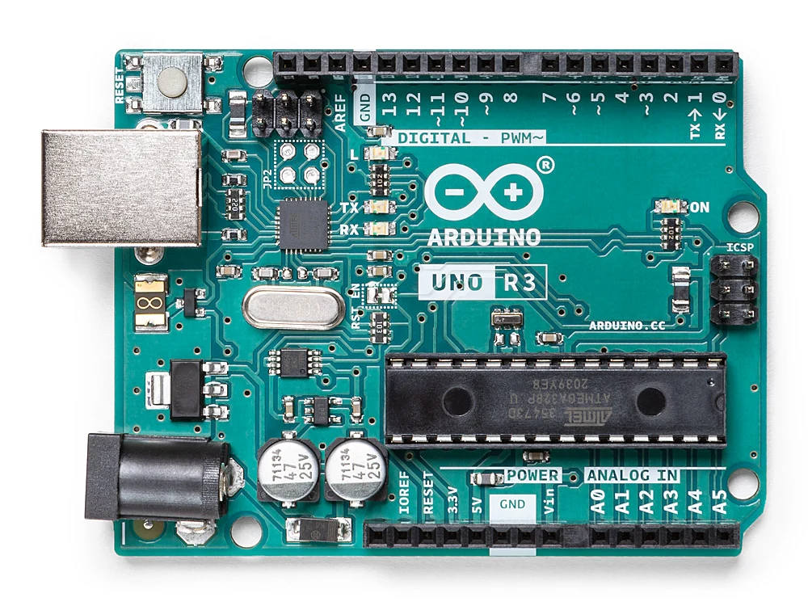
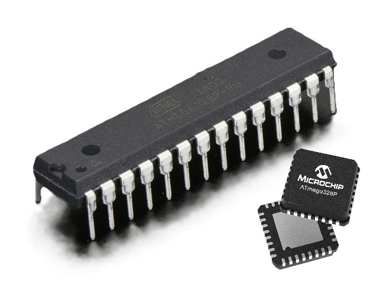
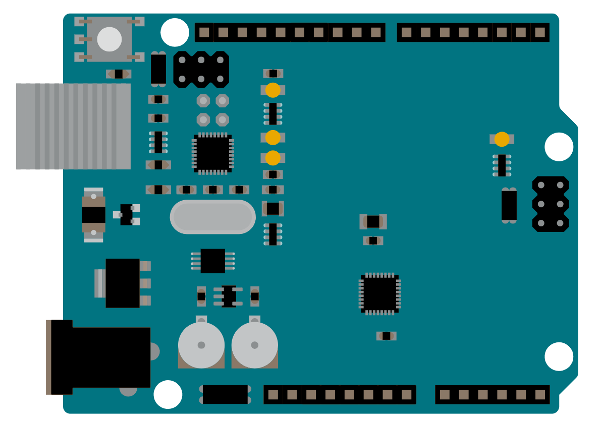
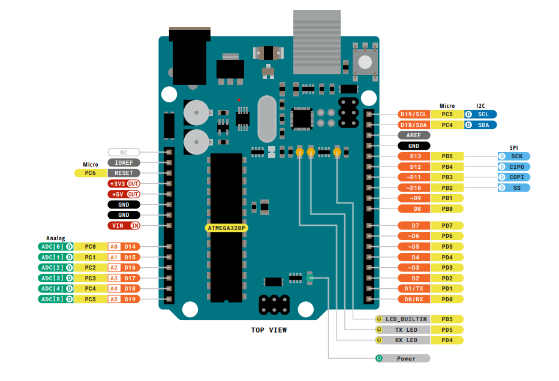
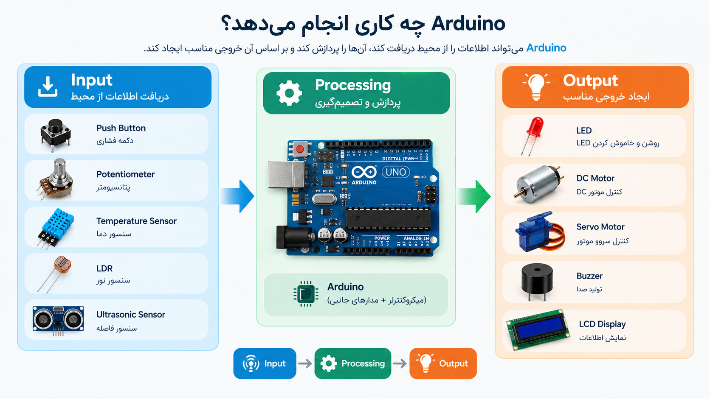
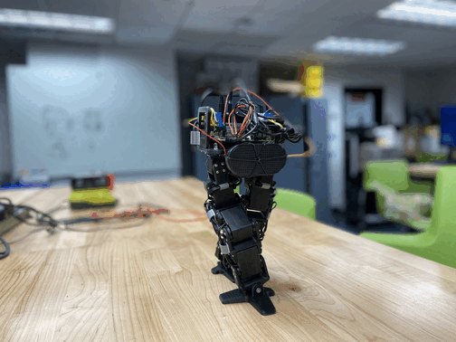
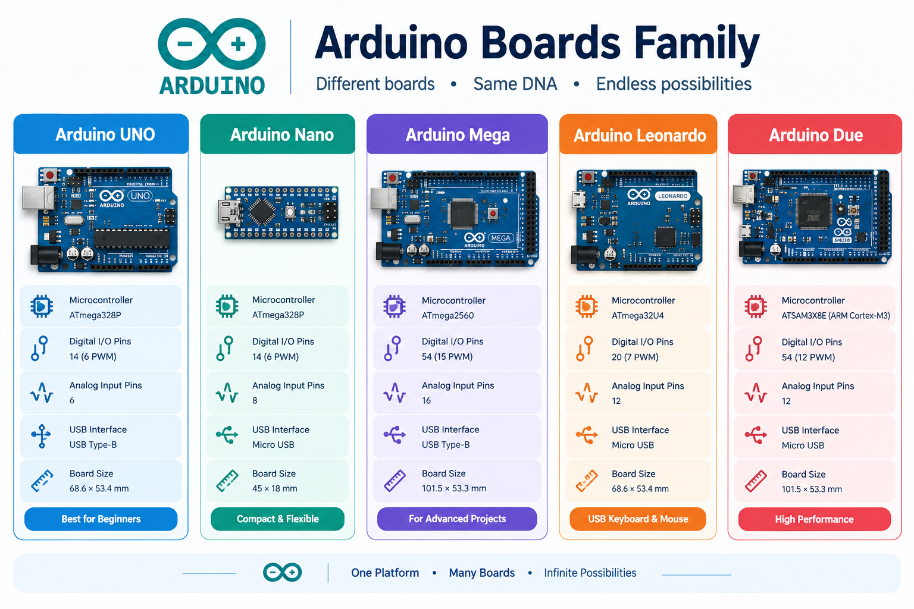

<h2 dir="rtl" align="center">جلسه 01 — آشنایی با Arduino</h1>

<hr>

<h2 dir="rtl">🎯 هدف جلسه</h2>

<p dir="rtl">
در این جلسه با <strong>Arduino</strong>، کاربرد آن، ساختار یک برد Arduino و تفاوت آن با یک میکروکنترلر آشنا می‌شویم.
</p>

<p dir="rtl">
در پایان این جلسه باید بتوانیم به سؤالات زیر پاسخ دهیم:
</p>

<ul dir="rtl">
<li>Arduino چیست؟</li>
<li>میکروکنترلر چیست؟</li>
<li>Arduino Board چیست؟</li>
<li>تفاوت Arduino و Microcontroller چیست؟</li>
<li>اجزای اصلی یک برد Arduino چیست؟</li>
<li>چرا از Arduino استفاده می‌کنیم؟</li>
<li>چه پروژه‌هایی می‌توان با Arduino ساخت؟</li>
</ul>

<hr>

<h2 dir="rtl">📚 1. Arduino چیست؟</h2>

<p dir="rtl">
<strong>Arduino</strong> یک پلتفرم الکترونیکی متن‌باز
(<code>Open Source</code>)
است که برای یادگیری، نمونه‌سازی و ساخت پروژه‌های الکترونیکی و کنترلی استفاده می‌شود.
</p>

<p dir="rtl">
Arduino شامل مجموعه‌ای از بردهای سخت‌افزاری، نرم‌افزار، کتابخانه‌ها و ابزارهای مختلف است که کار طراحی و ساخت پروژه‌های الکترونیکی را ساده‌تر می‌کنند.
</p>

<p dir="rtl">
یکی از معروف‌ترین بردهای این خانواده،
<strong>Arduino UNO</strong>
است که در ادامه این دوره بیشتر با آن کار خواهیم کرد.
</p>

<p align="center">

</p>

<p dir="rtl">
به طور کلی Arduino را می‌توان نقطه شروع مناسبی برای یادگیری برنامه‌نویسی میکروکنترلرها، الکترونیک و سیستم‌های Embedded در نظر گرفت.
</p>

<hr>

<h2 dir="rtl">🧠 2. میکروکنترلر چیست؟</h2>

<p dir="rtl">
میکروکنترلر یک مدار مجتمع
(<code>IC</code>)
است که می‌تواند یک برنامه را اجرا کند و تجهیزات الکترونیکی مختلف را کنترل کند.
</p>

<p dir="rtl">
یک میکروکنترلر معمولاً شامل بخش‌هایی مانند موارد زیر است:
</p>

<ul dir="rtl">
<li>CPU</li>
<li>Flash Memory</li>
<li>RAM</li>
<li>Input / Output</li>
<li>Timers</li>
<li>Communication Interfaces</li>
<li>ADC</li>
</ul>

<p dir="rtl">
در واقع می‌توان میکروکنترلر را یک سیستم کامپیوتری کوچک در نظر گرفت که بسیاری از اجزای موردنیاز برای اجرای یک برنامه را درون یک تراشه در اختیار ما قرار می‌دهد.
</p>

<p align="center">

</p>

<h3 dir="rtl">🔹 اجزای اصلی یک میکروکنترلر</h3>

<ul dir="rtl">
<li><strong>CPU:</strong> اجرای دستورات برنامه</li>
<li><strong>Flash:</strong> ذخیره برنامه</li>
<li><strong>RAM:</strong> ذخیره موقت داده‌ها</li>
<li><strong>GPIO:</strong> ارتباط با ورودی‌ها و خروجی‌ها</li>
<li><strong>Timer:</strong> ایجاد و اندازه‌گیری زمان</li>
<li><strong>ADC:</strong> تبدیل سیگنال آنالوگ به دیجیتال</li>
<li><strong>Communication:</strong> ارتباط با تجهیزات دیگر</li>
</ul>

<p dir="rtl">
برای مثال، در
<strong>Arduino UNO R3</strong>
از میکروکنترلر
<strong>ATmega328P</strong>
استفاده شده است.
</p>

<hr>

<h2 dir="rtl">🔌 3. Arduino Board چیست؟</h2>

<p dir="rtl">
یک <strong>Arduino Board</strong> بردی آماده است که یک میکروکنترلر را به همراه مدارها و امکانات جانبی موردنیاز در اختیار ما قرار می‌دهد.
</p>

<p dir="rtl">
به عنوان مثال، Arduino UNO فقط شامل میکروکنترلر نیست و قسمت‌های مختلفی برای ارتباط با کامپیوتر، تأمین توان و اتصال تجهیزات خارجی روی آن قرار گرفته است.
</p>

<p align="center">

</p>

<h3 dir="rtl">🔹 بخش‌های مهم Arduino Board</h3>

<ul dir="rtl">
<li><strong>Microcontroller:</strong> اجرای برنامه</li>
<li><strong>USB:</strong> ارتباط با کامپیوتر و انتقال برنامه</li>
<li><strong>Digital Pins:</strong> ورودی و خروجی دیجیتال</li>
<li><strong>Analog Pins:</strong> خواندن سیگنال‌های آنالوگ</li>
<li><strong>Power:</strong> تأمین انرژی برد</li>
<li><strong>Reset:</strong> شروع مجدد برنامه</li>
<li><strong>Clock:</strong> ایجاد کلاک موردنیاز برای اجرای میکروکنترلر</li>
</ul>

<p dir="rtl">
به همین دلیل کار با Arduino نسبت به استفاده مستقیم از یک میکروکنترلر خام ساده‌تر است.
</p>

<hr>

<h2 dir="rtl">⚙️ 4. اجزای اصلی Arduino UNO</h2>

<p dir="rtl">
یکی از محبوب‌ترین بردهای Arduino،
<strong>Arduino UNO</strong>
است.
</p>

<p dir="rtl">
برای کار با Arduino لازم است با پایه‌ها و قسمت‌های اصلی برد آشنا باشیم.
</p>

<p align="center">

</p>

<h3 dir="rtl">🔹 Digital Pins</h3>

<p dir="rtl">
پایه‌های دیجیتال برای دریافت یا ارسال سیگنال‌های دیجیتال استفاده می‌شوند.
</p>

<p dir="rtl">
یک سیگنال دیجیتال معمولاً دارای دو وضعیت اصلی است:
</p>

```text
HIGH
LOW
```

<p dir="rtl">
برای مثال می‌توانیم با استفاده از یک پایه دیجیتال، یک LED را روشن یا خاموش کنیم.
</p>

<h3 dir="rtl">🔹 Analog Pins</h3>

<p dir="rtl">
پایه‌های آنالوگ برای خواندن سیگنال‌های آنالوگ استفاده می‌شوند.
</p>

<p dir="rtl">
برای مثال می‌توانیم ولتاژ خروجی یک پتانسیومتر یا سنسور را اندازه‌گیری کنیم.
</p>

<h3 dir="rtl">🔹 USB Port</h3>

<p dir="rtl">
پورت USB برای موارد زیر استفاده می‌شود:
</p>

<ul dir="rtl">
<li>اتصال Arduino به کامپیوتر</li>
<li>انتقال برنامه به برد</li>
<li>ارتباط Serial با کامپیوتر</li>
<li>تأمین توان برد در شرایط مناسب</li>
</ul>

<h3 dir="rtl">🔹 Power Input</h3>

<p dir="rtl">
برای تأمین انرژی Arduino می‌توان از روش‌های مختلف تغذیه استفاده کرد.
</p>

<h3 dir="rtl">🔹 Reset Button</h3>

<p dir="rtl">
با فشار دادن کلید Reset، اجرای برنامه از ابتدا شروع می‌شود.
</p>

<hr>

<h2 dir="rtl">💡 5. Arduino چه کاری انجام می‌دهد؟</h2>

<p dir="rtl">
Arduino می‌تواند اطلاعات را از محیط دریافت کند، آن‌ها را پردازش کند و بر اساس نتیجه، خروجی ایجاد کند.
</p>

<p dir="rtl">
به صورت ساده می‌توان عملکرد Arduino را این‌گونه نمایش داد:
</p>

<p align="center">

</p>

<p dir="rtl">
در یک سیستم ساده، اطلاعات از طریق یک ورودی وارد Arduino می‌شوند، میکروکنترلر برنامه را اجرا می‌کند و سپس بر اساس منطق برنامه، خروجی مناسب ایجاد می‌شود.
</p>

<h3 dir="rtl">🔹 مثال اول</h3>

```text
Push Button
     ↓
  Arduino
     ↓
    LED
```

<p dir="rtl">
در این مثال، Push Button ورودی و LED خروجی سیستم است.
</p>

<h3 dir="rtl">🔹 مثال دوم</h3>

```text
Temperature Sensor
        ↓
      Arduino
        ↓
        Fan
```

<p dir="rtl">
در این مثال، Arduino اطلاعات سنسور دما را دریافت کرده و بر اساس برنامه، موتور یا فن را کنترل می‌کند.
</p>

<hr>

<h2 dir="rtl">🔄 6. ورودی و خروجی</h2>

<h3 dir="rtl">📥 ورودی‌ها (Input)</h3>

<p dir="rtl">
Arduino می‌تواند اطلاعات را از تجهیزات مختلف دریافت کند.
</p>

<ul dir="rtl">
<li>Push Button</li>
<li>Potentiometer</li>
<li>Temperature Sensor</li>
<li>LDR</li>
<li>Ultrasonic Sensor</li>
</ul>

<h3 dir="rtl">📤 خروجی‌ها (Output)</h3>

<p dir="rtl">
Arduino می‌تواند تجهیزات مختلف را کنترل کند.
</p>

<ul dir="rtl">
<li>LED</li>
<li>Buzzer</li>
<li>Relay</li>
<li>Servo Motor</li>
<li>DC Motor</li>
<li>Display</li>
</ul>

<p dir="rtl">
بنابراین Arduino می‌تواند بین سنسورها و تجهیزات خروجی قرار گرفته و نقش یک کنترل‌کننده را ایفا کند.
</p>

<hr>

<h2 dir="rtl">🆚 7. تفاوت Arduino و Microcontroller</h2>

<p dir="rtl">
<strong>Arduino</strong> و <strong>Microcontroller</strong> یکسان نیستند.
</p>

<p dir="rtl">
میکروکنترلر یک تراشه است، در حالی که Arduino معمولاً یک برد و اکوسیستم آماده مبتنی بر یک میکروکنترلر است.
</p>

<h3 dir="rtl">میکروکنترلر:</h3>

```text
ATmega328P
     ↓
Microcontroller
```

<h3 dir="rtl">Arduino UNO:</h3>

```text
Arduino UNO
     ↓
Board
     ↓
ATmega328P
     +
USB
     +
Power
     +
Pins
     +
Supporting Circuits
```

<p dir="rtl">
به عبارت ساده، میکروکنترلر قلب سیستم است و Arduino یک برد آماده است که کار استفاده از آن میکروکنترلر را ساده‌تر می‌کند.
</p>

<hr>

<h2 dir="rtl">🚀 8. چرا از Arduino استفاده می‌کنیم؟</h2>

<p dir="rtl">
Arduino به دلیل سادگی و دسترسی بالا، یکی از پلتفرم‌های محبوب برای یادگیری الکترونیک، برنامه‌نویسی و ساخت نمونه‌های اولیه است.
</p>

<h3 dir="rtl">برخی از ویژگی‌های Arduino:</h3>

<ul dir="rtl">
<li>سادگی در یادگیری</li>
<li>مناسب برای نمونه‌سازی سریع</li>
<li>دارای کتابخانه‌های متعدد</li>
<li>جامعه کاربری بزرگ</li>
<li>مثال‌ها و پروژه‌های فراوان</li>
<li>هزینه نسبتاً پایین</li>
<li>مناسب برای آموزش</li>
</ul>

<hr>

<h2 dir="rtl">🛠️ 9. با Arduino چه پروژه‌هایی می‌توان ساخت؟</h2>

<p dir="rtl">
Arduino فقط برای روشن و خاموش کردن یک LED استفاده نمی‌شود. با یادگیری صحیح می‌توان پروژه‌های بسیار متنوعی با آن ساخت.
</p>

<p align="center">

</p>

<h3 dir="rtl">🟢 پروژه‌های ساده</h3>

<ul dir="rtl">
<li>چشمک‌زدن LED</li>
<li>کنترل LED با Push Button</li>
<li>کنترل روشنایی LED</li>
<li>تولید صدا با Buzzer</li>
</ul>

<h3 dir="rtl">🟡 پروژه‌های متوسط</h3>

<ul dir="rtl">
<li>اندازه‌گیری دما</li>
<li>فاصله‌سنج اولتراسونیک</li>
<li>کنترل Servo Motor</li>
<li>کنترل DC Motor</li>
<li>نمایش اطلاعات روی LCD</li>
</ul>

<h3 dir="rtl">🔴 پروژه‌های پیشرفته‌تر</h3>

<ul dir="rtl">
<li>سیستم‌های اتوماسیون</li>
<li>ربات</li>
<li>خانه هوشمند</li>
<li>سیستم‌های کنترل موتور</li>
<li>سیستم‌های مانیتورینگ</li>
<li>ارتباط بی‌سیم</li>
<li>پروژه‌های IoT</li>
</ul>

<hr>

<h2 dir="rtl">🧩 10. انواع بردهای Arduino</h2>

<p dir="rtl">
Arduino فقط به مدل UNO محدود نمی‌شود و بردهای مختلفی برای کاربردهای متفاوت وجود دارد.
</p>

<p align="center">

</p>

<table>
<thead>
<tr>
<th>Board</th>
<th>ویژگی</th>
</tr>
</thead>
<tbody>
<tr>
<td>Arduino UNO</td>
<td>مناسب برای شروع یادگیری</td>
</tr>
<tr>
<td>Arduino Nano</td>
<td>کوچک و مناسب پروژه‌های فشرده</td>
</tr>
<tr>
<td>Arduino Mega</td>
<td>تعداد پایه‌های بیشتر</td>
</tr>
<tr>
<td>Arduino Leonardo</td>
<td>دارای امکانات USB متفاوت</td>
</tr>
<tr>
<td>Arduino Due</td>
<td>پردازنده قدرتمندتر</td>
</tr>
</tbody>
</table>

<p dir="rtl">
در این دوره برای شروع، از
<strong>Arduino UNO</strong>
استفاده خواهیم کرد.
</p>

<hr>

<h2 dir="rtl">💻 11. Arduino IDE چیست؟</h2>

<p dir="rtl">
برای نوشتن برنامه و انتقال آن به Arduino معمولاً از
<strong>Arduino IDE</strong>
استفاده می‌کنیم.
</p>

<p dir="rtl">
Arduino IDE محیطی است که در آن می‌توانیم کد برنامه را بنویسیم، آن را بررسی و کامپایل کنیم و در نهایت برنامه را روی برد Arduino منتقل کنیم.
</p>

<p dir="rtl">
در جلسه بعد یاد می‌گیریم:
</p>

<ul dir="rtl">
<li>Arduino IDE را نصب کنیم.</li>
<li>Arduino را به کامپیوتر متصل کنیم.</li>
<li>برد مناسب را انتخاب کنیم.</li>
<li>Port مناسب را انتخاب کنیم.</li>
<li>برنامه را Compile کنیم.</li>
<li>برنامه را روی Arduino Upload کنیم.</li>
</ul>

<hr>

<h2 dir="rtl">🧠 12. Arduino چگونه با دنیای واقعی ارتباط برقرار می‌کند؟</h2>

<p dir="rtl">
یکی از مهم‌ترین مفاهیمی که در ادامه دوره یاد می‌گیریم، ارتباط بین نرم‌افزار و سخت‌افزار است.
</p>

<p dir="rtl">
Arduino می‌تواند اطلاعات را از سنسورها دریافت کند، آن‌ها را پردازش کند و بر اساس برنامه، تجهیزات مختلف را کنترل کند.
</p>

```text
        Hardware
            ↓
     Microcontroller
            ↓
       Programming
            ↓
         Sensors
            ↓
        Processing
            ↓
        Actuators
            ↓
        Real Project
```

<p dir="rtl">
هدف این دوره این است که قدم‌به‌قدم از مفاهیم پایه به سمت ساخت چنین سیستم‌هایی حرکت کنیم.
</p>

<hr>

<h2 dir="rtl">📝 تمرین جلسه</h2>

<p dir="rtl">
قبل از رفتن به جلسه بعد، به سؤالات زیر پاسخ دهید:
</p>

<ol dir="rtl">
<li>Arduino چیست؟</li>
<li>میکروکنترلر چیست؟</li>
<li>تفاوت Arduino Board و Microcontroller چیست؟</li>
<li>میکروکنترلر Arduino UNO R3 چه نام دارد؟</li>
<li>سه نمونه ورودی برای Arduino نام ببرید.</li>
<li>سه نمونه خروجی برای Arduino نام ببرید.</li>
<li>Arduino IDE چه کاربردی دارد؟</li>
<li>چند مدل مختلف از بردهای Arduino را نام ببرید.</li>
</ol>

<hr>

<h2 dir="rtl">✅ خلاصه جلسه</h2>

<p dir="rtl">
در این جلسه با مفاهیم پایه Arduino آشنا شدیم:
</p>

<ul dir="rtl">
<li>Arduino چیست.</li>
<li>میکروکنترلر چیست.</li>
<li>Arduino Board چه تفاوتی با Microcontroller دارد.</li>
<li>Arduino UNO چیست.</li>
<li>ورودی و خروجی چیست.</li>
<li>اجزای اصلی Arduino UNO چیست.</li>
<li>Arduino IDE چه کاربردی دارد.</li>
<li>چه پروژه‌هایی می‌توان با Arduino ساخت.</li>
</ul>

<hr>

<h2 dir="rtl">⏭️ جلسه بعد</h2>

<p dir="rtl">
در جلسه دوم، <strong>Arduino IDE</strong> را نصب و راه‌اندازی می‌کنیم و اولین برنامه خود را روی یک Arduino واقعی اجرا خواهیم کرد.
</p>

<p dir="rtl">
⬅️ <a href="../02-Arduino-IDE/">جلسه 02 — نصب و راه‌اندازی Arduino IDE</a>
</p>


<p align="center">
<strong>Arduino From Zero to Projects</strong>
</p>

<p align="center">
<strong>Mohammad Esteghamat</strong>
</p>
