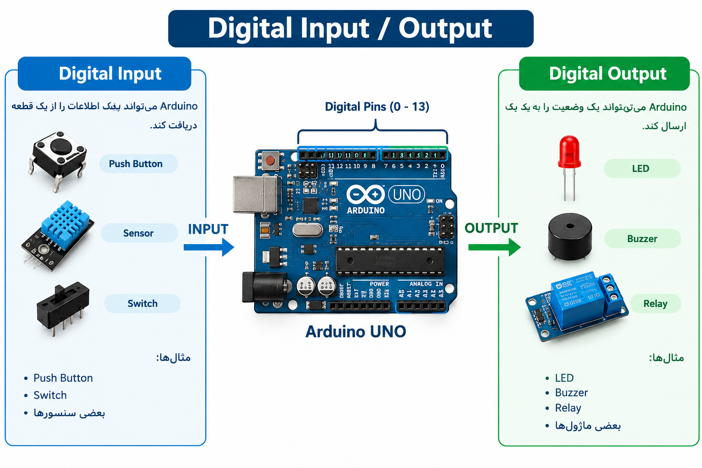
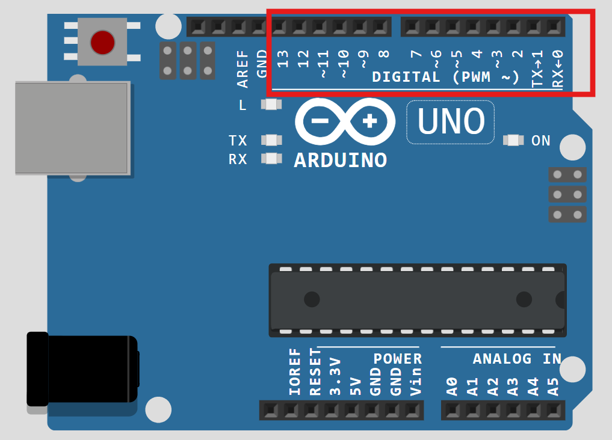
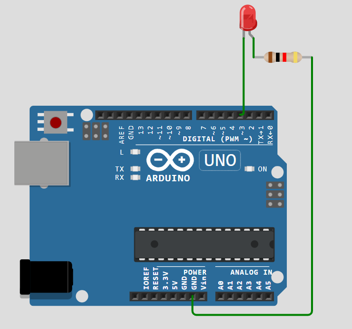
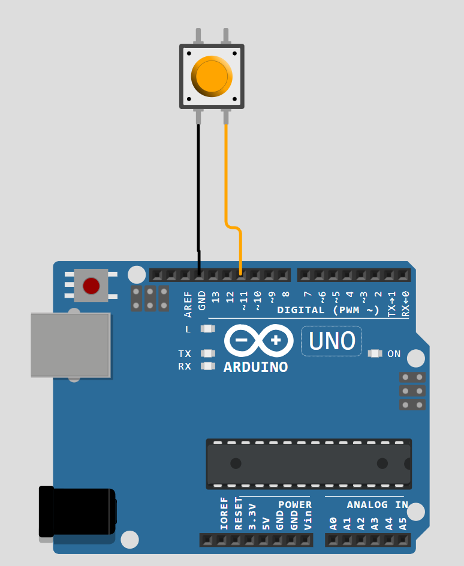
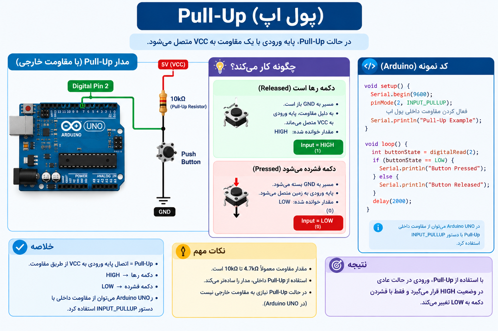
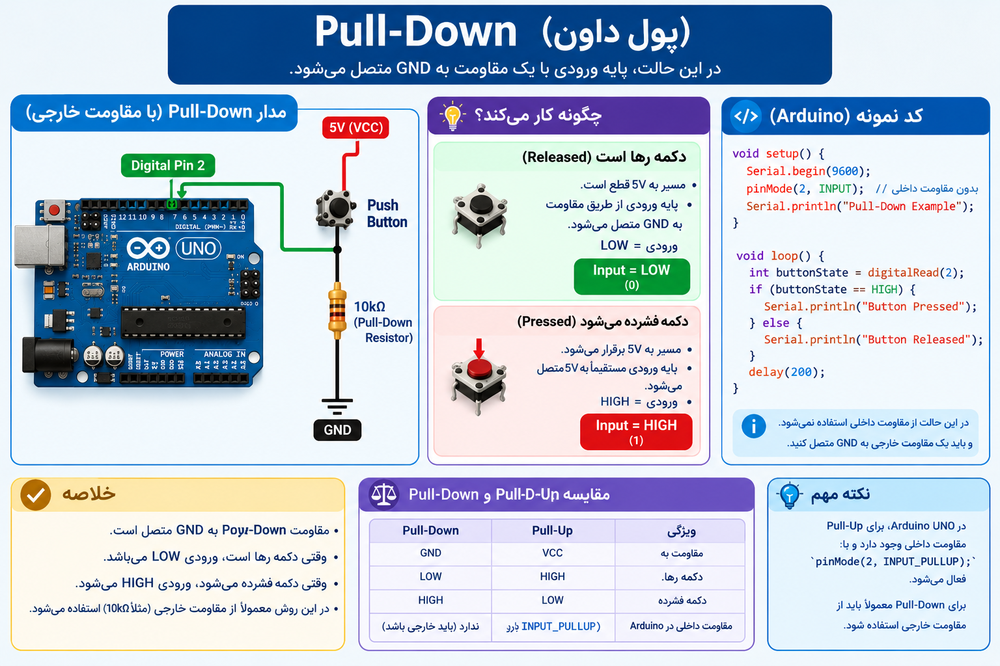
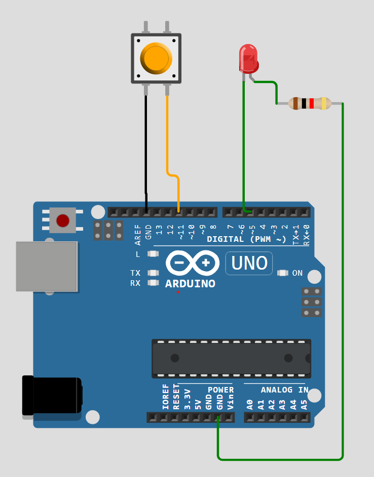

# جلسه 03 — <span dir="ltr">Digital Input / Output</span>


## 🎯 هدف جلسه

در این جلسه با **ورودی و خروجی دیجیتال** در <span dir="ltr">Arduino</span> آشنا می‌شویم.

یاد می‌گیریم:

- <span dir="ltr">Digital</span> چیست؟
- <span dir="ltr">Digital Input</span> و <span dir="ltr">Digital Output</span> چه تفاوتی دارند؟
- <span dir="ltr">GPIO</span> چیست؟
- پایه‌های دیجیتال <span dir="ltr">Arduino</span> چگونه کار می‌کنند؟
- چگونه یک <span dir="ltr">LED</span> را کنترل کنیم؟
- چگونه یک <span dir="ltr">Push Button</span> را بخوانیم؟
- <code dir="ltr">pinMode()</code> چیست؟
- <code dir="ltr">digitalWrite()</code> چیست؟
- <code dir="ltr">digitalRead()</code> چیست؟
- مفهوم <code dir="ltr">HIGH</code> و <code dir="ltr">LOW</code> چیست؟
- <span dir="ltr">Pull-up</span> و <span dir="ltr">Pull-down</span> چیست؟
- چگونه یک دکمه را به <span dir="ltr">Arduino</span> متصل کنیم؟
- چگونه با <span dir="ltr">Push Button</span> یک <span dir="ltr">LED</span> را کنترل کنیم؟

در پایان جلسه می‌توانیم یک **مدار واقعی با LED و Push Button** بسازیم.


---

# 🔌 <span dir="ltr">Digital</span> چیست؟


در سیستم‌های دیجیتال، اطلاعات معمولاً با دو وضعیت اصلی نمایش داده می‌شوند:


```text
LOW  →  0
HIGH →  1
```


بنابراین یک ورودی یا خروجی دیجیتال معمولاً دو حالت دارد:
- <code dir="ltr">LOW</code>
- <code dir="ltr">HIGH</code>

برای مثال:


- LED خاموش ← <code dir="ltr">LOW</code>
- LED روشن ← <code dir="ltr">HIGH</code>

البته معنی دقیق <code dir="ltr">HIGH</code> و <code dir="ltr">LOW</code> به مدار و نحوه اتصال قطعه بستگی دارد.


---

# 🧠 <span dir="ltr">Digital Input</span> و <span dir="ltr">Digital Output</span>


<span dir="ltr">Arduino</span> می‌تواند از پایه‌های دیجیتال خود برای دریافت اطلاعات یا ارسال اطلاعات استفاده کند.


```text
             Arduino
                 │
        ┌────────┴────────┐
        ↓                 ↓
      INPUT             OUTPUT
        ↓                 ↓
      Button             LED
      Sensor            Buzzer
                         Relay
```



---
### <span dir="ltr">Digital Input</span>

وقتی <span dir="ltr">Arduino</span> اطلاعات را از یک قطعه دریافت می‌کند.

مثال:

- <span dir="ltr">Push Button</span>
- <span dir="ltr">Switch</span>
- بعضی سنسورها

### <span dir="ltr">Digital Output</span>

وقتی <span dir="ltr">Arduino</span> یک وضعیت را به یک قطعه ارسال می‌کند.

مثال:

- <span dir="ltr">LED</span>
- <span dir="ltr">Buzzer</span>
- <span dir="ltr">Relay</span>


---

# 📍 پایه‌های دیجیتال <span dir="ltr">Arduino UNO</span>





در <span dir="ltr">Arduino UNO</span> تعدادی پایه دیجیتال وجود دارد که می‌توانیم از آن‌ها برای ورودی و خروجی استفاده کنیم.

پایه‌های دیجیتال <span dir="ltr">Arduino UNO</span> با شماره‌های زیر مشخص می‌شوند:


```text
0   1   2   3   4   5   6   7
8   9   10  11  12  13
```


بعضی از این پایه‌ها قابلیت‌های دیگری نیز دارند.

برای مثال پایه‌های 3، 5، 6، 9، 10 و 11 قابلیت <span dir="ltr">PWM</span> دارند که در جلسه مربوط به <span dir="ltr">PWM</span> با آن‌ها کار خواهیم کرد.


---

# ⚙️ <span dir="ltr">GPIO</span> چیست؟


<span dir="ltr">GPIO</span> مخفف:


```text
General Purpose Input/Output
```


است.

یعنی پایه‌ای که می‌توانیم از آن برای دریافت یا ارسال سیگنال استفاده کنیم.

در <span dir="ltr">Arduino</span> بسیاری از پایه‌های دیجیتال نقش <span dir="ltr">GPIO</span> را دارند.


---

# 🛠️ تابع <code dir="ltr">pinMode()</code>


برای مشخص کردن اینکه یک پایه به‌عنوان <span dir="ltr">Input</span> یا <span dir="ltr">Output</span> استفاده شود، از تابع <code dir="ltr">pinMode()</code> استفاده می‌کنیم.

ساختار:


```cpp
pinMode(pin, mode);
```


مثلاً برای قرار دادن پایه 13 به‌عنوان خروجی:


```cpp
pinMode(13, OUTPUT);
```


و برای قرار دادن پایه 2 به‌عنوان ورودی:


```cpp
pinMode(2, INPUT);
```


---


# 💡 اولین پروژه — کنترل <span dir="ltr">LED</span>





در اولین پروژه می‌خواهیم یک <span dir="ltr">LED</span> را با <span dir="ltr">Arduino</span> کنترل کنیم.
مدار را مطابق عکس بالا  میبندیم و کد زیر  را روی بورد اپلود میکنیم.


### کد


```cpp
void setup() {
  pinMode(3, OUTPUT);
}

void loop() {
  digitalWrite(3, HIGH);
  delay(1000);
  digitalWrite(3, LOW);
  delay(1000);
}
```


در این برنامه:

- <span dir="ltr">LED</span> به‌عنوان خروجی تعریف می‌شود.
- <span dir="ltr">LED</span> روشن می‌شود.
- یک ثانیه صبر می‌کنیم.
- <span dir="ltr">LED</span> خاموش می‌شود.
- دوباره یک ثانیه صبر می‌کنیم.
- این روند در <code dir="ltr">loop()</code> تکرار می‌شود.


---

# 🔧 <span dir="ltr">Digital Output</span>


برای تغییر وضعیت یک خروجی دیجیتال از تابع <code dir="ltr">digitalWrite()</code> استفاده می‌کنیم.

ساختار:


```cpp
digitalWrite(pin, value);
```


مثلاً:


```cpp
digitalWrite(13, HIGH);
```


یعنی وضعیت پایه 13 را روی <code dir="ltr">HIGH</code> قرار بده.

برای قرار دادن آن روی <code dir="ltr">LOW</code>:


```cpp
digitalWrite(13, LOW);
```

---

# 🔴 <span dir="ltr">HIGH</span> و <span dir="ltr">LOW</span>


در برنامه <span dir="ltr">Arduino</span> معمولاً از دو مقدار زیر برای وضعیت دیجیتال استفاده می‌کنیم:


| مقدار | مفهوم |
|:---:|:---|
| <code dir="ltr">HIGH</code> | وضعیت منطقی 1 |
| <code dir="ltr">LOW</code> | وضعیت منطقی 0 |


در یک مدار ساده می‌توانیم به‌صورت مفهومی این‌گونه در نظر بگیریم:


```text
HIGH → فعال
LOW  → غیرفعال
```


اما همیشه نباید <code dir="ltr">HIGH</code> را مساوی «روشن بودن قطعه» در نظر گرفت؛ نحوه اتصال مدار می‌تواند باعث <span dir="ltr">Active-Low</span> شدن یک خروجی شود.


---

# 🔘 <span dir="ltr">Digital Input</span>


حالا می‌خواهیم اطلاعات را از یک قطعه دریافت کنیم.

برای مثال می‌توانیم از یک <span dir="ltr">Push Button</span> استفاده کنیم.

یک <span dir="ltr">Push Button</span> می‌تواند دو وضعیت داشته باشد:


```text
Button Released → یک وضعیت
Button Pressed  → وضعیت دیگر
```


<span dir="ltr">Arduino</span> می‌تواند این وضعیت را از طریق یک پایه دیجیتال بخواند.

برای خواندن ورودی دیجیتال از تابع <code dir="ltr">digitalRead()</code> استفاده می‌کنیم.


---

# 📖 تابع <code dir="ltr">digitalRead()</code>


ساختار تابع:


```cpp
digitalRead(pin);
```


مثلاً:


```cpp
digitalRead(2);
```


مقدار برگشتی معمولاً یکی از این دو مقدار است:

- <code dir="ltr">HIGH</code>
- <code dir="ltr">LOW</code>


---

# 🔘 اتصال <span dir="ltr">Push Button</span>





برای اتصال <span dir="ltr">Push Button</span> روش‌های مختلفی وجود دارد.

یکی از ساده‌ترین روش‌ها استفاده از <span dir="ltr">Internal Pull-Up</span> خود <span dir="ltr">Arduino</span> است.

در این روش نیازی به مقاومت <span dir="ltr">Pull-Up</span> خارجی نداریم.

مدار مفهومی:


```text
Arduino

Pin 11 ───── Push Button ───── GND
```


در این حالت پایه را با <code dir="ltr">INPUT_PULLUP</code> تنظیم می‌کنیم.


---

# ⚙️ <code dir="ltr">INPUT_PULLUP</code>


<span dir="ltr">Arduino</span> دارای مقاومت <span dir="ltr">Pull-Up</span> داخلی است که می‌توانیم آن را فعال کنیم.


```cpp
pinMode(2, INPUT_PULLUP);
```


در این حالت، وقتی دکمه فشرده نشده است، ورودی معمولاً <code dir="ltr">HIGH</code> خوانده می‌شود.

وقتی دکمه فشرده شود، پایه به <span dir="ltr">GND</span> متصل شده و مقدار <code dir="ltr">LOW</code> خوانده می‌شود.

بنابراین:


| وضعیت <span dir="ltr">Push Button</span> | مقدار ورودی |
|:---:|:---:|
| فشرده نشده | <code dir="ltr">HIGH</code> |
| فشرده شده | <code dir="ltr">LOW</code> |


این موضوع در ابتدا ممکن است کمی عجیب باشد، اما دلیل آن نحوه اتصال <span dir="ltr">Pull-Up</span> است.


---

# ⬆️ <span dir="ltr">Pull-Up</span> و ⬇️ <span dir="ltr">Pull-Down</span>


وقتی یک پایه دیجیتال به‌عنوان ورودی استفاده می‌شود، بهتر است در زمانی که دکمه یا سنسور آن را به هیچ سطح مشخصی متصل نکرده است، ورودی در یک وضعیت مشخص <span dir="ltr">HIGH</span> یا <span dir="ltr">LOW</span> قرار داشته باشد.

برای این کار از مقاومت‌های <span dir="ltr">Pull-Up</span> و <span dir="ltr">Pull-Down</span> استفاده می‌کنیم.

## ⬆️ <span dir="ltr">Pull-Up</span>

در مدار <span dir="ltr">Pull-Up</span>، پایه ورودی از طریق یک مقاومت به <span dir="ltr">VCC</span> متصل می‌شود. بنابراین وقتی کلید فشرده نشده است، ورودی معمولاً <span dir="ltr">HIGH</span> خواهد بود.

وقتی کلید فشرده می‌شود، پایه ورودی به <span dir="ltr">GND</span> متصل شده و مقدار <span dir="ltr">LOW</span> خوانده می‌شود.

```text
VCC
 │
[R]  Pull-Up
 │
 ├──────── Arduino Input
 │
Push Button
 │
GND
```

بنابراین:

| وضعیت <span dir="ltr">Push Button</span> | مقدار ورودی |
|:---:|:---:|
| فشرده نشده | <code dir="ltr">HIGH</code> |
| فشرده شده | <code dir="ltr">LOW</code> |

## ⬇️ <span dir="ltr">Pull-Down</span>

در مدار <span dir="ltr">Pull-Down</span>، پایه ورودی از طریق یک مقاومت به <span dir="ltr">GND</span> متصل می‌شود. بنابراین وقتی کلید فشرده نشده است، ورودی معمولاً <span dir="ltr">LOW</span> خواهد بود.

وقتی کلید فشرده می‌شود، پایه ورودی به <span dir="ltr">VCC</span> متصل شده و مقدار <span dir="ltr">HIGH</span> خوانده می‌شود.

```text
VCC
 │
Push Button
 │
 ├──────── Arduino Input
 │
[R]  Pull-Down
 │
GND
```

بنابراین:

| وضعیت <span dir="ltr">Push Button</span> | مقدار ورودی |
|:---:|:---:|
| فشرده نشده | <code dir="ltr">LOW</code> |
| فشرده شده | <code dir="ltr">HIGH</code> |

## مقایسه <span dir="ltr">Pull-Up</span> و <span dir="ltr">Pull-Down</span>

| نوع اتصال | وضعیت در حالت عادی | وضعیت هنگام فشردن دکمه |
|:---:|:---:|:---:|
| <span dir="ltr">Pull-Up</span> | <code dir="ltr">HIGH</code> | <code dir="ltr">LOW</code> |
| <span dir="ltr">Pull-Down</span> | <code dir="ltr">LOW</code> | <code dir="ltr">HIGH</code> |

در <span dir="ltr">Arduino UNO</span> می‌توان از مقاومت <span dir="ltr">Pull-Up</span> داخلی استفاده کرد. برای این کار پایه را با <code dir="ltr">INPUT_PULLUP</code> تنظیم می‌کنیم.

برای <span dir="ltr">Pull-Down</span> در این ساختار، معمولاً از یک مقاومت خارجی استفاده می‌شود.

---

# 💡 کنترل <span dir="ltr">LED</span> با <span dir="ltr">Push Button</span>





حالا می‌خواهیم برنامه‌ای بنویسیم که:

- وقتی دکمه را فشار می‌دهیم، <span dir="ltr">LED</span> روشن شود.
- وقتی دکمه را رها می‌کنیم، <span dir="ltr">LED</span> خاموش شود.

### کد کامل


```cpp
const int buttonPin = 11;
const int ledPin = 5;

void setup() {
  pinMode(buttonPin, INPUT_PULLUP);
  pinMode(ledPin, OUTPUT);
}

void loop() {
  int buttonState = digitalRead(buttonPin);

  if (buttonState == LOW) {
    digitalWrite(ledPin, HIGH);
  }
  else {
    digitalWrite(ledPin, LOW);
  }
}
```


در این برنامه:

- پایه 2 برای <span dir="ltr">Push Button</span> استفاده شده است.
- <span dir="ltr">LED</span> داخلی <span dir="ltr">Arduino</span> به‌عنوان خروجی تعریف شده است.
- <span dir="ltr">Pull-Up</span> داخلی فعال شده است.
- وضعیت دکمه با <code dir="ltr">digitalRead()</code> خوانده می‌شود.
- اگر دکمه فشرده باشد، مقدار <code dir="ltr">LOW</code> دریافت می‌کنیم.
- در این حالت <span dir="ltr">LED</span> روشن می‌شود.
- در غیر این صورت <span dir="ltr">LED</span> خاموش می‌شود.


---

# 🧩 بررسی برنامه

## تعریف پایه‌ها

```cpp
const int buttonPin = 2;
const int ledPin = LED_BUILTIN;
```


در این قسمت شماره پایه‌ها را در متغیر قرار داده‌ایم تا کد خواناتر و قابل تغییر باشد.


## تنظیم پایه‌ها

```cpp
void setup() {
  pinMode(buttonPin, INPUT_PULLUP);
  pinMode(ledPin, OUTPUT);
}
```


پایه <span dir="ltr">Button</span> به‌عنوان <span dir="ltr">Input</span> و پایه <span dir="ltr">LED</span> به‌عنوان <span dir="ltr">Output</span> تنظیم شده است.


## خواندن دکمه

```cpp
int buttonState = digitalRead(buttonPin);
```


در این خط وضعیت دکمه را می‌خوانیم و در متغیر <code dir="ltr">buttonState</code> قرار می‌دهیم.


## بررسی وضعیت دکمه

```cpp
if (buttonState == LOW) {
```


چون از <code dir="ltr">INPUT_PULLUP</code> استفاده کرده‌ایم، هنگام فشرده شدن دکمه مقدار <code dir="ltr">LOW</code> دریافت می‌کنیم.


---

# 🔌 اتصال <span dir="ltr">LED</span> خارجی


یک مدار ساده شامل موارد زیر است:

- <span dir="ltr">Arduino</span>
- <span dir="ltr">LED</span>
- مقاومت
- سیم <span dir="ltr">Jumper</span>
- <span dir="ltr">Breadboard</span>

مقاومت برای محدود کردن جریان <span dir="ltr">LED</span> استفاده می‌شود.


```text
Arduino Pin
     │
     │
  Resistor
     │
     │
    LED
     │
     │
    GND
```


هرگز <span dir="ltr">LED</span> را بدون توجه به محدود کردن جریان مستقیماً به پایه <span dir="ltr">Arduino</span> متصل نکنید.


---

# 📐 مقاومت <span dir="ltr">LED</span>


برای <span dir="ltr">LED</span> معمولاً از یک مقاومت سری استفاده می‌کنیم.

مقدار مقاومت به شرایط مدار و مشخصات <span dir="ltr">LED</span> بستگی دارد.

برای تمرین‌های ساده <span dir="ltr">Arduino</span> معمولاً مقادیر رایجی مانند <span dir="ltr">220Ω</span> یا <span dir="ltr">330Ω</span> استفاده می‌شوند.


---

# 🧪 تمرین‌های جلسه


### تمرین 01 — <span dir="ltr">LED</span>

برنامه‌ای بنویسید که <span dir="ltr">LED</span>:

- <span dir="ltr">500ms</span> روشن
- <span dir="ltr">500ms</span> خاموش

باشد.

---

### تمرین 02 — تغییر سرعت

برنامه تمرین قبلی را طوری تغییر دهید که <span dir="ltr">LED</span>:

- <span dir="ltr">100ms</span> روشن
- <span dir="ltr">100ms</span> خاموش

باشد.

سپس آن را روی مقادیر زیر امتحان کنید:

- <span dir="ltr">1000ms</span>
- <span dir="ltr">2000ms</span>

---

### تمرین 03 — <span dir="ltr">Push Button</span>

یک <span dir="ltr">Push Button</span> به پایه 2 متصل کنید.

برنامه‌ای بنویسید که هنگام فشار دادن دکمه، <span dir="ltr">LED</span> روشن شود.

---

### تمرین 04 — <span dir="ltr">Toggle</span>

برنامه را تغییر دهید تا با هر بار فشار دادن دکمه، وضعیت <span dir="ltr">LED</span> تغییر کند:


```text
OFF → ON
ON  → OFF
```


در این تمرین با مفهوم تشخیص تغییر وضعیت دکمه آشنا خواهید شد.

---

### تمرین 05 — دو <span dir="ltr">LED</span>

دو <span dir="ltr">LED</span> به <span dir="ltr">Arduino</span> متصل کنید.

برنامه‌ای بنویسید که با فشار دادن دکمه:


```text
LED 1 → ON
LED 2 → OFF
```


و با رها کردن دکمه:


```text
LED 1 → OFF
LED 2 → ON
```


شود.


---

# 📝 سوالات


1. <span dir="ltr">Digital Input</span> چیست؟
2. <span dir="ltr">Digital Output</span> چیست؟
3. <span dir="ltr">GPIO</span> چیست؟
4. <code dir="ltr">pinMode()</code> چه کاری انجام می‌دهد؟
5. <code dir="ltr">digitalWrite()</code> چه کاری انجام می‌دهد؟
6. <code dir="ltr">digitalRead()</code> چه کاری انجام می‌دهد؟
7. <code dir="ltr">HIGH</code> و <code dir="ltr">LOW</code> چه مفهومی دارند؟
8. <code dir="ltr">INPUT_PULLUP</code> چیست؟
9. چرا هنگام استفاده از <code dir="ltr">INPUT_PULLUP</code>، فشار دادن دکمه مقدار <code dir="ltr">LOW</code> ایجاد می‌کند؟
10. چرا برای <span dir="ltr">LED</span> از مقاومت استفاده می‌کنیم؟
11. تفاوت <span dir="ltr">Input</span> و <span dir="ltr">Output</span> چیست؟


---

# 📌 جمع‌بندی


در این جلسه یاد گرفتیم:

- مفهوم <span dir="ltr">Digital</span> را یاد گرفتیم.
- <span dir="ltr">Digital Input</span> و <span dir="ltr">Digital Output</span> را بررسی کردیم.
- با <span dir="ltr">GPIO</span> آشنا شدیم.
- پایه‌های دیجیتال <span dir="ltr">Arduino</span> را شناختیم.
- نحوه استفاده از <code dir="ltr">pinMode()</code> را یاد گرفتیم.
- با <code dir="ltr">digitalWrite()</code> خروجی دیجیتال را کنترل کردیم.
- با <code dir="ltr">digitalRead()</code> ورودی دیجیتال را خواندیم.
- مفهوم <code dir="ltr">HIGH</code> و <code dir="ltr">LOW</code> را بررسی کردیم.
- با <span dir="ltr">Push Button</span> کار کردیم.
- مفهوم <code dir="ltr">INPUT_PULLUP</code> را یاد گرفتیم.
- یک <span dir="ltr">LED</span> را با <span dir="ltr">Push Button</span> کنترل کردیم.

در جلسه بعد وارد <span dir="ltr">Analog Input / Output</span> می‌شویم و یاد می‌گیریم چگونه مقادیر متغیر را از سنسورها و ورودی‌های آنالوگ دریافت کنیم.


---

# 🔗 جلسه بعد


<p dir="rtl">
➡️ <a href="../04-Analog-IO/">جلسه 04 — Analog-IO  Arduino IDE</a>
</p>


### <span dir="ltr">Arduino From Zero to Projects 🚀</span>

**<span dir="ltr">Learn → Build → Experiment → Create</span>**

