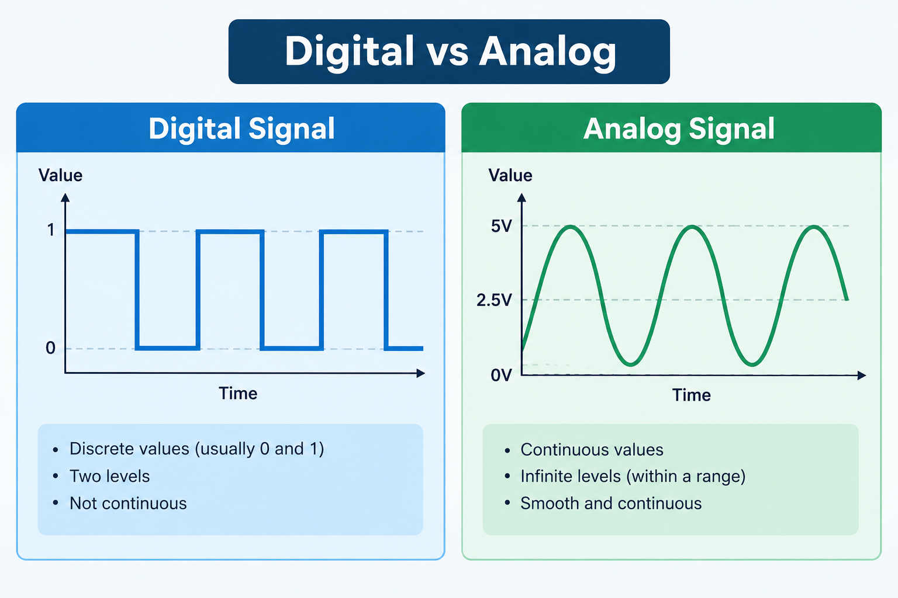
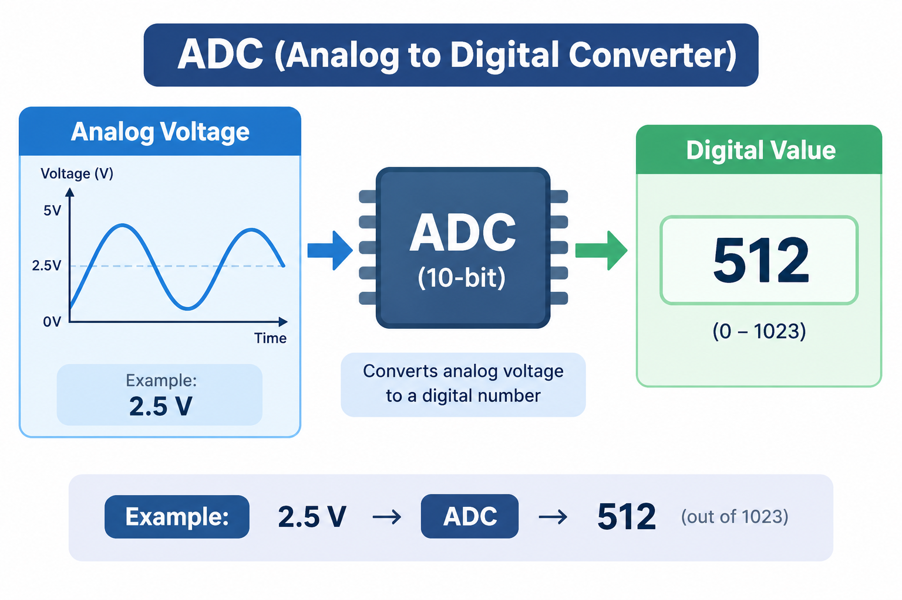
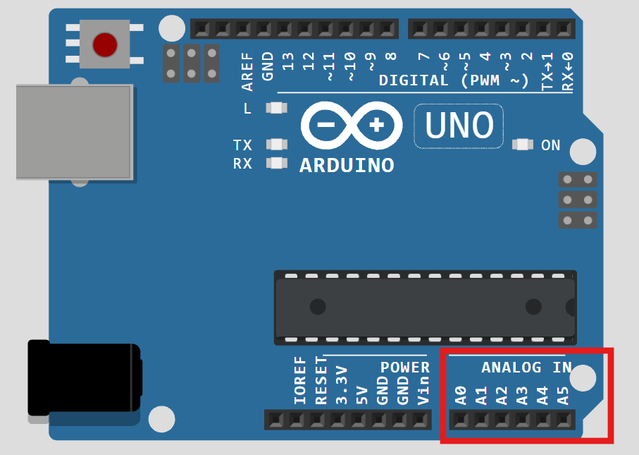
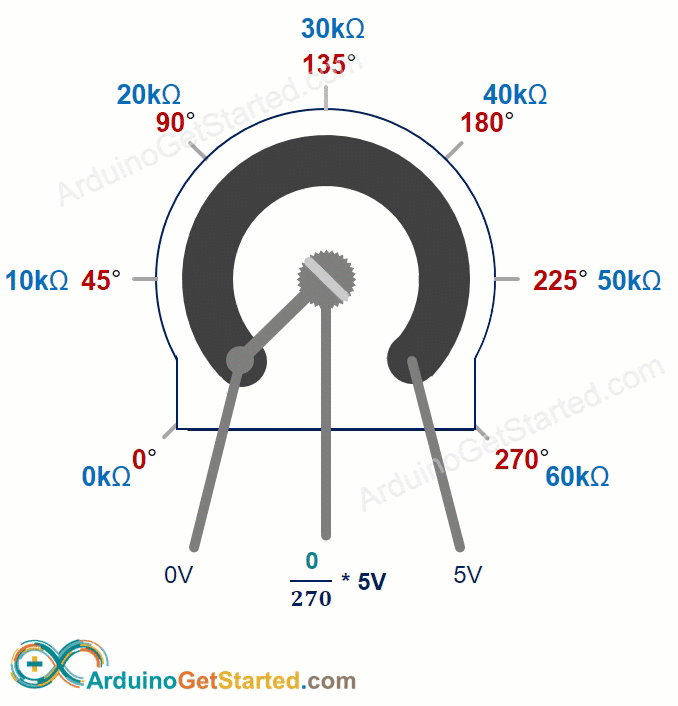
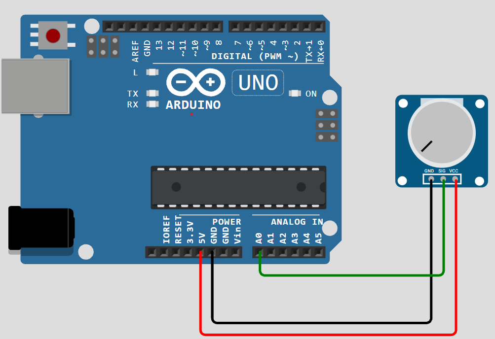
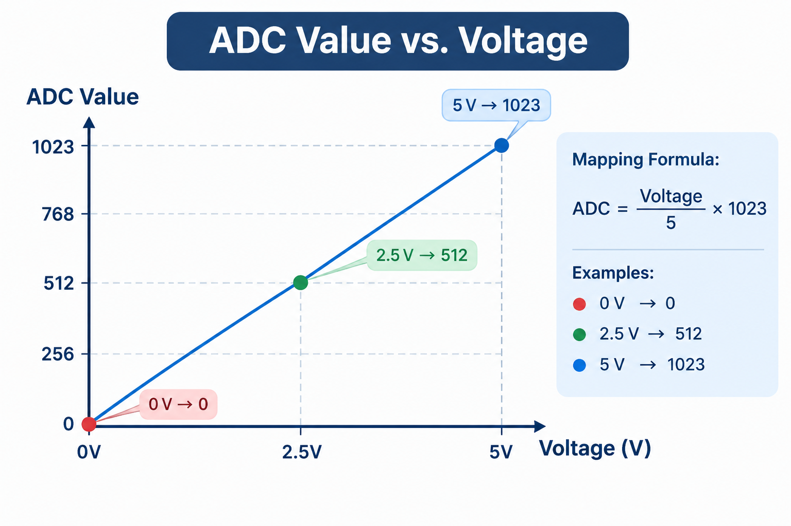
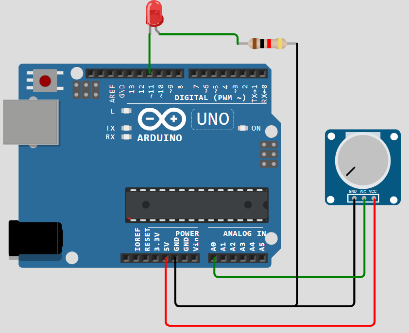

<h1 align="center">جلسه 04 — Analog Input / Output</h1>

<div dir="rtl" align="right">

## 🎯 هدف جلسه

در جلسه قبل با **Digital Input / Output** آشنا شدیم و یاد گرفتیم چگونه وضعیت‌هایی مانند `HIGH` و `LOW` را با Arduino بخوانیم و کنترل کنیم.

در این جلسه با **Analog Input / Output** آشنا می‌شویم.

در این جلسه یاد می‌گیریم:

- سیگنال Analog چیست؟
- تفاوت Digital و Analog چیست؟
- ورودی‌های Analog در Arduino UNO چگونه کار می‌کنند؟
- ADC چیست؟
- تابع `()analogRead` چیست؟
- چگونه مقدار یک Potentiometer را بخوانیم؟
- چگونه مقدار Analog را در Serial Monitor مشاهده کنیم؟
- محدوده مقدار `()analogRead` در Arduino UNO چیست؟
- چگونه مقدار Analog را به یک محدوده دیگر تبدیل کنیم؟
- چگونه با یک Potentiometer شدت روشنایی LED را کنترل کنیم؟

در پایان این جلسه می‌توانیم مقدار یک ورودی متغیر را با Arduino اندازه‌گیری و از آن برای کنترل یک خروجی استفاده کنیم.

</div>

---

<h2 dir="rtl" align="right">🔢 Digital vs Analog</h2>

<div dir="rtl" align="right">

در جلسه قبل دیدیم که یک ورودی دیجیتال معمولاً دو وضعیت دارد:

</div>

```text
LOW
HIGH
```

<div dir="rtl" align="right">

اما بسیاری از کمیت‌های دنیای واقعی فقط دو حالت ندارند.

برای مثال:

- شدت نور
- دما
- فشار
- موقعیت یک ولوم
- مقدار یک سنسور

می‌توانند در محدوده‌ای از مقادیر تغییر کنند.

به چنین سیگنال‌هایی **Analog** می‌گوییم.

</div>


<table dir="rtl" align="100%">
  <thead>
    <tr>
      <th>ویژگی</th>
      <th>Digital</th>
      <th>Analog</th>
    </tr>
  </thead>
  <tbody>
    <tr>
      <td>تعداد وضعیت</td>
      <td>معمولاً دو وضعیت</td>
      <td>محدوده‌ای از مقادیر</td>
    </tr>
    <tr>
      <td>مثال</td>
      <td>Button</td>
      <td>Potentiometer</td>
    </tr>
    <tr>
      <td>مقادیر نمونه</td>
      <td><code>LOW / HIGH</code></td>
      <td><code>0 ... 1023</code></td>
    </tr>
    <tr>
      <td>تابع خواندن</td>
      <td><code>()digitalRead</code></td>
      <td><code>()analogRead</code></td>
    </tr>
  </tbody>
</table>

<div dir="rtl" align="right">
<br>
</div>

<p align="center">
  
</p>

---

<h2 dir="rtl" align="right">🌊 سیگنال Analog چیست؟</h2>

<div dir="rtl" align="right">

یک سیگنال Analog می‌تواند در یک محدوده، مقادیر مختلفی داشته باشد.

برای مثال فرض کنید ولتاژ یک سیگنال بین `0V` و `5V` تغییر کند.

در این حالت ممکن است مقدار ولتاژ چنین مقادیری باشد:

</div>

```text
0V
1V
2V
2.5V
3V
4V
5V
```

<div dir="rtl" align="right">

یعنی برخلاف Digital که معمولاً با دو وضعیت کار می‌کند، Analog می‌تواند مقادیر مختلفی داشته باشد.

</div>

---

<h2 dir="rtl" align="right">🔄 ADC چیست؟</h2>

<div dir="rtl">

<p>
<span dir="ltr"><code>Arduino</code></span>
نمی‌تواند یک ولتاژ
<span dir="ltr"><code>Analog</code></span>
را مستقیماً به شکل عددی در برنامه استفاده کند.
</p>

<p>
برای تبدیل ولتاژ
<span dir="ltr"><code>Analog</code></span>
به یک مقدار عددی، از
<strong><span dir="ltr">ADC</span></strong>
استفاده می‌شود.
</p>

<p>
<strong><span dir="ltr">ADC</span></strong>
مخفف:
</p>

</div>

<p dir="ltr" align="center">
<strong>Analog to Digital Converter</strong>
</p>

<div dir="rtl">

یعنی:

<strong>مبدل آنالوگ به دیجیتال</strong>

فرآیند کلی به شکل زیر است:


```text
Analog Voltage
      ↓
     ADC
      ↓
Digital Value
      ↓
Arduino Program
```

<div dir="rtl" align="right">

در Arduino UNO، ورودی‌های Analog توسط ADC داخلی میکروکنترلر خوانده می‌شوند.

</div>

<p align="center">
  
</p>

---

<h2 dir="rtl" align="right">📍 پایه‌های Analog در Arduino UNO</h2>

<div dir="rtl" align="right">

در Arduino UNO پایه‌های Analog با نام‌های زیر مشخص می‌شوند:

</div>

```text
A0
A1
A2
A3
A4
A5
```

<div dir="rtl" align="right">

برای مثال می‌توانیم یک سنسور یا Potentiometer را به پایه `A0` متصل کنیم و مقدار آن را بخوانیم.

</div>

<p align="center">
  
</p>

---

<h2 dir="rtl" align="right">⚙️ تابع <code>()analogRead</code></h2>

<div dir="rtl" align="right">

برای خواندن مقدار یک ورودی Analog از تابع زیر استفاده می‌کنیم:

</div>
<div dir="rtl" align="left">

```cpp
analogRead(pin);
```

<div dir="rtl" align="right">

برای مثال:

</div>

```cpp
analogRead(A0);
```

<div dir="rtl" align="right">

مقدار برگشتی این تابع در Arduino UNO معمولاً در محدوده زیر قرار دارد:

</div>

```text
0 ───────────────────── 1023
```

<div dir="rtl" align="right">

بنابراین:

- کمترین مقدار = `0`
- بیشترین مقدار = `1023`

است.

</div>

---

<h2 dir="rtl" align="right">📊 چرا مقدار 0 تا 1023 است؟</h2>

<div dir="rtl">
<div dir="rtl" align="right">
<p>
ADC مورد استفاده در
<span dir="ltr"><code>Arduino UNO</code></span>
دارای رزولوشن <strong>10 بیت</strong> است.
</p>

</div>
<div dir="rtl" align="right">

با 10 بیت می‌توانیم:

</div>

```text
2¹⁰ = 1024
```

<div dir="rtl" align="right">

مقدار مختلف ایجاد کنیم.

از آنجا که شمارش از صفر شروع می‌شود، محدوده خروجی به شکل زیر است:

</div>

```text
0 تا 1023
```

<div dir="rtl" align="right">

یعنی مجموعاً **1024 سطح مختلف** داریم.

</div>

---

<h2 dir="rtl" align="right">🎛️ Potentiometer چیست؟</h2>

<div dir="rtl" align="right">

<p dir="rtl">
<span dir="ltr"><strong>Potentiometer</strong></span>
یا پتانسیومتر یک مقاومت متغیر است.
</p>

با چرخاندن محور آن، ولتاژ خروجی می‌تواند در یک محدوده تغییر کند.

یک Potentiometer معمولی سه پایه دارد.

برای استفاده به‌عنوان **Voltage Divider**:

- یک پایه → `5V`
- پایه وسط → `A0`
- پایه دیگر → `GND`

پایه وسط معمولاً همان **Wiper** است و ولتاژ متغیر خروجی را فراهم می‌کند.

</div>

```text
      Potentiometer

        ┌─────┐
   VCC ─┤  1  │
        │     │
  OUT ──┤  2  │
        │     │
   GND ─┤  3  │
        └─────┘
```

<p align="center">
  
</p>

---

<h2 dir="rtl" align="right">🔌 اتصال Potentiometer به Arduino</h2>

```text
        Potentiometer

       ┌────────────┐
5V ────┤            │
       │            │
A0 ────┤    OUT     │
       │            │
GND ───┤            │
       └────────────┘
```

<div dir="rtl" align="right">

با چرخاندن Potentiometer، ولتاژ پایه `A0` تغییر می‌کند.

<p dir="rtl">
<span dir="ltr"><code>Arduino</code></span>
این تغییر ولتاژ را توسط
<span dir="ltr"><code>ADC</code></span>
اندازه‌گیری می‌کند.
</p>

</div>

<p align="center">
  
</p>

---

<h2 dir="rtl" align="right">🧪 اولین پروژه — خواندن Potentiometer</h2>

<div dir="rtl" align="right">

در اولین پروژه مقدار Potentiometer را از پایه `A0` می‌خوانیم.

</div>

```cpp
const int potPin = A0;

void setup() {
  Serial.begin(9600);
}

void loop() {

  int value = analogRead(potPin);

  Serial.println(value);

  delay(200);
}
```

<div dir="rtl" align="right">

در این برنامه مقدار Potentiometer به‌صورت مداوم خوانده می‌شود و در Serial Monitor نمایش داده می‌شود.

</div>

---

<h2 dir="rtl" align="right">🖥️ مشاهده مقدار در Serial Monitor</h2>

<div dir="rtl" align="right">

<div dir="rtl">

<p>
بعد از
<span dir="ltr"><code>Upload</code></span>
کردن برنامه:
</p>

<ol>
  <li>
    <span dir="ltr"><code>Serial Monitor</code></span>
    را باز کنید.
  </li>
  <li>
    <span dir="ltr"><code>Baud Rate</code></span>
    را روی
    <span dir="ltr"><code>9600</code></span>
    قرار دهید.
  </li>
  <li>
    <span dir="ltr"><code>Potentiometer</code></span>
    را بچرخانید.
  </li>
  <li>
    تغییر مقدار را مشاهده کنید.
  </li>
</ol>

</div>

ممکن است مقادیری مانند این مشاهده کنید:

</div>

```text
0
125
267
489
512
734
901
1023
```

<div dir="rtl" align="right">

با چرخاندن Potentiometer مقدار خوانده‌شده تغییر می‌کند.

</div>

---

<h2 dir="rtl" align="right">📈 ارتباط ولتاژ و مقدار ADC</h2>

<div dir="rtl" align="right">

به‌صورت ساده، اگر مرجع ADC برابر `5V` باشد، می‌توانیم رابطه تقریبی زیر را در نظر بگیریم:

</div>
<p align="center">
  
</p>
  
<div dir="rtl" align="right">

به‌صورت تقریبی:

</div>

```text
0V   → 0
2.5V → حدود 512
5V   → 1023
```

<div dir="rtl" align="right">

مقدار دقیق می‌تواند به مرجع ولتاژ ADC و شرایط واقعی مدار وابسته باشد.

</div>

---

<h2 dir="rtl" align="right">🧮 تبدیل مقدار ADC به ولتاژ</h2>

<div dir="rtl" align="right">

اگر بخواهیم مقدار خوانده‌شده را به ولتاژ تقریبی تبدیل کنیم، می‌توانیم از رابطه زیر استفاده کنیم:

</div>

<div dir="ltr" align="center">

$$
V = \frac{ADC \times V_{ref}}{1023}
$$

</div>

<div dir="rtl" align="right">

برای مثال اگر:

</div>

```text
ADC = 512
Vref = 5V
```

<div dir="rtl" align="right">

داشته باشیم:

</div>

```text
Voltage ≈ 512 × 5 / 1023
Voltage ≈ 2.5V
```

---

<h2 dir="rtl" align="right">🔬 نمایش ولتاژ در Serial Monitor</h2>

```cpp
const int potPin = A0;

void setup() {
  Serial.begin(9600);
}

void loop() {

  int adcValue = analogRead(potPin);

  float voltage = adcValue * 5.0 / 1023.0;

  Serial.print("ADC = ");
  Serial.print(adcValue);

  Serial.print("   Voltage = ");
  Serial.println(voltage);

  delay(200);
}
```

<div dir="rtl" align="right">

حالا Serial Monitor می‌تواند چیزی شبیه این نمایش دهد:

</div>

```text
ADC = 0     Voltage = 0.00
ADC = 256   Voltage = 1.25
ADC = 512   Voltage = 2.50
ADC = 768   Voltage = 3.75
ADC = 1023  Voltage = 5.00
```

---

<h2 dir="rtl" align="right">🔄 تابع <code>()map</code></h2>

<div dir="rtl" align="right">

گاهی لازم است یک مقدار را از یک محدوده به محدوده دیگری تبدیل کنیم.

برای این کار Arduino تابع `()map` را در اختیار ما قرار می‌دهد.

ساختار:

</div>

```cpp
map(value, fromLow, fromHigh, toLow, toHigh);
```

<div dir="rtl" align="right">

برای مثال اگر مقدار ADC بین `0` تا `1023` باشد و بخواهیم آن را به محدوده `0` تا `100` تبدیل کنیم:

</div>

```cpp
int percent = map(value, 0, 1023, 0, 100);
```

<div dir="rtl" align="right">

در این حالت تقریباً:

</div>

```text
ADC = 0     → 0%
ADC = 512   → 50%
ADC = 1023  → 100%
```

---

<h2 dir="rtl" align="right">💡 کنترل شدت LED با Potentiometer</h2>

<div dir="rtl" align="right">

حالا می‌خواهیم یک پروژه ترکیبی بسازیم.

<strong>هدف:</strong>

با چرخاندن Potentiometer، شدت روشنایی LED تغییر کند.

در این پروژه مسیر داده به شکل زیر است:

</div>

```text
 Potentiometer
      ↓
  Analog Input
      ↓
   Arduino
      ↓
   Output
      ↓
     LED
```

<p align="center">
  
</p>

<div dir="rtl" align="right">

برای این کار باید مقدار Analog را بخوانیم و سپس آن را برای کنترل خروجی استفاده کنیم.

<strong>نکته آموزشی:</strong> در این جلسه PWM را فقط به‌عنوان پیش‌زمینه مطرح می‌کنیم. آموزش اصلی PWM و تابع `()analogWrite` در جلسه ۵ انجام خواهد شد.

در جلسه بعد با PWM به‌صورت کامل آشنا خواهیم شد.

</div>

---

<h2 dir="rtl" align="right">🧪 تمرین عملی</h2>

<div dir="rtl" align="right">

یک Potentiometer را به `A0` متصل کنید و مقدار آن را بخوانید.

سپس مقدار خوانده‌شده را در Serial Monitor نمایش دهید.

</div>

```cpp
const int potPin = A0;

void setup() {
  Serial.begin(9600);
}

void loop() {

  int value = analogRead(potPin);

  Serial.println(value);

  delay(100);
}
```

---

<h2 dir="rtl" align="right">🧩 تمرین 02 — درصد Potentiometer</h2>

<div dir="rtl" align="right">

برنامه را تغییر دهید تا مقدار Potentiometer به‌صورت درصد نمایش داده شود.

مثلاً:

</div>

```text
0%
25%
50%
75%
100%
```

<div dir="rtl" align="right">

راهنمایی:

</div>

```cpp
int percent = map(value, 0, 1023, 0, 100);
```


---

<h2 dir="rtl" align="right">🧩 تمرین 03 — دو ورودی Analog</h2>

<div dir="rtl" align="right">

دو Potentiometer را به پایه‌های زیر متصل کنید:

</div>

```text
A0
A1
```

<div dir="rtl" align="right">

سپس مقدار هر دو را در Serial Monitor نمایش دهید.

<hr>

<h2 dir="rtl">📝 سوالات</h2>

<div dir="rtl">

<ol>
  <li>سیگنال <span dir="ltr"><code>Analog</code></span> چیست؟</li>
  <li>تفاوت <span dir="ltr"><code>Digital</code></span> و <span dir="ltr"><code>Analog</code></span> چیست؟</li>
  <li><span dir="ltr"><code>ADC</code></span> چیست؟</li>
  <li><span dir="ltr"><code>ADC</code></span> در <span dir="ltr"><code>Arduino UNO</code></span> چند بیت است؟</li>
  <li>چرا <span dir="ltr"><code>analogRead()</code></span> مقدار بین <span dir="ltr"><code>0</code></span> تا <span dir="ltr"><code>1023</code></span> برمی‌گرداند؟</li>
  <li><span dir="ltr"><code>Potentiometer</code></span> چیست؟</li>
  <li>پایه وسط <span dir="ltr"><code>Potentiometer</code></span> معمولاً چه نقشی دارد؟</li>
  <li>تابع <span dir="ltr"><code>analogRead()</code></span> چه کاری انجام می‌دهد؟</li>
  <li><span dir="ltr"><code>A0</code></span> چه کاربردی دارد؟</li>
  <li>تابع <span dir="ltr"><code>map()</code></span> چه کاری انجام می‌دهد؟</li>
  <li>چگونه مقدار <span dir="ltr"><code>ADC</code></span> را به ولتاژ تبدیل می‌کنیم؟</li>
  <li>تفاوت <span dir="ltr"><code>digitalRead()</code></span> و <span dir="ltr"><code>analogRead()</code></span> چیست؟</li>
</ol>

</div>

---

<h2 dir="rtl">📌 جمع‌بندی</h2>

<div dir="rtl">

<p>در این جلسه یاد گرفتیم:</p>

<ul>
  <li>مفهوم <span dir="ltr"><code>Analog</code></span> را یاد گرفتیم.</li>
  <li><span dir="ltr"><code>Digital</code></span> و <span dir="ltr"><code>Analog</code></span> را با یکدیگر مقایسه کردیم.</li>
  <li>با <span dir="ltr"><code>ADC</code></span> آشنا شدیم.</li>
  <li>ورودی‌های <span dir="ltr"><code>Analog</code></span> در <span dir="ltr"><code>Arduino UNO</code></span> را شناختیم.</li>
  <li>مفهوم رزولوشن <strong>10 بیتی</strong> را یاد گرفتیم.</li>
  <li>با <span dir="ltr"><code>analogRead()</code></span> کار کردیم.</li>
  <li>یک <span dir="ltr"><code>Potentiometer</code></span> را به <span dir="ltr"><code>Arduino</code></span> متصل کردیم.</li>
  <li>مقدار <span dir="ltr"><code>Potentiometer</code></span> را در <span dir="ltr"><code>Serial Monitor</code></span> مشاهده کردیم.</li>
  <li>مقدار <span dir="ltr"><code>ADC</code></span> را به ولتاژ تبدیل کردیم.</li>
  <li>با تابع <span dir="ltr"><code>map()</code></span> آشنا شدیم.</li>
  <li>مقدار <span dir="ltr"><code>Analog</code></span> را به یک محدوده جدید تبدیل کردیم.</li>
</ul>

<p>
در جلسه بعد وارد
<strong><span dir="ltr">PWM</span></strong>
می‌شویم و یاد می‌گیریم چگونه از
<span dir="ltr"><code>Arduino</code></span>
برای کنترل متغیر خروجی‌هایی مانند شدت روشنایی
<span dir="ltr"><code>LED</code></span>
و سرعت موتور استفاده کنیم.
</p>

</div>

---

<h2 dir="rtl" align="right">⏭️ جلسه بعد</h2>

<div dir="rtl" align="right">


<p dir="rtl">
⬅️ <a href="../05-PWM/">جلسه 05 — PWM </a>
</p>


<p align="center">
<strong>Arduino From Zero to Projects</strong>
</p>

<p align="center">
<strong>Mohammad Esteghamat</strong>
</p>
