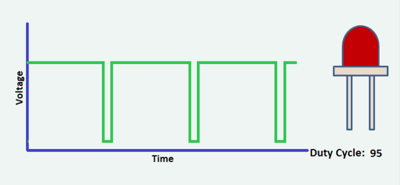
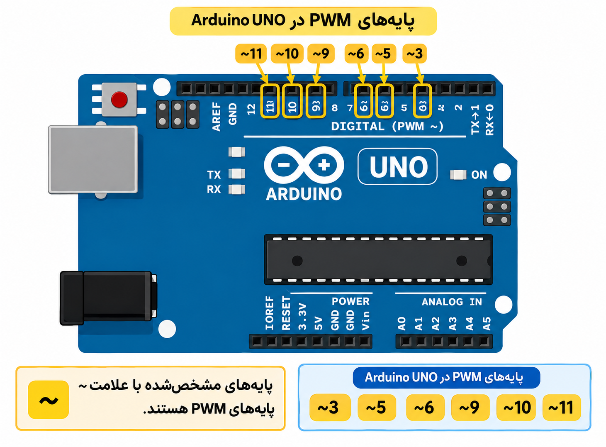
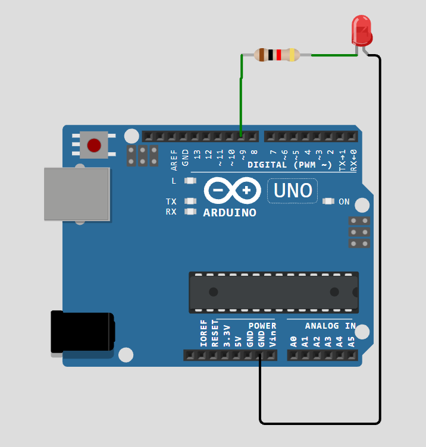
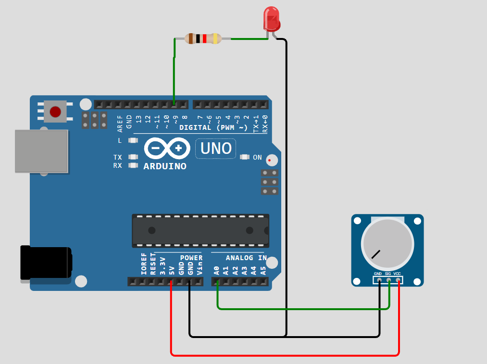
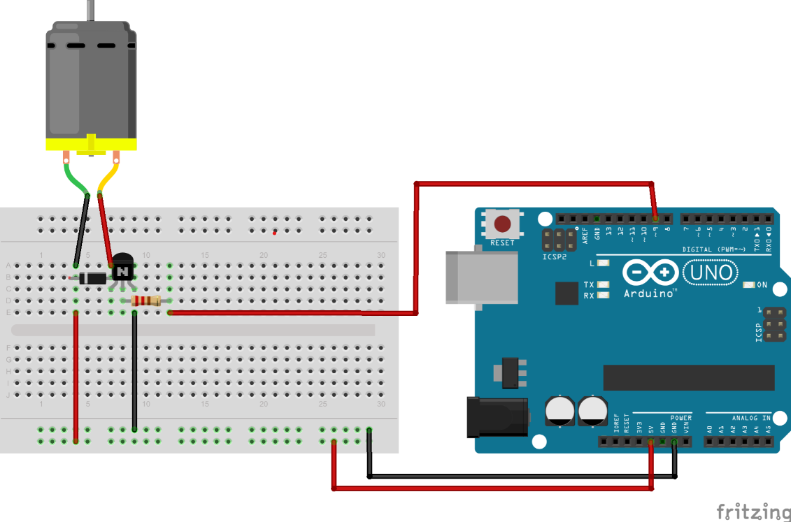

<h2 dir="rtl" align="center">
# جلسه 05 — PWM در Arduino

<div dir="rtl" align="right">
      
## 🎯 هدف جلسه

در این جلسه با مفهوم <bdi>**PWM (Pulse Width Modulation)**</bdi> آشنا می‌شویم و یاد می‌گیریم چگونه با استفاده از آن، میزان روشنایی <bdi>LED</bdi> یا سرعت موتور <bdi>DC</bdi> را کنترل کنیم.

در جلسه قبل با <bdi>Analog Input</bdi> و تابع <code dir="ltr">analogRead()</code> آشنا شدیم. در این جلسه می‌بینیم که چگونه می‌توان از تابع <code dir="ltr">analogWrite()</code> برای ایجاد خروجی <bdi>PWM</bdi> استفاده کرد.

---

## 📚 سرفصل‌های جلسه

- <bdi>PWM</bdi> چیست؟
- تفاوت <bdi>PWM</bdi> با خروجی آنالوگ واقعی
- پایه‌های <bdi>PWM</bdi> در <bdi>Arduino UNO</bdi>
- تابع <code dir="ltr">analogWrite()</code>
- مفهوم <bdi>Duty Cycle</bdi>
- کنترل روشنایی <bdi>LED</bdi>
- استفاده از <bdi>Potentiometer</bdi> برای کنترل <bdi>LED</bdi>
- تبدیل مقدار <code dir="ltr">analogRead()</code> به <bdi>PWM</bdi> با <code dir="ltr">map()</code>
- کنترل سرعت موتور <bdi>DC</bdi>
- تمرین‌ها و سوالات

---

# 1️⃣ <bdi>PWM</bdi> چیست؟

<bdi>**PWM**</bdi> مخفف عبارت زیر است:

> <bdi>**Pulse Width Modulation**</bdi>

به معنی **مدولاسیون پهنای پالس** است.

در <bdi>PWM</bdi>، <bdi>Arduino</bdi> ولتاژ را به‌صورت واقعی بین <code dir="ltr">0V</code> و <code dir="ltr">5V</code> تغییر نمی‌دهد؛ بلکه یک سیگنال دیجیتال را با سرعت زیاد بین دو حالت زیر تغییر می‌دهد:

- <code dir="ltr">HIGH</code>
- <code dir="ltr">LOW</code>

با تغییر مدت زمانی که سیگنال در حالت <code dir="ltr">HIGH</code> قرار دارد، می‌توان توان متوسط اعمال‌شده به یک قطعه را کنترل کرد.

<div dir="ltr" align="center">



</div>

---

# 2️⃣ <bdi>PWM</bdi> چگونه کار می‌کند؟

فرض کنید یک <bdi>LED</bdi> داریم.

اگر <bdi>LED</bdi> همیشه خاموش باشد:

```text
LOW   LOW   LOW   LOW   LOW
```

اگر <bdi>LED</bdi> همیشه روشن باشد:

```text
HIGH  HIGH  HIGH  HIGH  HIGH
```

اما در <bdi>PWM</bdi> می‌توانیم حالت‌هایی مانند موارد زیر داشته باشیم:

```text
HIGH  HIGH  LOW   LOW   LOW
```

یا:

```text
HIGH  HIGH  HIGH  LOW   LOW
```

هرچه مدت زمان <code dir="ltr">HIGH</code> بیشتر باشد، توان متوسط بیشتری به بار اعمال می‌شود.

---

# 3️⃣ <bdi>Duty Cycle</bdi> چیست؟

به درصد زمانی که سیگنال در حالت <code dir="ltr">HIGH</code> قرار دارد، <bdi>**Duty Cycle**</bdi> گفته می‌شود.

### <bdi>Duty Cycle = 25%</bdi>

```text
██░░░░░░
```

### <bdi>Duty Cycle = 50%</bdi>

```text
████░░░░
```

### <bdi>Duty Cycle = 75%</bdi>

```text
██████░░
```

### <bdi>Duty Cycle = 100%</bdi>

```text
████████
```

| <bdi>Duty Cycle</bdi> | نتیجه تقریبی |
|---:|---|
| <code dir="ltr">0%</code> | خاموش |
| <code dir="ltr">25%</code> | روشنایی کم |
| <code dir="ltr">50%</code> | روشنایی متوسط |
| <code dir="ltr">75%</code> | روشنایی زیاد |
| <code dir="ltr">100%</code> | حداکثر روشنایی |

> **توجه:** روشنایی واقعی <bdi>LED</bdi> الزاماً به‌صورت خطی با <bdi>Duty Cycle</bdi> دیده نمی‌شود، زیرا چشم انسان پاسخ غیرخطی دارد.

---

# 4️⃣ پایه‌های <bdi>PWM</bdi> در <bdi>Arduino UNO</bdi>

در <bdi>Arduino UNO</bdi>، برخی پایه‌های دیجیتال قابلیت <bdi>PWM</bdi> دارند.

این پایه‌ها با علامت <code dir="ltr">~</code> روی برد مشخص می‌شوند:

```text
~3
~5
~6
~9
~10
~11
```

<div dir="ltr" align="center">



</div>

بنابراین می‌توان از این پایه‌ها برای <code dir="ltr">analogWrite()</code> استفاده کرد.

مثلاً:
<div dir="ltr" align="left">

```cpp
analogWrite(9, 128);
```
<div dir="ltr" align="right">
---

# 5️⃣ تابع <code dir="ltr">analogWrite()</code>

ساختار کلی تابع:
<div dir="ltr" align="left">

```cpp
analogWrite(pin, value);
```
<div dir="ltr" align="right">
مثال:
<div dir="ltr" align="left">

```cpp
analogWrite(9, 128);
```
<div dir="ltr" align="right">

در <bdi>Arduino UNO</bdi> مقدار <bdi>PWM</bdi> معمولاً از:

```text
0 تا 255
```

است.

| مقدار <code dir="ltr">analogWrite()</code> | <bdi>Duty Cycle</bdi> تقریبی |
|---:|---:|
| <code dir="ltr">0</code> | <code dir="ltr">0%</code> |
| <code dir="ltr">64</code> | <code dir="ltr">25%</code> |
| <code dir="ltr">128</code> | <code dir="ltr">50%</code> |
| <code dir="ltr">192</code> | <code dir="ltr">75%</code> |
| <code dir="ltr">255</code> | <code dir="ltr">100%</code> |

پس:
<div dir="ltr" align="left">

```cpp
analogWrite(9, 0);
```
<div dir="ltr" align="right">

تقریباً معادل خاموش بودن خروجی است.

و:
<div dir="ltr" align="left">

```cpp
analogWrite(9, 255);
```
<div dir="ltr" align="right">

حداکثر <bdi>Duty Cycle</bdi> را ایجاد می‌کند.

---

# 6️⃣ اولین پروژه <bdi>PWM</bdi> — کنترل روشنایی <bdi>LED</bdi>

## قطعات مورد نیاز

- <bdi>Arduino UNO</bdi>
- <bdi>LED</bdi>
- مقاومت <code dir="ltr">220Ω</code> یا <code dir="ltr">330Ω</code>
- سیم <bdi>Jumper</bdi>
- <bdi>Breadboard</bdi>

## اتصال

```text
Arduino Pin 9
      │
   Resistor
      │
     LED
      │
     GND
```
<div dir="ltr" align="center">



</div>

پایه بلند <bdi>LED</bdi> معمولاً به سمت مقاومت و پایه کوتاه به <code dir="ltr">GND</code> متصل می‌شود.

## 💻 کد
<div dir="ltr" align="left">

```cpp
const int ledPin = 9;

void setup() {
  pinMode(ledPin, OUTPUT);
}

void loop() {
  analogWrite(ledPin, 128);
}
```
<div dir="ltr" align="right">

در این برنامه <bdi>LED</bdi> با <bdi>Duty Cycle</bdi> تقریباً <code dir="ltr">50%</code> روشن می‌شود.

---

# 7️⃣ ایجاد <bdi>Fade</bdi> برای <bdi>LED</bdi>

حالا می‌خواهیم <bdi>LED</bdi> به‌صورت تدریجی روشن و خاموش شود.

<div dir="ltr" align="left">

```cpp
const int ledPin = 9;

void setup() {
  pinMode(ledPin, OUTPUT);
}

void loop() {

  for (int brightness = 0; brightness <= 255; brightness++) {
    analogWrite(ledPin, brightness);
    delay(10);
  }

  for (int brightness = 255; brightness >= 0; brightness--) {
    analogWrite(ledPin, brightness);
    delay(10);
  }
}
```
<div dir="ltr" align="right">

در این برنامه مقدار متغیر <code dir="ltr">brightness</code> از <code dir="ltr">0</code> تا <code dir="ltr">255</code> افزایش پیدا می‌کند و سپس دوباره کاهش پیدا می‌کند.

---

# 8️⃣ ترکیب <bdi>Analog Input</bdi> و <bdi>PWM</bdi>

در جلسه قبل با <code dir="ltr">analogRead()</code> آشنا شدیم.

تابع <code dir="ltr">analogRead()</code> در <bdi>Arduino UNO</bdi> مقدار زیر را برمی‌گرداند:

```text
0 تا 1023
```

اما <code dir="ltr">analogWrite()</code> مقدار زیر را دریافت می‌کند:

```text
0 تا 255
```

بنابراین برای تبدیل این دو بازه می‌توانیم از تابع <code dir="ltr">map()</code> استفاده کنیم.

---

# 9️⃣ کنترل <bdi>LED</bdi> با <bdi>Potentiometer</bdi>

در این پروژه با چرخاندن <bdi>Potentiometer</bdi>، روشنایی <bdi>LED</bdi> تغییر می‌کند.

## اتصال <bdi>Potentiometer</bdi>

```text
5V ─────────────┐
                │
          Potentiometer
                │
A0 ─────────────┤
                │
GND ────────────┘
```

<div dir="ltr" align="center">



</div>

اتصال <bdi>LED</bdi>:

```text
Pin 9 → Resistor → LED → GND
```

## 💻 کد
<div dir="ltr" align="left">

```cpp
const int potPin = A0;
const int ledPin = 9;

void setup() {
  pinMode(ledPin, OUTPUT);
}

void loop() {

  int potValue = analogRead(potPin);

  int brightness = map(potValue, 0, 1023, 0, 255);

  analogWrite(ledPin, brightness);

  delay(10);
}
```
<div dir="ltr" align="right">
---

## 🔍 این برنامه چه کاری انجام می‌دهد؟

ابتدا مقدار <bdi>Potentiometer</bdi> را می‌خوانیم:

<div dir="ltr" align="left">

```cpp
int potValue = analogRead(potPin);
```
<div dir="ltr" align="right">

مقدار آن بین <code dir="ltr">0</code> تا <code dir="ltr">1023</code> است.

سپس آن را به بازه <code dir="ltr">0</code> تا <code dir="ltr">255</code> تبدیل می‌کنیم:

<div dir="ltr" align="left">

```cpp
int brightness = map(potValue, 0, 1023, 0, 255);
```
<div dir="ltr" align="right">

و در نهایت مقدار <bdi>PWM</bdi> را روی <bdi>LED</bdi> اعمال می‌کنیم:

<div dir="ltr" align="left">

```cpp
analogWrite(ledPin, brightness);
```
<div dir="ltr" align="right">

فرآیند کلی:

```text
Potentiometer
      │
      ▼
analogRead()
      │
   0 → 1023
      │
      ▼
    map()
      │
    0 → 255
      │
      ▼
analogWrite()
      │
      ▼
     LED
```

---

# 🔟 تابع <code dir="ltr">map()</code>

ساختار تابع:

<div dir="ltr" align="left">

```cpp
map(value, fromLow, fromHigh, toLow, toHigh);
```
<div dir="ltr" align="right">

مثلاً:
<div dir="ltr" align="left">

```cpp
map(potValue, 0, 1023, 0, 255);
```
<div dir="ltr" align="right">

یعنی:

> مقدار <code dir="ltr">potValue</code> را از بازه <code dir="ltr">0</code> تا <code dir="ltr">1023</code> به بازه <code dir="ltr">0</code> تا <code dir="ltr">255</code> تبدیل کن.

مثال:

```text
0     → 0
512   → تقریباً 127
1023  → 255
```

---

# 1️⃣1️⃣ <bdi>PWM</bdi> خروجی آنالوگ واقعی نیست

یکی از نکات مهم این جلسه این است که:
<div dir="ltr" align="left">

```cpp
analogWrite()
```
<div dir="ltr" align="right">

در <bdi>Arduino UNO</bdi> به معنی ایجاد **ولتاژ آنالوگ واقعی** نیست.

بلکه این تابع یک سیگنال <bdi>PWM</bdi> تولید می‌کند.

یعنی خروجی همچنان بین:

```text
HIGH
LOW
```

تغییر می‌کند.

به دلیل سرعت بالای تغییرات، در بسیاری از کاربردها می‌توان از <bdi>PWM</bdi> برای کنترل توان متوسط استفاده کرد.

برای مثال:

- روشنایی <bdi>LED</bdi>
- سرعت موتور <bdi>DC</bdi>
- کنترل برخی عملگرها
- تولید سیگنال مناسب برای بعضی مدارها

---

# 1️⃣2️⃣ تفاوت <code dir="ltr">analogRead()</code> و <code dir="ltr">analogWrite()</code>

| ویژگی | <code dir="ltr">analogRead()</code> | <code dir="ltr">analogWrite()</code> |
|---|---|---|
| کاربرد | خواندن ورودی | ایجاد خروجی <bdi>PWM</bdi> |
| محدوده در <bdi>UNO</bdi> | <code dir="ltr">0–1023</code> | <code dir="ltr">0–255</code> |
| مثال | <bdi>Potentiometer</bdi> | <bdi>LED</bdi> |
| نوع | <bdi>ADC</bdi> | <bdi>PWM</bdi> |
| پایه نمونه | <code dir="ltr">A0</code> | <code dir="ltr">~9</code> |

نکته مهم:

```text
analogRead  → Input
analogWrite → PWM Output
```

---

# 1️⃣3️⃣ کنترل سرعت موتور <bdi>DC</bdi>

<bdi>PWM</bdi> فقط برای <bdi>LED</bdi> نیست.

می‌توان از <bdi>PWM</bdi> برای کنترل سرعت موتور <bdi>DC</bdi> نیز استفاده کرد.

برای مثال:
<div dir="ltr" align="left">

```cpp
analogWrite(9, 100);
```
<div dir="ltr" align="right">

یک سیگنال <bdi>PWM</bdi> با مقدار <code dir="ltr">100</code> تولید می‌کند.

اما **موتور DC را نباید مستقیماً به پایه Arduino متصل کرد.**

برای کنترل موتور معمولاً به مدار درایور نیاز داریم، مانند:

- <bdi>Transistor / MOSFET</bdi>
- <bdi>Diode</bdi>
- <bdi>Motor Driver</bdi>

<div dir="ltr" align="center">



</div>

در پروژه‌های بعدی می‌توانیم کنترل موتور را به‌صورت عملی بررسی کنیم.

---

# 🧪 تمرین‌های جلسه

## تمرین 1

یک <bdi>LED</bdi> را به یک پایه <bdi>PWM</bdi> متصل کنید و مقدار <bdi>PWM</bdi> را روی:

```text
50
```

قرار دهید.

سپس مقدار را به:

```text
200
```

تغییر دهید.

تفاوت روشنایی را مشاهده کنید.

---

## تمرین 2

برنامه‌ای بنویسید که <bdi>LED</bdi> به‌صورت تدریجی روشن و خاموش شود.

راهنمایی:

از:
<div dir="ltr" align="left">

```cpp
for
```
<div dir="ltr" align="right">

و:
<div dir="ltr" align="left">

```cpp
analogWrite()
```
<div dir="ltr" align="right">

استفاده کنید.

---

## تمرین 3

یک <bdi>Potentiometer</bdi> به <code dir="ltr">A0</code> متصل کنید و با چرخاندن آن، روشنایی <bdi>LED</bdi> متصل به پایه <code dir="ltr">9</code> را تغییر دهید.

---

## تمرین 4

مقدار <bdi>Potentiometer</bdi> را به درصد تبدیل کنید.

راهنمایی:
<div dir="ltr" align="left">

```cpp
map(value, 0, 1023, 0, 100);
```
<div dir="ltr" align="right">

---

## تمرین 5

برنامه‌ای بنویسید که:

- اگر مقدار <bdi>Potentiometer</bdi> کمتر از <code dir="ltr">300</code> بود → <bdi>LED</bdi> خاموش
- اگر مقدار بین <code dir="ltr">300</code> تا <code dir="ltr">700</code> بود → <bdi>LED</bdi> با روشنایی متوسط
- اگر مقدار بیشتر از <code dir="ltr">700</code> بود → <bdi>LED</bdi> با روشنایی زیاد

کار کند.

---

# ❓ سوالات

### سوال 1

<bdi>PWM</bdi> مخفف چیست؟

### سوال 2

محدوده مقدار <code dir="ltr">analogWrite()</code> در <bdi>Arduino UNO</bdi> چیست؟

### سوال 3

چرا <code dir="ltr">analogRead()</code> مقدار <code dir="ltr">0</code> تا <code dir="ltr">1023</code> دارد ولی <code dir="ltr">analogWrite()</code> مقدار <code dir="ltr">0</code> تا <code dir="ltr">255</code>؟

### سوال 4

<bdi>Duty Cycle</bdi> چیست؟

### سوال 5

آیا <code dir="ltr">analogWrite()</code> در <bdi>Arduino UNO</bdi> یک ولتاژ آنالوگ واقعی تولید می‌کند؟

### سوال 6

چرا برای تبدیل مقدار <bdi>Potentiometer</bdi> به <bdi>PWM</bdi> از <code dir="ltr">map()</code> استفاده کردیم؟

---

# 📌 خلاصه جلسه

در این جلسه یاد گرفتیم:

- <bdi>PWM</bdi> چیست.
- <bdi>Duty Cycle</bdi> چه مفهومی دارد.
- پایه‌های <bdi>PWM</bdi> در <bdi>Arduino UNO</bdi> کدام‌اند.
- چگونه از <code dir="ltr">analogWrite()</code> استفاده کنیم.
- مقدار <bdi>PWM</bdi> در <bdi>Arduino UNO</bdi> بین <code dir="ltr">0</code> تا <code dir="ltr">255</code> است.
- چگونه روشنایی <bdi>LED</bdi> را کنترل کنیم.
- چگونه با <bdi>PWM</bdi> یک <bdi>LED</bdi> را <bdi>Fade</bdi> کنیم.
- چگونه <code dir="ltr">analogRead()</code> و <code dir="ltr">analogWrite()</code> را با <code dir="ltr">map()</code> به یکدیگر مرتبط کنیم.
- چگونه با <bdi>Potentiometer</bdi> روشنایی <bdi>LED</bdi> را کنترل کنیم.
- <bdi>PWM</bdi> با خروجی آنالوگ واقعی تفاوت دارد.
- برای کنترل موتور <bdi>DC</bdi> نباید موتور را مستقیماً به پایه <bdi>Arduino</bdi> وصل کرد.

---

#⏭️جلسه بعد

در جلسه ششم با **<bdi>Serial Monitor</bdi>** به‌صورت کامل‌تر کار می‌کنیم و یاد می‌گیریم چگونه اطلاعات را بین <bdi>Arduino</bdi> و کامپیوتر ارسال و دریافت کنیم.

<p dir="rtl">
⬅️ <a href="../06-Serial-Monitor/">جلسه 06 — Serial-Monitor </a>
</p>


<p align="center">
<strong>Arduino From Zero to Projects</strong>
</p>

<p align="center">
<strong>Mohammad Esteghamat</strong>
</p>
