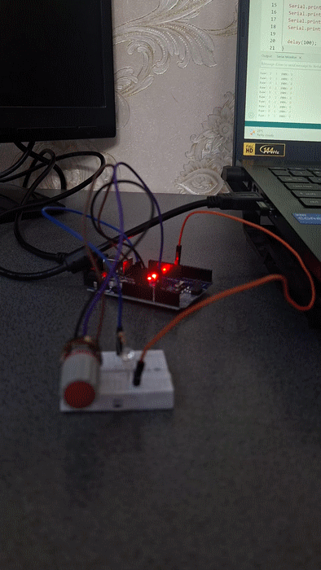

<div dir="rtl" align="right">

# جلسه 06 — Serial Monitor در Arduino

## 🎯 هدف جلسه

در این جلسه با مفهوم <bdi>**Serial Communication**</bdi> آشنا می‌شویم و یاد می‌گیریم چگونه از طریق <bdi>**Serial Monitor**</bdi> اطلاعات را بین <bdi>Arduino</bdi> و کامپیوتر ارسال و دریافت کنیم.

در جلسات قبل با ورودی و خروجی دیجیتال، <bdi>Analog Input</bdi> و <bdi>PWM</bdi> کار کردیم. حالا می‌خواهیم ببینیم چگونه می‌توانیم داده‌ها را روی صفحه کامپیوتر ببینیم و حتی از طریق کامپیوتر به <bdi>Arduino</bdi> دستور بدهیم.

---

## 📚 سرفصل‌های جلسه

- ارتباط سریال چیست؟
- <bdi>Serial Monitor</bdi> چیست؟
- <bdi>Baud Rate</bdi>
- تابع <code dir="ltr">Serial.begin()</code>
- تابع‌های <code dir="ltr">Serial.print()</code> و <code dir="ltr">Serial.println()</code>
- خواندن داده از <bdi>Serial</bdi>
- توابع <code dir="ltr">Serial.available()</code> و <code dir="ltr">Serial.read()</code>
- ارسال داده سنسور به کامپیوتر
- کنترل <bdi>LED</bdi> از طریق <bdi>Serial Monitor</bdi>
- تمرین‌ها و سوالات

---

# 1️⃣ ارتباط سریال چیست؟

<bdi>**Serial Communication**</bdi> روشی برای تبادل داده بین دو دستگاه است که داده‌ها را به‌صورت سری (بیت به بیت) ارسال می‌کند.

در <bdi>Arduino</bdi> معمولاً از پروتکل <bdi>UART</bdi> استفاده می‌شود که از طریق پایه‌های زیر کار می‌کند:

```text
TX  →  Transmit (ارسال)
RX  →  Receive (دریافت)
```

در <bdi>Arduino UNO</bdi>:

- پایه <code dir="ltr">0</code> = <bdi>RX</bdi>
- پایه <code dir="ltr">1</code> = <bdi>TX</bdi>

<div dir="ltr" align="center">


</div>

> **نکته مهم:** وقتی از <bdi>Serial Monitor</bdi> استفاده می‌کنید، این دو پایه برای ارتباط با کامپیوتر رزرو می‌شوند. بنابراین معمولاً نباید سنسور یا ماژول دیگری را مستقیماً به پایه‌های <code dir="ltr">0</code> و <code dir="ltr">1</code> وصل کنید.

---

<h2 dir="rtl" align="right">2️⃣ <bdi>Serial Monitor</bdi> چیست؟</h2>

<div dir="rtl" align="right">

<bdi>**Serial Monitor**</bdi> پنجره‌ای در نرم‌افزار <bdi>Arduino IDE</bdi> است که به شما امکان می‌دهد:

<ul>
  <li>داده‌هایی که <bdi>Arduino</bdi> ارسال می‌کند را ببینید.</li>
  <li>از طریق کیبورد به <bdi>Arduino</bdi> دستور بفرستید.</li>
</ul>

برای باز کردن آن:

<ol>
  <li>کد را روی برد آپلود کنید.</li>
  <li>از منوی بالا گزینه <bdi>Tools → Serial Monitor</bdi> را انتخاب کنید.</li>
  <li>یا کلید میانبر <code dir="ltr">Ctrl + Shift + M</code> را بزنید.</li>
</ol>

</div>

<div dir="ltr" align="center">


</div>

<div dir="rtl" align="right">

در پایین پنجره می‌توانید:

<ul>
  <li>متن ارسال کنید.</li>
  <li><bdi>Baud Rate</bdi> را تنظیم کنید.</li>
  <li>نوع <bdi>Line Ending</bdi> را انتخاب کنید.</li>
</ul>

</div>

---

<h2 dir="rtl" align="right">3️⃣ <bdi>Baud Rate</bdi> چیست؟</h2>

<div dir="rtl" align="right">

<bdi>**Baud Rate**</bdi> سرعت انتقال داده را مشخص می‌کند و واحد آن <bdi>بیت بر ثانیه (bps)</bdi> است.

رایج‌ترین مقدار در پروژه‌های <bdi>Arduino</bdi>:

</div>

<div dir="ltr" align="left">

```text
9600
```
</div> <div dir="rtl" align="right">

مقادیر رایج دیگر:

</div> <div dir="ltr" align="left">
4800
9600
19200
38400
57600
115200
</div> <div dir="rtl" align="right">

<strong>قانون مهم:</strong>

<bdi>Baud Rate</bdi> در کد و در <bdi>Serial Monitor</bdi> باید <strong>دقیقاً یکسان</strong> باشد، وگرنه داده‌ها به‌هم‌ریخته نمایش داده می‌شوند.

</div> <table dir="rtl" align="right"> <tr> <th>مقدار در کد</th> <th>مقدار در <bdi>Serial Monitor</bdi></th> <th>نتیجه</th> </tr> <tr> <td><code dir="ltr">9600</code></td> <td><code dir="ltr">9600</code></td> <td>صحیح</td> </tr> <tr> <td><code dir="ltr">9600</code></td> <td><code dir="ltr">115200</code></td> <td>متن بی‌معنی</td> </tr> <tr> <td><code dir="ltr">115200</code></td> <td><code dir="ltr">115200</code></td> <td>صحیح</td> </tr> </table>

# 4️⃣ شروع ارتباط سریال — <code dir="ltr">Serial.begin()</code>

قبل از استفاده از هر تابع <bdi>Serial</bdi>، باید ارتباط را راه‌اندازی کنید.

ساختار کلی تابع:
<div dir="ltr" align="left">

```cpp
Serial.begin(speed);
```
<div dir="rtl" align="right">

مثال:
<div dir="ltr" align="left">

```cpp
void setup() {
  Serial.begin(9600);
}
```
<div dir="rtl" align="right">

این خط معمولاً داخل <code dir="ltr">setup()</code> نوشته می‌شود.

تا وقتی <code dir="ltr">Serial.begin()</code> فراخوانی نشده باشد، توابع <code dir="ltr">print</code> و <code dir="ltr">read</code> کار نمی‌کنند.

---

# 5️⃣ ارسال داده به کامپیوتر

### <code dir="ltr">Serial.print()</code>

داده را بدون رفتن به خط بعد چاپ می‌کند.
<div dir="ltr" align="left">

```cpp
Serial.print("Hello");
Serial.print(" World");
```
<div dir="rtl" align="right">

خروجی:

```text
Hello World
```

### <code dir="ltr">Serial.println()</code>

داده را چاپ می‌کند و به خط بعد می‌رود.
<div dir="ltr" align="left">

```cpp
Serial.println("Hello");
Serial.println("World");
```
<div dir="rtl" align="right">

خروجی:

```text
Hello
World
```

### تفاوت این دو تابع

| تابع | رفتار |
|---:|---:|
| <code dir="ltr">Serial.print()</code> | در همان خط ادامه می‌دهد |
| <code dir="ltr">Serial.println()</code> | بعد از چاپ به خط بعد می‌رود |

---

# 6️⃣ اولین پروژه — چاپ پیام ساده

## قطعات مورد نیاز

- <bdi>Arduino UNO</bdi>
- کابل <bdi>USB</bdi>

برای این پروژه به قطعه خارجی نیاز نیست.

## 💻 کد
<div dir="ltr" align="left">

```cpp
void setup() {
  Serial.begin(9600);
  Serial.println("Arduino Ready!");
}

void loop() {
  Serial.println("Hello from Arduino");
  delay(1000);
}
```
<div dir="rtl" align="right">

بعد از آپلود، <bdi>Serial Monitor</bdi> را باز کنید و <bdi>Baud Rate</bdi> را روی <code dir="ltr">9600</code> تنظیم کنید.

هر ثانیه یک پیام جدید خواهید دید.

---

# 7️⃣ ارسال مقدار سنسور به کامپیوتر

فرض کنید یک <bdi>Potentiometer</bdi> به پایه <code dir="ltr">A0</code> وصل کرده‌اید.

## اتصال <bdi>Potentiometer</bdi>

```text
5V ─────────────┐
                │
          Potentiometer
                │
A0 ─────────────┤
                │
GND ────────────┘
```

<div dir="ltr" align="center">


</div>

## 💻 کد
<div dir="ltr" align="left">

```cpp
const int potPin = A0;

void setup() {
  Serial.begin(9600);
}

void loop() {
  int potValue = analogRead(potPin);

  Serial.print("Potentiometer Value: ");
  Serial.println(potValue);

  delay(200);
}
```
<div dir="rtl" align="right">

با چرخاندن <bdi>Potentiometer</bdi>، مقدار آن به‌صورت زنده در <bdi>Serial Monitor</bdi> نمایش داده می‌شود.

## 🔍 این برنامه چه کاری انجام می‌دهد؟

ابتدا مقدار پتانسیومتر را می‌خوانیم:
<div dir="ltr" align="left">

```cpp
int potValue = analogRead(potPin);
```
<div dir="rtl" align="right">

مقدار آن بین <code dir="ltr">0</code> تا <code dir="ltr">1023</code> است.

سپس برچسب و عدد را چاپ می‌کنیم:
<div dir="ltr" align="left">

```cpp
Serial.print("Potentiometer Value: ");
Serial.println(potValue);
```
<div dir="rtl" align="right">

فرآیند کلی:
<div dir="rtl" align="left">

```text
Potentiometer
      │
      ▼
 analogRead()
      │
   0 → 1023
      │
      ▼
Serial.println()
      │
      ▼
 Serial Monitor
```
<div dir="rtl" align="right">

---

# 8️⃣ خواندن داده از <bdi>Serial Monitor</bdi>

گاهی می‌خواهیم از طریق کیبورد به <bdi>Arduino</bdi> دستور بدهیم.

برای این کار از دو تابع مهم استفاده می‌کنیم:

### <code dir="ltr">Serial.available()</code>

تعداد کاراکترهای در صف انتظار را برمی‌گرداند.
اگر داده جدیدی آمده باشد، مقدار آن بزرگ‌تر از صفر است.
<div dir="ltr" align="left">

```cpp
if (Serial.available() > 0) {
  // داده جدیدی آمده است
}
```
<div dir="rtl" align="right">

### <code dir="ltr">Serial.read()</code>

یک کاراکتر را از بافر می‌خواند.
<div dir="ltr" align="left">

```cpp
char command = Serial.read();
```
<div dir="rtl" align="right">

> **توجه:** <code dir="ltr">Serial.read()</code> فقط **یک کاراکتر** را می‌خواند، نه کل متن.

---

# 9️⃣ کنترل <bdi>LED</bdi> از طریق <bdi>Serial Monitor</bdi>

در این پروژه با تایپ کردن حروف در <bdi>Serial Monitor</bdi>، <bdi>LED</bdi> را روشن و خاموش می‌کنیم.

## قطعات مورد نیاز

- <bdi>Arduino UNO</bdi>
- <bdi>LED</bdi>
- مقاومت <code dir="ltr">220Ω</code> یا <code dir="ltr">330Ω</code>
- سیم <bdi>Jumper</bdi>
- <bdi>Breadboard</bdi>

## اتصال
<div dir="rtl" align="left">

```text
Arduino Pin 13
      │
     LED
      │
     GND
```
<div dir="rtl" align="right">
(می‌توانید از <bdi>LED</bdi> داخلی پایه <code dir="ltr">13</code> هم استفاده کنید)


## 💻 کد
<div dir="ltr" align="left">

```cpp
const int ledPin = 13;

void setup() {
  pinMode(ledPin, OUTPUT);
  Serial.begin(9600);
  Serial.println("Send '1' to turn ON, '0' to turn OFF");
}

void loop() {
  if (Serial.available() > 0) {
    char command = Serial.read();

    if (command == '1') {
      digitalWrite(ledPin, HIGH);
      Serial.println("LED ON");
    }
    else if (command == '0') {
      digitalWrite(ledPin, LOW);
      Serial.println("LED OFF");
    }
  }
}
```
<div dir="rtl" align="right">

### نحوه کار:

1. کد را آپلود کنید
2. <bdi>Serial Monitor</bdi> را باز کنید
3. در کادر پایین تایپ کنید:
   - <code dir="ltr">1</code> → <bdi>LED</bdi> روشن می‌شود
   - <code dir="ltr">0</code> → <bdi>LED</bdi> خاموش می‌شود
4. گزینه <bdi>Line ending</bdi> را روی <bdi>No line ending</bdi> بگذارید تا کاراکتر اضافه خوانده نشود

---

# 🔟 خواندن عدد کامل با <code dir="ltr">Serial.parseInt()</code>

گاهی می‌خواهیم یک عدد کامل (مثلاً <code dir="ltr">150</code>) را دریافت کنیم، نه فقط یک کاراکتر.

ساختار کلی:
<div dir="ltr" align="left">

```cpp
int value = Serial.parseInt();
```
<div dir="rtl" align="right">

## 💻 کد
<div dir="ltr" align="left">

```cpp
void setup() {
  Serial.begin(9600);
}

void loop() {
  if (Serial.available() > 0) {
    int value = Serial.parseInt();
    Serial.print("Received number: ");
    Serial.println(value);
  }
}
```
<div dir="rtl" align="right">

اگر در <bdi>Serial Monitor</bdi> عدد <code dir="ltr">250</code> را بفرستید، <bdi>Arduino</bdi> همان عدد را برمی‌گرداند.

---

# 1️⃣1️⃣ ترکیب <bdi>Analog Input</bdi> + <bdi>Serial</bdi> + <bdi>PWM</bdi>

می‌توانیم مقدار <bdi>Potentiometer</bdi> را بخوانیم، آن را در <bdi>Serial</bdi> نمایش دهیم و همزمان روشنایی <bdi>LED</bdi> را کنترل کنیم.

## اتصال

```text
5V ─────────────┐
                │
          Potentiometer
                │
A0 ─────────────┤
                │
GND ────────────┘

Pin 9 → Resistor → LED → GND
```

## 💻 کد
<div dir="ltr" align="left">

```cpp
const int potPin = A0;
const int ledPin = 9;

void setup() {
  pinMode(ledPin, OUTPUT);
  Serial.begin(9600);
}

void loop() {
  int potValue = analogRead(potPin);
  int brightness = map(potValue, 0, 1023, 0, 255);

  analogWrite(ledPin, brightness);

  Serial.print("Raw: ");
  Serial.print(potValue);
  Serial.print("  |  PWM: ");
  Serial.println(brightness);

  delay(100);
}
```

<div dir="ltr" align="center">



</div>

<div dir="rtl" align="right">

فرآیند کلی:
<div dir="rtl" align="left">

```text
Potentiometer
      │
      ▼
 analogRead()     →  0 تا 1023
      │
      ▼
    map()         →  0 تا 255
      │
      ├── analogWrite()  →  LED
      │
      └── Serial.println() → Serial Monitor
```
<div dir="rtl" align="right">

---

# 1️⃣2️⃣ تفاوت توابع مهم <bdi>Serial</bdi>

| تابع | کاربرد | نتیجه |
|:---|:---:|---:|
| <code dir="ltr">Serial.begin()</code> | شروع ارتباط | باید در <code dir="ltr">setup()</code> باشد |
| <code dir="ltr">Serial.print()</code> | ارسال متن | بدون خط جدید |
| <code dir="ltr">Serial.println()</code> | ارسال متن | با خط جدید |
| <code dir="ltr">Serial.available()</code> | بررسی داده جدید | تعداد کاراکتر در بافر |
| <code dir="ltr">Serial.read()</code> | خواندن ورودی | یک کاراکتر |
| <code dir="ltr">Serial.parseInt()</code> | خواندن عدد | عدد صحیح |

نکته مهم:

```text
Serial.print   → Output
Serial.read    → Input
```

---

# 1️⃣3️⃣ نکات مهم <bdi>Serial</bdi>

| موضوع | توضیح |
|:---|---:|
| <bdi>Baud Rate</bdi> | باید در کد و <bdi>Serial Monitor</bdi> یکسان باشد |
| پایه‌های <code dir="ltr">0</code> و <code dir="ltr">1</code> | برای ارتباط سریال رزرو شده‌اند |
| <code dir="ltr">Serial.print()</code> | بدون خط جدید |
| <code dir="ltr">Serial.println()</code> | با خط جدید |
| <code dir="ltr">Serial.available()</code> | چک کردن وجود داده جدید |
| <code dir="ltr">Serial.read()</code> | خواندن یک کاراکتر |
| <code dir="ltr">Serial.parseInt()</code> | خواندن عدد صحیح |
| <bdi>Line ending</bdi> | اگر روی <bdi>Newline</bdi> باشد، کاراکتر اضافه هم ارسال می‌شود |

> **توجه:** بعد از آپلود کد، معمولاً برد ریست می‌شود. بنابراین <bdi>Serial Monitor</bdi> را بعد از آپلود باز کنید.

---

# 🧪 تمرین‌های جلسه

## تمرین 1

برنامه‌ای بنویسید که هر ۲ ثانیه پیام زیر را چاپ کند:
<div dir="rtl" align="left">

```text
Arduino is running...
```
<div dir="rtl" align="right">

---

## تمرین 2

مقدار یک <bdi>Potentiometer</bdi> را بخوانید و هم مقدار خام (<code dir="ltr">0</code> تا <code dir="ltr">1023</code>) و هم مقدار درصدی (<code dir="ltr">0</code> تا <code dir="ltr">100</code>) را در <bdi>Serial Monitor</bdi> نمایش دهید.

راهنمایی:
<div dir="ltr" align="left">

```cpp
map(value, 0, 1023, 0, 100);
```
<div dir="rtl" align="right">

---

## تمرین 3

برنامه‌ای بنویسید که با دریافت حرف <code dir="ltr">a</code> از <bdi>Serial Monitor</bdi>، <bdi>LED</bdi> را روشن کند و با دریافت حرف <code dir="ltr">b</code> آن را خاموش کند.

---

## تمرین 4

برنامه‌ای بنویسید که عدد دریافت‌شده از <bdi>Serial Monitor</bdi> را به‌عنوان مقدار <bdi>PWM</bdi> روی پایه <code dir="ltr">9</code> اعمال کند (عدد بین <code dir="ltr">0</code> تا <code dir="ltr">255</code>).

راهنمایی:

از:
<div dir="ltr" align="left">

```cpp
Serial.parseInt()
```
<div dir="rtl" align="right">

و:
<div dir="ltr" align="left">

```cpp
analogWrite()
```
<div dir="rtl" align="right">

استفاده کنید.

---

## تمرین 5

مقدار دو سنسور آنالوگ (مثلاً دو <bdi>Potentiometer</bdi> روی <code dir="ltr">A0</code> و <code dir="ltr">A1</code>) را همزمان در یک خط از <bdi>Serial Monitor</bdi> چاپ کنید.

---

# ❓ سوالات

### سوال 1

<bdi>Baud Rate</bdi> چیست و چرا مهم است؟

### سوال 2

تفاوت <code dir="ltr">Serial.print()</code> و <code dir="ltr">Serial.println()</code> چیست؟

### سوال 3

چرا معمولاً نباید سنسور را به پایه‌های <code dir="ltr">0</code> و <code dir="ltr">1</code> وصل کنیم؟

### سوال 4

تابع <code dir="ltr">Serial.available()</code> چه کاری انجام می‌دهد؟

### سوال 5

اگر <bdi>Baud Rate</bdi> در کد <code dir="ltr">9600</code> باشد ولی در <bdi>Serial Monitor</bdi> مقدار <code dir="ltr">115200</code> تنظیم شده باشد، چه اتفاقی می‌افتد؟

### سوال 6

چگونه می‌توان یک عدد کامل (مثلاً <code dir="ltr">250</code>) را از <bdi>Serial Monitor</bdi> دریافت کرد؟

---

# 📌 خلاصه جلسه

در این جلسه یاد گرفتیم:

- ارتباط سریال چیست و چگونه کار می‌کند.
- <bdi>Serial Monitor</bdi> چیست و چگونه باز می‌شود.
- <bdi>Baud Rate</bdi> چه مفهومی دارد.
- چگونه با <code dir="ltr">Serial.begin()</code> ارتباط را شروع کنیم.
- چگونه با <code dir="ltr">Serial.print()</code> و <code dir="ltr">Serial.println()</code> داده ارسال کنیم.
- چگونه داده را از <bdi>Serial Monitor</bdi> بخوانیم.
- چگونه <bdi>LED</bdi> را از طریق <bdi>Serial</bdi> کنترل کنیم.
- چگونه مقادیر سنسور را روی کامپیوتر نمایش دهیم.
- تفاوت‌های مهم توابع <bdi>Serial</bdi>.
- پایه‌های <code dir="ltr">0</code> و <code dir="ltr">1</code> برای ارتباط سریال رزرو هستند.

---

# 🔜 جلسه بعد

در جلسه هفتم با پروتکل <bdi>**I2C**</bdi> آشنا می‌شویم و یاد می‌گیریم چگونه ماژول <bdi>**OLED**</bdi> را راه‌اندازی کنیم و روی آن متن و شکل نمایش دهیم.

<p dir="rtl">
⬅️ <a href="../07-I2C-OLED/">جلسه 07 — I2C و راه‌اندازی ماژول OLED</a>
</p>

<p align="center">
<strong>Arduino From Zero to Projects</strong>
</p>

<p align="center">
<strong>Mohammad Esteghamat</strong>
</p>

</div>
