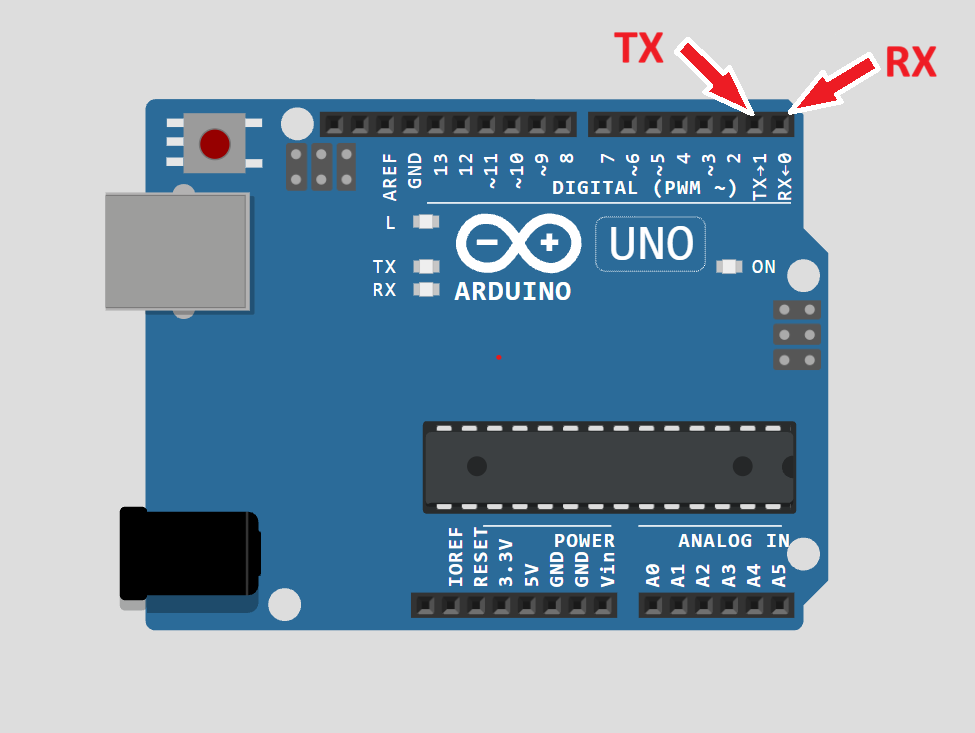
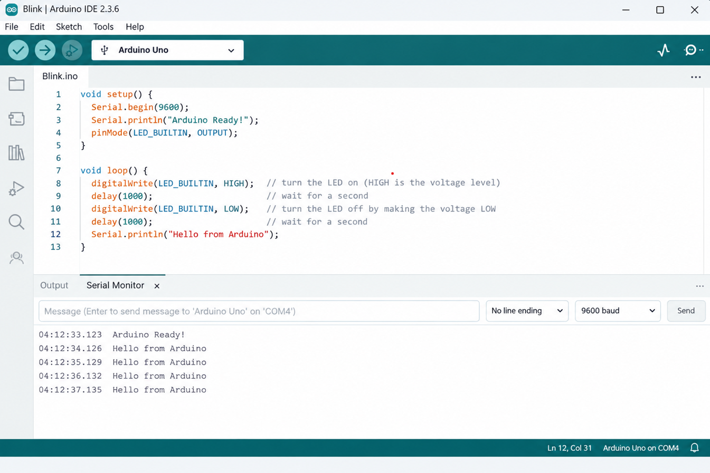
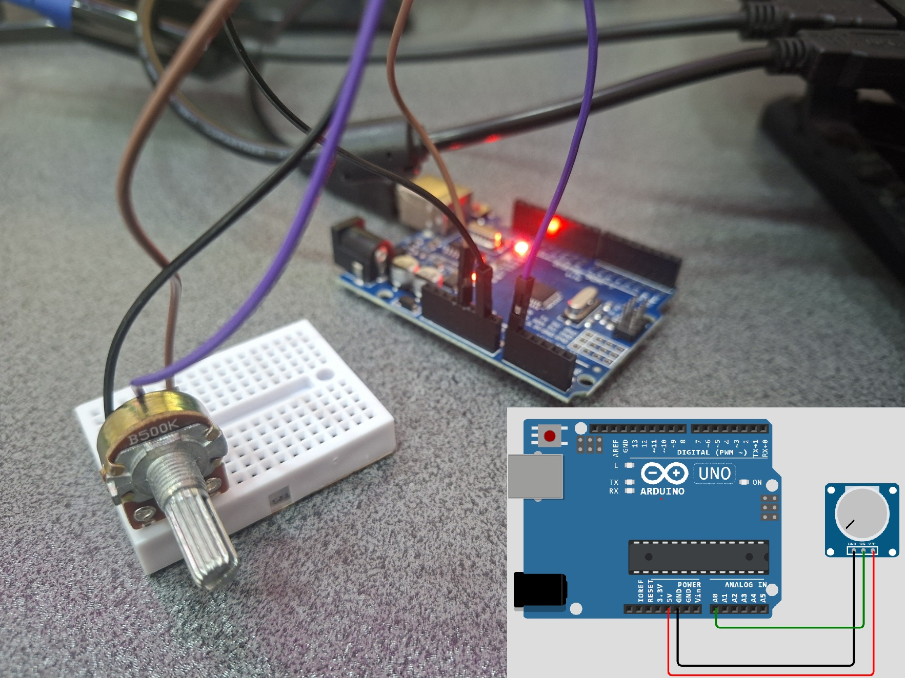

<h1 dir="rtl" align="center">جلسه 06 — <bdi><strong>Serial</strong></bdi> Monitor</strong></bdi> در <bdi><strong>Arduino</strong></bdi></h1>

<h2 dir="rtl" align="right">🎯 هدف جلسه</h2>


<p dir="rtl" align="right">در این جلسه با مفهوم <bdi><bdi><strong>Serial</strong></bdi> Communication</strong></bdi> آشنا می‌شویم و یاد می‌گیریم چگونه از طریق <bdi><bdi><strong>Serial</strong></bdi> Monitor</strong></bdi> اطلاعات را بین <bdi><strong>Arduino</strong></bdi> و کامپیوتر ارسال و دریافت کنیم.</p>

<p dir="rtl" align="right">در جلسات قبل با ورودی و خروجی دیجیتال، <bdi><strong>Analog Input</strong></bdi> و <bdi><strong>PWM</strong></bdi> کار کردیم. حالا می‌خواهیم ببینیم چگونه می‌توانیم داده‌ها را روی صفحه کامپیوتر ببینیم و حتی از طریق کامپیوتر به <bdi><strong>Arduino</strong></bdi> دستور بدهیم.</p>
<hr>
<h2 dir="rtl" align="right">📚 سرفصل‌های جلسه</h2>

<ul dir="rtl" align="right">
  <li>ارتباط سریال چیست؟</li>
  <li><bdi><bdi><strong>Serial</strong></bdi> Monitor</strong></bdi> چیست؟</li>
  <li><bdi><strong>Baud Rate</strong></bdi></li>
  <li>تابع <code dir="ltr"><bdi><strong>Serial</strong></bdi>.begin()</code></li>
  <li>تابع‌های <code dir="ltr"><bdi><strong>Serial</strong></bdi>.print()</code> و <code dir="ltr"><bdi><strong>Serial</strong></bdi>.println()</code></li>
  <li>خواندن داده از <bdi><strong>Serial</strong></bdi></li>
  <li>توابع <code dir="ltr"><bdi><strong>Serial</strong></bdi>.available()</code> و <code dir="ltr"><bdi><strong>Serial</strong></bdi>.read()</code></li>
  <li>ارسال داده سنسور به کامپیوتر</li>
  <li>کنترل <bdi><strong>LED</strong></bdi> از طریق <bdi><bdi><strong>Serial</strong></bdi> Monitor</strong></bdi></li>
  <li>تمرین‌ها و سوالات</li>
</ul>
<hr>
<h2 dir="rtl" align="right">1️⃣ ارتباط سریال چیست؟</h2>
<p dir="rtl" align="right">
  <bdi dir="ltr"><strong>Serial Communication</strong></bdi> روشی برای تبادل داده بین دو دستگاه است که داده‌ها را به‌صورت سری (بیت به بیت) ارسال می‌کند.
</p>
<p dir="rtl" align="right">
  در <bdi dir="ltr"><strong>Arduino</strong></bdi> معمولاً از پروتکل <bdi dir="ltr"><strong>UART</strong></bdi> استفاده می‌شود که از طریق پایه‌های زیر کار می‌کند:
</p>

```text
TX  →  Transmit (ارسال)
RX  →  Receive (دریافت)
```


<p dir="rtl" align="right">در <bdi><bdi><strong>Arduino</strong></bdi> UNO</strong></bdi>:</p>

<ul>
  <li>پایه <code dir="ltr">0</code> = <bdi>RX</bdi></li>
  <li>پایه <code dir="ltr">1</code> = <bdi>TX</bdi></li>
</ul>


<div dir="ltr" align="center">
<strong>Arduino</strong></bdi> UNO</strong></bdi> <bdi><strong>Serial</strong></bdi> Pins TX RX" width="700">
</div>


<blockquote dir="rtl" align="right">
  <strong>نکته مهم:</strong> وقتی از <bdi dir="ltr"><strong>Serial Monitor</strong></bdi> استفاده می‌کنید، این دو پایه برای ارتباط با کامپیوتر رزرو می‌شوند. بنابراین معمولاً نباید سنسور یا ماژول دیگری را مستقیماً به پایه‌های <code dir="ltr">0</code> و <code dir="ltr">1</code> وصل کنید.
</blockquote>
<hr>
<h2 dir="rtl" align="right">2️⃣ <bdi dir="ltr"><strong>Serial Monitor</strong></bdi> چیست؟</h2>
<p dir="rtl" align="right">
  <bdi dir="ltr"><strong>Serial Monitor</strong></bdi> پنجره‌ای در نرم‌افزار <bdi dir="ltr"><strong>Arduino IDE</strong></bdi> است که به شما امکان می‌دهد:
</p>

<ul>
  <li>داده‌هایی که <bdi><strong>Arduino</strong></bdi> ارسال می‌کند را ببینید.</li>
  <li>از طریق کیبورد به <bdi><strong>Arduino</strong></bdi> دستور بفرستید.</li>
</ul>

<p>برای باز کردن آن:</p>

<ol>
  <li>کد را روی برد آپلود کنید.</li>
  <li>از منوی بالا گزینه <bdi>Tools → <bdi><strong>Serial</strong></bdi> Monitor</strong></bdi> را انتخاب کنید.</li>
  <li>یا کلید میانبر <code dir="ltr">Ctrl + Shift + M</code> را بزنید.</li>
</ol>


<div dir="ltr" align="center">
<strong>Arduino</strong></bdi> IDE</strong></bdi> <bdi><strong>Serial</strong></bdi> Monitor</strong></bdi>" width="700">
</div>


<p>در پایین پنجره می‌توانید:</p>

<ul>
  <li>متن ارسال کنید.</li>
  <li><bdi><strong>Baud Rate</strong></bdi> را تنظیم کنید.</li>
  <li>نوع <bdi><strong>Line Ending</strong></bdi> را انتخاب کنید.</li>
</ul>
<hr>
<h2 dir="rtl" align="right">3️⃣ <bdi dir="ltr"><strong>Baud Rate</strong></bdi> چیست؟</h2>
<p dir="rtl" align="right">
  <bdi dir="ltr"><strong>Baud Rate</strong></bdi> سرعت انتقال داده را مشخص می‌کند و واحد آن <bdi dir="ltr">بیت بر ثانیه (bps)</bdi> است.
</p>
<p dir="rtl" align="right">
  رایج‌ترین مقدار در پروژه‌های <bdi dir="ltr"><strong>Arduino</strong></bdi>:
</p>

```text
9600
```


<p>مقادیر رایج دیگر:</p>


```text
4800
9600
19200
38400
57600
115200
```


<p dir="rtl" align="right"><strong>قانون مهم:</strong></p>
<p dir="rtl" align="right">
  <bdi dir="ltr"><strong>Baud Rate</strong></bdi> در کد و در <bdi dir="ltr"><strong>Serial Monitor</strong></bdi> باید <strong>دقیقاً یکسان</strong> باشد، وگرنه داده‌ها به‌هم‌ریخته نمایش داده می‌شوند.
</p>


<table dir="rtl" align="right">
  <thead>
    <tr>
      <th>مقدار در کد</th>
      <th>مقدار در <bdi><bdi><strong>Serial</strong></bdi> Monitor</strong></bdi></th>
      <th>نتیجه</th>
    </tr>
  </thead>
  <tbody>
    <tr>
      <td><code dir="ltr">9600</code></td>
      <td><code dir="ltr">9600</code></td>
      <td>صحیح</td>
    </tr>
    <tr>
      <td><code dir="ltr">9600</code></td>
      <td><code dir="ltr">115200</code></td>
      <td>متن بی‌معنی</td>
    </tr>
    <tr>
      <td><code dir="ltr">115200</code></td>
      <td><code dir="ltr">115200</code></td>
      <td>صحیح</td>
    </tr>
  </tbody>
</table>

<br clear="all">
<hr>
<h2 dir="rtl" align="right">4️⃣ شروع ارتباط سریال — <code dir="ltr"><bdi><strong>Serial.begin()</strong></bdi></code></h2>
<p dir="rtl" align="right">
  قبل از استفاده از هر تابع <bdi dir="ltr"><strong>Serial</strong></bdi>، باید ارتباط را راه‌اندازی کنید.
</p>
<p dir="rtl" align="right">
  ساختار کلی تابع:
</p>


```cpp
Serial.begin(speed);
```


<p>مثال:</p>


```cpp
void setup() {
 Serial.begin(9600);
}
```


<p>این خط معمولاً داخل <code dir="ltr">setup()</code> نوشته می‌شود.</p>

<p>تا وقتی <code dir="ltr"><bdi><strong>Serial</strong></bdi>.begin()</code> فراخوانی نشده باشد، توابع <code dir="ltr">print</code> و <code dir="ltr">read</code> کار نمی‌کنند.</p>
<hr>
<h2 dir="rtl" align="right">5️⃣ ارسال داده به کامپیوتر</h2>
<h3 dir="rtl" align="right">
  <code dir="ltr"><bdi><strong>Serial.print()</strong></bdi></code>
</h3>
<p dir="rtl" align="right">
  داده را بدون رفتن به خط بعد چاپ می‌کند.
</p>


```cpp
>Serial.print("Hello");
Serial.print(" World");
```


<p>خروجی:</p>


```text
Hello World
```

<h3 dir="rtl" align="right"><code dir="ltr"><bdi><strong>Serial</strong></bdi>.println()</code></h3>


<p dir="rtl" align="right">داده را چاپ می‌کند و به خط بعد می‌رود.</p>


```cpp
Seria.println("Hello");
>Serial.println("World");
```


<p>خروجی:</p>


```text
Hello
World
```

<h3 dir="rtl" align="right">تفاوت این دو تابع</h3>

<table dir="rtl" align="right">
  <thead>
    <tr>
      <th>تابع</th>
      <th>رفتار</th>
    </tr>
  </thead>
  <tbody>
    <tr>
      <td><code dir="ltr"><bdi><strong>Serial</strong></bdi>.print()</code></td>
      <td>در همان خط ادامه می‌دهد</td>
    </tr>
    <tr>
      <td><code dir="ltr"><bdi><strong>Serial</strong></bdi>.println()</code></td>
      <td>بعد از چاپ به خط بعد می‌رود</td>
    </tr>
  </tbody>
</table>

<br clear="all">
<hr>
<h2 dir="rtl" align="right">6️⃣ اولین پروژه — چاپ پیام ساده</h2>
<h3 dir="rtl" align="right">قطعات مورد نیاز</h3>
<ul dir="rtl" align="right">
  <li><bdi dir="ltr"><strong>Arduino UNO</strong></bdi></li>
  <li>کابل <bdi dir="ltr">USB</bdi></li>
</ul>


<p>برای این پروژه به قطعه خارجی نیاز نیست.</p>


<h3 dir="rtl" align="right">💻 کد</h3>

```cpp
void setup() {
  Serial.begin(9600);
  Serial.println("Arduino Ready!");
}

void loop() {
  Serial.println("Hello from Arduino");
  delay(1000);
}
```


<p>بعد از آپلود، <bdi><bdi><strong>Serial</strong></bdi> Monitor</strong></bdi> را باز کنید و <bdi><strong>Baud Rate</strong></bdi> را روی <code dir="ltr">9600</code> تنظیم کنید.</p>

<p>هر ثانیه یک پیام جدید خواهید دید.</p>
<hr>
<h2 dir="rtl" align="right">7️⃣ ارسال مقدار سنسور به کامپیوتر</h2>
<p dir="rtl" align="right">
  فرض کنید یک <bdi dir="ltr"><strong>Potentiometer</strong></bdi> به پایه <code dir="ltr">A0</code> وصل کرده‌اید.
</p>
<h3 dir="rtl" align="right">
  اتصال <bdi dir="ltr"><strong>Potentiometer</strong></bdi>
</h3>

```text
5V ─────────────┐
                │
           Potentiometer
                │
A0 ─────────────┤
                │
GND ────────────┘
```

<div dir="ltr" align="center">
<strong>Potentiometer</strong></bdi> <bdi><strong>Serial</strong></bdi> Circuit" width="700">
</div>

<h3 dir="rtl" align="right">💻 کد</h3>

```cpp
const int potPin = A0;

void setup() {
 Serial.begin(9600);
}

void loop() {
  int potValue = analogRead(potPin);

  Serial.print("Potentiometer Value: ");
  Serial.println(potValue);

  delay(200);
}
```


<p>با چرخاندن <bdi><strong>Potentiometer</strong></bdi>، مقدار آن به‌صورت زنده در <bdi><bdi><strong>Serial</strong></bdi> Monitor</strong></bdi> نمایش داده می‌شود.</p>

<h3>🔍 این برنامه چه کاری انجام می‌دهد؟</h3>

<p>ابتدا مقدار پتانسیومتر را می‌خوانیم:</p>


```cpp
int potValue = analogRead(potPin);
```


<p>مقدار آن بین <code dir="ltr">0</code> تا <code dir="ltr">1023</code> است.</p>

<p>سپس برچسب و عدد را چاپ می‌کنیم:</p>


```cpp
Serial.print("Potentiometer Value: ");
Serial.println(potValue);
```


<p>فرآیند کلی:</p>


```text
Potentiometer
      │
      ▼
analogRead()
      │
      ▼
  0 → 1023
      │
      ▼
Serial.println()
      │
      ▼
Serial Monitor
```
<hr>
<h2 dir="rtl" align="right">8️⃣ خواندن داده از <bdi dir="ltr"><strong>Serial Monitor</strong></bdi></h2>
<p dir="rtl" align="right">
  گاهی می‌خواهیم از طریق کیبورد به <bdi dir="ltr"><strong>Arduino</strong></bdi> دستور بدهیم.
</p>
<p dir="rtl" align="right">
  برای این کار از دو تابع مهم استفاده می‌کنیم:
</p>
<h3 dir="rtl" align="right">
  <code dir="ltr"><bdi><strong>Serial.available()</strong></bdi></code>
</h3>

<p>تعداد کاراکترهای در صف انتظار را برمی‌گرداند.</p>

<p>اگر داده جدیدی آمده باشد، مقدار آن بزرگ‌تر از صفر است.</p>


```cpp
if (Serial.available() > 0) {
  // داده جدیدی آمده است
}
```


<h3><code dir="ltr"><bdi><strong>Serial</strong></bdi>.read()</code></h3>

<p>یک کاراکتر را از بافر می‌خواند.</p>


```cpp
char command = Serial.read();
```


> **توجه:** <code dir="ltr">Serial.read()</code> فقط **یک کاراکتر** را می‌خواند، نه کل متن.
<h2 dir="rtl" align="right">9️⃣ کنترل <bdi dir="ltr"><strong>LED</strong></bdi> از طریق <bdi dir="ltr"><strong>Serial Monitor</strong></bdi></h2>
<p dir="rtl" align="right">
  در این پروژه با تایپ کردن حروف در <bdi dir="ltr"><strong>Serial Monitor</strong></bdi>، <bdi dir="ltr"><strong>LED</strong></bdi> را روشن و خاموش می‌کنیم.
</p>
<h3 dir="rtl" align="right">قطعات مورد نیاز</h3>

<ul>
  <li><strong dir="ltr">Arduino UNO</strong></li>
  <li><strong dir="ltr">LED</strong></li>
  <li>مقاومت <code dir="ltr">220Ω</code> یا <code dir="ltr">330Ω</code></li>
  <li>سیم <strong dir="ltr">Jumper</strong></li>
  <li><strong dir="ltr">Breadboard</strong></li>
</ul>

<h3>اتصال</h3>


```text
Arduino Pin 13
      │
     LED
      │
     GND
```


<p>می‌توانید از <bdi><strong>LED</strong></bdi> داخلی پایه <code dir="ltr">13</code> هم استفاده کنید.</p>

<h3>💻 کد</h3>


```cpp
const int ledPin = 13;

void setup() {
  pinMode(ledPin, OUTPUT);
  Serial.begin(9600);
  Serial.println("Send '1' to turn ON, '0' to turn OFF");
}

void loop() {
  if (Serial.available() > 0) {
    char command = Serial.read();

    if (command == '1') {
      digitalWrite(ledPin, HIGH);
      Serial.println("LED ON");
    }
    else if (command == '0') {
      digitalWrite(ledPin, LOW);
      Serial.println("LED OFF");
    }
  }
}
```


<h3>نحوه کار:</h3>

<ol>
  <li>کد را آپلود کنید.</li>
  <li><bdi><bdi><strong>Serial</strong></bdi> Monitor</strong></bdi> را باز کنید.</li>
  <li>در کادر پایین تایپ کنید:
    <ul>
      <li><code dir="ltr">1</code> → <bdi><strong>LED</strong></bdi> روشن می‌شود.</li>
      <li><code dir="ltr">0</code> → <bdi><strong>LED</strong></bdi> خاموش می‌شود.</li>
    </ul>
  </li>
  <li>گزینه <bdi>Line ending</bdi> را روی <bdi>No line ending</bdi> بگذارید تا کاراکتر اضافه خوانده نشود.</li>
</ol>
<hr>
<h2 dir="rtl" align="right">🔟 خواندن عدد کامل با <code dir="ltr"><bdi><strong>Serial.parseInt()</strong></bdi></code></h2>
<p dir="rtl" align="right">
  گاهی می‌خواهیم یک عدد کامل (مثلاً <code dir="ltr">150</code>) را دریافت کنیم، نه فقط یک کاراکتر.
</p>
<p dir="rtl" align="right">
  ساختار کلی:
</p>


```cpp
int value = Serial.parseInt();
```

<h3 dir="rtl" align="right">💻 کد</h3>

```cpp
void setup() {
  Serial.begin(9600);
}

void loop() {
  if (Serial.available() > 0) {
    int value = Serial.parseInt();
    Serial.print("Received number: ");
    Serial.println(value);
  }
}
```


<p>اگر در <bdi><bdi><strong>Serial</strong></bdi> Monitor</strong></bdi> عدد <code dir="ltr">250</code> را بفرستید، <bdi><strong>Arduino</strong></bdi> همان عدد را برمی‌گرداند.</p>
<hr>
<h2 dir="rtl" align="right">
  1️⃣1️⃣ ترکیب <bdi dir="ltr"><strong>Analog Input</strong></bdi> + <bdi dir="ltr"><strong>Serial</strong></bdi> + <bdi dir="ltr"><strong>PWM</strong></bdi>
</h2>
<p dir="rtl" align="right">
  می‌توانیم مقدار <bdi dir="ltr"><strong>Potentiometer</strong></bdi> را بخوانیم، آن را در <bdi dir="ltr"><strong>Serial</strong></bdi> نمایش دهیم و همزمان روشنایی <bdi dir="ltr"><strong>LED</strong></bdi> را کنترل کنیم.
</p>
<h3 dir="rtl" align="right">اتصال</h3>


```text
5V ─────────────┐
                │
           Potentiometer
                │
A0 ─────────────┤
                │
GND ────────────┘

Pin 9 → Resistor → LED → GND
```

<h3 dir="rtl" align="right">💻 کد</h3>

```cpp
const int potPin = A0;
const int ledPin = 9;

void setup() {
  pinMode(ledPin, OUTPUT);
  Serial.begin(9600);
}

void loop() {
  int potValue = analogRead(potPin);
  int brightness = map(potValue, 0, 1023, 0, 255);

  analogWrite(ledPin, brightness);

  Serial.print("Raw: ");
  Serial.print(potValue);
  Serial.print("  |  PWM : ");
  Serial.println(brightness);

  delay(100);
}
```

<div dir="ltr" align="center">
<strong>Potentiometer</strong></bdi>-led.gif" alt="<bdi><strong>Arduino</strong></bdi> <bdi><strong>Serial</strong></bdi> <bdi><strong>LED</strong></bdi> Control" width="600">
</div>


<p>فرآیند کلی:</p>


```text
Potentiometer
      │
      ▼
analogRead()     →  0 تا 1023
      │
      ▼
map()            →  0 تا 255
      │
      ├── analogWrite()      →  LED
      │
      └── Serial.println()   →  Serial Monitor
```
<hr>
<h2 dir="rtl" align="right">1️⃣2️⃣ تفاوت توابع مهم <bdi dir="ltr"><strong>Serial</strong></bdi></h2>

<table dir="rtl" align="right">
  <thead>
    <tr>
      <th>تابع</th>
      <th>کاربرد</th>
      <th>نتیجه</th>
    </tr>
  </thead>
  <tbody>
    <tr>
      <td><code dir="ltr"><bdi><strong>Serial.begin()</strong></bdi></code></td>
      <td>شروع ارتباط</td>
      <td>باید در <code dir="ltr">setup()</code> باشد</td>
    </tr>
    <tr>
      <td><code dir="ltr"><bdi><strong>Serial.print()</strong></bdi></code></td>
      <td>ارسال متن</td>
      <td>بدون خط جدید</td>
    </tr>
    <tr>
      <td><code dir="ltr"><bdi><strong>Serial.println()</strong></bdi></code></td>
      <td>ارسال متن</td>
      <td>با خط جدید</td>
    </tr>
    <tr>
      <td><code dir="ltr"><bdi><strong>Serial.available()</strong></bdi></code></td>
      <td>بررسی داده جدید</td>
      <td>تعداد کاراکتر در بافر</td>
    </tr>
    <tr>
      <td><code dir="ltr"><bdi><strong>Serial.read()</strong></bdi></code></td>
      <td>خواندن ورودی</td>
      <td>یک کاراکتر</td>
    </tr>
    <tr>
      <td><code dir="ltr"><bdi><strong>Serial.parseInt()</strong></bdi></code></td>
      <td>خواندن عدد</td>
      <td>عدد صحیح</td>
    </tr>
  </tbody>
</table>

<br clear="all">

<p dir="rtl" align="right"><strong>نکته مهم:</strong></p>

<pre dir="ltr" style="text-align: left;">
<strong>Serial.print</strong>  → Output
<strong>Serial.read</strong>   → Input
</pre>

<hr>
<h2 dir="rtl" align="right">1️⃣3️⃣ نکات مهم <bdi><strong>Serial</strong></bdi></h2>

<table dir="rtl" align="right">
  <thead>
    <tr>
      <th>موضوع</th>
      <th>توضیح</th>
    </tr>
  </thead>
  <tbody>
    <tr>
      <td><bdi><strong>Baud Rate</strong></bdi></td>
      <td>باید در کد و <bdi><bdi><strong>Serial</strong></bdi> Monitor</strong></bdi> یکسان باشد</td>
    </tr>
    <tr>
      <td>پایه‌های <code dir="ltr">0</code> و <code dir="ltr">1</code></td>
      <td>برای ارتباط سریال رزرو شده‌اند</td>
    </tr>
    <tr>
      <td><code dir="ltr"><bdi><strong>Serial</strong></bdi>.print()</code></td>
      <td>بدون خط جدید</td>
    </tr>
    <tr>
      <td><code dir="ltr"><bdi><strong>Serial</strong></bdi>.println()</code></td>
      <td>با خط جدید</td>
    </tr>
    <tr>
      <td><code dir="ltr"><bdi><strong>Serial</strong></bdi>.available()</code></td>
      <td>چک کردن وجود داده جدید</td>
    </tr>
    <tr>
      <td><code dir="ltr"><bdi><strong>Serial</strong></bdi>.read()</code></td>
      <td>خواندن یک کاراکتر</td>
    </tr>
    <tr>
      <td><code dir="ltr"><bdi><strong>Serial</strong></bdi>.parseInt()</code></td>
      <td>خواندن عدد صحیح</td>
    </tr>
    <tr>
      <td><bdi>Line ending</bdi></td>
      <td>اگر روی <bdi>Newline</bdi> باشد، کاراکتر اضافه هم ارسال می‌شود</td>
    </tr>
  </tbody>
</table>

<br clear="all">


> **توجه:** بعد از آپلود کد، معمولاً برد ریست می‌شود. بنابراین <code dir="ltr">Serial Monitor</code> را بعد از آپلود باز کنید.
<h2 dir="rtl" align="right">🧪 تمرین‌های جلسه</h2>

<h3 dir="rtl" align="right">تمرین 1</h3>


<p>برنامه‌ای بنویسید که هر ۲ ثانیه پیام زیر را چاپ کند:</p>


```text
Arduino is running...
```
<hr>
<h3 dir="rtl" align="right">تمرین 2</h3>


<p>مقدار یک <bdi><strong>Potentiometer</strong></bdi> را بخوانید و هم مقدار خام (<code dir="ltr">0</code> تا <code dir="ltr">1023</code>) و هم مقدار درصدی (<code dir="ltr">0</code> تا <code dir="ltr">100</code>) را در <bdi><bdi><strong>Serial</strong></bdi> Monitor</strong></bdi> نمایش دهید.</p>

<p>راهنمایی:</p>


```cpp
map(value, 0, 1023, 0, 100);
```
<hr>
<h3 dir="rtl" align="right">تمرین 3</h3>


<p>برنامه‌ای بنویسید که با دریافت حرف <code dir="ltr">a</code> از <bdi><bdi><strong>Serial</strong></bdi> Monitor</strong></bdi>، <bdi><strong>LED</strong></bdi> را روشن کند و با دریافت حرف <code dir="ltr">b</code> آن را خاموش کند.</p>
<hr>
<h3 dir="rtl" align="right">تمرین 4</h3>


<p>برنامه‌ای بنویسید که عدد دریافت‌شده از <bdi><bdi><strong>Serial</strong></bdi> Monitor</strong></bdi> را به‌عنوان مقدار <bdi><strong>PWM</strong></bdi> روی پایه <code dir="ltr">9</code> اعمال کند (عدد بین <code dir="ltr">0</code> تا <code dir="ltr">255</code>).</p>

<p>راهنمایی:</p>

<p>از:</p>


```cpp
Serial.parseInt()
```


<p>و:</p>


```cpp
analogWrite()
```


<p>استفاده کنید.</p>
<hr>
<h3 dir="rtl" align="right">تمرین 5</h3>


<p>مقدار دو سنسور آنالوگ (مثلاً دو <bdi><strong>Potentiometer</strong></bdi> روی <code dir="ltr">A0</code> و <code dir="ltr">A1</code>) را همزمان در یک خط از <bdi><bdi><strong>Serial</strong></bdi> Monitor</strong></bdi> چاپ کنید.</p>
<hr>
<h2 dir="rtl" align="right">❓ سوالات</h2>

<h3 dir="rtl" align="right">سوال ۱</h3>
<p dir="rtl" align="right"><strong dir="ltr">Baud Rate</strong> چیست و چرا مهم است؟</p>

<h3 dir="rtl" align="right">سوال ۲</h3>
<p dir="rtl" align="right">تفاوت <code dir="ltr">Serial.print()</code> و <code dir="ltr">Serial.println()</code> چیست؟</p>


<h3 dir="rtl" align="right">سوال 3</h3>


<p dir="rtl" align="right">چرا معمولاً نباید سنسور را به پایه‌های <code dir="ltr">0</code> و <code dir="ltr">1</code> وصل کنیم؟</p>


<h3 dir="rtl" align="right">سوال 4</h3>


<p dir="rtl" align="right">تابع <code dir="ltr"><bdi><strong>Serial</strong></bdi>.available()</code> چه کاری انجام می‌دهد؟</p>


<h3 dir="rtl" align="right">سوال 5</h3>


<p dir="rtl" align="right">اگر <bdi><strong>Baud Rate</strong></bdi> در کد <code dir="ltr">9600</code> باشد ولی در <bdi><bdi><strong>Serial</strong></bdi> Monitor</strong></bdi> مقدار <code dir="ltr">115200</code> تنظیم شده باشد، چه اتفاقی می‌افتد؟</p>


<h3 dir="rtl" align="right">سوال 6</h3>


<p dir="rtl" align="right">چگونه می‌توان یک عدد کامل (مثلاً <code dir="ltr">250</code>) را از <bdi><bdi><strong>Serial</strong></bdi> Monitor</strong></bdi> دریافت کرد؟</p>
<hr>
<h2 dir="rtl" align="right">📌 خلاصه جلسه</h2>


<p dir="rtl" align="right">در این جلسه یاد گرفتیم:</p>

<ul>
  <li>ارتباط سریال چیست و چگونه کار می‌کند.</li>
  <li><bdi><bdi><strong>Serial</strong></bdi> Monitor</strong></bdi> چیست و چگونه باز می‌شود.</li>
  <li><bdi><strong>Baud Rate</strong></bdi> چه مفهومی دارد.</li>
  <li>چگونه با <code dir="ltr"><bdi><strong>Serial</strong></bdi>.begin()</code> ارتباط را شروع کنیم.</li>
  <li>چگونه با <code dir="ltr"><bdi><strong>Serial</strong></bdi>.print()</code> و <code dir="ltr"><bdi><strong>Serial</strong></bdi>.println()</code> داده ارسال کنیم.</li>
  <li>چگونه داده را از <bdi><bdi><strong>Serial</strong></bdi> Monitor</strong></bdi> بخوانیم.</li>
  <li>چگونه <bdi><strong>LED</strong></bdi> را از طریق <bdi><strong>Serial</strong></bdi> کنترل کنیم.</li>
  <li>چگونه مقادیر سنسور را روی کامپیوتر نمایش دهیم.</li>
  <li>تفاوت‌های مهم توابع <bdi><strong>Serial</strong></bdi>.</li>
  <li>پایه‌های <code dir="ltr">0</code> و <code dir="ltr">1</code> برای ارتباط سریال رزرو هستند.</li>
</ul>
<hr>
<h2 dir="rtl" align="right">⏭️ جلسه بعد</h2>


<p dir="rtl" align="right">در جلسه هفتم با پروتکل <bdi><strong>I2C</strong></bdi> آشنا می‌شویم و یاد می‌گیریم چگونه ماژول <bdi><strong>OLED</strong></bdi> را راه‌اندازی کنیم و روی آن متن و شکل نمایش دهیم.</p>

<p dir="rtl">
<p dir="rtl" align="right">⬅️ <a href="../07-<bdi><strong>I2C</strong></bdi>-<bdi><strong>OLED</strong></bdi>/">جلسه 07 — <bdi><strong>I2C</strong></bdi> و راه‌اندازی ماژول <bdi><strong>OLED</strong></bdi></a></p>
</p>


<p dir="ltr" align="center">
<bdi><strong>Arduino</strong></bdi> From Zero to Projects</strong>
</p>

<p dir="ltr" align="center">
<strong>Mohammad Esteghamat</strong>
</p>
