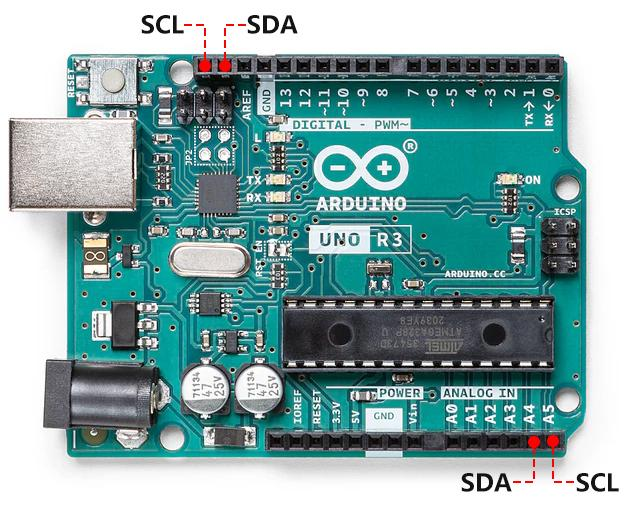
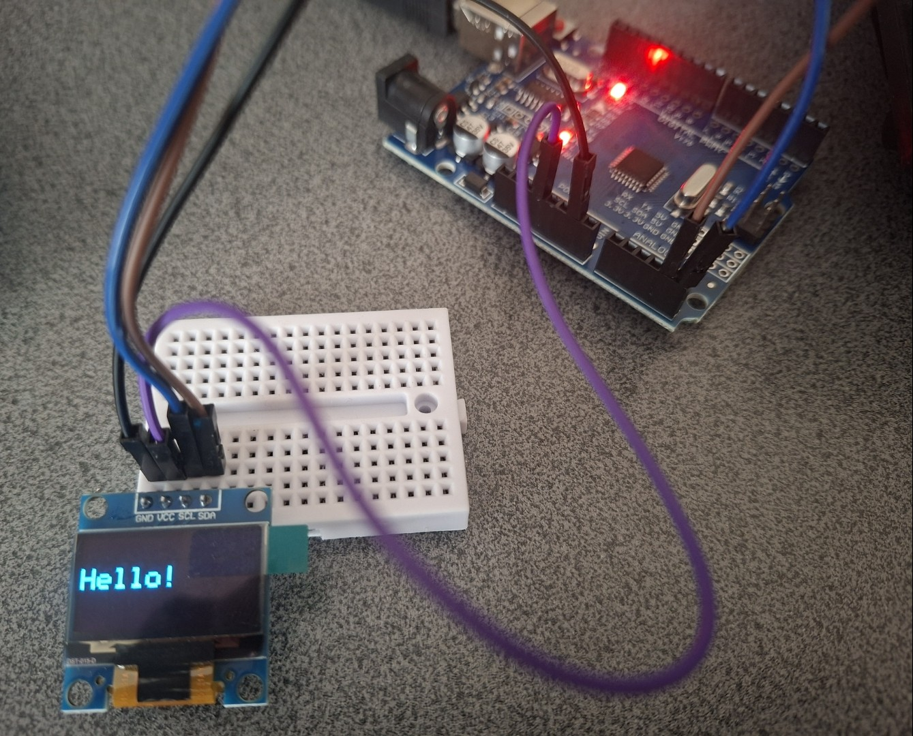

<h1 dir="rtl" align="center">جلسه 07 — <bdi><strong>I2C</strong></bdi> و راه‌اندازی <bdi><strong>OLED</strong></bdi></h1>

<h2 dir="rtl" align="right">🎯 هدف جلسه</h2>

<p dir="rtl" align="right">
در این جلسه با پروتکل ارتباطی <bdi><strong>I2C</strong></bdi> آشنا می‌شویم و یک نمایشگر <bdi><strong>OLED</strong></bdi> را به <bdi><strong>Arduino UNO</strong></bdi> متصل و راه‌اندازی می‌کنیم.
</p>

<p dir="rtl" align="right">
در این جلسه یاد می‌گیریم:
</p>

<ol dir="rtl" align="right">
  <li><bdi><strong>I2C</strong></bdi> چیست و چگونه کار می‌کند؟</li>
  <li>پایه‌های <bdi><code>SDA</code></bdi> و <bdi><code>SCL</code></bdi> چه کاری انجام می‌دهند؟</li>
  <li>آدرس <bdi><strong>I2C</strong></bdi> چیست و چه کاربردی دارد؟</li>
  <li>چگونه آدرس <bdi><strong>OLED</strong></bdi> را پیدا کنیم؟</li>
  <li>چگونه <bdi><strong>OLED</strong></bdi> را به <bdi><strong>Arduino UNO</strong></bdi> متصل کنیم؟</li>
  <li>چگونه اولین متن را روی <bdi><strong>OLED</strong></bdi> نمایش دهیم؟</li>
</ol>

<p dir="rtl" align="right">
در پایان این جلسه می‌توانیم یک <bdi><strong>OLED</strong></bdi> را از طریق <bdi><strong>I2C</strong></bdi> به <bdi><strong>Arduino</strong></bdi> متصل کرده و اطلاعات ساده را روی آن نمایش دهیم.
</p>
</div>

---

<h2 dir="rtl" align="right">🔗 <bdi><strong>I2C</strong></bdi> چیست و چگونه کار می‌کند؟</h2>

<p dir="rtl" align="right">
<bdi><strong>I2C</strong></bdi> (مخفف <bdi><strong>Inter-Integrated Circuit</strong></bdi>) یک پروتکل ارتباطی سریال است که برای ارتباط بین میکروکنترلر (مثل <bdi><strong>Arduino</strong></bdi>) و قطعات جانبی (سنسورها، نمایشگرها، حافظه‌ها و ...) استفاده می‌شود.
</p>

<h3 dir="rtl" align="right">ویژگی‌های مهم <bdi><strong>I2C</strong></bdi>:</h3>

<ul dir="rtl" align="right">
  <li>فقط به <strong>دو سیم</strong> نیاز دارد (به‌جز تغذیه و زمین).</li>
  <li>می‌تواند همزمان با <strong>چندین دستگاه</strong> ارتباط برقرار کند (<bdi><strong>Multi-Master</strong></bdi> / <bdi><strong>Multi-Slave</strong></bdi>).</li>
  <li>سرعت نسبتاً خوبی دارد (معمولاً ۱۰۰ کیلوهرتز یا ۴۰۰ کیلوهرتز).</li>
  <li>هر دستگاه یک <strong>آدرس یکتا</strong> دارد تا <bdi><strong>Arduino</strong></bdi> بداند با کدام قطعه صحبت می‌کند.</li>
</ul>
<h3 dir="rtl" align="right">نحوه کار <bdi><strong>I2C</strong></bdi> به زبان ساده:</h3>

<p dir="rtl" align="right">
در <bdi><strong>I2C</strong></bdi> دو خط اصلی وجود دارد:
</p>

<div style="overflow-x: auto; margin: 15px 0;">
  <table dir="rtl" border="1" cellpadding="10" cellspacing="0" 
         style="border-collapse: collapse; width: 100%; max-width: 500px; margin-right: auto; margin-left: 0;">
    <thead>
      <tr style="background-color: #2d2d2d; color: #fff;">
        <th style="padding: 10px;">خط</th>
        <th style="padding: 10px;">نام کامل</th>
        <th style="padding: 10px;">وظیفه</th>
      </tr>
    </thead>
    <tbody>
      <tr>
        <td style="padding: 10px; text-align: center;"><bdi><strong>SDA</strong></bdi></td>
        <td style="padding: 10px;"><bdi>Serial Data</bdi></td>
        <td style="padding: 10px;">انتقال داده‌ها (دوطرفه)</td>
      </tr>
      <tr>
        <td style="padding: 10px; text-align: center;"><bdi><strong>SCL</strong></bdi></td>
        <td style="padding: 10px;"><bdi>Serial Clock</bdi></td>
        <td style="padding: 10px;">سیگنال ساعت (زمان‌بندی)</td>
      </tr>
    </tbody>
  </table>
</div>

<br>

<p dir="rtl" align="right">
<strong>مراحل کلی ارتباط:</strong>
</p>

<ol dir="rtl" style="padding-right: 25px; line-height: 1.9;">
  <li><bdi><strong>Arduino</strong></bdi> (<bdi><strong>Master</strong></bdi>) خط <bdi><strong>SCL</strong></bdi> را کنترل می‌کند و ساعت را تولید می‌کند.</li>
  <li><bdi><strong>Arduino</strong></bdi> روی خط <bdi><strong>SDA</strong></bdi> آدرس دستگاه مورد نظر را می‌فرستد.</li>
  <li>دستگاهی که آن آدرس را دارد پاسخ می‌دهد (<bdi><strong>ACK</strong></bdi>).</li>
  <li>سپس داده‌ها بین <bdi><strong>Master</strong></bdi> و <bdi><strong>Slave</strong></bdi> رد و بدل می‌شوند.</li>
  <li>در پایان ارتباط، <bdi><strong>Master</strong></bdi> سیگنال <bdi><strong>Stop</strong></bdi> می‌فرستد.</li>
</ol>

<p dir="rtl" align="right">
چون داده‌ها و ساعت روی دو خط جدا هستند، زمان‌بندی دقیق است و خطا کمتر رخ می‌دهد.
</p>
<h2 dir="rtl" align="right">پایه‌های <bdi><strong>I2C</strong></bdi> در <bdi><strong>Arduino UNO</strong></bdi></h2>

<p dir="rtl" align="right">
در <bdi><strong>Arduino UNO</strong></bdi> پایه‌های <bdi><strong>I2C</strong></bdi> از قبل مشخص هستند:
</p>

<pre dir="ltr" style="background:#f4f4f4; padding:12px; border-radius:6px; text-align:left;">
A4 → SDA
A5 → SCL
</pre>

<p align="center">
  
</p>

<h2 dir="rtl" align="right">📡 <bdi><strong>SDA</strong></bdi> و <bdi><strong>SCL</strong></bdi></h2>

<h3 dir="rtl" align="right"><bdi><strong>SDA</strong></bdi> (<bdi>Serial Data</bdi>)</h3>
<p dir="rtl" align="right">
خط انتقال داده است. هم <bdi><strong>Master</strong></bdi> و هم <bdi><strong>Slave</strong></bdi> می‌توانند از این خط داده بفرستند یا دریافت کنند.
</p>

<h3 dir="rtl" align="right"><bdi><strong>SCL</strong></bdi> (<bdi>Serial Clock</bdi>)</h3>
<p dir="rtl" align="right">
خط کلاک است. <bdi><strong>Arduino</strong></bdi> این خط را کنترل می‌کند تا زمان ارسال و دریافت داده مشخص باشد.
</p>

<h3 dir="rtl" align="right">اتصال کلی:</h3>

<pre dir="ltr" style="background:#f4f4f4; padding:12px; border-radius:6px; text-align:left;">
Arduino UNO          I2C Device
───────────────────────────────
A4 / SDA  ─────────── SDA
A5 / SCL  ─────────── SCL
GND       ─────────── GND
VCC       ─────────── VCC 
</pre>

<h2 dir="rtl" align="right">🏷️ آدرس <bdi><strong>I2C</strong></bdi></h2>

<p dir="rtl" align="right">
هر دستگاه <bdi><strong>I2C</strong></bdi> دارای یک آدرس یکتا (<bdi><strong>Address</strong></bdi>) است تا <bdi><strong>Arduino</strong></bdi> بتواند آن را از بین چند دستگاه تشخیص دهد.
</p>

<p dir="rtl" align="right">
آدرس‌ها معمولاً به صورت هگزادسیمال نوشته می‌شوند.
</p>

<p dir="rtl" align="right">
بسیاری از <bdi><strong>OLED</strong></bdi>های رایج یکی از این دو آدرس را دارند:
</p>

<pre dir="ltr" style="background:#f4f4f4; padding:12px; border-radius:6px; text-align:left;">
0x3C
0x3D
</pre>

<p dir="rtl" align="right">
اگر آدرس نمایشگر را ندانیم، می‌توانیم با یک برنامه ساده به نام <bdi><strong>I2C Scanner</strong></bdi> آن را پیدا کنیم.
</p>

<h2 dir="rtl" align="right">🔎 پیدا کردن آدرس با <bdi><strong>I2C Scanner</strong></bdi></h2>

<p dir="rtl" align="right">
کد زیر را روی <bdi><strong>Arduino</strong></bdi> آپلود کنید:
</p>

```cpp
#include <Wire.h>

void setup() {
  Wire.begin();
  Serial.begin(9600);
  Serial.println("I2C Scanner");
}

void loop() {
  byte error;
  int devices = 0;

  for (byte address = 1; address < 127; address++) {
    Wire.beginTransmission(address);
    error = Wire.endTransmission();

    if (error == 0) {
      Serial.print("I2C device found at 0x");
      if (address < 16) Serial.print("0");
      Serial.println(address, HEX);
      devices++;
    }
  }

  if (devices == 0) {
    Serial.println("No I2C devices found.");
  }

  delay(3000);
}
```
بعد از آپلود<p dir="rtl" align="right">
<bdi><strong>Serial Monitor</strong></bdi> را باز کنید.<br>
<bdi><strong>Baud Rate</strong></bdi> را روی <bdi>9600</bdi> قرار دهید.
</p>

<p dir="rtl" align="right">
اگر <bdi><strong>OLED</strong></bdi> درست متصل باشد، چیزی شبیه این می‌بینید:
</p>

<pre dir="ltr" style="background:#f4f4f4; padding:12px; border-radius:6px; text-align:left;">
I2C device found at 0x3C
</pre>

<h2 dir="rtl" align="right">🖥️ <bdi><strong>OLED</strong></bdi> چیست؟</h2>

<p dir="rtl" align="right">
<bdi><strong>OLED</strong></bdi> (<bdi><strong>Organic Light-Emitting Diode</strong></bdi>) یک نمایشگر کوچک و کم‌مصرف است که می‌توانیم روی آن متن، عدد و شکل‌های ساده نمایش دهیم.
</p>

<p dir="rtl" align="right">
بیشتر <bdi><strong>OLED</strong></bdi>های رایج (مثل <bdi><strong>SSD1306</strong></bdi>) از طریق <bdi><strong>I2C</strong></bdi> با <bdi><strong>Arduino</strong></bdi> ارتباط برقرار می‌کنند.
</p>

<h3 dir="rtl" align="right">اتصال <bdi><strong>OLED</strong></bdi> به <bdi><strong>Arduino UNO</strong></bdi>:</h3>

<pre dir="ltr" style="background:#f4f4f4; padding:12px; border-radius:6px; text-align:left;">
OLED          Arduino UNO
─────────────────────────
VCC   ───────  5V 
GND   ───────  GND
SDA   ───────  A4
SCL   ───────  A5
</pre>

<h2 dir="rtl" align="right">📚 نصب کتابخانه <bdi><strong>OLED</strong></bdi></h2>

<p dir="rtl" align="right">
برای <bdi><strong>OLED</strong></bdi>های رایج <bdi><strong>SSD1306</strong></bdi> این دو کتابخانه را نصب کنید:
</p>

<ul dir="rtl" align="right">
  <li><bdi><strong>Adafruit SSD1306</strong></bdi></li>
  <li><bdi><strong>Adafruit GFX</strong></bdi></li>
</ul>

<h3 dir="rtl" align="right">مراحل نصب در <bdi><strong>Arduino IDE</strong></bdi>:</h3>

<pre dir="ltr" style="background:#f4f4f4; padding:12px; border-radius:6px; text-align:left;">
Sketch → Include Library → Manage Libraries
      ↓
جستجو: Adafruit SSD1306
      ↓
Install
      ↓
جستجو: Adafruit GFX
      ↓
Install
</pre>

<h2 dir="rtl" align="right">🚀 اولین برنامه <bdi><strong>OLED</strong></bdi></h2>

<p dir="rtl" align="right">
در این مثال فرض می‌کنیم:
</p>

<ul dir="rtl" align="right">
  <li>آدرس <bdi><strong>OLED</strong></bdi> = <bdi>0x3C</bdi></li>
  <li>اندازه صفحه = <bdi>128×64</bdi></li>
</ul>

```cpp
#include <Wire.h>
#include <Adafruit_GFX.h>
#include <Adafruit_SSD1306.h>

#define SCREEN_WIDTH 128
#define SCREEN_HEIGHT 64

Adafruit_SSD1306 display(SCREEN_WIDTH, SCREEN_HEIGHT, &Wire, -1);

void setup() {
  if (!display.begin(SSD1306_SWITCHCAPVCC, 0x3C)) {
    // اگر OLED پیدا نشد، برنامه متوقف می‌شود
    while (true);
  }

  display.clearDisplay();           // پاک کردن صفحه
  display.setTextSize(2);           // اندازه متن
  display.setTextColor(SSD1306_WHITE);
  display.setCursor(0, 20);         // موقعیت شروع نوشتن
  display.println("Hello!");
  display.display();                // نمایش محتوا روی صفحه
}

void loop() {
  // خالی می‌ماند
}

```

<p align="center">
  
</p>

<h3 dir="rtl" align="right">نکته‌های مهم:</h3>

<ul dir="rtl" style="padding-right: 25px; line-height: 2;">
  <li>
    <bdi><code>;()display.clearDisplay</code></bdi> → صفحه را پاک می‌کند.
  </li>
  <li>
    <bdi><code>;()display.display</code></bdi> → محتوایی که آماده کرده‌ایم را روی <bdi><strong>OLED</strong></bdi> نشان می‌دهد.
  </li>
  <li>
    بدون <bdi><code>()display.display</code></bdi> هیچ چیزی روی صفحه ظاهر نمی‌شود.
  </li>
</ul>

<h2 dir="rtl" align="right">🧪 پروژه عملی</h2>

<p dir="rtl" align="right">
برنامه را تغییر دهید تا روی <bdi><strong>OLED</strong></bdi> این سه خط نمایش داده شود:
</p>

<pre dir="ltr" style="background:#f4f4f4; padding:12px; border-radius:6px; text-align:left;">
Arduino
I2C
OLED
</pre>

<p dir="rtl" align="right">
سپس:
</p>

<ul dir="rtl" align="right">
  <li>اندازه متن را تغییر دهید.</li>
  <li>موقعیت (<bdi><code>setCursor</code></bdi>) را جابه‌جا کنید.</li>
  <li>سعی کنید متن را وسط صفحه قرار دهید.</li>
</ul>

<h2 dir="rtl" align="right">📝 سوالات</h2>

<ol dir="rtl" align="right">
  <li><bdi><strong>I2C</strong></bdi> چیست و چه مزیتی نسبت به روش‌های دیگر دارد؟</li>
  <li>دو خط اصلی <bdi><strong>I2C</strong></bdi> چه نام دارند و هر کدام چه کاری انجام می‌دهند؟</li>
  <li>پایه‌های <bdi><strong>SDA</strong></bdi> و <bdi><strong>SCL</strong></bdi> در <bdi><strong>Arduino UNO</strong></bdi> کدام‌اند؟</li>
  <li>آدرس <bdi><strong>I2C</strong></bdi> چه کاربردی دارد؟</li>
  <li>چگونه آدرس یک دستگاه <bdi><strong>I2C</strong></bdi> را پیدا می‌کنیم؟</li>
  <li><bdi><strong>OLED</strong></bdi> چگونه از طریق <bdi><strong>I2C</strong></bdi> به <bdi><strong>Arduino</strong></bdi> متصل می‌شود؟</li>
</ol>
<h2 dir="rtl" align="right">📌 جمع‌بندی</h2>

<p dir="rtl" align="right">
در این جلسه:
</p>

<ul dir="rtl" align="right">
  <li>با مفهوم <bdi><strong>I2C</strong></bdi> و نحوه کار آن آشنا شدیم.</li>
  <li>خطوط <bdi><strong>SDA</strong></bdi> و <bdi><strong>SCL</strong></bdi> را شناختیم.</li>
  <li>پایه‌های <bdi><strong>I2C</strong></bdi> در <bdi><strong>Arduino UNO</strong></bdi> را یاد گرفتیم.</li>
  <li>با مفهوم <bdi><strong>I2C Address</strong></bdi> آشنا شدیم.</li>
  <li>با <bdi><strong>I2C Scanner</strong></bdi> آدرس دستگاه را پیدا کردیم.</li>
  <li>یک <bdi><strong>OLED</strong></bdi> را به <bdi><strong>Arduino</strong></bdi> متصل کردیم.</li>
  <li>کتابخانه‌های لازم را نصب کردیم.</li>
  <li>اولین متن را روی <bdi><strong>OLED</strong></bdi> نمایش دادیم.</li>
</ul>

<p dir="rtl" align="right">
در جلسه بعد سراغ پروتکل ارتباطی <bdi><strong>SPI</strong></bdi> می‌رویم.
</p>

<hr>

<h2 dir="rtl" align="right">⏭️ جلسه بعد</h2>

<p dir="rtl" align="right">
در جلسه هشتم با پروتکل ارتباطی <bdi><strong>SPI</strong></bdi> آشنا می‌شویم و یاد می‌گیریم چگونه از این پروتکل برای ارتباط <bdi><strong>Arduino</strong></bdi> با قطعات مختلف استفاده کنیم.
</p>
<hr>
<p dir="rtl">
⬅️ <a href="../06-Serial-Monitor/">جلسه 06 — Serial-Monitor </a>
</p>

<p dir="rtl" align="right">
⬅️ <a href="../08-SPI/">جلسه 08 — پروتکل <bdi><strong>SPI</strong></bdi></a>
</p>

<p align="center">
<strong>Arduino From Zero to Projects</strong>
</p>

<p align="center">
<strong>Mohammad Esteghamat</strong>
</p>
