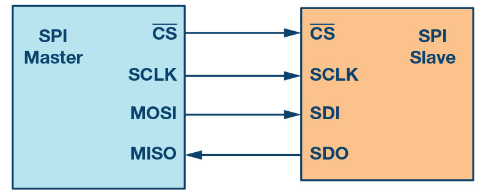
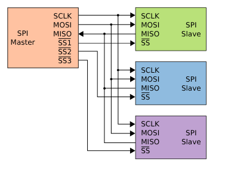

<h1 dir="rtl" align="center">جلسه 08 — <bdi><strong>SPI</strong></bdi> و ارتباط <bdi><strong>Arduino</strong></bdi> با قطعات</h1>

---

<h2 dir="rtl" align="right">🎯 هدف جلسه</h2>

در این جلسه با پروتکل ارتباطی <bdi><strong>SPI</strong></bdi> آشنا می‌شویم و یاد می‌گیریم چگونه از این پروتکل برای ارتباط <bdi><strong>Arduino UNO</strong></bdi> با قطعات مختلف استفاده کنیم.

در این جلسه یاد می‌گیریم:

<ol dir="rtl" align="right">
  <li><bdi><strong>SPI</strong></bdi> چیست و چگونه کار می‌کند؟</li>
  <li>خطوط <bdi><strong>MOSI</strong></bdi>، <bdi><strong>MISO</strong></bdi>، <bdi><strong>SCK</strong></bdi> و <bdi><strong>SS</strong></bdi> چه کاری انجام می‌دهند؟</li>
  <li>پایه‌های <bdi><strong>SPI</strong></bdi> در <bdi><strong>Arduino UNO</strong></bdi> کدام‌اند؟</li>
  <li>تفاوت <bdi><strong>SPI</strong></bdi> و <bdi><strong>I2C</strong></bdi> چیست؟</li>
  <li>چگونه کتابخانه <bdi><strong>SPI</strong></bdi> را در برنامه استفاده کنیم؟</li>
  <li>چگونه یک داده را از طریق <bdi><strong>SPI</strong></bdi> ارسال و دریافت کنیم؟</li>
  <li>چگونه یک تست ساده برای بررسی عملکرد <bdi><strong>SPI</strong></bdi> انجام دهیم؟</li>
</ol>

در پایان این جلسه می‌توانیم مفهوم <bdi><strong>SPI</strong></bdi> را درک کنیم، پایه‌های آن را روی <bdi><strong>Arduino UNO</strong></bdi> پیدا کنیم و یک ارتباط ساده <bdi><strong>SPI</strong></bdi> را آزمایش کنیم.

---

<h2 dir="rtl" align="right">🔗 <bdi><strong>SPI</strong></bdi> چیست و چگونه کار می‌کند؟</h2>

<bdi><strong>SPI</strong></bdi> مخفف <bdi><strong>Serial Peripheral Interface</strong></bdi> است و یک پروتکل ارتباطی سریال برای ارتباط بین میکروکنترلر و قطعات جانبی مختلف استفاده می‌شود.

از <bdi><strong>SPI</strong></bdi> می‌توان برای ارتباط با قطعاتی مانند حافظه‌ها، نمایشگرها، ماژول‌های ارتباطی، مبدل‌ها و بسیاری از تجهیزات جانبی استفاده کرد.

<h3 dir="rtl" align="right">ویژگی‌های مهم <bdi><strong>SPI</strong></bdi>:</h3>

<ul dir="rtl" align="right">
  <li>سرعت بالایی دارد.</li>
  <li>ساختار آن نسبتاً ساده است.</li>
  <li>از چند خط ارتباطی استفاده می‌کند.</li>
  <li>امکان اتصال چند دستگاه جانبی وجود دارد.</li>
  <li>ارتباط می‌تواند به صورت ارسال و دریافت همزمان انجام شود.</li>
</ul>

<h3 dir="rtl" align="right">نحوه کار <bdi><strong>SPI</strong></bdi> به زبان ساده:</h3>

در یک ارتباط ساده <bdi><strong>SPI</strong></bi> معمولاً یک دستگاه به عنوان <bdi><strong>Master</strong></bdi> و یک یا چند دستگاه به عنوان <bdi><strong>Slave</strong></bdi> در نظر گرفته می‌شوند.

در این حالت، <bdi><strong>Master</strong></bdi> زمان‌بندی ارتباط را کنترل می‌کند و مشخص می‌کند چه زمانی انتقال داده انجام شود.

---

<h2 dir="rtl" align="right">📡 خطوط اصلی <bdi><strong>SPI</strong></bdi></h2>

در <bdi><strong>SPI</strong></bdi> چهار خط اصلی وجود دارد:

  <table dir="rtl" border="1" cellpadding="10" cellspacing="0"
         style="border-collapse: collapse; width: 100%; max-width: 700px; margin-right: auto; margin-left: 0;">
    <thead>
      <tr style="background-color: #2d2d2d; color: #fff;">
        <th style="padding: 10px;">خط</th>
        <th style="padding: 10px;">نام کامل</th>
        <th style="padding: 10px;">وظیفه</th>
      </tr>
    </thead>
    <tbody>
      <tr>
        <td style="padding: 10px; text-align: center;"><bdi><strong>MOSI</strong></bdi></td>
        <td style="padding: 10px;"><bdi>Master Out Slave In</bdi></td>
        <td style="padding: 10px;">ارسال داده از Master به Slave</td>
      </tr>
      <tr>
        <td style="padding: 10px; text-align: center;"><bdi><strong>MISO</strong></bdi></td>
        <td style="padding: 10px;"><bdi>Master In Slave Out</bdi></td>
        <td style="padding: 10px;">ارسال داده از Slave به Master</td>
      </tr>
      <tr>
        <td style="padding: 10px; text-align: center;"><bdi><strong>SCK</strong></bdi></td>
        <td style="padding: 10px;"><bdi>Serial Clock</bdi></td>
        <td style="padding: 10px;">سیگنال کلاک</td>
      </tr>
      <tr>
        <td style="padding: 10px; text-align: center;"><bdi><strong>SS</strong></bdi></td>
        <td style="padding: 10px;"><bdi>Slave Select</bdi></td>
        <td style="padding: 10px;">انتخاب دستگاه Slave</td>
      </tr>
    </tbody>
  </table>

---

<h2 dir="rtl" align="right">📤 <bdi><strong>MOSI</strong></bdi></h2>

<bdi><strong>MOSI</strong></bdi> مخفف <bdi><strong>Master Out Slave In</strong></bdi> است.

از این خط برای ارسال داده از <bdi><strong>Master</strong></bdi> به <bdi><strong>Slave</strong></bdi> استفاده می‌شود.

<pre dir="ltr" style="background:#f4f4f4; padding:12px; border-radius:6px; text-align:left;">
Master  ───────────→  Slave
          MOSI
</pre>

---

<h2 dir="rtl" align="right">📥 <bdi><strong>MISO</strong></bdi></h2>

<bdi><strong>MISO</strong></bdi> مخفف <bdi><strong>Master In Slave Out</strong></bdi> است.

از این خط برای ارسال داده از <bdi><strong>Slave</strong></bdi> به <bdi><strong>Master</strong></bdi> استفاده می‌شود.

<pre dir="ltr" style="background:#f4f4f4; padding:12px; border-radius:6px; text-align:left;">
Master  ←───────────  Slave
          MISO
</pre>

---

<h2 dir="rtl" align="right">⏱️ <bdi><strong>SCK</strong></bdi></h2>

<bdi><strong>SCK</strong></bdi> مخفف <bdi><strong>Serial Clock</strong></bdi> است.

این خط توسط <bdi><strong>Master</strong></bdi> تولید می‌شود و زمان‌بندی ارسال و دریافت داده را مشخص می‌کند.

<pre dir="ltr" style="background:#f4f4f4; padding:12px; border-radius:6px; text-align:left;">
Master
   │
   └──────────── SCK ────────────→ Slave
</pre>

---

<h2 dir="rtl" align="right">🎯 <bdi><strong>SS</strong></bdi> یا <bdi><strong>CS</strong></bdi></h2>

خط <bdi><strong>SS</strong></bdi> یا <bdi><strong>CS</strong></bdi> برای انتخاب دستگاه مورد نظر استفاده می‌شود.

اگر چند دستگاه <bdi><strong>SPI</strong></bdi> به یک <bdi><strong>Arduino</strong></bdi> متصل باشند، برای هر دستگاه معمولاً یک خط انتخاب جداگانه در نظر گرفته می‌شود.

<pre dir="ltr" style="background:#f4f4f4; padding:12px; border-radius:6px; text-align:left;">
             ┌── Device 1
Arduino ─ CS1
             ├── Device 2
        ─ CS2
             └── Device 3
        ─ CS3
</pre>

در بسیاری از مدارها این خط با نام <bdi><strong>CS</strong></bdi> یعنی <bdi><strong>Chip Select</strong></bdi> نیز دیده می‌شود.

---

<h2 dir="rtl" align="right">📍 پایه‌های <bdi><strong>SPI</strong></bdi> در <bdi><strong>Arduino UNO</strong></bdi></h2>

در <bdi><strong>Arduino UNO</strong></bdi> پایه‌های سخت‌افزاری <bdi><strong>SPI</strong></bdi> به صورت زیر هستند:

<pre dir="ltr" style="background:#f4f4f4; padding:12px; border-radius:6px; text-align:left;">
D10 → SS
D11 → MOSI
D12 → MISO
D13 → SCK
</pre>

پس در یک اتصال معمولی می‌توانیم این خطوط را به صورت زیر در نظر بگیریم:

<pre dir="ltr" style="background:#f4f4f4; padding:12px; border-radius:6px; text-align:left;">
Arduino UNO          SPI Device
────────────────────────────────
D10 / SS   ────────  CS / SS
D11 / MOSI  ───────  MOSI
D12 / MISO  ───────  MISO
D13 / SCK   ───────  SCK
GND         ───────  GND
</pre>

  

---

<h2 dir="rtl" align="right">🧠 تفاوت <bdi><strong>SPI</strong></bdi> و <bdi><strong>I2C</strong></bdi></h2>

هر دو پروتکل برای ارتباط با قطعات جانبی استفاده می‌شوند، اما ساختار آن‌ها متفاوت است.

  <table dir="rtl" border="1" cellpadding="10" cellspacing="0"
         style="border-collapse: collapse; width: 100%; max-width: 800px; margin-right: auto; margin-left: 0;">
    <thead>
      <tr style="background-color: #2d2d2d; color: #fff;">
        <th>ویژگی</th>
        <th><bdi><strong>I2C</strong></bdi></th>
        <th><bdi><strong>SPI</strong></bdi></th>
      </tr>
    </thead>
    <tbody>
      <tr>
        <td>تعداد خطوط اصلی</td>
        <td>2</td>
        <td>4</td>
      </tr>
      <tr>
        <td>داده از Master به Slave</td>
        <td>SDA</td>
        <td>MOSI</td>
      </tr>
      <tr>
        <td>داده از Slave به Master</td>
        <td>SDA</td>
        <td>MISO</td>
      </tr>
      <tr>
        <td>خط کلاک</td>
        <td>SCL</td>
        <td>SCK</td>
      </tr>
      <tr>
        <td>انتخاب دستگاه</td>
        <td>Address</td>
        <td>SS / CS</td>
      </tr>
    </tbody>
  </table>

در <bdi><strong>I2C</strong></bdi> معمولاً با استفاده از آدرس دستگاه را مشخص می‌کنیم، اما در <bdi><strong>SPI</strong></bdi> معمولاً با خط <bdi><strong>SS/CS</strong></bdi> دستگاه مورد نظر را انتخاب می‌کنیم.

---

<h2 dir="rtl" align="right">📚 کتابخانه <bdi><strong>SPI</strong></bdi></h2>

برای استفاده از <bdi><strong>SPI</strong></bdi> در <bdi><strong>Arduino</strong></bdi> از کتابخانه استاندارد <bdi><strong>SPI.h</strong></bdi> استفاده می‌کنیم.

<pre dir="ltr" style="background:#f4f4f4; padding:12px; border-radius:6px; text-align:left;">
#include &lt;SPI.h&gt;
</pre>

در حالت معمول نیازی به نصب جداگانه این کتابخانه نداریم و همراه محیط <bdi><strong>Arduino IDE</strong></bdi> در دسترس است.

---

<h2 dir="rtl" align="right">⚙️ راه‌اندازی <bdi><strong>SPI</strong></bdi></h2>

برای شروع ارتباط <bdi><strong>SPI</strong></bdi> می‌توانیم از دستور زیر استفاده کنیم:

<pre dir="ltr" style="background:#f4f4f4; padding:12px; border-radius:6px; text-align:left;">
SPI.begin();
</pre>

این دستور رابط سخت‌افزاری <bdi><strong>SPI</strong></bdi> را فعال می‌کند.

برای پایان کار نیز می‌توان از:

<pre dir="ltr" style="background:#f4f4f4; padding:12px; border-radius:6px; text-align:left;">
SPI.end();
</pre>

استفاده کرد.

---

<h2 dir="rtl" align="right">📦 ارسال و دریافت داده با <bdi><strong>SPI</strong></bdi></h2>

یکی از دستورات مهم در کتابخانه <bdi><strong>SPI</strong></bdi> تابع <bdi><strong>transfer()</strong></bdi> است.

<pre dir="ltr" style="background:#f4f4f4; padding:12px; border-radius:6px; text-align:left;">
byte data = SPI.transfer(0x55);
</pre>

در این مثال مقدار <bdi><strong>0x55</strong></bdi> ارسال می‌شود و همزمان یک مقدار از ورودی <bdi><strong>SPI</strong></bdi> دریافت می‌شود.

بنابراین <bdi><strong>SPI</strong></bdi> می‌تواند ارسال و دریافت را در یک عملیات انجام دهد.

---

<h2 dir="rtl" align="right">🔄 مراحل کلی یک ارتباط <bdi><strong>SPI</strong></bdi></h2>

<ol dir="rtl" style="padding-right: 25px; line-height: 1.9;">
  <li><bdi><strong>Master</strong></bdi> خط <bdi><strong>SS/CS</strong></bdi> دستگاه مورد نظر را فعال می‌کند.</li>
  <li><bdi><strong>Master</strong></bdi> کلاک <bdi><strong>SCK</strong></bdi> را تولید می‌کند.</li>
  <li>داده از طریق <bdi><strong>MOSI</strong></bdi> ارسال می‌شود.</li>
  <li>همزمان داده از طریق <bdi><strong>MISO</strong></bdi> دریافت می‌شود.</li>
  <li>پس از پایان انتقال، <bdi><strong>SS/CS</strong></bdi> غیرفعال می‌شود.</li>
</ol>

---

<h2 dir="rtl" align="right">🧪 اولین برنامه <bdi><strong>SPI</strong></bdi></h2>

در این مثال فقط رابط <bdi><strong>SPI</strong></bdi> را راه‌اندازی می‌کنیم و یک داده را ارسال می‌کنیم.

<pre dir="ltr" style="background:#f4f4f4; padding:12px; border-radius:6px; text-align:left;">
#include &lt;SPI.h&gt;

#define SS_PIN 10

void setup() {
  pinMode(SS_PIN, OUTPUT);
  digitalWrite(SS_PIN, HIGH);

  SPI.begin();
}

void loop() {
  digitalWrite(SS_PIN, LOW);

  SPI.transfer(0x55);

  digitalWrite(SS_PIN, HIGH);

  delay(1000);
}
</pre>

<h3 dir="rtl" align="right">بررسی کد:</h3>

<ul dir="rtl" align="right">
  <li><bdi><code>SPI.begin()</code></bdi> رابط <bdi><strong>SPI</strong></bdi> را فعال می‌کند.</li>
  <li><bdi><code>digitalWrite(SS_PIN, LOW)</code></bdi> دستگاه مورد نظر را انتخاب می‌کند.</li>
  <li><bdi><code>SPI.transfer(0x55)</code></bdi> داده را ارسال می‌کند.</li>
  <li>در پایان با قرار دادن <bdi><strong>SS</strong></bdi> روی <bdi><strong>HIGH</strong></bdi> انتقال را پایان می‌دهیم.</li>
</ul>

---

<h2 dir="rtl" align="right">🔬 پروژه عملی اول — تست <bdi><strong>SPI Loopback</strong></bdi></h2>

برای اینکه بدون نیاز به قطعه جانبی عملکرد ارسال و دریافت <bdi><strong>SPI</strong></bdi> را بررسی کنیم، می‌توانیم یک تست ساده انجام دهیم.

در این آزمایش پایه <bdi><strong>MOSI</strong></bdi> را به <bdi><strong>MISO</strong></bdi> وصل می‌کنیم تا داده‌ای که ارسال می‌شود دوباره وارد بخش دریافت شود.

<h3 dir="rtl" align="right">اتصال:</h3>

<pre dir="ltr" style="background:#f4f4f4; padding:12px; border-radius:6px; text-align:left;">
Arduino UNO

D11 (MOSI) ───────── D12 (MISO)
GND        ───────── GND
</pre>

در این آزمایش بهتر است فقط از یک سیم برای اتصال <bdi><strong>D11</strong></bdi> و <bdi><strong>D12</strong></bdi> استفاده کنیم.

<h3 dir="rtl" align="right">کد تست:</h3>

<pre dir="ltr" style="background:#f4f4f4; padding:12px; border-radius:6px; text-align:left;">
#include &lt;SPI.h&gt;

void setup() {
  Serial.begin(9600);
  SPI.begin();

  Serial.println("SPI Loopback Test");
}

void loop() {

  byte sentData = 0x55;

  byte receivedData = SPI.transfer(sentData);

  Serial.print("Sent: 0x");
  Serial.println(sentData, HEX);

  Serial.print("Received: 0x");
  Serial.println(receivedData, HEX);

  Serial.println();

  delay(1000);
}
</pre>

<h3 dir="rtl" align="right">خروجی مورد انتظار:</h3>

<pre dir="ltr" style="background:#f4f4f4; padding:12px; border-radius:6px; text-align:left;">
SPI Loopback Test

Sent: 0x55
Received: 0x55

Sent: 0x55
Received: 0x55
</pre>

اگر مقدار ارسال‌شده و دریافت‌شده یکسان باشد، می‌توانیم نتیجه بگیریم که مسیر آزمایشی <bdi><strong>SPI</strong></bdi> درست عمل می‌کند.

---

<h2 dir="rtl" align="right">🎛️ تنظیمات ارتباط <bdi><strong>SPI</strong></bdi></h2>

در پروژه‌های واقعی ممکن است قطعات مختلف به سرعت و تنظیمات متفاوتی نیاز داشته باشند.

برای تنظیم دقیق‌تر ارتباط می‌توانیم از <bdi><strong>SPISettings</strong></bdi> استفاده کنیم.

<pre dir="ltr" style="background:#f4f4f4; padding:12px; border-radius:6px; text-align:left;">
SPI.beginTransaction(
  SPISettings(1000000, MSBFIRST, SPI_MODE0)
);
</pre>

در این مثال:

<ul dir="rtl" align="right">
  <li><bdi><strong>1000000</strong></bdi> یعنی سرعت <bdi><strong>1 MHz</strong></bdi>.</li>
  <li><bdi><strong>MSBFIRST</strong></bdi> مشخص می‌کند بیت‌های با اهمیت بیشتر زودتر ارسال شوند.</li>
  <li><bdi><strong>SPI_MODE0</strong></bdi> یکی از حالت‌های استاندارد زمانی <bdi><strong>SPI</strong></bdi> است.</li>
</ul>

پس از پایان انتقال نیز می‌توانیم بنویسیم:

<pre dir="ltr" style="background:#f4f4f4; padding:12px; border-radius:6px; text-align:left;">
SPI.endTransaction();
</pre>

---

<h2 dir="rtl" align="right">💡 چند دستگاه روی <bdi><strong>SPI</strong></bdi></h2>

یکی از ویژگی‌های مهم <bdi><strong>SPI</strong></bdi> این است که می‌توان چند دستگاه را به خطوط مشترک <bdi><strong>MOSI</strong></bdi>، <bdi><strong>MISO</strong></bdi> و <bdi><strong>SCK</strong></bdi> متصل کرد.

در این حالت برای انتخاب هر دستگاه از یک خط <bdi><strong>CS</strong></bdi> یا <bdi><strong>SS</strong></bdi> جداگانه استفاده می‌شود.

<pre dir="ltr" style="background:#f4f4f4; padding:12px; border-radius:6px; text-align:left;">
                    ┌── Device 1
MOSI ───────────────┼── Device 2
MISO ───────────────┼── Device 3
SCK  ───────────────┘

CS1 ───────────────── Device 1
CS2 ───────────────── Device 2
CS3 ───────────────── Device 3
</pre>

  

به این ترتیب می‌توانیم چند قطعه را روی یک رابط <bdi><strong>SPI</strong></bdi> قرار دهیم.

---

<h2 dir="rtl" align="right">⚠️ نکته‌های مهم</h2>

<ul dir="rtl" style="padding-right: 25px; line-height: 2;">
  <li>اتصال <bdi><strong>GND</strong></bdi> بین برد و قطعه باید مشترک باشد.</li>
  <li>قبل از اتصال قطعه، پایه‌های <bdi><strong>MOSI</strong></bdi>، <bdi><strong>MISO</strong></bdi>، <bdi><strong>SCK</strong></bdi> و <bdi><strong>CS</strong></bdi> آن را بررسی کنید.</li>
  <li>همه ماژول‌ها از نظر ولتاژ تغذیه یکسان نیستند؛ ولتاژ مورد نیاز قطعه را بررسی کنید.</li>
  <li>اگر چند دستگاه <bdi><strong>SPI</strong></bdi> متصل هستند، انتخاب دستگاه درست با خط <bdi><strong>CS/SS</strong></bdi> اهمیت دارد.</li>
  <li>سرعت و حالت <bdi><strong>SPI</strong></bdi> باید با مشخصات قطعه سازگار باشد.</li>
</ul>

---

<h2 dir="rtl" align="right">🧩 پروژه عملی دوم</h2>

در یک پروژه ساده، برنامه‌ای بنویسید که هر یک ثانیه یک داده جدید را از طریق <bdi><strong>SPI</strong></bdi> ارسال کند.

داده‌های زیر را به ترتیب ارسال کنید:

<pre dir="ltr" style="background:#f4f4f4; padding:12px; border-radius:6px; text-align:left;">
0x10
0x20
0x30
0x40
0x50
</pre>

بعد از هر انتقال، مقدار ارسال‌شده را در <bdi><strong>Serial Monitor</strong></bdi> نمایش دهید.

هدف پروژه این است که با روند زیر آشنا شوید:

<pre dir="ltr" style="background:#f4f4f4; padding:12px; border-radius:6px; text-align:left;">
انتخاب Slave
      ↓
ارسال داده
      ↓
دریافت پاسخ
      ↓
پایان انتقال
      ↓
Serial Monitor نمایش نتیجه در 
</pre>

---

<h2 dir="rtl" align="right">📝 سوالات</h2>

<ol dir="rtl" align="right">
  <li><bdi><strong>SPI</strong></bdi> چیست و برای چه کاری استفاده می‌شود؟</li>
  <li>چهار خط اصلی <bdi><strong>SPI</strong></bdi> چه نام دارند؟</li>
  <li><bdi><strong>MOSI</strong></bdi> چه کاری انجام می‌دهد؟</li>
  <li><bdi><strong>MISO</strong></bdi> چه کاری انجام می‌دهد؟</li>
  <li>وظیفه <bdi><strong>SCK</strong></bdi> چیست؟</li>
  <li><bdi><strong>SS</strong></bdi> یا <bdi><strong>CS</strong></bdi> چه کاربردی دارد؟</li>
  <li>پایه‌های <bdi><strong>SPI</strong></bdi> در <bdi><strong>Arduino UNO</strong></bdi> کدام‌اند؟</li>
  <li>تفاوت اصلی <bdi><strong>SPI</strong></bdi> و <bdi><strong>I2C</strong></bdi> چیست؟</li>
  <li>دستور <bdi><code>SPI.begin()</code></bdi> چه کاری انجام می‌دهد؟</li>
  <li>تابع <bdi><code>SPI.transfer()</code></bdi> برای چه کاری استفاده می‌شود؟</li>
</ol>

---

<h2 dir="rtl" align="right">📌 جمع‌بندی</h2>

در این جلسه:

<ul dir="rtl" align="right">
  <li>با مفهوم <bdi><strong>SPI</strong></bdi> آشنا شدیم.</li>
  <li>ساختار <bdi><strong>Master</strong></bdi> و <bdi><strong>Slave</strong></bdi> را بررسی کردیم.</li>
  <li>خطوط <bdi><strong>MOSI</strong></bdi>، <bdi><strong>MISO</strong></bdi>، <bdi><strong>SCK</strong></bdi> و <bdi><strong>SS</strong></bdi> را شناختیم.</li>
  <li>پایه‌های <bdi><strong>SPI</strong></bdi> در <bdi><strong>Arduino UNO</strong></bdi> را یاد گرفتیم.</li>
  <li>تفاوت <bdi><strong>SPI</strong></bdi> و <bdi><strong>I2C</strong></bdi> را بررسی کردیم.</li>
  <li>با کتابخانه <bdi><strong>SPI.h</strong></bdi> کار کردیم.</li>
  <li>با <bdi><strong>SPI.transfer()</strong></bdi> داده ارسال و دریافت کردیم.</li>
  <li>یک تست ساده <bdi><strong>SPI Loopback</strong></bdi> انجام دادیم.</li>
  <li>با مفهوم <bdi><strong>CS/SS</strong></bdi> برای انتخاب دستگاه آشنا شدیم.</li>
</ul>

اکنون با یکی دیگر از مهم‌ترین روش‌های ارتباطی در دنیای <bdi><strong>Arduino</strong></bdi> آشنا شده‌ایم و می‌توانیم در پروژه‌های مختلف از <bdi><strong>SPI</strong></bdi> برای ارتباط با قطعات جانبی استفاده کنیم.

<h2 dir="rtl" align="right">⏭️ جلسه بعد</h2>

در جلسه نهم با مفهوم <bdi><strong>Interrupt</strong></bdi> یا <bdi><strong>وقفه</strong></bdi> آشنا می‌شویم.

یاد می‌گیریم چگونه کاری کنیم که <bdi><strong>Arduino</strong></bdi> بتواند در هنگام رخ دادن یک رویداد مهم، بدون اینکه دائماً آن رویداد را بررسی کند، بلافاصله به آن واکنش نشان دهد.

در این جلسه با مفاهیمی مانند <bdi><strong>Interrupt</strong></bdi>، <bdi><strong>ISR</strong></bdi> و <bdi><strong>attachInterrupt()</strong></bdi> آشنا خواهیم شد و با استفاده از یک پروژه عملی نحوه استفاده از وقفه‌ها را یاد می‌گیریم.

⬅️ <a href="../09-Interrupt/">جلسه 09 — آشنایی با <bdi><strong>Interrupt</strong></bdi> و وقفه‌ها</a>

<strong>Arduino From Zero to Projects</strong>

<strong>Mohammad Esteghamat</strong>

