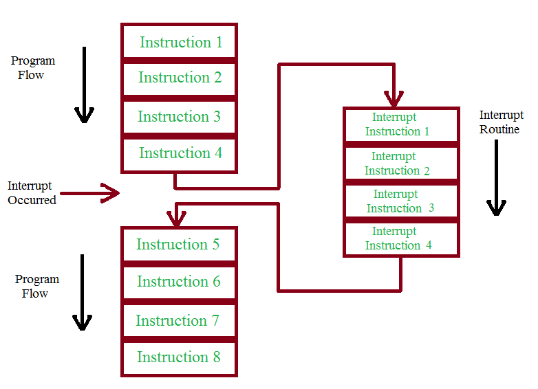
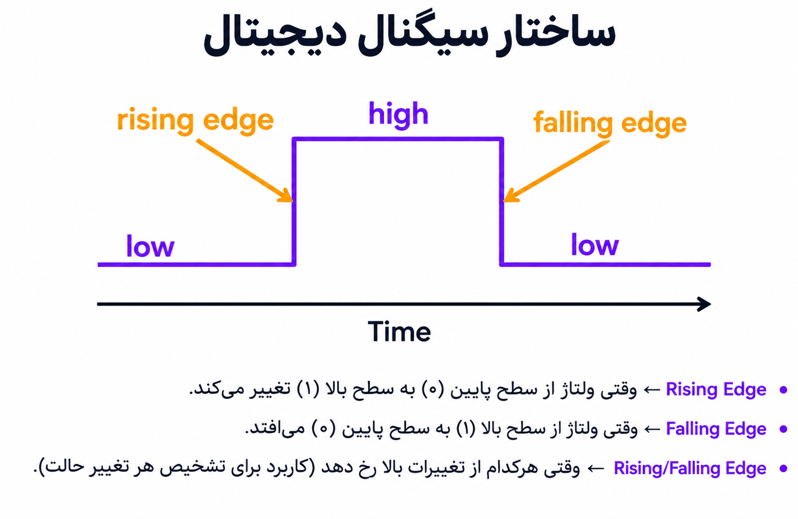
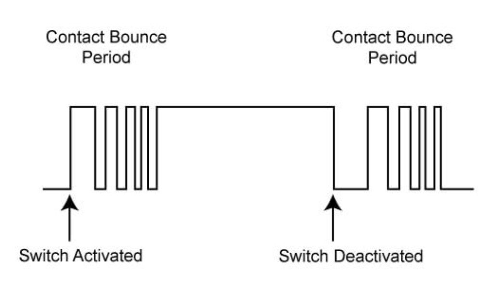

<h1 dir="rtl" align="center">جلسه 09 — <bdi><strong>Interrupt</strong></bdi> و وقفه‌ها در <bdi><strong>Arduino</strong></bdi></h1>

---

<h2 dir="rtl" align="right">🎯 هدف جلسه</h2>

در این جلسه با یکی از مهم‌ترین قابلیت‌های میکروکنترلرها یعنی <bdi><strong>Interrupt</strong></bdi> یا <bdi><strong>وقفه</strong></bdi> آشنا می‌شویم.

در برنامه‌های معمولی، <bdi><strong>Arduino</strong></bdi> دستورات را به ترتیب اجرا می‌کند و برای بررسی یک ورودی معمولاً باید دائماً آن را چک کنیم. اما با استفاده از <bdi><strong>Interrupt</strong></bdi> می‌توانیم به <bdi><strong>Arduino</strong></bdi> بگوییم:

<pre dir="ltr" style="background:#f4f4f4; padding:12px; border-radius:6px; text-align:center;">
"هر وقت این اتفاق افتاد،
فوراً این کار را انجام بده."
</pre>

در این جلسه یاد می‌گیریم:

<ol dir="rtl" align="right">
  <li><bdi><strong>Interrupt</strong></bdi> چیست و چرا به آن نیاز داریم؟</li>
  <li>تفاوت روش معمولی بررسی ورودی با <bdi><strong>Interrupt</strong></bdi> چیست؟</li>
  <li><bdi><strong>ISR</strong></bdi> چیست؟</li>
  <li>چگونه از <bdi><strong>attachInterrupt()</strong></bdi> استفاده کنیم؟</li>
  <li>پایه‌های مناسب <bdi><strong>External Interrupt</strong></bdi> در <bdi><strong>Arduino UNO</strong></bdi> کدام‌اند؟</li>
  <li>مفهوم <bdi><strong>RISING</strong></bdi>، <bdi><strong>FALLING</strong></bdi>، <bdi><strong>CHANGE</strong></bdi> و <bdi><strong>LOW</strong></bdi> چیست؟</li>
  <li>چگونه یک دکمه را با <bdi><strong>Interrupt</strong></bdi> کنترل کنیم؟</li>
  <li>چه نکاتی را هنگام نوشتن تابع وقفه باید رعایت کنیم؟</li>
</ol>

در پایان این جلسه می‌توانیم یک رویداد خارجی را با استفاده از <bdi><strong>Interrupt</strong></bdi> تشخیص داده و بدون بررسی دائمی ورودی، به آن واکنش نشان دهیم.

---

<h2 dir="rtl" align="right">⚡ <bdi><strong>Interrupt</strong></bdi> چیست؟</h2>

<bdi><strong>Interrupt</strong></bdi> به معنی «وقفه» است. یعنی در هنگام رخ دادن یک رویداد مشخص، اجرای عادی برنامه برای مدت کوتاهی متوقف می‌شود و <bdi><strong>Arduino</strong></bdi> یک تابع مخصوص را اجرا می‌کند.

پس از پایان آن تابع، اجرای برنامه دوباره از همان جایی که متوقف شده بود ادامه پیدا می‌کند.

<pre dir="ltr" style="background:#f4f4f4; padding:12px; border-radius:6px; text-align:left;">
برنامه اصلی
    ↓
    ↓
    ↓
رویداد Interrupt
    ↓
اجرای ISR
    ↓
بازگشت به برنامه اصلی
    ↓
ادامه اجرای برنامه
</pre>

  

---

<h2 dir="rtl" align="right">🤔 چرا به <bdi><strong>Interrupt</strong></bdi> نیاز داریم؟</h2>

فرض کنید یک دکمه داریم و می‌خواهیم هر زمان فشرده شد، یک کار خاص انجام شود.

در روش معمولی باید مرتباً وضعیت دکمه را بررسی کنیم:

<pre dir="ltr" style="background:#f4f4f4; padding:12px; border-radius:6px; text-align:left;">
if (digitalRead(buttonPin) == LOW) {
    // دکمه فشرده شده
}
</pre>

این روش در پروژه‌های ساده کاملاً مناسب است؛ اما اگر برنامه همزمان مشغول انجام کارهای دیگری باشد، بررسی مداوم ورودی ممکن است باعث شود واکنش به رویداد با تأخیر انجام شود.

در چنین شرایطی می‌توانیم از <bdi><strong>Interrupt</strong></bdi> استفاده کنیم.

---

<h2 dir="rtl" align="right">🔍 تفاوت Polling و Interrupt</h2>

<h3 dir="rtl" align="right">روش اول — <bdi><strong>Polling</strong></bdi></h3>

در روش <bdi><strong>Polling</strong></bdi> خود برنامه دائماً وضعیت ورودی را بررسی می‌کند.

<pre dir="ltr" style="background:#f4f4f4; padding:12px; border-radius:6px; text-align:left;">
loop()
   ↓
بررسی ورودی
   ↓
انجام کار
   ↓
بررسی ورودی
   ↓
انجام کار
   ↓
...
</pre>

<h3 dir="rtl" align="right">روش دوم — <bdi><strong>Interrupt</strong></bdi></h3>

در این روش لازم نیست برنامه دائماً ورودی را چک کند. سخت‌افزار در هنگام رخ دادن رویداد مشخص، اجرای تابع مربوط به وقفه را آغاز می‌کند.

<pre dir="ltr" style="background:#f4f4f4; padding:12px; border-radius:6px; text-align:left;">
loop()
   ↓
اجرای برنامه اصلی
   ↓
اجرای برنامه اصلی
   ↓
Interrupt
   ↓
ISR
   ↓
بازگشت به برنامه اصلی
</pre>

---

<h2 dir="rtl" align="right">🧠 <bdi><strong>ISR</strong></bdi> چیست؟</h2>

<bdi><strong>ISR</strong></bdi> مخفف <bdi><strong>Interrupt Service Routine</strong></bdi> است.

در واقع <bdi><strong>ISR</strong></bdi> همان تابعی است که هنگام رخ دادن وقفه اجرا می‌شود.

در <bdi><strong>Arduino</strong></bdi> معمولاً تابع ISR را به شکل یک تابع ساده تعریف می‌کنیم:

<pre dir="ltr" style="background:#f4f4f4; padding:12px; border-radius:6px; text-align:left;">
void myInterrupt() {
    // دستورات مربوط به وقفه
}
</pre>

بعداً این تابع را به یک وقفه مشخص متصل می‌کنیم.

---

<h2 dir="rtl" align="right">🔌 پایه‌های Interrupt در <bdi><strong>Arduino UNO</strong></bdi></h2>

در <bdi><strong>Arduino UNO</strong></bdi> وقفه‌های خارجی سخت‌افزاری اصلی روی دو پایه در دسترس هستند:

<pre dir="ltr" style="background:#f4f4f4; padding:12px; border-radius:6px; text-align:left;">
D2 → Interrupt 0
D3 → Interrupt 1
</pre>

بنابراین در این جلسه برای مثال‌های خود از پایه‌های <bdi><strong>D2</strong></bdi> و <bdi><strong>D3</strong></bdi> استفاده می‌کنیم.

---

<h2 dir="rtl" align="right">🛠️ تابع <bdi><strong>attachInterrupt()</strong></bdi></h2>

برای متصل کردن یک تابع به وقفه از <bdi><strong>attachInterrupt()</strong></bdi> استفاده می‌کنیم.

<pre dir="ltr" style="background:#f4f4f4; padding:12px; border-radius:6px; text-align:left;">
attachInterrupt(digitalPinToInterrupt(pin), ISR, mode);
</pre>

این تابع سه بخش اصلی دارد:

  <table dir="rtl" border="1" cellpadding="10" cellspacing="0"
         style="border-collapse: collapse; width: 100%; max-width: 800px; margin-right: auto; margin-left: 0;">
    <thead>
      <tr style="background-color: #2d2d2d; color: #fff;">
        <th>پارامتر</th>
        <th>توضیح</th>
      </tr>
    </thead>
    <tbody>
      <tr>
        <td><bdi><strong>pin</strong></bdi></td>
        <td>پایه‌ای که رویداد روی آن رخ می‌دهد.</td>
      </tr>
      <tr>
        <td><bdi><strong>ISR</strong></bdi></td>
        <td>تابعی که هنگام وقوع وقفه اجرا می‌شود.</td>
      </tr>
      <tr>
        <td><bdi><strong>mode</strong></bdi></td>
        <td>نوع تغییری که باعث ایجاد وقفه می‌شود.</td>
      </tr>
    </tbody>
  </table>

---

<h2 dir="rtl" align="right">📈 حالت‌های Trigger</h2>

مقدار <bdi><strong>mode</strong></bdi> مشخص می‌کند چه تغییری باعث اجرای وقفه شود.

  

---

<h2 dir="rtl" align="right">💡 اولین مثال Interrupt</h2>

در این مثال با فشار دادن یک دکمه، یک متغیر تغییر می‌کند و وضعیت LED را کنترل می‌کنیم.

<h3 dir="rtl" align="right">اتصالات</h3>

  

برای ساده‌تر شدن مدار از مقاومت Pull-up داخلی استفاده می‌کنیم و دکمه را به <bdi><strong>GND</strong></bdi> متصل می‌کنیم.

---

<h2 dir="rtl" align="right">🚀 برنامه اول — کنترل LED با Interrupt</h2>

<pre dir="ltr" style="background:#f4f4f4; padding:12px; border-radius:6px; text-align:left;">
const byte buttonPin = 2;
const byte ledPin = LED_BUILTIN;

volatile bool ledState = false;

void buttonInterrupt() {
  ledState = !ledState;
}

void setup() {

  pinMode(ledPin, OUTPUT);

  pinMode(buttonPin, INPUT_PULLUP);

  attachInterrupt(
    digitalPinToInterrupt(buttonPin),
    buttonInterrupt,
    FALLING
  );
}

void loop() {

  digitalWrite(ledPin, ledState);

}
</pre>

<h3 dir="rtl" align="right">🔎 بررسی برنامه</h3>

<ul dir="rtl" align="right">
  <li><bdi><code>INPUT_PULLUP</code></bdi> مقاومت Pull-up داخلی پایه را فعال می‌کند.</li>
  <li>دکمه بین <bdi><strong>D2</strong></bdi> و <bdi><strong>GND</strong></bdi> قرار گرفته است.</li>
  <li>با فشردن دکمه، وضعیت پایه از <bdi><strong>HIGH</strong></bdi> به <bdi><strong>LOW</strong></bdi> تغییر می‌کند.</li>
  <li>به همین دلیل از <bdi><strong>FALLING</strong></bdi> استفاده کرده‌ایم.</li>
  <li>تابع <bdi><code>buttonInterrupt()</code></bdi> هنگام وقوع وقفه اجرا می‌شود.</li>
  <li>متغیر <bdi><code>ledState</code></bdi> وضعیت LED را تغییر می‌دهد.</li>
</ul>

---

<h2 dir="rtl" align="right">⚠️ چرا از <bdi><strong>volatile</strong></bdi> استفاده کردیم؟</h2>

وقتی یک متغیر در برنامه اصلی و همچنین در تابع وقفه استفاده می‌شود، بهتر است آن را با <bdi><strong>volatile</strong></bdi> تعریف کنیم.

<pre dir="ltr" style="background:#f4f4f4; padding:12px; border-radius:6px; text-align:left;">
volatile bool ledState = false;
</pre>

این کلمه به کامپایلر اعلام می‌کند که مقدار این متغیر ممکن است خارج از روند معمول اجرای برنامه تغییر کند؛ برای مثال توسط یک <bdi><strong>Interrupt</strong></bdi>.

---

<h2 dir="rtl" align="right">🚨 نکات مهم در نوشتن ISR</h2>

تابع وقفه باید تا حد امکان کوتاه و سریع باشد.

بهتر است داخل ISR کارهای سنگین انجام ندهیم.

<ul dir="rtl" align="right">
  <li>از <bdi><code>delay()</code></bdi> داخل ISR استفاده نکنید.</li>
  <li>کارهای طولانی را داخل ISR انجام ندهید.</li>
  <li>پردازش‌های سنگین را به <bdi><code>loop()</code></bdi> منتقل کنید.</li>
  <li>ISR را تا حد امکان ساده نگه دارید.</li>
</ul>

یک روش مناسب این است که داخل ISR فقط یک متغیر یا Flag را تغییر دهیم و سپس در <bdi><code>loop()</code></bdi> کار اصلی را انجام دهیم.

---

<h2 dir="rtl" align="right">✅ روش پیشنهادی برای استفاده از Interrupt</h2>

به جای اینکه داخل ISR تمام کار را انجام دهیم، می‌توانیم فقط یک علامت ایجاد کنیم.

<pre dir="ltr" style="background:#f4f4f4; padding:12px; border-radius:6px; text-align:left;">
volatile bool eventOccurred = false;

void interruptFunction() {
  eventOccurred = true;
}

void loop() {

  if (eventOccurred) {

    eventOccurred = false;

    // انجام کار اصلی

  }

}
</pre>

این روش باعث می‌شود تابع وقفه ساده و سریع باقی بماند.

---

<h2 dir="rtl" align="right">🔘 پروژه عملی — شمارش فشار دکمه</h2>

در این پروژه هر بار که دکمه فشرده شود، یک شمارنده افزایش پیدا می‌کند و مقدار آن در <bdi><strong>Serial Monitor</strong></bdi> نمایش داده می‌شود.

<h3 dir="rtl" align="right">اتصالات</h3>

  

<h3 dir="rtl" align="right">کد پروژه:</h3>

<pre dir="ltr" style="background:#f4f4f4; padding:12px; border-radius:6px; text-align:left;">
const byte buttonPin = 2;

volatile unsigned long counter = 0;

void buttonInterrupt() {
  counter++;
}

void setup() {

  Serial.begin(9600);

  pinMode(buttonPin, INPUT_PULLUP);

  attachInterrupt(
    digitalPinToInterrupt(buttonPin),
    buttonInterrupt,
    FALLING
  );
}

void loop() {

  static unsigned long lastCounter = 0;

  if (counter != lastCounter) {

    lastCounter = counter;

    Serial.print("Button pressed: ");
    Serial.println(counter);
  }

}
</pre>

<h3 dir="rtl" align="right">خروجی مورد انتظار:</h3>

<pre dir="ltr" style="background:#f4f4f4; padding:12px; border-radius:6px; text-align:left;">
Button pressed: 1
Button pressed: 2
Button pressed: 3
Button pressed: 4
...
</pre>

---

<h2 dir="rtl" align="right">⚠️ مشکل Bounce دکمه</h2>

ممکن است تصور کنیم با هر بار فشار دادن دکمه دقیقاً یک تغییر ایجاد می‌شود، اما در دنیای واقعی کنتاکت مکانیکی دکمه هنگام فشرده شدن ممکن است چند بار به سرعت قطع و وصل شود.

به این پدیده <bdi><strong>Button Bounce</strong></bdi> گفته می‌شود.

<pre dir="ltr" style="background:#f4f4f4; padding:12px; border-radius:6px; text-align:left;">
فشار دادن واقعی دکمه:
</pre>

  

در نتیجه ممکن است یک بار فشار دادن دکمه باعث چند بار اجرای Interrupt شود.

در پروژه‌های واقعی می‌توان برای این موضوع از روش‌های مختلفی مانند <bdi><strong>Debouncing</strong></bdi> نرم‌افزاری یا سخت‌افزاری استفاده کرد.

در این جلسه هدف اصلی ما درک مفهوم <bdi><strong>Interrupt</strong></bdi> است و در پروژه‌های بعدی می‌توانیم روش‌های بهتر مدیریت ورودی‌های متعدد را بررسی کنیم.

---

<h2 dir="rtl" align="right">🧪 تمرین</h2>

برنامه‌ای بنویسید که با هر بار فشردن یک دکمه:

<ol dir="rtl" align="right">
  <li>یک واحد به شمارنده اضافه کند.</li>
  <li>اگر شمارنده زوج بود LED خاموش باشد.</li>
  <li>اگر شمارنده فرد بود LED روشن باشد.</li>
  <li>مقدار شمارنده در <bdi><strong>Serial Monitor</strong></bdi> نمایش داده شود.</li>
</ol>

سپس حالت Interrupt را از <bdi><strong>FALLING</strong></bdi> به <bdi><strong>CHANGE</strong></bdi> تغییر دهید و رفتار مدار را بررسی کنید.

---

<h2 dir="rtl" align="right">📝 سوالات</h2>

<ol dir="rtl" align="right">
  <li><bdi><strong>Interrupt</strong></bdi> چیست؟</li>
  <li>تفاوت <bdi><strong>Polling</strong></bdi> و <bdi><strong>Interrupt</strong></bdi> چیست؟</li>
  <li><bdi><strong>ISR</strong></bdi> مخفف چیست و چه کاری انجام می‌دهد؟</li>
  <li>پایه‌های Interrupt در <bdi><strong>Arduino UNO</strong></bdi> کدام‌اند؟</li>
  <li>تابع <bdi><code>attachInterrupt()</code></bdi> چه کاری انجام می‌دهد؟</li>
  <li>تفاوت <bdi><strong>RISING</strong></bdi> و <bdi><strong>FALLING</strong></bdi> چیست؟</li>
  <li>حالت <bdi><strong>CHANGE</strong></bdi> چه زمانی فعال می‌شود؟</li>
  <li>چرا بهتر است ISR کوتاه و سریع باشد؟</li>
  <li>کلمه <bdi><strong>volatile</strong></bdi> چه کاربردی دارد؟</li>
  <li><bdi><strong>Button Bounce</strong></bdi> چیست؟</li>
</ol>

---

<h2 dir="rtl" align="right">📌 جمع‌بندی</h2>

در این جلسه:

<ul dir="rtl" align="right">
  <li>با مفهوم <bdi><strong>Interrupt</strong></bdi> آشنا شدیم.</li>
  <li>تفاوت <bdi><strong>Polling</strong></bdi> و <bdi><strong>Interrupt</strong></bdi> را بررسی کردیم.</li>
  <li>با مفهوم <bdi><strong>ISR</strong></bdi> آشنا شدیم.</li>
  <li>پایه‌های Interrupt در <bdi><strong>Arduino UNO</strong></bdi> را شناختیم.</li>
  <li>با تابع <bdi><strong>attachInterrupt()</strong></bdi> کار کردیم.</li>
  <li>حالت‌های <bdi><strong>LOW</strong></bdi>، <bdi><strong>RISING</strong></bdi>، <bdi><strong>FALLING</strong></bdi> و <bdi><strong>CHANGE</strong></bdi> را یاد گرفتیم.</li>
  <li>یک دکمه را با استفاده از Interrupt کنترل کردیم.</li>
  <li>با <bdi><strong>volatile</strong></bdi> و اهمیت آن در Interrupt آشنا شدیم.</li>
  <li>مفهوم <bdi><strong>Button Bounce</strong></bdi> را بررسی کردیم.</li>
</ul>

<h2 dir="rtl" align="right">⏭️ جلسه بعد</h2>

در جلسه دهم سراغ <bdi><strong>Keypad</strong></bdi> می‌رویم و یاد می‌گیریم چگونه یک صفحه‌کلید ماتریسی را به <bdi><strong>Arduino</strong></bdi> متصل و راه‌اندازی کنیم.

در این جلسه با ساختار <bdi><strong>Row</strong></bdi> و <bdi><strong>Column</strong></bdi>، نحوه اتصال <bdi><strong>Keypad</strong></bdi> و روش خواندن کلیدهای فشرده‌شده آشنا می‌شویم.

همچنین در ادامه می‌توانیم از <bdi><strong>Keypad</strong></bdi> برای ساخت پروژه‌هایی مانند رمز عبور، ماشین‌حساب ساده و منوی کنترلی استفاده کنیم.

⬅️ <a href="../08-SPI/">جلسه 08 — پروتکل <bdi><strong>SPI</strong></bdi></a>

⬅️ <a href="../10-Keypad/">جلسه 10 — کار با <bdi><strong>Keypad</strong></bdi></a>

<strong>Arduino From Zero to Projects</strong>

<strong>Mohammad Esteghamat</strong>

