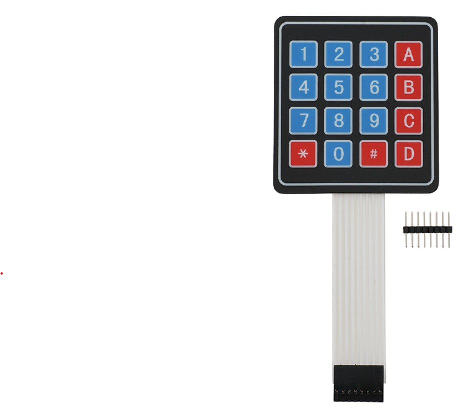
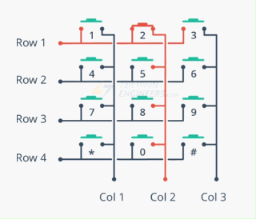
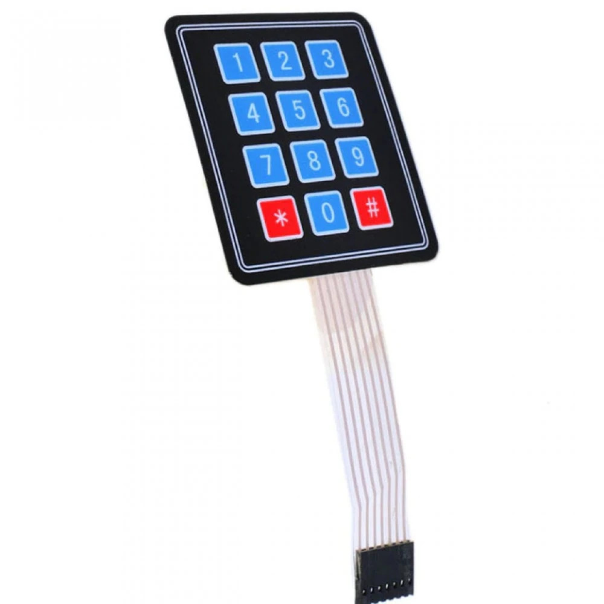
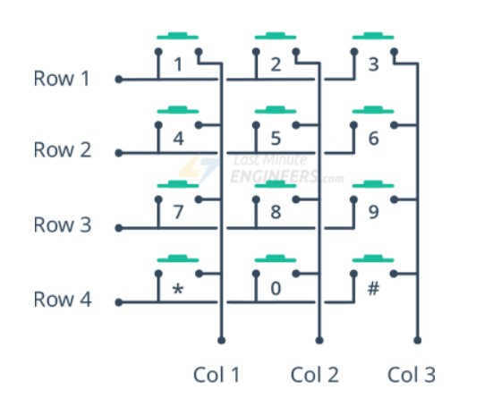

<h1 dir="rtl" align="center">جلسه 10 — راه‌اندازی <bdi><strong>Keypad</strong></bdi> و خواندن کلیدها</h1>

---

<h2 dir="rtl" align="right">🎯 هدف جلسه</h2>

در این جلسه با <bdi><strong>Keypad</strong></bdi> آشنا می‌شویم و یاد می‌گیریم چگونه یک <bdi><strong>Keypad</strong></bdi> ماتریسی را به <bdi><strong>Arduino UNO</strong></bdi> متصل و راه‌اندازی کنیم.

در این جلسه یاد می‌گیریم:

<ol dir="rtl" align="right">
  <li><bdi><strong>Keypad</strong></bdi> چیست و چگونه کار می‌کند؟</li>
  <li>ساختار <bdi><strong>Row</strong></bdi> و <bdi><strong>Column</strong></bdi> چیست؟</li>
  <li>چگونه پایه‌های <bdi><strong>Keypad</strong></bdi> را به <bdi><strong>Arduino</strong></bdi> متصل کنیم؟</li>
  <li>چگونه کتابخانه <bdi><strong>Keypad</strong></bdi> را نصب کنیم؟</li>
  <li>چگونه کلید فشرده‌شده را با برنامه تشخیص دهیم؟</li>
  <li>چگونه مقدار کلید را در <bdi><strong>Serial Monitor</strong></bdi> نمایش دهیم؟</li>
</ol>

در پایان این جلسه می‌توانیم یک <bdi><strong>Keypad 4×4</strong></bdi> را به <bdi><strong>Arduino UNO</strong></bdi> متصل کرده و هر کلیدی را که فشار می‌دهیم در <bdi><strong>Serial Monitor</strong></bdi> مشاهده کنیم.

---

<h2 dir="rtl" align="right">⌨️ <bdi><strong>Keypad</strong></bdi> چیست؟</h2>

<bdi><strong>Keypad</strong></bdi> یا صفحه‌کلید یکی از روش‌های رایج برای وارد کردن اطلاعات به یک سیستم الکترونیکی است.

در پروژه‌های <bdi><strong>Arduino</strong></bdi> می‌توان از Keypad برای وارد کردن عدد، رمز عبور، انتخاب گزینه‌ها و ارسال فرمان استفاده کرد.

یکی از Keypadهای پرکاربرد، مدل <bdi><strong>4×4</strong></bdi> است.

<pre dir="ltr" style="background:#f4f4f4; padding:12px; border-radius:6px; text-align:center;">
┌───┬───┬───┬───┐
│ 1 │ 2 │ 3 │ A │
├───┼───┼───┼───┤
│ 4 │ 5 │ 6 │ B │
├───┼───┼───┼───┤
│ 7 │ 8 │ 9 │ C │
├───┼───┼───┼───┤
│ * │ 0 │ # │ D │
└───┴───┴───┴───┘
</pre>

  

---

<h2 dir="rtl" align="right">🧩 Keypad ماتریسی چیست؟</h2>

ممکن است در نگاه اول فکر کنیم برای هر کلید باید یک پایه جداگانه به <bdi><strong>Arduino</strong></bdi> متصل شود.

اما در Keypadهای ماتریسی، کلیدها به صورت <bdi><strong>سطر</strong></bdi> و <bdi><strong>ستون</strong></bdi> سازمان‌دهی شده‌اند.

در Keypad چهار در چهار داریم:

<pre dir="ltr" style="background:#f4f4f4; padding:12px; border-radius:6px; text-align:center;">
4 Row
+
4 Column
=
8 Pins
</pre>

یعنی برای کنترل ۱۶ کلید، به جای ۱۶ پایه، فقط به ۸ پایه نیاز داریم.

---

<h2 dir="rtl" align="right">📐 ساختار Row و Column</h2>

ساختار داخلی یک Keypad چهار در چهار را می‌توان به صورت زیر تصور کرد:

  

هر کلید در محل تقاطع یک <bdi><strong>Row</strong></bdi> و یک <bdi><strong>Column</strong></bdi> قرار دارد.

برای مثال کلید <bdi><strong>5</strong></bdi> در محل تقاطع <bdi><strong>Row 2</strong></bdi> و <bdi><strong>Column 2</strong></bdi> قرار دارد.

---

<h2 dir="rtl" align="right">⌨️ Keypad چهاردرسه (4×3)</h2>

یکی دیگر از Keypadهای پرکاربرد، مدل <bdi><strong>4×3</strong></bdi> است.
این Keypad دارای <bdi><strong>4 سطر</strong></bdi> و <bdi><strong>3 ستون</strong></bdi> است و در مجموع <bdi><strong>12 کلید</strong></bdi> دارد.

<pre dir="ltr" style="background:#f4f4f4; padding:12px; border-radius:6px; text-align:center;">
┌───┬───┬───┐
│ 1 │ 2 │ 3 │
├───┼───┼───┤
│ 4 │ 5 │ 6 │
├───┼───┼───┤
│ 7 │ 8 │ 9 │
├───┼───┼───┤
│ * │ 0 │ # │
└───┴───┴───┘
</pre>

  

در این Keypad به جای 8 پایه، فقط به <bdi><strong>7 پایه</strong></bdi> نیاز داریم:

<pre dir="ltr" style="background:#f4f4f4; padding:12px; border-radius:6px; text-align:center;">
4 Row + 3 Column = 7 Pins
</pre>

ساختار آن به این صورت است:

  

---

<h2 dir="rtl" align="right">🔌 اتصال Keypad چهاردرسه به Arduino UNO</h2>

در این مثال پایه‌های Keypad را به پایه‌های دیجیتال Arduino UNO متصل می‌کنیم:

<pre dir="ltr" style="background:#f4f4f4; padding:12px; border-radius:6px; text-align:left;">
Keypad 4×3          Arduino UNO
──────────────────────────────
R1  ──────────────  D9
R2  ──────────────  D8
R3  ──────────────  D7
R4  ──────────────  D6

C1  ──────────────  D5
C2  ──────────────  D4
C3  ──────────────  D3
</pre>

در این حالت فقط از پایه‌های <bdi><strong>D3 تا D9</strong></bdi> استفاده می‌کنیم و پایه <bdi><strong>D2</strong></bdi> آزاد می‌ماند.

⚠️ <strong>نکته:</strong> ترتیب پایه‌های فیزیکی Keypad در مدل‌های مختلف ممکن است متفاوت باشد. بنابراین حتماً قبل از سیم‌کشی، ترتیب <bdi><strong>R1 تا R4</strong></bdi> و <bdi><strong>C1 تا C3</strong></bdi> را از روی دیتاشیت یا با بررسی خود Keypad مشخص کنید.

---

<h2 dir="rtl" align="right">💻 برنامه Keypad چهاردرسه</h2>

برای Keypad چهاردرسه، مقدار <bdi><strong>COLS</strong></bdi> برابر 3 خواهد بود:

<pre dir="ltr" style="background:#f4f4f4; padding:12px; border-radius:6px; text-align:left;">
#include &lt;Keypad.h&gt;

const byte ROWS = 4;
const byte COLS = 3;

char keys[ROWS][COLS] = {
  {'1', '2', '3'},
  {'4', '5', '6'},
  {'7', '8', '9'},
  {'*', '0', '#'}
};

byte rowPins[ROWS] = {9, 8, 7, 6};
byte colPins[COLS] = {5, 4, 3};

Keypad keypad = Keypad(
  makeKeymap(keys),
  rowPins,
  colPins,
  ROWS,
  COLS
);

void setup() {

  Serial.begin(9600);

  Serial.println("Keypad 4x3 Ready");
}

void loop() {

  char key = keypad.getKey();

  if (key) {

    Serial.print("Key Pressed: ");
    Serial.println(key);

  }
}
</pre>

---

<h2 dir="rtl" align="right">🖥️ خروجی در Serial Monitor</h2>

بعد از آپلود برنامه، Serial Monitor را روی <bdi><strong>9600 Baud</strong></bdi> قرار دهید.
سپس با فشردن کلیدها، مقدار آن‌ها در Serial Monitor نمایش داده می‌شود.

برای مثال اگر کلیدهای <bdi><strong>1</strong></bdi>، <bdi><strong>5</strong></bdi>، <bdi><strong>9</strong></bdi>، <bdi><strong>0</strong></bdi> و <bdi><strong>#</strong></bdi> را فشار دهیم:

<pre dir="ltr" style="background:#f4f4f4; padding:12px; border-radius:6px; text-align:left;">
Keypad 4x3 Ready

Key Pressed: 1
Key Pressed: 5
Key Pressed: 9
Key Pressed: 0
Key Pressed: #
</pre>

---

<h2 dir="rtl" align="right">🔄 مقایسه Keypad 4×4 و 4×3</h2>

<table dir="rtl" border="1" cellpadding="10" cellspacing="0"
       style="border-collapse:collapse; width:100%; max-width:800px;">
<thead>
<tr>
<th>ویژگی</th>
<th>Keypad 4×4</th>
<th>Keypad 4×3</th>
</tr>
</thead>
<tbody>
<tr>
<td>تعداد سطر</td>
<td>4</td>
<td>4</td>
</tr>
<tr>
<td>تعداد ستون</td>
<td>4</td>
<td>3</td>
</tr>
<tr>
<td>تعداد کلید</td>
<td>16</td>
<td>12</td>
</tr>
<tr>
<td>تعداد پایه</td>
<td>8</td>
<td>7</td>
</tr>
<tr>
<td>کلیدهای معمول</td>
<td>1 تا 9، 0، *، # و A تا D</td>
<td>1 تا 9، 0، * و #</td>
</tr>
</tbody>
</table>

بنابراین تفاوت اصلی این دو مدل در تعداد ستون‌ها و در نتیجه تعداد کلیدها و پایه‌های آن‌هاست.

---

<h2 dir="rtl" align="right">🧪 تمرین</h2>

برنامه Keypad چهاردرسه را تغییر دهید تا هنگام فشردن هر کلید، شماره سطر و ستون آن نیز در Serial Monitor نمایش داده شود.

برای مثال:

<pre dir="ltr" style="background:#f4f4f4; padding:12px; border-radius:6px; text-align:left;">
Key: 5
Row: 2
Column: 2
</pre>

در این تمرین هدف این است که ارتباط بین ساختار ماتریسی Keypad و کلیدی که کاربر فشار می‌دهد را بهتر درک کنیم.

---

<h2 dir="rtl" align="right">📌 نکته مهم برای جلسه 11</h2>

در جلسه ۱۰ تمرکز ما روی <bdi><strong>ورودی</strong></bdi> است؛ یعنی اطلاعات را از Keypad دریافت می‌کنیم و در Serial Monitor نمایش می‌دهیم.

در جلسه ۱۱ یک <bdi><strong> کاراکتری LCD </strong></bdi> به مدار اضافه می‌کنیم تا اطلاعات دریافت‌شده از Keypad را مستقیماً روی LCD نمایش دهیم.

<pre dir="ltr" style="background:#f4f4f4; padding:12px; border-radius:6px; text-align:center;">
          ┌───────────┐
          │  Keypad   │
          └─────┬─────┘
                │
                ↓
             Arduino
                │
                ↓
          ┌───────────┐
          │    LCD    │
          └───────────┘
</pre>

به این ترتیب در جلسه بعد می‌توانیم از همین Keypad برای وارد کردن اطلاعات و نمایش آن‌ها روی LCD استفاده کنیم.

<h2 dir="rtl" align="right">🔌 پایه‌های Keypad4*4</h2>

یک Keypad چهار در چهار معمولاً ۸ پایه دارد:

<pre dir="ltr" style="background:#f4f4f4; padding:12px; border-radius:6px; text-align:left;">
R1
R2
R3
R4

C1
C2
C3
C4
</pre>

چهار پایه مربوط به سطرها و چهار پایه مربوط به ستون‌ها هستند.

ترتیب پایه‌ها ممکن است در مدل‌های مختلف متفاوت باشد؛ بنابراین قبل از سیم‌کشی، ترتیب پایه‌های Keypad خود را بررسی کنید.

---

<h2 dir="rtl" align="right">🔗 اتصال Keypad به Arduino UNO</h2>

برای این جلسه فرض می‌کنیم Keypad ما یک مدل <bdi><strong>4×4</strong></bdi> است و پایه‌های آن به صورت <bdi><strong>R1 تا R4</strong></bdi> و <bdi><strong>C1 تا C4</strong></bdi> مشخص شده‌اند.

می‌توانیم اتصال را به صورت زیر انجام دهیم:

<pre dir="ltr" style="background:#f4f4f4; padding:12px; border-radius:6px; text-align:left;">
Keypad             Arduino UNO
──────────────────────────────
R1  ──────────────  D9
R2  ──────────────  D8
R3  ──────────────  D7
R4  ──────────────  D6

C1  ──────────────  D5
C2  ──────────────  D4
C3  ──────────────  D3
C4  ──────────────  D2
</pre>

در این جلسه فقط از پایه‌های دیجیتال <bdi><strong>D2 تا D9</strong></bdi> استفاده می‌کنیم.

---

<h2 dir="rtl" align="right">📚 نصب کتابخانه Keypad</h2>

برای ساده‌تر شدن کار با Keypad از کتابخانه <bdi><strong>Keypad</strong></bdi> استفاده می‌کنیم.

<h3 dir="rtl" align="right">مراحل نصب:</h3>

<pre dir="ltr" style="background:#f4f4f4; padding:12px; border-radius:6px; text-align:left;">
Sketch
   ↓
Include Library
   ↓
Manage Libraries
   ↓
Search: Keypad
   ↓
Install
</pre>

پس از نصب کتابخانه، می‌توانیم آن را در برنامه خود وارد کنیم:

<pre dir="ltr" style="background:#f4f4f4; padding:12px; border-radius:6px; text-align:left;">
#include &lt;Keypad.h&gt;
</pre>

---

<h2 dir="rtl" align="right">🚀  برنامه Keypad4*4</h2>

در اولین برنامه هدف بسیار ساده است:

هر کلیدی که فشار می‌دهیم، مقدار آن را در <bdi><strong>Serial Monitor</strong></bdi> ببینیم.

<pre dir="ltr" style="background:#f4f4f4; padding:12px; border-radius:6px; text-align:left;">
#include &lt;Keypad.h&gt;

const byte ROWS = 4;
const byte COLS = 4;

char keys[ROWS][COLS] = {
  {'1', '2', '3', 'A'},
  {'4', '5', '6', 'B'},
  {'7', '8', '9', 'C'},
  {'*', '0', '#', 'D'}
};

byte rowPins[ROWS] = {9, 8, 7, 6};
byte colPins[COLS] = {5, 4, 3, 2};

Keypad keypad = Keypad(
  makeKeymap(keys),
  rowPins,
  colPins,
  ROWS,
  COLS
);

void setup() {

  Serial.begin(9600);

  Serial.println("Keypad Ready");
}

void loop() {

  char key = keypad.getKey();

  if (key) {

    Serial.print("Key Pressed: ");
    Serial.println(key);

  }
}
</pre>

---

<h2 dir="rtl" align="right">🔎 بررسی کد</h2>

<h3 dir="rtl" align="right">1️⃣ تعریف تعداد سطر و ستون</h3>

<pre dir="ltr" style="background:#f4f4f4; padding:12px; border-radius:6px; text-align:left;">
const byte ROWS = 4;
const byte COLS = 4;
</pre>

در اینجا مشخص می‌کنیم که Keypad ما ۴ سطر و ۴ ستون دارد.

---

<h3 dir="rtl" align="right">2️⃣ تعریف کلیدها</h3>

<pre dir="ltr" style="background:#f4f4f4; padding:12px; border-radius:6px; text-align:left;">
char keys[ROWS][COLS] = {

  {'1', '2', '3', 'A'},
  {'4', '5', '6', 'B'},
  {'7', '8', '9', 'C'},
  {'*', '0', '#', 'D'}

};
</pre>

این آرایه مشخص می‌کند هر کلید چه مقداری داشته باشد.

مثلاً:

<pre dir="ltr" style="background:#f4f4f4; padding:12px; border-radius:6px; text-align:left;">
Row 1 → 1  2  3  A
Row 2 → 4  5  6  B
Row 3 → 7  8  9  C
Row 4 → *  0  #  D
</pre>

---

<h3 dir="rtl" align="right">3️⃣ مشخص کردن پایه‌های Row</h3>

<pre dir="ltr" style="background:#f4f4f4; padding:12px; border-radius:6px; text-align:left;">
byte rowPins[ROWS] = {9, 8, 7, 6};
</pre>

یعنی:

<pre dir="ltr" style="background:#f4f4f4; padding:12px; border-radius:6px; text-align:left;">
R1 → D9
R2 → D8
R3 → D7
R4 → D6
</pre>

---

<h3 dir="rtl" align="right">4️⃣ مشخص کردن پایه‌های Column</h3>

<pre dir="ltr" style="background:#f4f4f4; padding:12px; border-radius:6px; text-align:left;">
byte colPins[COLS] = {5, 4, 3, 2};
</pre>

یعنی:

<pre dir="ltr" style="background:#f4f4f4; padding:12px; border-radius:6px; text-align:left;">
C1 → D5
C2 → D4
C3 → D3
C4 → D2
</pre>

---

<h3 dir="rtl" align="right">5️⃣ ساختن Keypad</h3>

<pre dir="ltr" style="background:#f4f4f4; padding:12px; border-radius:6px; text-align:left;">
Keypad keypad = Keypad(
  makeKeymap(keys),
  rowPins,
  colPins,
  ROWS,
  COLS
);
</pre>

در این قسمت کتابخانه اطلاعات مربوط به کلیدها و پایه‌ها را دریافت می‌کند و یک شیء به نام <bdi><strong>keypad</strong></bdi> ایجاد می‌شود.

---

<h2 dir="rtl" align="right">⌨️ تابع <bdi><strong>getKey()</strong></bdi></h2>

یکی از مهم‌ترین دستورات کتابخانه Keypad تابع <bdi><strong>getKey()</strong></bdi> است.

<pre dir="ltr" style="background:#f4f4f4; padding:12px; border-radius:6px; text-align:left;">
char key = keypad.getKey();
</pre>

این تابع وضعیت Keypad را بررسی می‌کند و اگر کلیدی فشرده شده باشد، مقدار آن کلید را برمی‌گرداند.

به همین دلیل معمولاً از شرط زیر استفاده می‌کنیم:

<pre dir="ltr" style="background:#f4f4f4; padding:12px; border-radius:6px; text-align:left;">
if (key) {

  Serial.println(key);

}
</pre>

یعنی فقط زمانی که یک کلید فشرده شده باشد، آن را در Serial Monitor نمایش بده.

---

<h2 dir="rtl" align="right">🖥️ مشاهده خروجی در Serial Monitor</h2>

پس از آپلود برنامه، <bdi><strong>Serial Monitor</strong></bdi> را باز کنید.

سرعت ارتباط را روی:

<pre dir="ltr" style="background:#f4f4f4; padding:12px; border-radius:6px; text-align:center;">
9600 Baud
</pre>

قرار دهید.

اگر کلیدهای زیر را به ترتیب فشار دهیم:

<pre dir="ltr" style="background:#f4f4f4; padding:12px; border-radius:6px; text-align:left;">
1
5
9
A
0
#
</pre>

خروجی باید چیزی شبیه این باشد:

<pre dir="ltr" style="background:#f4f4f4; padding:12px; border-radius:6px; text-align:left;">
Keypad Ready

Key Pressed: 1
Key Pressed: 5
Key Pressed: 9
Key Pressed: A
Key Pressed: 0
Key Pressed: #
</pre>

---

<h2 dir="rtl" align="right">🔬 Keypad چگونه کلید را تشخیص می‌دهد؟</h2>

کتابخانه Keypad در پشت صحنه سطرها و ستون‌ها را بررسی می‌کند تا مشخص شود کدام کلید فشرده شده است.

برای مثال اگر کلید <bdi><strong>5</strong></bdi> فشرده شود، کتابخانه تشخیص می‌دهد که اتصال مربوط به:

<pre dir="ltr" style="background:#f4f4f4; padding:12px; border-radius:6px; text-align:center;">
Row 2
+
Column 2
=
Key 5
</pre>

را داریم.

بنابراین لازم نیست خودمان برای هر کلید به صورت جداگانه برنامه بنویسیم؛ کتابخانه این کار را برای ما انجام می‌دهد.

---

<h2 dir="rtl" align="right">🧪 پروژه عملی</h2>

برنامه‌ای بنویسید که با فشار دادن هر کلید، علاوه بر مقدار کلید، یک پیام مناسب نیز در Serial Monitor نمایش دهد.

برای مثال:

<pre dir="ltr" style="background:#f4f4f4; padding:12px; border-radius:6px; text-align:left;">
Key Pressed: 1
Number

Key Pressed: A
Command Key

Key Pressed: #
Special Key
</pre>

هدف این تمرین این است که بتوانیم مقدار دریافتی از Keypad را در برنامه بررسی و بر اساس آن تصمیم‌گیری کنیم.

---

<h2 dir="rtl" align="right">💡 تمرین دوم</h2>

برنامه را طوری تغییر دهید که اگر کلیدهای خاصی فشرده شدند، پیام متفاوتی نمایش داده شود.

<pre dir="ltr" style="background:#f4f4f4; padding:12px; border-radius:6px; text-align:left;">
اگر 1 فشرده شد:
"Option 1"

اگر 2 فشرده شد:
"Option 2"

اگر 3 فشرده شد:
"Option 3"

اگر # فشرده شد:
"Enter"
</pre>

برای این کار می‌توانید از <bdi><strong>if</strong></bdi> یا <bdi><strong>switch-case</strong></bdi> استفاده کنید.

---

<h2 dir="rtl" align="right">⚠️ نکته‌های مهم</h2>

<ul dir="rtl" style="padding-right: 25px; line-height: 2;">
  <li>ترتیب پایه‌های Keypad در همه مدل‌ها یکسان نیست.</li>
  <li>قبل از اتصال، پایه‌های <bdi><strong>Row</strong></bdi> و <bdi><strong>Column</strong></bdi> را بررسی کنید.</li>
  <li>شماره پایه‌های Arduino در آرایه‌های <bdi><code>rowPins</code></bdi> و <bdi><code>colPins</code></bdi> باید با سیم‌کشی واقعی مطابقت داشته باشد.</li>
  <li>برای مشاهده خروجی، <bdi><strong>Serial Monitor</strong></bdi> را روی <bdi><strong>9600 Baud</strong></bdi> قرار دهید.</li>
  <li>در این جلسه هنوز از LCD استفاده نمی‌کنیم؛ تمام خروجی‌ها در Serial Monitor نمایش داده می‌شوند.</li>
</ul>

---

<h2 dir="rtl" align="right">📝 سوالات</h2>

<ol dir="rtl" align="right">
  <li><bdi><strong>Keypad</strong></bdi> چیست و در پروژه‌های Arduino چه کاربردی دارد؟</li>
  <li>منظور از Keypad ماتریسی چیست؟</li>
  <li>در Keypad چهار در چهار چند <bdi><strong>Row</strong></bdi> و چند <bdi><strong>Column</strong></bdi> داریم؟</li>
  <li>چرا برای ۱۶ کلید فقط به ۸ پایه نیاز داریم؟</li>
  <li>آرایه <bdi><code>keys</code></bdi> چه کاری انجام می‌دهد؟</li>
  <li><bdi><code>rowPins</code></bdi> و <bdi><code>colPins</code></bdi> چه کاربردی دارند؟</li>
  <li>تابع <bdi><code>keypad.getKey()</code></bdi> چه کاری انجام می‌دهد؟</li>
  <li>چگونه مقدار کلید فشرده‌شده را در Serial Monitor نمایش می‌دهیم؟</li>
  <li>چرا ترتیب پایه‌های Keypad اهمیت دارد؟</li>
</ol>

---

<h2 dir="rtl" align="right">📌 جمع‌بندی</h2>

در این جلسه:

<ul dir="rtl" align="right">
  <li>با مفهوم <bdi><strong>Keypad</strong></bdi> آشنا شدیم.</li>
  <li>ساختار ماتریسی Keypad را بررسی کردیم.</li>
  <li>مفهوم <bdi><strong>Row</strong></bdi> و <bdi><strong>Column</strong></bdi> را یاد گرفتیم.</li>
  <li>یک Keypad چهار در چهار را به <bdi><strong>Arduino UNO</strong></bdi> متصل کردیم.</li>
  <li>کتابخانه <bdi><strong>Keypad</strong></bdi> را نصب و استفاده کردیم.</li>
  <li>با تابع <bdi><strong>getKey()</strong></bdi> کلید فشرده‌شده را تشخیص دادیم.</li>
  <li>خروجی Keypad را در <bdi><strong>Serial Monitor</strong></bdi> مشاهده کردیم.</li>
</ul>

<h2 dir="rtl" align="right">⏭️ جلسه بعد</h2>

در جلسه یازدهم، یک قدم جلوتر می‌رویم و <bdi><strong>LCD کاراکتری</strong></bdi> را وارد پروژه می‌کنیم.

در آن جلسه یاد می‌گیریم چگونه یک <bdi><strong>LCD Character</strong></bdi> را به <bdi><strong>Arduino</strong></bdi> متصل و راه‌اندازی کنیم و سپس اطلاعاتی را که از <bdi><strong>Keypad</strong></bdi> دریافت می‌کنیم روی LCD نمایش دهیم.

در واقع چیزی که در این جلسه در <bdi><strong>Serial Monitor</strong></bdi> مشاهده کردیم، در جلسه بعد روی <bdi><strong>LCD</strong></bdi> نمایش داده خواهد شد.

در ادامه می‌توانیم با ترکیب <bdi><strong>Keypad + LCD</strong></bdi> پروژه‌های کاربردی مانند ورود رمز عبور، منوی انتخاب و سیستم ورود اطلاعات بسازیم.

⬅️ <a href="../11-LCD/">جلسه 11 — راه‌اندازی <bdi><strong>LCD کاراکتری</strong></bdi> و اتصال آن به <bdi><strong>Keypad</strong></bdi></a>

<strong>Arduino From Zero to Projects</strong>

<strong>Mohammad Esteghamat</strong>

