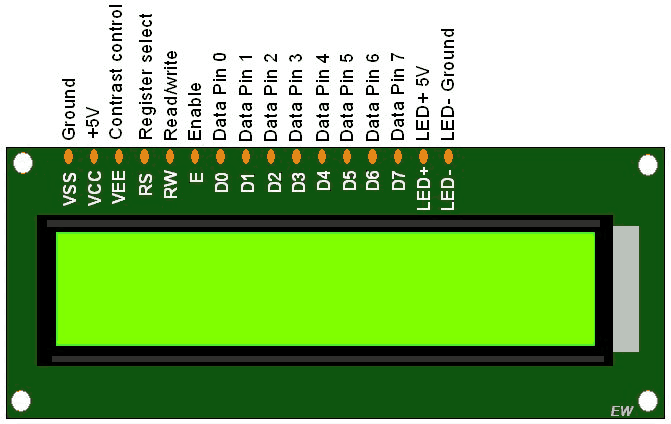
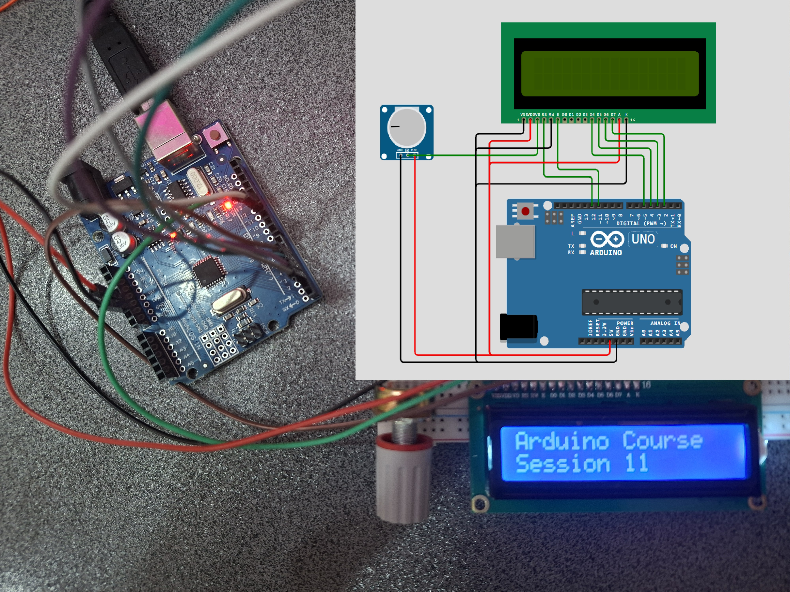
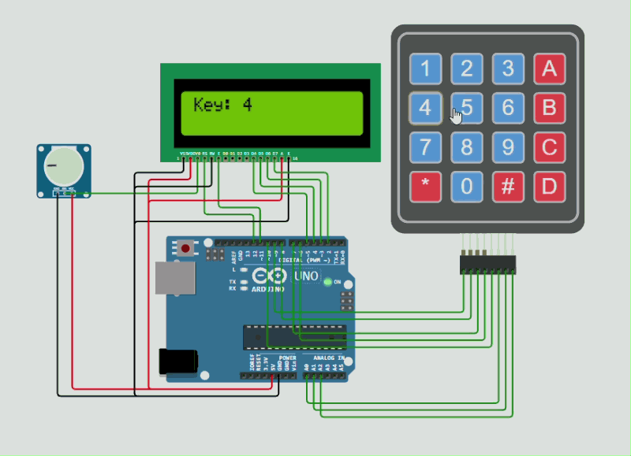

<h1 dir="rtl" align="center">📘 جلسه ۱۱: راه‌اندازی LCD کاراکتری و اتصال Keypad 4×4</h1>

<p dir="rtl" align="right">
در جلسه قبل با <bdi><strong>Keypad ماتریسی</strong></bdi> آشنا شدیم و یاد گرفتیم کلیدهای فشرده‌شده را در <bdi><strong>Serial Monitor</strong></bdi> مشاهده کنیم.
</p>

<p dir="rtl" align="right">
در این جلسه ابتدا <bdi><strong>LCD کاراکتری 16×2</strong></bdi> را به <bdi><strong>Arduino</strong></bdi> متصل و راه‌اندازی می‌کنیم. سپس <bdi><strong>Keypad 4×4</strong></bdi> را به پروژه اضافه می‌کنیم تا اطلاعات واردشده توسط کاربر روی LCD نمایش داده شود.
</p>

<p dir="rtl" align="right">
در جلسه ۱۲ نیز با <bdi><strong>GLCD</strong></bdi> و نمایشگرهای گرافیکی آشنا خواهیم شد.
</p>

<hr>

<h2 dir="rtl" align="right">🎯 اهداف جلسه</h2>

<p dir="rtl" align="right">
در پایان این جلسه می‌توانیم:
</p>

<ul dir="rtl" align="right">
  <li><bdi><strong>LCD کاراکتری 16×2</strong></bdi> را راه‌اندازی کنیم.</li>
  <li>متن و عدد را روی <bdi><strong>LCD</strong></bdi> نمایش دهیم.</li>
  <li>مکان‌نمای <bdi><strong>LCD</strong></bdi> را کنترل کنیم.</li>
  <li>صفحه <bdi><strong>LCD</strong></bdi> را پاک کنیم.</li>
  <li><bdi><strong>Keypad 4×4</strong></bdi> را به پروژه اضافه کنیم.</li>
  <li>کلیدهای <bdi><strong>Keypad</strong></bdi> را روی <bdi><strong>LCD</strong></bdi> نمایش دهیم.</li>
  <li>چند رقم را از کاربر دریافت کنیم.</li>
  <li>با کلیدهای <bdi><strong>*</strong></bdi> و <bdi><strong>#</strong></bdi> ورودی را پاک و تأیید کنیم.</li>
</ul>

<hr>

<h2 dir="rtl" align="right">📺 بخش اول: LCD کاراکتری چیست؟</h2>

<p dir="rtl" align="right">
LCD مخفف عبارت زیر است:
</p>

<p dir="center" align="center">
<bdi><strong>Liquid Crystal Display</strong></bdi>
</p>

<p dir="rtl" align="right">
LCDهای کاراکتری برای نمایش متن، عدد و کاراکترهای مختلف استفاده می‌شوند.
</p>

<p dir="rtl" align="right">
یکی از پرکاربردترین مدل‌ها:
</p>

<p dir="center" align="center">
<bdi><strong>LCD 16×2</strong></bdi>
</p>

<p dir="rtl" align="right">
است.
</p>

<p dir="rtl" align="right">
عدد <bdi><strong>16×2</strong></bdi> یعنی LCD دارای:
</p>

<ul dir="rtl" align="right">
  <li>16 ستون</li>
  <li>2 سطر</li>
</ul>

<p dir="rtl" align="right">
بنابراین می‌توانیم در هر لحظه 16 کاراکتر در هر سطر نمایش دهیم.
</p>

<p dir="rtl" align="right">
مثلاً:
</p>

```text
Arduino Course
Session 11
````

<hr>

<h2 dir="rtl" align="right">🔌 بخش دوم: پایه‌های LCD 16×2</h2>

<p dir="rtl" align="right">
LCD کاراکتری استاندارد دارای پایه‌های مختلفی است:
</p>

<div dir="rtl" align="left">

| پایه | نام | کاربرد               |
| ---: | --- | -------------------- |
|    1 | VSS | GND                  |
|    2 | VDD | +5V                  |
|    3 | VO  | تنظیم کنتراست        |
|    4 | RS  | انتخاب دستور یا داده |
|    5 | RW  | خواندن/نوشتن         |
|    6 | E   | فعال‌سازی            |
|   11 | D4  | خط داده              |
|   12 | D5  | خط داده              |
|   13 | D6  | خط داده              |
|   14 | D7  | خط داده              |
|   15 | A   | نور پس‌زمینه         |
|   16 | K   | GND نور پس‌زمینه     |

</div>

<p dir="rtl" align="right">
در این جلسه از <bdi><strong>حالت 4 بیتی</strong></bdi> استفاده می‌کنیم.
</p>

<p dir="rtl" align="right">
بنابراین برای انتقال داده از چهار پایه استفاده می‌شود:
</p>

```text
D4
D5
D6
D7
```
<p align="center">
  
</p>
<hr>

<h2 dir="rtl" align="right">🔗 بخش سوم: اتصال LCD به Arduino</h2>

<p dir="rtl" align="right">
در این پروژه LCD را به شکل زیر به <bdi><strong>Arduino UNO</strong></bdi> متصل می‌کنیم:
</p>

<div dir="rtl" align="left">

| LCD | Arduino UNO         |
| --- | ------------------- |
| VSS | GND                 |
| VDD | 5V                  |
| VO  | پایه وسط پتانسیومتر |
| RS  | D12                 |
| RW  | GND                 |
| E   | D11                 |
| D4  | D5                  |
| D5  | D4                  |
| D6  | D3                  |
| D7  | D2                  |
| A   | 5V*                 |
| K   | GND                 |

</div>

<p dir="rtl" align="right">
💡 <b>نکته:</b> اگر LCD شما برای نور پس‌زمینه مقاومت محدودکننده داخلی ندارد، باید مقاومت مناسب برای LED نور پس‌زمینه در نظر گرفته شود.
</p>

<hr>

<h2 dir="rtl" align="right">🎚️ پتانسیومتر و تنظیم کنتراست</h2>

<p dir="rtl" align="right">
پایه <bdi><strong>VO</strong></bdi> برای تنظیم کنتراست LCD استفاده می‌شود.
</p>

<p dir="rtl" align="right">
می‌توانیم از یک پتانسیومتر <bdi><strong>10KΩ</strong></bdi> استفاده کنیم:
</p>

```text
        +5V
         |
      ┌─────┐
      │ POT │
      └─────┘
         |
         +------ VO LCD
         |
        GND
```

<p dir="rtl" align="right">
با چرخاندن پتانسیومتر می‌توانیم میزان وضوح نوشته‌های LCD را تنظیم کنیم.
</p>

<hr>

<h2 dir="rtl" align="right">📚 بخش چهارم: کتابخانه LiquidCrystal</h2>

<p dir="rtl" align="right">
برای کنترل LCD از کتابخانه زیر استفاده می‌کنیم:
</p>

```cpp
#include <LiquidCrystal.h>
```

<p dir="rtl" align="right">
سپس پایه‌های LCD را تعریف می‌کنیم:
</p>

```cpp
LiquidCrystal lcd(12, 11, 5, 4, 3, 2);
```

<p dir="rtl" align="right">
ترتیب پایه‌ها در این دستور به شکل زیر است:
</p>

```text
RS → D12
E  → D11
D4 → D5
D5 → D4
D6 → D3
D7 → D2
```

<hr>

<h2 dir="rtl" align="right">💻 بخش پنجم: اولین برنامه LCD</h2>

<p dir="rtl" align="right">
در مرحله اول هنوز <bdi><strong>Keypad</strong></bdi> را وارد برنامه نمی‌کنیم.
</p>

<p dir="rtl" align="right">
ابتدا باید مطمئن شویم LCD به‌درستی کار می‌کند.
</p>

```cpp
#include <LiquidCrystal.h>

LiquidCrystal lcd(12, 11, 5, 4, 3, 2);

void setup() {

  lcd.begin(16, 2);

  lcd.setCursor(0, 0);

  lcd.print("Arduino Course");

  lcd.setCursor(0, 1);

  lcd.print("Session 11");

}

void loop() {

}
```

<p dir="rtl" align="right">
خروجی:
</p>

<p align="center">
  
</p>


<hr>

<h2 dir="rtl" align="right">🔎 بررسی برنامه</h2>

<h3 dir="rtl" align="right">1️⃣ اضافه کردن کتابخانه</h3>

```cpp
#include <LiquidCrystal.h>
```

<p dir="rtl" align="right">
کتابخانه موردنیاز LCD را به برنامه اضافه می‌کند.
</p>

<h3 dir="rtl" align="right">2️⃣ تعریف LCD</h3>

```cpp
LiquidCrystal lcd(12, 11, 5, 4, 3, 2);
```

<p dir="rtl" align="right">
در این قسمت مشخص می‌کنیم LCD به کدام پایه‌های Arduino متصل شده است.
</p>

<h3 dir="rtl" align="right">3️⃣ تعیین اندازه LCD</h3>

```cpp
lcd.begin(16, 2);
```

<p dir="rtl" align="right">
یعنی LCD ما دارای:
</p>

```text
16 ستون
2 سطر
```

<h3 dir="rtl" align="right">4️⃣ تعیین مکان نمایش متن</h3>

<p dir="rtl" align="right">
برای مشخص کردن محل قرارگیری مکان‌نما از دستور زیر استفاده می‌کنیم:
</p>

```cpp
lcd.setCursor(column, row);
```

<p dir="rtl" align="right">
مثلاً:
</p>

```cpp
lcd.setCursor(0, 0);
```

<p dir="rtl" align="right">
یعنی:
</p>

```text
ستون 0
سطر 0
```

<p dir="rtl" align="right">
و:
</p>

```cpp
lcd.setCursor(0, 1);
```

<p dir="rtl" align="right">
یعنی:
</p>

```text
ستون 0
سطر 1
```

<p dir="rtl" align="right">
⚠️ توجه کنید که شمارش سطر و ستون از <bdi><strong>صفر</strong></bdi> شروع می‌شود.
</p>

<hr>

<h2 dir="rtl" align="right">📝 نمایش متن روی LCD</h2>

<p dir="rtl" align="right">
برای نمایش متن از دستور زیر استفاده می‌کنیم:
</p>

```cpp
lcd.print("Hello");
```

<p dir="rtl" align="right">
مثلاً:
</p>

```cpp
lcd.setCursor(0, 0);
lcd.print("Hello");
```

<hr>

<h2 dir="rtl" align="right">🧹 پاک کردن LCD</h2>

<p dir="rtl" align="right">
برای پاک کردن محتوای LCD از دستور زیر استفاده می‌کنیم:
</p>

```cpp
lcd.clear();
```

<p dir="rtl" align="right">
مثلاً:
</p>

```cpp
lcd.clear();

lcd.setCursor(0, 0);

lcd.print("Hello");
```

<p dir="rtl" align="right">
ابتدا LCD پاک می‌شود و سپس متن جدید نمایش داده می‌شود.
</p>

<p dir="rtl" align="right">
💡 <b>نکته:</b> بهتر است <code>()lcd.clear</code> را بدون دلیل در هر بار اجرای <code>()loop</code> استفاده نکنیم؛ زیرا می‌تواند باعث چشمک‌زدن متن روی LCD شود.
</p>

<hr>

<h2 dir="rtl" align="right">⌨️ بخش ششم: اضافه کردن Keypad 4×4</h2>

<p dir="rtl" align="right">
حالا که LCD را به‌تنهایی راه‌اندازی کردیم، <bdi><strong>Keypad 4×4</strong></bdi> را به پروژه اضافه می‌کنیم.
</p>

<p dir="rtl" align="right">
Keypad 4×4 دارای:
</p>

```text
4 Row
4 Column
```

<p dir="rtl" align="right">
است.
</p>

<p dir="rtl" align="right">
بنابراین در مجموع 8 خط برای ماتریس دارد.
</p>

<p dir="rtl" align="right">
چیدمان معمول Keypad:
</p>

```text
┌───┬───┬───┬───┐
│ 1 │ 2 │ 3 │ A │
├───┼───┼───┼───┤
│ 4 │ 5 │ 6 │ B │
├───┼───┼───┼───┤
│ 7 │ 8 │ 9 │ C │
├───┼───┼───┼───┤
│ * │ 0 │ # │ D │
└───┴───┴───┴───┘
```

<hr>

<h2 dir="rtl" align="right">🔌 اتصال Keypad 4×4</h2>

<p dir="rtl" align="right">
در این پروژه برای جلوگیری از تداخل با پایه‌های LCD از اتصال زیر استفاده می‌کنیم:
</p>

<div dir="rtl" align="left">

| Keypad | Arduino UNO |
| ------ | ----------- |
| R1     | D9          |
| R2     | D8          |
| R3     | D7          |
| R4     | D6          |
| C1     | D10         |
| C2     | A0          |
| C3     | A1          |
| C4     | A2          |

</div>

<p dir="rtl" align="right">
⚠️ <b>نکته مهم:</b> ترتیب فیزیکی پایه‌های Keypad در مدل‌های مختلف ممکن است متفاوت باشد. اگر Keypad شما پایه‌های 10تایی دارد، قبل از اتصال باید مشخص کنیم کدام پایه‌ها مربوط به ماتریس هستند و دو پایه اضافی چه کاربردی دارند.
</p>

<hr>

<h2 dir="rtl" align="right">📚 بخش هفتم: کتابخانه Keypad</h2>

<p dir="rtl" align="right">
برای کنترل Keypad از کتابخانه زیر استفاده می‌کنیم:
</p>

```cpp
#include <Keypad.h>
```

<p dir="rtl" align="right">
تعداد سطر و ستون را مشخص می‌کنیم:
</p>

```cpp
const byte ROWS = 4;
const byte COLS = 4;
```

<p dir="rtl" align="right">
سپس چیدمان کلیدها را تعریف می‌کنیم:
</p>

```cpp
char keys[ROWS][COLS] = {

  {'1', '2', '3', 'A'},

  {'4', '5', '6', 'B'},

  {'7', '8', '9', 'C'},

  {'*', '0', '#', 'D'}

};
```

<hr>

<h2 dir="rtl" align="right">📍 تعریف پایه‌های Keypad</h2>

```cpp
byte rowPins[ROWS] = {9, 8, 7, 6};

byte colPins[COLS] = {10, A0, A1, A2};
```

<p dir="rtl" align="right">
سپس Keypad را ایجاد می‌کنیم:
</p>

```cpp
Keypad keypad = Keypad(

  makeKeymap(keys),

  rowPins,

  colPins,

  ROWS,

  COLS

);
```


<h2 dir="rtl" align="right">🔄 بخش هشتم: ترکیب LCD و Keypad</h2>

<p dir="rtl" align="right">
حالا LCD و Keypad را در یک برنامه قرار می‌دهیم.
</p>

<p dir="rtl" align="right">
در این برنامه هر کلیدی که فشار دهیم روی LCD نمایش داده می‌شود.
</p>

```cpp
#include <LiquidCrystal.h>
#include <Keypad.h>

// ---------- LCD ----------

LiquidCrystal lcd(12, 11, 5, 4, 3, 2);

// ---------- Keypad ----------

const byte ROWS = 4;
const byte COLS = 4;

char keys[ROWS][COLS] = {

  {'1', '2', '3', 'A'},

  {'4', '5', '6', 'B'},

  {'7', '8', '9', 'C'},

  {'*', '0', '#', 'D'}

};

byte rowPins[ROWS] = {9, 8, 7, 6};

byte colPins[COLS] = {10, A0, A1, A2};

Keypad keypad = Keypad(

  makeKeymap(keys),

  rowPins,

  colPins,

  ROWS,

  COLS

);

void setup() {

  lcd.begin(16, 2);

  lcd.setCursor(0, 0);

  lcd.print("Press a Key");

}

void loop() {

  char key = keypad.getKey();

  if (key) {

    lcd.clear();

    lcd.setCursor(0, 0);

    lcd.print("Key:");

    lcd.setCursor(5, 0);

    lcd.print(key);

  }

}
```
<p align="center">
  
</p>
<hr>

<h2 dir="rtl" align="right">🔎 بررسی عملکرد برنامه</h2>

<p dir="rtl" align="right">
در هر بار اجرای <code>()loop</code> دستور زیر اجرا می‌شود:
</p>

```cpp
char key = keypad.getKey();
```

<p dir="rtl" align="right">
اگر هیچ کلیدی فشرده نشده باشد، مقدار معتبری برای کلید دریافت نمی‌شود.
</p>

<p dir="rtl" align="right">
اما اگر مثلاً کلید <code>5</code> را فشار دهیم:
</p>

```text
key = '5'
```

<p dir="rtl" align="right">
و سپس این قسمت اجرا می‌شود:
</p>

```cpp
if (key) {
```

<p dir="rtl" align="right">
در نتیجه LCD نمایش می‌دهد:
</p>

```text
Key: 5
```

<p dir="rtl" align="right">
اگر کلید <code>A</code> را فشار دهیم:
</p>

```text
Key: A
```

<hr>

<h2 dir="rtl" align="right">🔢 بخش نهم: دریافت چند رقم از Keypad</h2>

<p dir="rtl" align="right">
حالا می‌خواهیم برنامه را کمی کاربردی‌تر کنیم.
</p>

<p dir="rtl" align="right">
فرض کنید کاربر کلیدهای زیر را فشار دهد:
</p>

```text
1 → 2 → 3 → 4
```

<p dir="rtl" align="right">
LCD باید در نهایت نمایش دهد:
</p>

```text
Enter Number:
1234
```

<p dir="rtl" align="right">
برای این کار باید کلیدهای واردشده را ذخیره کنیم.
</p>

<hr>

<h2 dir="rtl" align="right">💻 برنامه دریافت عدد</h2>

```cpp
#include <LiquidCrystal.h>
#include <Keypad.h>

// ---------- LCD ----------

LiquidCrystal lcd(12, 11, 5, 4, 3, 2);

// ---------- Keypad ----------

const byte ROWS = 4;
const byte COLS = 4;

char keys[ROWS][COLS] = {

  {'1', '2', '3', 'A'},

  {'4', '5', '6', 'B'},

  {'7', '8', '9', 'C'},

  {'*', '0', '#', 'D'}

};

byte rowPins[ROWS] = {9, 8, 7, 6};

byte colPins[COLS] = {10, A0, A1, A2};

Keypad keypad = Keypad(

  makeKeymap(keys),

  rowPins,

  colPins,

  ROWS,

  COLS

);

// ---------- Input ----------

String input = "";

void setup() {

  lcd.begin(16, 2);

  lcd.setCursor(0, 0);

  lcd.print("Enter Number:");

  lcd.setCursor(0, 1);

}

void loop() {

  char key = keypad.getKey();

  if (key) {

    // ورود اعداد

    if (key >= '0' && key <= '9') {

      if (input.length() < 16) {

        input += key;

        lcd.setCursor(0, 1);

        lcd.print(input);

      }

    }

    // پاک کردن ورودی

    else if (key == '*') {

      input = "";

      lcd.clear();

      lcd.setCursor(0, 0);

      lcd.print("Enter Number:");

      lcd.setCursor(0, 1);

    }

    // تایید ورودی

    else if (key == '#') {

      lcd.clear();

      lcd.setCursor(0, 0);

      lcd.print("Entered:");

      lcd.setCursor(0, 1);

      lcd.print(input);

    }

  }

}
```

<hr>

<h2 dir="rtl" align="right">⌨️ عملکرد کلیدها</h2>

<p dir="rtl" align="right">
در این برنامه کلیدهای <bdi><strong>0</strong></bdi> تا <bdi><strong>9</strong></bdi> برای ورود عدد استفاده می‌شوند.
</p>

<p dir="rtl" align="right">
مثلاً:
</p>

```text
2 → 5 → 8 → 0
```

<p dir="rtl" align="right">
باعث می‌شود LCD نمایش دهد:
</p>

```text
Enter Number:
2580
```

<hr>

<h2 dir="rtl" align="right">⭐ کلید *</h2>

<p dir="rtl" align="right">
برای پاک کردن اطلاعات استفاده می‌شود.
</p>

```cpp
input = "";
```

<p dir="rtl" align="right">
بعد LCD دوباره به حالت اولیه برمی‌گردد:
</p>

```text
Enter Number:
```

<hr>

<h2 dir="rtl" align="right">✅ کلید #</h2>

<p dir="rtl" align="right">
برای تأیید اطلاعات استفاده می‌شود.
</p>

<p dir="rtl" align="right">
مثلاً اگر کاربر وارد کند:
</p>

```text
2580
```

<p dir="rtl" align="right">
و سپس <code>#</code> را فشار دهد:
</p>

```text
Entered:
2580
```

<p dir="rtl" align="right">
نمایش داده می‌شود.
</p>

<hr>

<h2 dir="rtl" align="right">🧵 آشنایی با String</h2>

<p dir="rtl" align="right">
در این پروژه از متغیر زیر استفاده کردیم:
</p>

```cpp
String input = "";
```

<p dir="rtl" align="right">
هدف این است که چند کاراکتر را پشت سر هم ذخیره کنیم.
</p>

<p dir="rtl" align="right">
مثلاً اگر کاربر این کلیدها را فشار دهد:
</p>

```text
1
2
3
4
```

<p dir="rtl" align="right">
متغیر <code>input</code> در نهایت شامل:
</p>

```text
1234
```

<p dir="rtl" align="right">
خواهد بود.
</p>

<p dir="rtl" align="right">
برای اضافه کردن کلید جدید از دستور زیر استفاده کردیم:
</p>

```cpp
input += key;
```

<hr>

<h2 dir="rtl" align="right">📝 یک تمرین عملی</h2>

<p dir="rtl" align="right">
برنامه را تغییر دهید تا کاربر حداکثر <bdi><strong>6 رقم</strong></bdi> بتواند وارد کند.
</p>

<p dir="rtl" align="right">
یعنی:
</p>

```text
123456
```

<p dir="rtl" align="right">
مجاز باشد، اما:
</p>

```text
1234567
```

<p dir="rtl" align="right">
پذیرفته نشود.
</p>

<hr>

<h2 dir="rtl" align="right">📝 تمرین دوم</h2>

<p dir="rtl" align="right">
برنامه‌ای طراحی کنید که ابتدا روی LCD نمایش دهد:
</p>

```text
Enter Password:
```

<p dir="rtl" align="right">
کاربر رمز را با Keypad وارد کند.
</p>

<p dir="rtl" align="right">
اما به‌جای نمایش رمز واقعی، برای هر رقم یک <bdi><strong>*</strong></bdi> نمایش داده شود:
</p>

```text
Enter Password:
****
```

<hr>

<h2 dir="rtl" align="right">📝 تمرین سوم</h2>

<p dir="rtl" align="right">
کلیدهای <bdi><strong>A</strong></bdi> و <bdi><strong>B</strong></bdi> را به برنامه اضافه کنید.
</p>

<p dir="rtl" align="right">
برای مثال:
</p>

```text
A → Add

B → Back
```

<p dir="rtl" align="right">
و عملکرد مناسبی برای آن‌ها تعریف کنید.
</p>

<hr>

<h2 dir="rtl" align="right">📌 جمع‌بندی جلسه</h2>

<p dir="rtl" align="right">
در این جلسه ابتدا <bdi><strong>LCD کاراکتری 16×2</strong></bdi> را به <bdi><strong>Arduino</strong></bdi> متصل کردیم و با دستورات اصلی آن آشنا شدیم:
</p>

```cpp
lcd.begin();

lcd.setCursor();

lcd.print();

lcd.clear();
```

<p dir="rtl" align="right">
سپس <bdi><strong>Keypad 4×4</strong></bdi> را به پروژه اضافه کردیم و با:
</p>

```cpp
keypad.getKey();
```

<p dir="rtl" align="right">
کلیدهای فشرده‌شده را دریافت کردیم.
</p>

<p dir="rtl" align="right">
در نهایت این دو ورودی و خروجی را با یکدیگر ترکیب کردیم:
</p>

```text
           Keypad 4×4
               │
               │
               ▼
            Arduino
               │
               │
               ▼
            LCD 16×2
```

<p dir="rtl" align="right">
بنابراین اکنون کاربر می‌تواند اطلاعات را با <bdi><strong>Keypad</strong></bdi> وارد کند و <bdi><strong>Arduino</strong></bdi> آن اطلاعات را روی <bdi><strong>LCD</strong></bdi> نمایش دهد.
</p>

<hr>

<h2 dir="rtl" align="right">⏭️ پیش‌نمایش جلسه ۱۲</h2>

<p dir="rtl" align="right">
در جلسه ۱۲ سراغ <bdi><strong>GLCD</strong></bdi> می‌رویم.
</p>

<p dir="rtl" align="right">
در <bdi><strong>LCD کاراکتری</strong></bdi> بیشتر با <bdi><strong>متن و کاراکتر</strong></bdi> سروکار داشتیم، اما در <bdi><strong>GLCD</strong></bdi> می‌توانیم با <bdi><strong>پیکسل‌ها</strong></bdi> کار کنیم.
</p>

<p dir="rtl" align="right">
در جلسه بعد با مفاهیمی مانند:
</p>

<ul dir="rtl" align="right">
  <li><bdi><strong>GLCD</strong></bdi> چیست؟</li>
  <li>تفاوت <bdi><strong>LCD کاراکتری</strong></bdi> و <bdi><strong>GLCD</strong></bdi></li>
  <li><bdi><strong>Pixel</strong></bdi></li>
  <li>مختصات <bdi><strong>X</strong></bdi> و <bdi><strong>Y</strong></bdi></li>
  <li>نمایش متن روی <bdi><strong>GLCD</strong></bdi></li>
  <li>رسم خط</li>
  <li>رسم شکل</li>
  <li>راه‌اندازی <bdi><strong>GLCD</strong></bdi> با <bdi><strong>Arduino</strong></bdi></li>
</ul>

<p dir="rtl" align="right">
آشنا خواهیم شد.
</p>


<hr>

<p dir="rtl" align="right">
⬅️ <a href="../12-GLCD/">جلسه 12 — آشنایی با <bdi><strong>GLCD</strong></bdi> و نمایش گرافیکی</a>
</p>


<p align="center">
<strong>Arduino From Zero to Projects</strong>
</p>

<p align="center">
<strong>Mohammad Esteghamat</strong>
</p>

