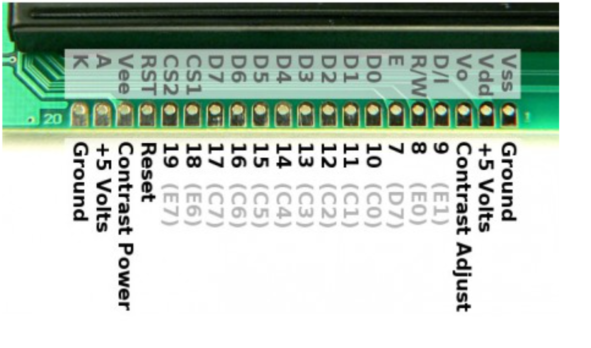
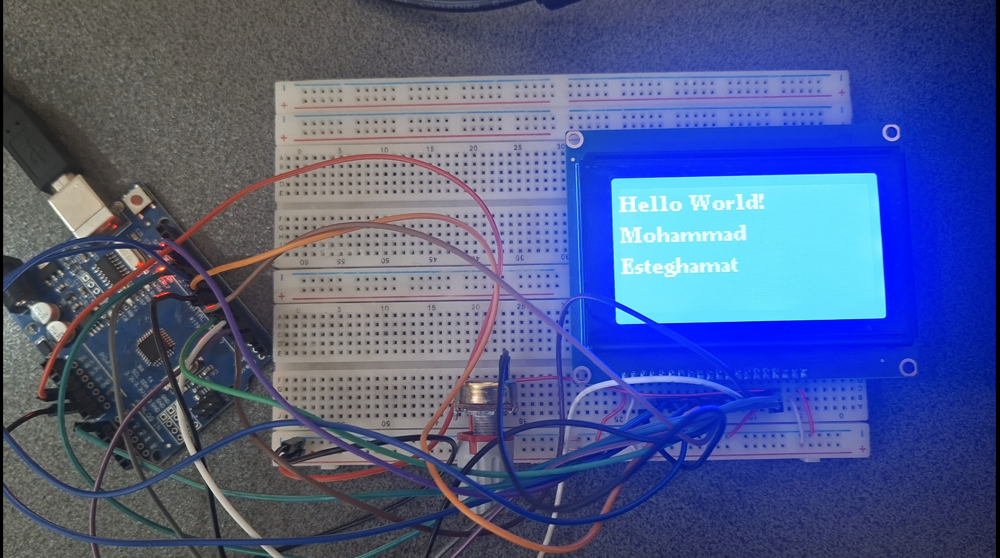
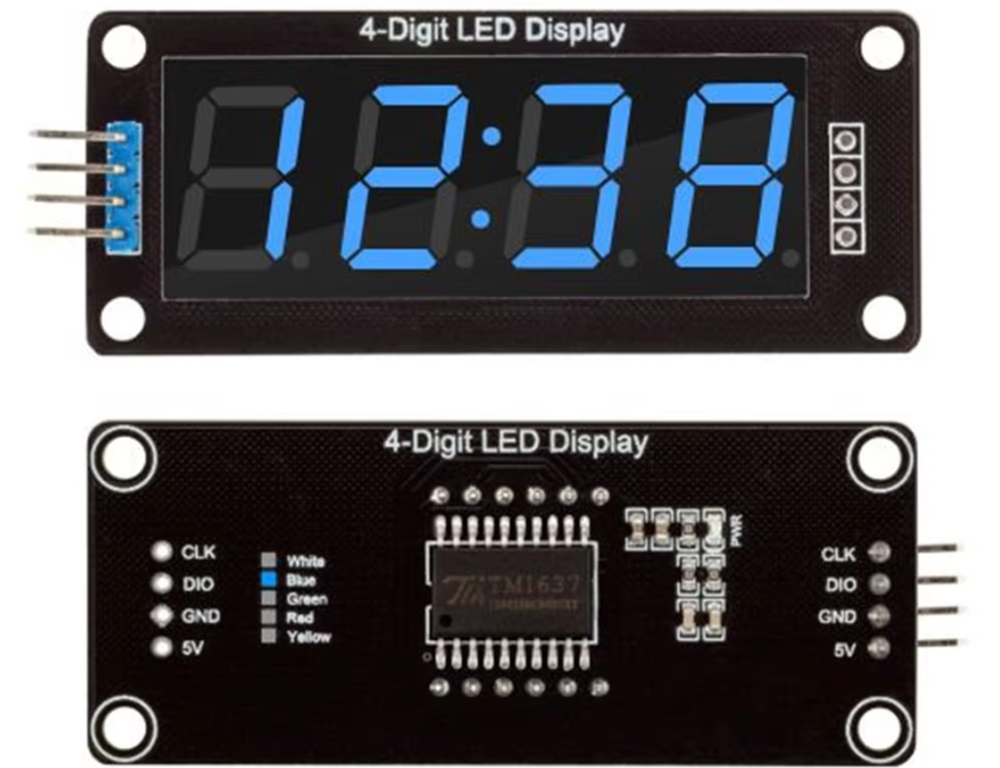

<h1 dir="rtl" align="center">📘 جلسه 12: آشنایی با GLCD 128×64 و نمایش گرافیکی</h1>

<p dir="rtl" align="right">
در جلسه قبل با <bdi><strong>LCD کاراکتری 16×2</strong></bdi> و <bdi><strong>Keypad 4×4</strong></bdi> آشنا شدیم و یاد گرفتیم اطلاعات واردشده توسط کاربر را روی LCD نمایش دهیم.
</p>

<p dir="rtl" align="right">
در این جلسه یک مرحله جلوتر می‌رویم و با <bdi><strong>GLCD</strong></bdi> یا نمایشگر گرافیکی آشنا می‌شویم. در این نمایشگر دیگر فقط با متن و کاراکترهای از پیش‌تعریف‌شده سروکار نداریم؛ بلکه می‌توانیم با <bdi><strong>Pixel</strong></bdi>ها کار کنیم و روی صفحه خط، مستطیل، دایره و شکل‌های مختلف رسم کنیم.
</p>

<p dir="rtl" align="right">
در این جلسه از نمایشگر <bdi><strong>GLCD 128×64</strong></bdi> با کنترلر <bdi><strong>KS0108</strong></bdi> و کتابخانه <bdi><strong>U8g2</strong></bdi> استفاده می‌کنیم.
</p>

<hr>

<h2 dir="rtl" align="right">🎯 اهداف جلسه</h2>

<p dir="rtl" align="right">
در پایان این جلسه می‌توانیم:
</p>

<ul dir="rtl" align="right">
  <li><bdi><strong>GLCD</strong></bdi> را بشناسیم.</li>
  <li>تفاوت <bdi><strong>LCD کاراکتری</strong></bdi> و <bdi><strong>GLCD</strong></bdi> را توضیح دهیم.</li>
  <li>مفهوم <bdi><strong>Pixel</strong></bdi> را درک کنیم.</li>
  <li>مختصات <bdi><strong>X</strong></bdi> و <bdi><strong>Y</strong></bdi> را در نمایشگر استفاده کنیم.</li>
  <li>GLCD 128×64 با کنترلر <bdi><strong>KS0108</strong></bdi> را به Arduino UNO متصل کنیم.</li>
  <li>کتابخانه <bdi><strong>U8g2</strong></bdi> را نصب و استفاده کنیم.</li>
  <li>متن را روی GLCD نمایش دهیم.</li>
  <li>پیکسل، خط، مستطیل و دایره رسم کنیم.</li>
  <li>چند شکل را هم‌زمان روی صفحه نمایش دهیم.</li>
  <li>یک پروژه گرافیکی ساده با Arduino بسازیم.</li>
</ul>

<hr>

<h2 dir="rtl" align="right">🖥️ بخش اول: GLCD چیست؟</h2>

<p dir="rtl" align="right">
GLCD مخفف عبارت زیر است:
</p>

<p dir="center" align="center">
<bdi><strong>Graphic Liquid Crystal Display</strong></bdi>
</p>

<p dir="rtl" align="right">
GLCD یک نمایشگر گرافیکی است که صفحه آن از تعداد زیادی <bdi><strong>Pixel</strong></bdi> تشکیل شده است. در این نوع نمایشگر می‌توانیم علاوه بر متن، شکل‌ها و عناصر گرافیکی مختلف را نیز نمایش دهیم.
</p>

<p dir="rtl" align="right">
نمایشگر مورد استفاده در این جلسه دارای وضوح زیر است:
</p>

<p dir="center" align="center">
<bdi><strong>128 × 64 Pixel</strong></bdi>
</p>

<p dir="rtl" align="right">
یعنی صفحه دارای:
</p>

<ul dir="rtl" align="right">
  <li>128 ستون پیکسلی در راستای X</li>
  <li>64 ردیف پیکسلی در راستای Y</li>
</ul>

<hr>

<h2 dir="rtl" align="right">🔍 بخش دوم: تفاوت LCD کاراکتری و GLCD</h2>

<p dir="rtl" align="right">
در LCD کاراکتری مانند <bdi><strong>16×2</strong></bdi>، صفحه بر اساس خانه‌های کاراکتری مدیریت می‌شود. اما در GLCD، کنترل صفحه بر اساس پیکسل‌ها انجام می‌شود.
</p>

<div dir="rtl" align="left">

| ویژگی | LCD کاراکتری 16×2 | GLCD 128×64 |
|:--- | ---: | ---: |
| واحد نمایش | کاراکتر | پیکسل |
| وضوح | 16×2 کاراکتر | 128×64 پیکسل |
| رسم خط | محدود | امکان‌پذیر |
| رسم شکل | محدود | امکان‌پذیر |
| رسم دایره | به‌صورت مستقیم ندارد | دارد |
| کاربرد | متن و اطلاعات ساده | متن، منو، نمودار و گرافیک |

</div>

<p dir="rtl" align="right">
بنابراین مهم‌ترین تغییر در این جلسه این است که از <bdi><strong>کاراکتر</strong></bdi> به <bdi><strong>پیکسل</strong></bdi> منتقل می‌شویم.
</p>

<hr>

<h2 dir="rtl" align="right">⬛ بخش سوم: Pixel چیست؟</h2>

<p dir="rtl" align="right">
کوچک‌ترین واحد قابل کنترل در یک نمایشگر گرافیکی را <bdi><strong>Pixel</strong></bdi> می‌نامیم.
</p>

<p dir="rtl" align="right">
در یک GLCD با وضوح 128×64، تعداد کل پیکسل‌ها برابر است با:
</p>

<p dir="center" align="center">
<bdi><strong>128 × 64 = 8192 Pixel</strong></bdi>
</p>

<p dir="rtl" align="right">
هر پیکسل می‌تواند روشن یا خاموش باشد و با کنترل مناسب این پیکسل‌ها می‌توان شکل‌های مختلف را روی صفحه ایجاد کرد.
</p>

<hr>

<h2 dir="rtl" align="right">📍 بخش چهارم: مختصات X و Y</h2>

<p dir="rtl" align="right">
برای کار با گرافیک باید بدانیم هر نقطه از صفحه در چه مختصاتی قرار دارد.
</p>

<p dir="rtl" align="right">
در این GLCD محدوده مختصات به‌صورت زیر در نظر گرفته می‌شود:
</p>

```text
X : 0 تا 127
Y : 0 تا 63
```

<p dir="rtl" align="right">
نقطه شروع معمولاً گوشه بالا-چپ نمایشگر است:
</p>

```text
(0,0)
  ┌──────────────────────────────────────────────┐
  │                                              │
  │                                              │
  │                 GLCD 128×64                  │
  │                                              │
  │                                              │
  └──────────────────────────────────────────────┘
                                                  (127,63)
```

<p dir="rtl" align="right">
بنابراین:
</p>

<ul dir="rtl" align="right">
  <li><bdi><strong>X</strong></bdi> از چپ به راست افزایش پیدا می‌کند.</li>
  <li><bdi><strong>Y</strong></bdi> از بالا به پایین افزایش پیدا می‌کند.</li>
</ul>

<hr>

<h2 dir="rtl" align="right">📺 بخش پنجم: معرفی GLCD مورد استفاده</h2>

<p dir="rtl" align="right">
نمایشگر مورد استفاده در این جلسه مدل <bdi><strong>LCM12864C-1</strong></bdi> است و از کنترلر <bdi><strong>KS0108</strong></bdi> یا سازگار با آن استفاده می‌کند.
</p>

<p dir="rtl" align="right">
مشخصات اصلی این نمایشگر عبارت‌اند از:
</p>

<div dir="rtl" align="left">

| ویژگی | مقدار |
| :--- | ---: |
| نوع | GLCD گرافیکی |
| وضوح | 128×64 پیکسل |
| کنترلر | KS0108 یا سازگار |
| ولتاژ کاری | 5V DC |
| رابط | موازی 8 بیتی |
| تعداد پایه | 20 پایه |
| نوع Backlight | LED آبی |
| جریان Backlight | حدود 150mA |
| مدل | LCM12864C-1 |

</div>

<p dir="rtl" align="right">
دو پایه <bdi><strong>CS1</strong></bdi> و <bdi><strong>CS2</strong></bdi> برای انتخاب دو بخش کنترلر نمایشگر استفاده می‌شوند.
</p>

<p align="center">
  
</p>

<hr>

<h2 dir="rtl" align="right">🔌 بخش ششم: پایه‌های GLCD</h2>

<p dir="rtl" align="right">
نمایشگر 20 پایه دارد. در این پروژه از ارتباط موازی 8 بیتی استفاده می‌کنیم.
</p>

<div dir="rtl" align="left">

| پایه | نام | کاربرد | اتصال به Arduino UNO |
| ---: | --- | --- | --- |
| 1 | VSS / GND | زمین | GND |
| 2 | VDD | تغذیه منطقی | 5V |
| 3 | VO | تنظیم کنتراست | وسط پتانسیومتر  |
| 4 | D/I یا RS | انتخاب دستور یا داده | D11 |
| 5 | R/W | خواندن / نوشتن | GND |
| 6 | E | Enable | D10 |
| 7 | D0 | خط داده | D2 |
| 8 | D1 | خط داده | D3 |
| 9 | D2 | خط داده | D4 |
| 10 | D3 | خط داده | D5 |
| 11 | D4 | خط داده | D6 |
| 12 | D5 | خط داده | D7 |
| 13 | D6 | خط داده | D8 |
| 14 | D7 | خط داده | D9 |
| 15 | CS1 | انتخاب بخش اول | D12 |
| 16 | CS2 | انتخاب بخش دوم | D13 |
| 17 | RST | ریست | A0 |
| 18 | VEE | ولتاژ کنتراست | سر پتانسیومتر |
| 19 | LED+ | Backlight مثبت | 5V |
| 20 | LED− | Backlight منفی | GND |

</div>

<p dir="rtl" align="right">
⚠️ <b>توجه:</b> نام پایه 4 در برخی ماژول‌ها ممکن است به صورت <bdi><strong>RS</strong></bdi>، <bdi><strong>DI</strong></bdi> یا نام‌های مشابه چاپ شده باشد. در کتابخانه U8g2 این پایه با مفهوم <bdi><strong>DC</strong></bdi> یا انتخاب داده/دستور در نظر گرفته می‌شود.
</p>

<hr>

<h2 dir="rtl" align="right">🎚️ بخش هفتم: تنظیم کنتراست با پتانسیومتر</h2>

<p dir="rtl" align="right">
پایه‌های <bdi><strong>VO</strong></bdi> و <bdi><strong>VEE</strong></bdi> در این نوع GLCD برای تنظیم ولتاژ کنتراست به کار می‌روند.
</p>

<p dir="rtl" align="right">
یک پتانسیومتر 10KΩ یا 20KΩ برای تنظیم کنتراست در نظر می‌گیریم.
</p>

```text
                 +5V
                  │
             ┌─────────┐
             │   POT   │
             │   10K   │
             └─────────┘
                  │
                  ├──────── VO  (Pin 3)
                  │
                  └──────── VEE (Pin 18)
                  
```

<p dir="rtl" align="right">
در عمل، بسته به ساختار دقیق ماژول، تنظیم کنتراست ممکن است نیاز به چرخاندن پتانسیومتر و مشاهده تصویر روی صفحه داشته باشد.
</p>

<p dir="rtl" align="right">
💡 <b>نکته:</b> اگر Backlight روشن است اما هیچ متن یا گرافیکی دیده نمی‌شود، یکی از اولین مواردی که باید بررسی شود مقدار کنتراست و اتصال پایه‌های کنترل است.
</p>

<hr>

<h2 dir="rtl" align="right">🔗 بخش هشتم: اتصال GLCD به Arduino UNO</h2>

<p dir="rtl" align="right">
برای اینکه سیم‌کشی مرتب باشد، در این جلسه از اتصال زیر استفاده می‌کنیم:
</p>

<div dir="rtl" align="left">

| GLCD | Arduino UNO |
| --- | --- |
| VSS | GND |
| VDD | 5V |
| VO | وسط پتانسیومتر |
| D/I یا RS | D11 |
| R/W | GND |
| E | D10 |
| D0 | D2 |
| D1 | D3 |
| D2 | D4 |
| D3 | D5 |
| D4 | D6 |
| D5 | D7 |
| D6 | D8 |
| D7 | D9 |
| CS1 | D12 |
| CS2 | D13 |
| RST | A0 |
| VEE | سر پتانسیومتر |
| LED+ | 5V |
| LED− | GND |

</div>


<p dir="rtl" align="right">
در این اتصال، پایه‌های <bdi><strong>D0 تا D7</strong></bdi> هشت خط داده هستند و پایه‌های کنترل برای ارسال اطلاعات به کنترلر GLCD استفاده می‌شوند.
</p>

<hr>

<h2 dir="rtl" align="right">🧩 بخش نهم: چرا از U8g2 استفاده می‌کنیم؟</h2>

<p dir="rtl" align="right">
برای کنترل نمایشگرهای گرافیکی می‌توانیم از کتابخانه‌های مختلف استفاده کنیم. در این جلسه از کتابخانه <bdi><strong>U8g2</strong></bdi> استفاده می‌کنیم.
</p>

<p dir="rtl" align="right">
یکی از مزیت‌های U8g2 این است که مجموعه‌ای از درایورها و روش‌های مختلف رسم متن و گرافیک را در اختیار برنامه‌نویس قرار می‌دهد و برای کنترلر <bdi><strong>KS0108</strong></bdi> نیز سازنده آماده دارد.
</p>

<hr>

<h2 dir="rtl" align="right">📚 بخش دهم: نصب کتابخانه U8g2</h2>

<p dir="rtl" align="right">
در Arduino IDE وارد مسیر زیر شوید:
</p>

```text
Tools → Manage Libraries
```

<p dir="rtl" align="right">
سپس عبارت زیر را جستجو کنید:
</p>

```text
U8g2
```

<p dir="rtl" align="right">
و کتابخانه:
</p>

```text
U8g2 by oliver
```

<p dir="rtl" align="right">
را نصب کنید.
</p>

<p dir="rtl" align="right">
بعد از نصب می‌توانیم در برنامه بنویسیم:
</p>

```cpp
#include <U8g2lib.h>
```

<hr>

<h2 dir="rtl" align="right">⚙️ بخش یازدهم: تعریف GLCD در U8g2</h2>

<p dir="rtl" align="right">
برای GLCD با کنترلر KS0108 از سازنده زیر استفاده می‌کنیم:
</p>

```cpp
U8G2_KS0108_128X64_F(...)
```

<p dir="rtl" align="right">
این سازنده پایه‌های داده، Enable، پایه انتخاب دستور/داده و پایه‌های Chip Select را دریافت می‌کند. ساختار رسمی سازنده در مستندات U8g2 به صورت زیر تعریف شده است:
</p>

```text
U8G2_KS0108_128X64_F(
  rotation,
  d0, d1, d2, d3, d4, d5, d6, d7,
  enable,
  dc,
  cs0,
  cs1,
  cs2,
  reset
)
```

<p dir="rtl" align="right">
در نمایشگر 128×64 مورد استفاده ما یک CS اضافی لازم نیست و آن را با <bdi><strong>U8X8_PIN_NONE</strong></bdi> مشخص می‌کنیم.
</p>

<hr>

<h2 dir="rtl" align="right">💻 بخش دوازدهم: اولین برنامه GLCD</h2>

<p dir="rtl" align="right">
قبل از رسم شکل‌های مختلف، ابتدا باید مطمئن شویم ارتباط GLCD با Arduino صحیح است.
</p>

```cpp
#include <U8g2lib.h>

// ---------- GLCD ----------
// KS0108 - 128x64
U8G2_KS0108_128X64_F u8g2(
  U8G2_R0,

  // D0 ... D7
  2, 3, 4, 5, 6, 7, 8, 9,

  // Enable
  10,

  // D/I یا RS
  11,

  // CS1
  12,

  // CS2
  13,

  // CS3 استفاده نمی‌شود
  U8X8_PIN_NONE,

  // Reset
  A0
);

void setup() {

  u8g2.begin();

}

void loop() {

  u8g2.clearBuffer();

  u8g2.setFont(u8g2_font_ncenB08_tr);

  u8g2.drawStr(0, 12, "Hello World!");
  u8g2.drawStr(0, 28, "Mohammad");
  u8g2.drawStr(0, 44, "Esteghamat");

  u8g2.sendBuffer();

  delay(1000);
}
```

<p align="center">
  
</p>

<hr>

<h2 dir="rtl" align="right">🔎 بخش سیزدهم: بررسی برنامه</h2>

<h3 dir="rtl" align="right">1️⃣ اضافه کردن کتابخانه</h3>

```cpp
#include <U8g2lib.h>
```

<p dir="rtl" align="right">
کتابخانه U8g2 را به برنامه اضافه می‌کند.
</p>

<h3 dir="rtl" align="right">2️⃣ ساخت شیء GLCD</h3>

```cpp
U8G2_KS0108_128X64_F u8g2(...);
```

<p dir="rtl" align="right">
در این قسمت نوع نمایشگر و پایه‌های مورد استفاده مشخص می‌شوند.
</p>

<h3 dir="rtl" align="right">3️⃣ راه‌اندازی نمایشگر</h3>

```cpp
u8g2.begin();
```

<p dir="rtl" align="right">
با این دستور نمایشگر مقداردهی اولیه می‌شود.
</p>

<h3 dir="rtl" align="right">4️⃣ پاک کردن بافر</h3>

```cpp
u8g2.clearBuffer();
```

<p dir="rtl" align="right">
قبل از رسم فریم جدید، بافر داخلی پاک می‌شود تا محتوای قبلی حذف شود.
</p>

<h3 dir="rtl" align="right">5️⃣ انتخاب فونت</h3>

```cpp
u8g2.setFont(u8g2_font_ncenB08_tr);
```

<p dir="rtl" align="right">
فونتی را که قرار است برای نمایش متن استفاده شود مشخص می‌کند.
</p>

<h3 dir="rtl" align="right">6️⃣ نمایش متن</h3>

```cpp
u8g2.drawStr(0, 12, "Hello World!");
```

<p dir="rtl" align="right">
متن را در مختصات مشخص‌شده رسم می‌کند. دو عدد اول مختصات X و Y هستند.
</p>

<h3 dir="rtl" align="right">7️⃣ ارسال تصویر به GLCD</h3>

```cpp
u8g2.sendBuffer();
```

<p dir="rtl" align="right">
محتویات بافر را روی نمایشگر ارسال می‌کند تا تصویر نهایی دیده شود.
</p>

<hr>

<h2 dir="rtl" align="right">✏️ بخش چهاردهم: رسم یک Pixel</h2>

<p dir="rtl" align="right">
برای روشن کردن یک پیکسل از دستور زیر استفاده می‌کنیم:
</p>

```cpp
u8g2.drawPixel(x, y);
```

<p dir="rtl" align="right">
مثلاً برای روشن کردن پیکسل مختصات 20 و 10:
</p>

```cpp
u8g2.drawPixel(20, 10);
```

<p dir="rtl" align="right">
یک برنامه ساده:
</p>

```cpp
#include <U8g2lib.h>

U8G2_KS0108_128X64_F u8g2(
  U8G2_R0,
  2, 3, 4, 5, 6, 7, 8, 9,
  10,
  11,
  12,
  13,
  U8X8_PIN_NONE,
  A0
);

void setup() {
  u8g2.begin();
}

void loop() {

  u8g2.clearBuffer();

  u8g2.drawPixel(20, 10);
  u8g2.drawPixel(21, 10);
  u8g2.drawPixel(22, 10);
  u8g2.drawPixel(23, 10);

  u8g2.sendBuffer();

  delay(1000);
}
```

<hr>

<h2 dir="rtl" align="right">📏 بخش پانزدهم: رسم خط</h2>

<p dir="rtl" align="right">
برای رسم یک خط از دستور زیر استفاده می‌کنیم:
</p>

```cpp
u8g2.drawLine(x1, y1, x2, y2);
```

<p dir="rtl" align="right">
مثلاً:
</p>

```cpp
u8g2.drawLine(0, 0, 127, 63);
```

<p dir="rtl" align="right">
این خط از گوشه بالا-چپ به سمت گوشه پایین-راست کشیده می‌شود.
</p>

<p dir="rtl" align="right">
می‌توانیم چند خط بکشیم تا یک شکل بسازیم:
</p>

```cpp
u8g2.drawLine(0, 0, 127, 0);
u8g2.drawLine(127, 0, 127, 63);
u8g2.drawLine(127, 63, 0, 63);
u8g2.drawLine(0, 63, 0, 0);
```

<hr>

<h2 dir="rtl" align="right">⬜ بخش شانزدهم: رسم مستطیل</h2>

<p dir="rtl" align="right">
برای رسم کادر مستطیلی از:
</p>

```cpp
u8g2.drawFrame(x, y, width, height);
```

<p dir="rtl" align="right">
استفاده می‌کنیم.
</p>

<p dir="rtl" align="right">
مثلاً:
</p>

```cpp
u8g2.drawFrame(10, 10, 80, 30);
```

<p dir="rtl" align="right">
اگر بخواهیم مستطیل کاملاً پر شود از:
</p>

```cpp
u8g2.drawBox(10, 10, 80, 30);
```

<p dir="rtl" align="right">
استفاده می‌کنیم.
</p>

<hr>

<h2 dir="rtl" align="right">⭕ بخش هفدهم: رسم دایره</h2>

<p dir="rtl" align="right">
یکی از قابلیت‌های مهم GLCD رسم دایره است.
</p>

<p dir="rtl" align="right">
برای رسم دایره از:
</p>

```cpp
u8g2.drawCircle(x, y, radius);
```

<p dir="rtl" align="right">
استفاده می‌کنیم.
</p>

<p dir="rtl" align="right">
مثلاً:
</p>

```cpp
u8g2.drawCircle(64, 32, 20);
```

<p dir="rtl" align="right">
که یک دایره با مرکز تقریباً در وسط صفحه و شعاع 20 رسم می‌کند.
</p>

<hr>

<h2 dir="rtl" align="right">🧱 بخش هجدهم: ترکیب چند شکل</h2>

<p dir="rtl" align="right">
یکی از مهم‌ترین نکات کار با GLCD این است که می‌توان چند عنصر گرافیکی را در یک فریم قرار داد.
</p>

```cpp
#include <U8g2lib.h>

U8G2_KS0108_128X64_F u8g2(
  U8G2_R0,
  2, 3, 4, 5, 6, 7, 8, 9,
  10,
  11,
  12,
  13,
  U8X8_PIN_NONE,
  A0
);

void setup() {
  u8g2.begin();
}

void loop() {

  u8g2.clearBuffer();

  // کادر دور صفحه
  u8g2.drawFrame(0, 0, 128, 64);

  // خط افقی
  u8g2.drawLine(0, 18, 127, 18);

  // متن
  u8g2.setFont(u8g2_font_6x10_tr);
  u8g2.drawStr(25, 13, "Arduino");

  // مستطیل
  u8g2.drawFrame(10, 28, 35, 20);

  // دایره
  u8g2.drawCircle(80, 38, 12);

  // مستطیل پرشده کوچک
  u8g2.drawBox(100, 30, 15, 15);

  u8g2.sendBuffer();

  delay(1000);
}
```

<hr>

<h2 dir="rtl" align="right">🧮 بخش نوزدهم: کار با مختصات</h2>

<p dir="rtl" align="right">
بهتر است هنگام رسم گرافیک همیشه محدوده نمایشگر را در ذهن داشته باشیم.
</p>

```text
عرض  = 128 Pixel
ارتفاع = 64 Pixel
```

<p dir="rtl" align="right">
پس اگر بخواهیم یک مستطیل با عرض 100 و ارتفاع 40 رسم کنیم، باید محل شروع آن به گونه‌ای انتخاب شود که از محدوده صفحه خارج نشود.
</p>

```cpp
u8g2.drawFrame(14, 12, 100, 40);
```

<p dir="rtl" align="right">
با این روش می‌توانیم یک ناحیه مرکزی مناسب برای نمایش اطلاعات ایجاد کنیم.
</p>

<hr>

<h2 dir="rtl" align="right">📝 بخش بیستم: نمایش متن و گرافیک در کنار هم</h2>

<p dir="rtl" align="right">
GLCD زمانی کاربردی‌تر می‌شود که متن و گرافیک را با هم ترکیب کنیم.
</p>

```cpp
#include <U8g2lib.h>

U8G2_KS0108_128X64_F u8g2(
  U8G2_R0,
  2, 3, 4, 5, 6, 7, 8, 9,
  10,
  11,
  12,
  13,
  U8X8_PIN_NONE,
  A0
);

void setup() {
  u8g2.begin();
}

void loop() {

  u8g2.clearBuffer();

  u8g2.setFont(u8g2_font_6x10_tr);

  u8g2.drawStr(4, 10, "TEMPERATURE");
  u8g2.drawFrame(2, 15, 124, 46);
  u8g2.drawCircle(20, 38, 10);
  u8g2.drawStr(38, 42, "25 C");

  u8g2.sendBuffer();

  delay(1000);
}
```

<p dir="rtl" align="right">
این نوع طراحی، پایه ساخت رابط‌های کاربری ساده برای دستگاه‌های اندازه‌گیری و پروژه‌های الکترونیکی است.
</p>

<hr>

<h2 dir="rtl" align="right">🔄 بخش بیست و یکم: نمایش چند صفحه مختلف</h2>

<p dir="rtl" align="right">
می‌توانیم در برنامه اطلاعات متفاوتی را در زمان‌های مختلف نشان دهیم.
</p>

```cpp
#include <U8g2lib.h>

U8G2_KS0108_128X64_F u8g2(
  U8G2_R0,
  2, 3, 4, 5, 6, 7, 8, 9,
  10,
  11,
  12,
  13,
  U8X8_PIN_NONE,
  A0
);

void setup() {
  u8g2.begin();
}

void loop() {

  // صفحه اول
  u8g2.clearBuffer();
  u8g2.setFont(u8g2_font_6x10_tr);
  u8g2.drawStr(25, 25, "PAGE 1");
  u8g2.drawFrame(5, 5, 118, 50);
  u8g2.sendBuffer();

  delay(1000);

  // صفحه دوم
  u8g2.clearBuffer();
  u8g2.drawStr(25, 25, "PAGE 2");
  u8g2.drawCircle(64, 35, 18);
  u8g2.sendBuffer();

  delay(1000);
}
```

<hr>

<h2 dir="rtl" align="right">⚠️ بخش بیست و دوم: نکات مهم در راه‌اندازی GLCD</h2>

<ul dir="rtl" align="right">
  <li>قبل از هر چیز <bdi><strong>GND</strong></bdi> و <bdi><strong>5V</strong></bdi> را بررسی کنید.</li>
  <li>پایه <bdi><strong>R/W</strong></bdi> این اتصال به <bdi><strong>GND</strong></bdi> وصل می‌شود.</li>
  <li>اتصال <bdi><strong>D0 تا D7</strong></bdi> باید دقیقاً مطابق تعریف برنامه باشد.</li>
  <li>جای پایه‌های <bdi><strong>CS1</strong></bdi> و <bdi><strong>CS2</strong></bdi> را بررسی کنید.</li>
  <li>پایه <bdi><strong>RST</strong></bdi> در برنامه به A0 اختصاص داده شده است.</li>
  <li>در صورت روشن بودن Backlight و نداشتن تصویر، کنتراست را با پتانسیومتر تنظیم کنید.</li>
  <li>از اتصال اشتباه مستقیم پایه‌های تغذیه و سیگنال جلوگیری کنید.</li>
</ul>

<p dir="rtl" align="right">
💡 <b>نکته:</b> نمایشگر مورد استفاده رابط موازی 8 بیتی دارد؛ بنابراین نسبت به یک نمایشگر سریال یا SPI تعداد پایه‌های بیشتری از Arduino را اشغال می‌کند.
</p>

<hr>

<h2 dir="rtl" align="right">🧪 بخش بیست و سوم: پروژه کوچک جلسه</h2>

<p dir="rtl" align="right">
یک برنامه طراحی کنید که صفحه GLCD را به چهار بخش تقسیم کند:
</p>

```text
┌────────────────────────────────────┐
│         ARDUINO PROJECT            │
├────────────────────────────────────┤
│ TEMP: 25 C                         │
│                                    │
│        ○                           │
│                                    │
│ STATUS: OK                         │
└────────────────────────────────────┘
```

<p dir="rtl" align="right">
برای این پروژه حداقل از موارد زیر استفاده کنید:
</p>

<ul dir="rtl" align="left">
  <li><bdi><strong>drawStr()</strong></bdi></li>
  <li><bdi><strong>drawFrame()</strong></bdi></li>
  <li><bdi><strong>drawCircle()</strong></bdi></li>
  <li><bdi><strong>clearBuffer()</strong></bdi></li>
  <li><bdi><strong>sendBuffer()</strong></bdi></li>
</ul>

<hr>

<h2 dir="rtl" align="right">📝 تمرین اول</h2>

<p dir="rtl" align="right">
برنامه‌ای بنویسید که یک کادر کامل دور صفحه رسم کند.
</p>

<p dir="rtl" align="right">
سپس داخل آن متن زیر را نمایش دهید:
</p>

```text
Arduino Course
Session 12
```

<hr>

<h2 dir="rtl" align="right">📝 تمرین دوم</h2>

<p dir="rtl" align="right">
سه دایره با اندازه‌های متفاوت روی GLCD رسم کنید.
</p>

<p dir="rtl" align="right">
مثلاً در مختصات زیر:
</p>

```text
(25,32)
(64,32)
(103,32)
```

<hr>

<h2 dir="rtl" align="right">📝 تمرین سوم</h2>

<p dir="rtl" align="right">
یک منوی ساده روی GLCD طراحی کنید:
</p>

```text
┌──────────────────────────────┐
│       MAIN MENU              │
├──────────────────────────────┤
│ 1. SENSOR                    │
│ 2. MOTOR                     │
│ 3. SETTINGS                  │
└──────────────────────────────┘
```

<p dir="rtl" align="right">
فعلاً نیازی به Keypad نداریم و فقط ظاهر منو را روی GLCD ایجاد می‌کنیم.
</p>

<hr>

<h2 dir="rtl" align="right">⭐ تمرین چهارم: رسم نمودار ساده</h2>

<p dir="rtl" align="right">
با استفاده از <bdi><strong>drawLine()</strong></bdi> یک نمودار ساده شبیه شکل زیر ایجاد کنید:
</p>

```text
│      ╱╲
│  ╱╲ ╱  ╲
│ ╱  ╲    ╲╱
│╱
└────────────────────
```

<p dir="rtl" align="right">
هدف این تمرین آشنایی بیشتر با مفهوم مختصات و اتصال چند نقطه به یکدیگر است.
</p>

<hr>

<h2 dir="rtl" align="right">🧠 بخش بیست و چهارم: نکته مهم درباره Buffer</h2>

<p dir="rtl" align="right">
در مثال‌های U8g2 معمولاً ابتدا محتوای تصویر در بافر آماده می‌شود و در پایان با دستور <bdi><strong>sendBuffer()</strong></bdi> به نمایشگر ارسال می‌شود.
</p>

<p dir="rtl" align="right">
بنابراین ترتیب کلی بسیاری از برنامه‌های ما به این شکل خواهد بود:
</p>

```text
clearBuffer()
      ↓
رسم متن و شکل‌ها
      ↓
sendBuffer()
```

<p dir="rtl" align="right">
این ساختار کمک می‌کند یک فریم کامل بسازیم و سپس آن را روی صفحه نمایش دهیم.
</p>

<hr>

<h2 dir="rtl" align="right">📌 بخش بیست و پنجم: مهم‌ترین دستورات این جلسه</h2>

<div dir="rtl" align="left">

| دستور | کاربرد |
| --- | --- |
| `u8g2.begin()` | راه‌اندازی GLCD |
| `u8g2.clearBuffer()` | پاک کردن بافر |
| `u8g2.setFont()` | انتخاب فونت |
| `u8g2.drawStr()` | نمایش متن |
| `u8g2.drawPixel()` | رسم یک پیکسل |
| `u8g2.drawLine()` | رسم خط |
| `u8g2.drawFrame()` | رسم کادر مستطیلی |
| `u8g2.drawBox()` | رسم مستطیل پر |
| `u8g2.drawCircle()` | رسم دایره |
| `u8g2.sendBuffer()` | ارسال بافر به نمایشگر |

</div>

<hr>

<h2 dir="rtl" align="right">📚 جمع‌بندی جلسه</h2>

<p dir="rtl" align="right">
در این جلسه از <bdi><strong>LCD کاراکتری</strong></bdi> وارد دنیای <bdi><strong>نمایش گرافیکی</strong></bdi> شدیم.
</p>

<p dir="rtl" align="right">
ابتدا با مفهوم <bdi><strong>GLCD</strong></bdi> و <bdi><strong>Pixel</strong></bdi> آشنا شدیم و تفاوت آن را با LCD کاراکتری بررسی کردیم.
</p>

<p dir="rtl" align="right">
سپس نمایشگر <bdi><strong>128×64 KS0108</strong></bdi> را به <bdi><strong>Arduino UNO</strong></bdi> متصل کردیم و کتابخانه <bdi><strong>U8g2</strong></bdi> را نصب کردیم.
</p>

<p dir="rtl" align="right">
در ادامه یاد گرفتیم:
</p>

```cpp
u8g2.drawPixel();
u8g2.drawLine();
u8g2.drawFrame();
u8g2.drawBox();
u8g2.drawCircle();
u8g2.drawStr();
```

<p dir="rtl" align="right">
را برای ساخت عناصر گرافیکی مختلف استفاده کنیم.
</p>

<p dir="rtl" align="right">
در نهایت دیدیم که می‌توان متن، کادر، خط، دایره و سایر عناصر را با هم ترکیب کرد و یک رابط گرافیکی ساده ساخت.
</p>


<hr>

<h2 dir="rtl" align="right">⏭️ پیش‌نمایش جلسه ۱۳</h2>

<p dir="rtl" align="right">
در جلسه ۱۳ سراغ یک نمایشگر متفاوت می‌رویم:
</p>

<p dir="center" align="center">
<bdi><strong>TM1637 4-Digit 7-Segment Display</strong></bdi>
</p>

<p dir="rtl" align="right">
در این جلسه با نمایشگرهای <bdi><strong>7-Segment</strong></bdi> و ماژول TM1637 آشنا می‌شویم و یاد می‌گیریم با فقط دو خط سیگنال، عددها و اطلاعات کوتاه را روی یک نمایشگر چهاررقمی نمایش دهیم.
</p>

<p dir="rtl" align="right">
موضوعات اصلی جلسه بعد شامل موارد زیر خواهد بود:
</p>

<ul dir="rtl" align="right">
  <li>TM1637 چیست؟</li>
  <li>7-Segment چگونه کار می‌کند؟</li>
  <li>پایه‌های <bdi><strong>VCC</strong></bdi>، <bdi><strong>GND</strong></bdi>، <bdi><strong>CLK</strong></bdi> و <bdi><strong>DIO</strong></bdi></li>
  <li>اتصال TM1637 به Arduino UNO</li>
  <li>نصب کتابخانه مربوط به TM1637</li>
  <li>نمایش عدد</li>
  <li>کنترل روشنایی</li>
  <li>نمایش ساعت و دقیقه</li>
  <li>استفاده از نقطه و جداکننده در نمایشگر</li>
  <li>ساخت یک پروژه ساده با شمارنده</li>
</ul>

<p align="center">
  
</p>

<p dir="rtl" align="right">
در جلسه بعد، در کنار نمایشگر گرافیکی، با یک روش ساده‌تر برای نمایش <bdi><strong>اعداد و مقادیر دیجیتال</strong></bdi> آشنا خواهیم شد.
</p>

<hr>


<p dir="rtl" align="right">
⬅️ <a href="../11-LCD/">جلسه 11 — راه‌اندازی LCD کاراکتری و اتصال Keypad 4×4</a>
</p>

<p dir="rtl" align="right">
➡️ <a href="../13-TM1637/">جلسه 13 — راه‌اندازی نمایشگر 7-Segment با TM1637</a>
</p>


<p align="center">
<strong>Arduino From Zero to Projects</strong>
</p>

<p align="center">
<strong>Mohammad Esteghamat</strong>
</p>
