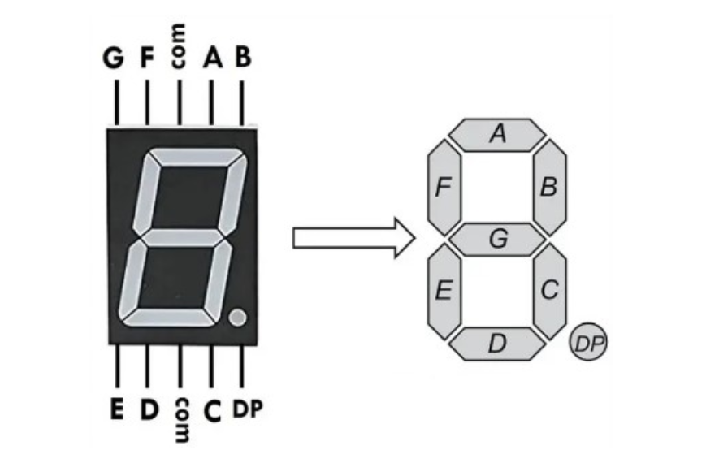
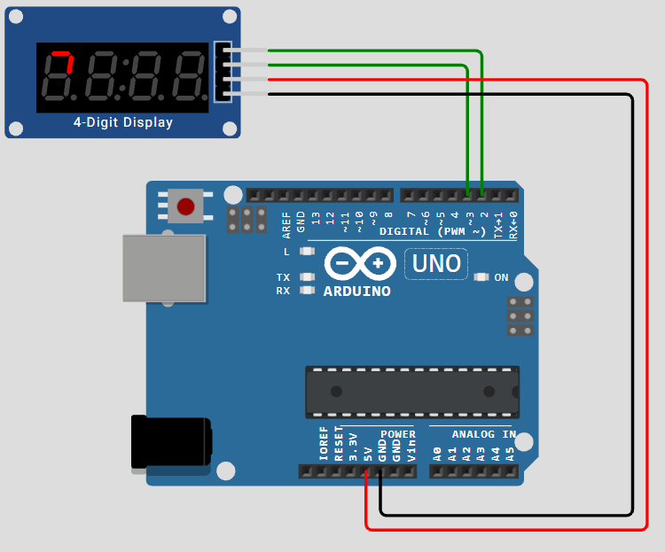
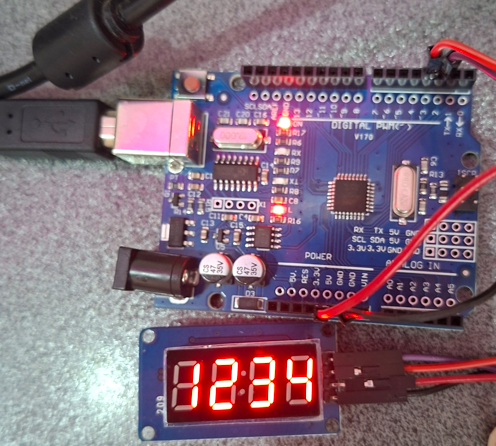

<h1 dir="rtl" align="center">📘 جلسه 13: راه‌اندازی نمایشگر 7-Segment با TM1637</h1>

<p dir="rtl" align="right">
در جلسه قبل با <bdi><strong>GLCD 128×64</strong></bdi> آشنا شدیم و یاد گرفتیم چگونه با استفاده از پیکسل‌ها، متن و شکل‌های گرافیکی مختلف را روی نمایشگر رسم کنیم.
</p>

<p dir="rtl" align="right">
در این جلسه سراغ یک نوع نمایشگر ساده‌تر برای نمایش <bdi><strong>اعداد</strong></bdi> می‌رویم. ماژول <bdi><strong>TM1637</strong></bdi> یک نمایشگر 7-Segment چهاررقمی را با استفاده از یک درایور کنترل می‌کند و برای ارتباط با Arduino فقط به دو خط سیگنال <bdi><strong>CLK</strong></bdi> و <bdi><strong>DIO</strong></bdi> نیاز دارد.
</p>

<p dir="rtl" align="right">
هدف این جلسه فقط <bdi><strong>آشنایی و راه‌اندازی اولیه TM1637</strong></bdi> است؛ بنابراین هنوز وارد پروژه‌هایی مانند ساعت، تایمر، شمارنده یا اتصال سنسور به نمایشگر نمی‌شویم.
</p>

<hr>

<h2 dir="rtl" align="right">🎯 اهداف جلسه</h2>

<p dir="rtl" align="right">
در پایان این جلسه می‌توانیم:
</p>

<ul dir="rtl" align="right">
  <li>نمایشگر <bdi><strong>7-Segment</strong></bdi> را بشناسیم.</li>
  <li>ماژول <bdi><strong>TM1637</strong></bdi> را معرفی کنیم.</li>
  <li>پایه‌های <bdi><strong>VCC</strong></bdi>، <bdi><strong>GND</strong></bdi>، <bdi><strong>CLK</strong></bdi> و <bdi><strong>DIO</strong></bdi> را بشناسیم.</li>
  <li>TM1637 را به <bdi><strong>Arduino UNO</strong></bdi> متصل کنیم.</li>
  <li>کتابخانه <bdi><strong>TM1637Display</strong></bdi> را نصب کنیم.</li>
  <li>یک عدد را روی نمایشگر چهاررقمی نمایش دهیم.</li>
  <li>روشنایی نمایشگر را تنظیم کنیم.</li>
  <li>نمایشگر را با دستور <bdi><strong>clear()</strong></bdi> پاک کنیم.</li>
</ul>

<hr>

<h2 dir="rtl" align="right">🔢 بخش اول: نمایشگر 7-Segment چیست؟</h2>

<p dir="rtl" align="right">
نمایشگر <bdi><strong>7-Segment</strong></bdi> از چند بخش LED تشکیل شده است که هر بخش را یک <bdi><strong>Segment</strong></bdi> می‌نامیم.
</p>

<p dir="rtl" align="right">
این بخش‌ها معمولاً با حروف زیر نام‌گذاری می‌شوند:
</p>

<p align="center">
  
</p>

<p dir="rtl" align="right">
با روشن و خاموش کردن این Segmentها می‌توان اعداد مختلف را ایجاد کرد. برای مثال برای نمایش عدد <bdi><strong>8</strong></bdi> تقریباً تمام Segmentهای اصلی روشن می‌شوند.
</p>

<p dir="rtl" align="right">
ماژول‌های چهاررقمی TM1637 معمولاً چهار عدد 7-Segment را در کنار یکدیگر قرار می‌دهند تا بتوانیم یک مقدار چهاررقمی را نمایش دهیم.
</p>

<hr>

<h2 dir="rtl" align="right">🧩 بخش دوم: TM1637 چیست؟</h2>

<p dir="rtl" align="right">
<bdi><strong>TM1637</strong></bdi> یک تراشه درایور برای کنترل نمایشگرهای LED و به‌طور رایج ماژول‌های چهاررقمی 7-Segment است.
</p>

<p dir="rtl" align="right">
مزیت مهم این ماژول برای شروع کار با Arduino این است که برخلاف اتصال مستقیم چندین Segment، در سمت Arduino فقط دو خط ارتباطی <bdi><strong>CLK</strong></bdi> و <bdi><strong>DIO</strong></bdi> در اختیار برنامه قرار می‌گیرد.
</p>

<p dir="rtl" align="right">
کتابخانه <bdi><strong>TM1637Display</strong></bdi> برای Arduino یک کلاس با همین نام در اختیار برنامه قرار می‌دهد و توابعی برای نمایش عدد، تنظیم روشنایی، پاک کردن نمایشگر و کنترل مستقیم Segmentها دارد.
</p>

<hr>

<h2 dir="rtl" align="right">🔌 بخش سوم: پایه‌های ماژول TM1637</h2>

<p dir="rtl" align="right">
ماژول‌های رایج TM1637 چهار پایه اصلی دارند:
</p>

<div dir="rtl" align="left">

| پایه | نام | کاربرد |
| ---: | --- | --- |
| 1 | VCC | تغذیه ماژول |
| 2 | GND | زمین |
| 3 | DIO | خط داده |
| 4 | CLK | خط کلاک |

</div>

<p dir="rtl" align="right">
دو پایه <bdi><strong>DIO</strong></bdi> و <bdi><strong>CLK</strong></bdi> خطوط سیگنال ارتباطی هستند. کتابخانه از طریق همین دو خط اطلاعات مربوط به Segmentها و اعداد را برای ماژول ارسال می‌کند.
</p>

<hr>

<h2 dir="rtl" align="right">🔗 بخش چهارم: اتصال TM1637 به Arduino UNO</h2>

<p dir="rtl" align="right">
برای این جلسه از اتصال ساده زیر استفاده می‌کنیم:
</p>

<div dir="rtl" align="left">

| TM1637 | Arduino UNO |
| --- | --- |
| VCC | 5V |
| GND | GND |
| DIO | D3 |
| CLK | D2 |

</div>

<p dir="rtl" align="right">
در این پروژه از <bdi><strong>D2</strong></bdi> برای CLK و از <bdi><strong>D3</strong></bdi> برای DIO استفاده می‌کنیم. این دو پایه صرفاً یک انتخاب برای سیم‌کشی هستند و در کتابخانه می‌توان شماره پایه‌های دیجیتال دیگری را نیز در سازنده مشخص کرد.
</p>

<p dir="rtl" align="right">
شماتیک ساده اتصال:
</p>

<p align="center">
  
</p>

<p dir="rtl" align="right">
⚠️ <b>نکته:</b> نام و ترتیب فیزیکی پایه‌ها را از نوشته روی خود ماژول بررسی کنید، زیرا بردهای مختلف ممکن است چیدمان کانکتور متفاوتی داشته باشند. نام پایه‌ها باید مبنای اتصال قرار بگیرد.
</p>

<hr>

<h2 dir="rtl" align="right">📚 بخش پنجم: نصب کتابخانه TM1637</h2>

<p dir="rtl" align="right">
برای کنترل این ماژول از کتابخانه <bdi><strong>TM1637Display</strong></bdi> استفاده می‌کنیم.
</p>

<p dir="rtl" align="right">
در Arduino IDE مسیر زیر را باز کنید:
</p>

```text
Sketch
   ↓
Include Library
   ↓
Manage Libraries...
```

<p dir="rtl" align="right">
سپس در قسمت جستجو عبارت زیر را وارد کنید:
</p>

```text
TM1637
```

<p dir="rtl" align="right">
کتابخانه‌ای که در این جلسه استفاده می‌کنیم:
</p>

```text
TM1637Display
```

<p dir="rtl" align="right">
پس از نصب، می‌توانیم آن را با دستور زیر به برنامه اضافه کنیم:
</p>

```cpp
#include <TM1637Display.h>
```

<p dir="rtl" align="right">
این کتابخانه در مخزن رسمی پروژه، کلاس <bdi><strong>TM1637Display</strong></bdi> و توابعی مانند <bdi><strong>showNumberDec()</strong></bdi>، <bdi><strong>setBrightness()</strong></bdi>، <bdi><strong>clear()</strong></bdi> و <bdi><strong>setSegments()</strong></bdi> را ارائه می‌کند.
</p>

<hr>

<h2 dir="rtl" align="right">💻 بخش ششم: ساخت شیء TM1637Display</h2>

<p dir="rtl" align="right">
بعد از اضافه کردن کتابخانه، باید به برنامه بگوییم پایه‌های <bdi><strong>CLK</strong></bdi> و <bdi><strong>DIO</strong></bdi> به کدام پایه‌های Arduino متصل شده‌اند.
</p>

```cpp
#define CLK 2
#define DIO 3

TM1637Display display(CLK, DIO);
```

<p dir="rtl" align="right">
در اینجا:
</p>

<ul dir="rtl" align="right">
  <li><bdi><strong>CLK</strong></bdi> برابر با پایه <bdi><strong>D2</strong></bdi> است.</li>
  <li><bdi><strong>DIO</strong></bdi> برابر با پایه <bdi><strong>D3</strong></bdi> است.</li>
  <li>شیء <bdi><strong>display</strong></bdi> برای کنترل ماژول ایجاد می‌شود.</li>
</ul>

<hr>

<h2 dir="rtl" align="right">🧪 بخش هفتم: اولین برنامه تست TM1637</h2>

<p dir="rtl" align="right">
حالا اولین برنامه را می‌نویسیم تا عدد <bdi><strong>1234</strong></bdi> روی نمایشگر نشان داده شود.
</p>

```cpp
#include <TM1637Display.h>

#define CLK 2
#define DIO 3

TM1637Display display(CLK, DIO);

void setup() {

  display.setBrightness(7);

  display.showNumberDec(1234, false);

}

void loop() {

}
```

<p dir="rtl" align="right">
پس از آپلود برنامه، باید عدد زیر روی نمایشگر دیده شود:
</p>
<p align="center">
  
</p>

<p dir="rtl" align="right">
در این برنامه بعد از راه‌اندازی، عدد فقط یک بار تنظیم می‌شود و چون در <bdi><strong>loop()</strong></bdi> کاری انجام نمی‌دهیم، نمایشگر همان مقدار را حفظ می‌کند.
</p>

<hr>

<h2 dir="rtl" align="right">🔎 بخش هشتم: بررسی برنامه</h2>

<h3 dir="rtl" align="right">1️⃣ اضافه کردن کتابخانه</h3>

```cpp
#include <TM1637Display.h>
```

<p dir="rtl" align="right">
کتابخانه مورد نیاز برای کنترل TM1637 را وارد می‌کند.
</p>

<h3 dir="rtl" align="right">2️⃣ تعریف پایه‌ها</h3>

```cpp
#define CLK 2
#define DIO 3
```

<p dir="rtl" align="right">
در این قسمت مشخص می‌کنیم که سیم CLK به D2 و سیم DIO به D3 متصل شده است.
</p>

<h3 dir="rtl" align="right">3️⃣ ایجاد شیء نمایشگر</h3>

```cpp
TM1637Display display(CLK, DIO);
```

<p dir="rtl" align="right">
با این دستور یک شیء به نام <bdi><strong>display</strong></bdi> ایجاد می‌کنیم تا دستورات نمایشگر را از طریق آن ارسال کنیم.
</p>

<h3 dir="rtl" align="right">4️⃣ تنظیم روشنایی</h3>

```cpp
display.setBrightness(7);
```

<p dir="rtl" align="right">
در این کتابخانه مقدار روشنایی از <bdi><strong>0</strong></bdi> تا <bdi><strong>7</strong></bdi> قابل تنظیم است؛ در این مثال از بیشترین سطح استفاده می‌کنیم.
</p>

<h3 dir="rtl" align="right">5️⃣ نمایش عدد</h3>

```cpp
display.showNumberDec(1234, false);
```

<p dir="rtl" align="right">
تابع <bdi><strong>showNumberDec()</strong></bdi> برای نمایش یک عدد دهدهی استفاده می‌شود. پارامتر دوم مشخص می‌کند که صفرهای ابتدایی نمایش داده شوند یا فضای خالی باقی بماند.
</p>

<hr>

<h2 dir="rtl" align="right">🔢 بخش نهم: نمایش اعداد مختلف</h2>

<p dir="rtl" align="right">
برای مثال می‌توانیم عددهای مختلف را با همین تابع نمایش دهیم:
</p>

```cpp
display.showNumberDec(25, false);
```

<p dir="rtl" align="right">
نمایش حاصل تقریباً به شکل زیر خواهد بود:
</p>

```text
┌─────────────────┐
│       25        │
└─────────────────┘
```

<p dir="rtl" align="right">
در حالت <bdi><strong>false</strong></bdi>، صفرهای غیرضروری در سمت چپ نمایش داده نمی‌شوند.
</p>

<p dir="rtl" align="right">
اگر بخواهیم عدد را با چهار رقم و صفرهای ابتدایی نمایش دهیم، می‌توانیم از <bdi><strong>true</strong></bdi> استفاده کنیم:
</p>

```cpp
display.showNumberDec(25, true);
```

<p dir="rtl" align="right">
در این حالت نمایش به شکل زیر خواهد بود:
</p>

```text
┌─────────────────┐
│      0025       │
└─────────────────┘
```

<hr>

<h2 dir="rtl" align="right">💡 بخش دهم: پاک کردن نمایشگر</h2>

<p dir="rtl" align="right">
برای خاموش کردن Segmentهای نمایشگر از تابع زیر استفاده می‌کنیم:
</p>

```cpp
display.clear();
```

<p dir="rtl" align="right">
مثلاً:
</p>

```cpp
#include <TM1637Display.h>

#define CLK 2
#define DIO 3

TM1637Display display(CLK, DIO);

void setup() {

  display.setBrightness(7);

  display.showNumberDec(1234, false);

  delay(2000);

  display.clear();

}

void loop() {

}
```

<p dir="rtl" align="right">
در این برنامه ابتدا عدد <bdi><strong>1234</strong></bdi> نمایش داده می‌شود، سپس بعد از دو ثانیه نمایشگر پاک می‌شود.
</p>

<hr>

<h2 dir="rtl" align="right">🎚️ بخش یازدهم: کنترل روشنایی</h2>

<p dir="rtl" align="right">
روشنایی نمایشگر را می‌توان با تابع زیر کنترل کرد:
</p>

```cpp
display.setBrightness(level);
```

<p dir="rtl" align="right">
مقدار <bdi><strong>level</strong></bdi> می‌تواند از 0 تا 7 باشد.
</p>

<div dir="rtl" align="left">

| مقدار | توضیح |
| ---: | --- |
| 0 | کمترین روشنایی |
| 1 | روشنایی کم |
| 2 | روشنایی کم |
| 3 | روشنایی متوسط |
| 4 | روشنایی متوسط |
| 5 | روشنایی زیاد |
| 6 | روشنایی زیاد |
| 7 | بیشترین روشنایی |

</div>

<p dir="rtl" align="right">
مثلاً:
</p>

```cpp
display.setBrightness(3);
```

<p dir="rtl" align="right">
یا برای روشنایی بیشتر:
</p>

```cpp
display.setBrightness(7);
```

<p dir="rtl" align="right">
طبق مستندات کتابخانه، تنظیم روشنایی زمانی اعمال می‌شود که فرمانی برای به‌روزرسانی داده‌های نمایشگر ارسال شود.
</p>

<hr>

<h2 dir="rtl" align="right">🧠 بخش دوازدهم: چرا TM1637 کاربردی است؟</h2>

<p dir="rtl" align="right">
اگر بخواهیم یک نمایشگر 7-Segment را بدون درایور کنترل کنیم، باید تعداد زیادی خط و منطق کنترلی برای Segmentها و رقم‌ها در نظر بگیریم.
</p>

<p dir="rtl" align="right">
اما در ماژول TM1637 بخش عمده این کنترل توسط درایور انجام می‌شود و Arduino از طریق خطوط <bdi><strong>CLK</strong></bdi> و <bdi><strong>DIO</strong></bdi> با ماژول ارتباط برقرار می‌کند.
</p>

```text
Arduino UNO
     │
     │  CLK + DIO
     ▼
┌─────────────┐
│   TM1637    │
│   Driver    │
└──────┬──────┘
       │
       ▼
┌─────────────────┐
│   7-Segment     │
│     4-Digit     │
└─────────────────┘
```

<hr>

<h2 dir="rtl" align="right">⚠️ بخش سیزدهم: نکات عیب‌یابی</h2>

<p dir="rtl" align="right">
اگر بعد از آپلود کد چیزی روی نمایشگر مشاهده نکردید، این موارد را بررسی کنید:
</p>

<ul dir="rtl" align="right">
  <li>اتصال <bdi><strong>VCC</strong></bdi> و <bdi><strong>GND</strong></bdi> را بررسی کنید.</li>
  <li>جابجا نبودن <bdi><strong>CLK</strong></bdi> و <bdi><strong>DIO</strong></bdi> را بررسی کنید.</li>
  <li>شماره پایه‌های تعریف‌شده در برنامه با سیم‌کشی واقعی یکسان باشد.</li>
  <li>مطمئن شوید کتابخانه <bdi><strong>TM1637Display</strong></bdi> نصب شده است.</li>
  <li>مطمئن شوید نام فایل هدر دقیقاً <code>TM1637Display.h</code> نوشته شده باشد.</li>
</ul>

<hr>

<h2 dir="rtl" align="right">📝 تمرین عملی</h2>

<p dir="rtl" align="right">
برنامه‌ای بنویسید که پس از روشن شدن Arduino، عدد زیر را روی نمایشگر TM1637 نشان دهد:
</p>

```text
2026
```

<p dir="rtl" align="right">
سپس روشنایی را روی مقدار <bdi><strong>4</strong></bdi> قرار دهید.
</p>

<p dir="rtl" align="right">
برای شروع می‌توانید از این قسمت استفاده کنید:
</p>

```cpp
#include <TM1637Display.h>

#define CLK 2
#define DIO 3

TM1637Display display(CLK, DIO);
```

<hr>

<h2 dir="rtl" align="right">📌 جمع‌بندی جلسه</h2>

<p dir="rtl" align="right">
در این جلسه با <bdi><strong>TM1637</strong></bdi> و ماژول نمایشگر چهاررقمی <bdi><strong>7-Segment</strong></bdi> آشنا شدیم.
</p>

<p dir="rtl" align="right">
در این جلسه یاد گرفتیم که برای اتصال ماژول به Arduino به چهار اتصال اصلی نیاز داریم:
</p>

```text
VCC
GND
CLK
DIO
```

<p dir="rtl" align="right">
همچنین کتابخانه <bdi><strong>TM1637Display</strong></bdi> را نصب کردیم و با دستورات اصلی زیر آشنا شدیم:
</p>

```cpp
TM1637Display display(CLK, DIO);

display.setBrightness(7);

display.showNumberDec(1234, false);

display.clear();
```

<p dir="rtl" align="right">
در این مرحله تمرکز ما فقط روی <bdi><strong>راه‌اندازی و نمایش عدد</strong></bdi> بود و وارد پروژه‌های زمان‌محور یا ورودی سنسورها نشدیم.
</p>

<hr>

<h2 dir="rtl" align="right">⏭️ پیش‌نمایش جلسه ۱۴</h2>

<p dir="rtl" align="right">
در جلسه ۱۴ سراغ یک نوع نمایشگر LED متفاوت می‌رویم:
</p>

<p dir="center" align="center">
<bdi><strong>LED Matrix 8×8</strong></bdi>
</p>

<p align="center">
  
</p>

<p dir="rtl" align="right">
در جلسه بعد با ساختار ماتریسی LEDها، ردیف و ستون، روش کنترل یک ماتریس 8×8 و نمایش الگوها و شکل‌های ساده آشنا خواهیم شد.
</p>

<p dir="rtl" align="right">
موضوعات اصلی جلسه ۱۴ شامل موارد زیر خواهد بود:
</p>

<ul dir="rtl" align="right">
  <li>LED Matrix چیست؟</li>
  <li>ساختار 8×8 و مفهوم Row و Column</li>
  <li>اتصال ماتریس LED به Arduino</li>
  <li>کنترل LEDهای ماتریسی</li>
  <li>نمایش الگوهای ساده</li>
  <li>نمایش حروف و شکل‌های ابتدایی</li>
</ul>

<hr>

<h2 dir="rtl" align="right">🔗 منابع و مراجع</h2>

<p dir="rtl" align="right">
اطلاعات مربوط به کتابخانه و شیء <bdi><strong>TM1637Display</strong></bdi>، پایه‌های ارتباطی <bdi><strong>CLK</strong></bdi> و <bdi><strong>DIO</strong></bdi> و توابع اصلی آن از مستندات پروژه TM1637 در GitHub بررسی شده است.
</p>

<ul dir="rtl" align="right">
  <li><a href="https://github.com/avishorp/TM1637">TM1637 Arduino Library — avishorp</a></li>
  <li><a href="https://github.com/avishorp/TM1637/blob/master/TM1637Display.h">TM1637Display.h — Reference</a></li>
  <li><a href="https://github.com/avishorp/TM1637/blob/master/examples/TM1637Test/TM1637Test.ino">TM1637 Library Example</a></li>
</ul>

<hr>

<p dir="rtl" align="right">
⬅️ <a href="../12-GLCD/">جلسه 12 — آشنایی با GLCD 128×64 و نمایش گرافیکی</a>
</p>

<p dir="rtl" align="right">
➡️ <a href="../14-LED-Matrix-8x8/">جلسه 14 — راه‌اندازی LED Matrix 8×8</a>
</p>


<p align="center">
<strong>Arduino From Zero to Projects</strong>
</p>

<p align="center">
<strong>Mohammad Esteghamat</strong>
</p>
