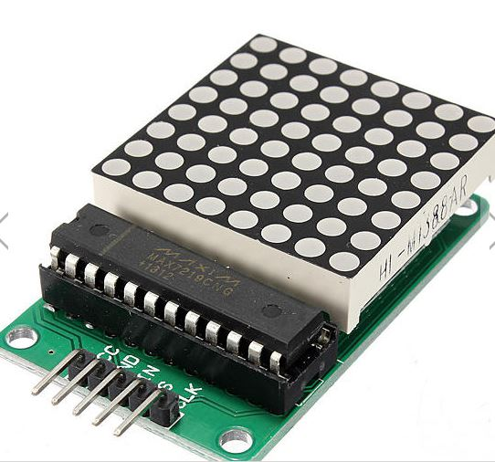
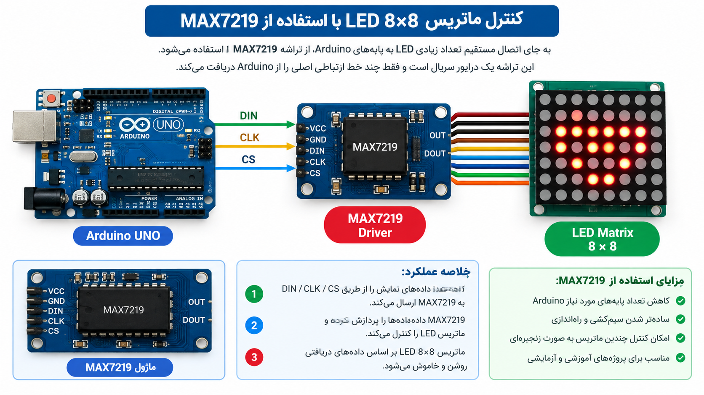
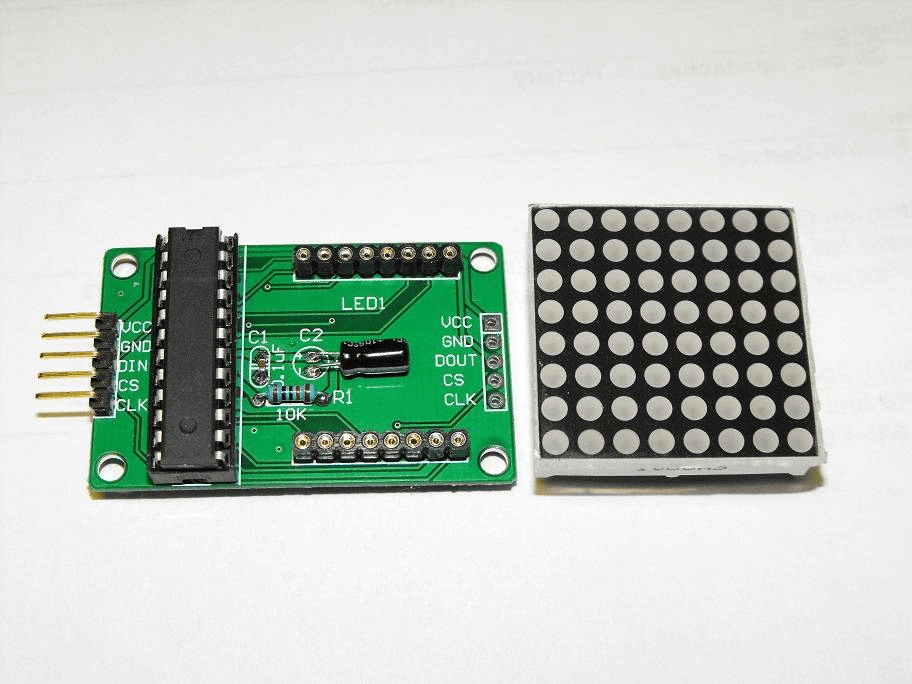
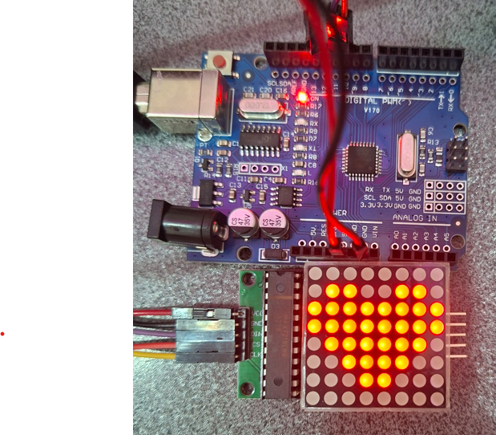
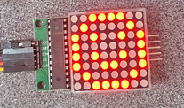

<h1 dir="rtl" align="center">📘 جلسه 14: راه‌اندازی LED Matrix 8×8 با MAX7219</h1>

<p dir="rtl" align="right">
در جلسه قبل با <bdi><strong>TM1637</strong></bdi> آشنا شدیم و یک نمایشگر 7-Segment چهاررقمی را راه‌اندازی کردیم.
</p>

<p dir="rtl" align="right">
در این جلسه سراغ <bdi><strong>LED Matrix 8×8</strong></bdi> می‌رویم. این نمایشگر به‌جای چند رقم 7-Segment، از تعدادی LED تشکیل شده است که در قالب <bdi><strong>8 سطر و 8 ستون</strong></bdi> قرار گرفته‌اند.
</p>

<p dir="rtl" align="right">
برای کنترل ماژول رایج <bdi><strong>8×8 با درایور MAX7219</strong></bdi> از Arduino UNO استفاده می‌کنیم. در این جلسه تمرکز روی شناخت ماتریس، سیم‌کشی، نصب کتابخانه و نمایش الگوهای ساده است. در جلسه ۱۵ سراغ اتصال چند ماتریس و ساخت <bdi><strong>LED Matrix 8×32</strong></bdi> خواهیم رفت.
</p>

<hr>

<h2 dir="rtl" align="right">🎯 اهداف جلسه</h2>

<p dir="rtl" align="right">
در پایان این جلسه می‌توانیم:
</p>

<ul dir="rtl" align="right">
  <li>مفهوم <bdi><strong>LED Matrix 8×8</strong></bdi> را توضیح دهیم.</li>
  <li>تفاوت سطر، ستون و <bdi><strong>Pixel</strong></bdi> را در ماتریس بشناسیم.</li>
  <li>درایور <bdi><strong>MAX7219</strong></bdi> را معرفی کنیم.</li>
  <li>پایه‌های <bdi><strong>VCC</strong></bdi>، <bdi><strong>GND</strong></bdi>، <bdi><strong>DIN</strong></bdi>، <bdi><strong>CS</strong></bdi> و <bdi><strong>CLK</strong></bdi> را بشناسیم.</li>
  <li>LED Matrix 8×8 را به <bdi><strong>Arduino UNO</strong></bdi> متصل کنیم.</li>
  <li>کتابخانه <bdi><strong>LedControl</strong></bdi> را نصب کنیم.</li>
  <li>یک LED یا چند LED را روشن و خاموش کنیم.</li>
  <li>یک شکل ساده مانند قلب و لبخند را روی ماتریس نمایش دهیم.</li>
</ul>

<hr>

<h2 dir="rtl" align="right">💡 بخش اول: LED Matrix 8×8 چیست؟</h2>

<p dir="rtl" align="right">
<bdi><strong>LED Matrix</strong></bdi> مجموعه‌ای از LEDهاست که به شکل سطر و ستون کنار یکدیگر قرار گرفته‌اند. در مدل <bdi><strong>8×8</strong></bdi>، هشت سطر و هشت ستون داریم و در مجموع:
</p>

```text
8 × 8 = 64 LED
```

<p dir="rtl" align="right">
بنابراین می‌توانیم هر نقطه از نمایشگر را به‌صورت یک <bdi><strong>Pixel</strong></bdi> در نظر بگیریم. هر Pixel در ساده‌ترین حالت می‌تواند خاموش یا روشن باشد.
</p>

<p dir="rtl" align="right">
یک ماتریس 8×8 را می‌توان به شکل زیر تصور کرد:
</p>

```text
    C0 C1 C2 C3 C4 C5 C6 C7
R0  ●  ●  ●  ●  ●  ●  ●  ●
R1  ●  ●  ●  ●  ●  ●  ●  ●
R2  ●  ●  ●  ●  ●  ●  ●  ●
R3  ●  ●  ●  ●  ●  ●  ●  ●
R4  ●  ●  ●  ●  ●  ●  ●  ●
R5  ●  ●  ●  ●  ●  ●  ●  ●
R6  ●  ●  ●  ●  ●  ●  ●  ●
R7  ●  ●  ●  ●  ●  ●  ●  ●
```
<p align="center">
  
</p>

<p dir="rtl" align="right">
هر نقطه با یک موقعیت سطر و ستون مشخص می‌شود.
</p>

<hr>

<h2 dir="rtl" align="right">🧩 بخش دوم: درایور MAX7219 چیست؟</h2>

<p dir="rtl" align="right">
کنترل مستقیم تعداد زیادی LED به پایه‌های Arduino نیاز زیادی ایجاد می‌کند. برای ساده‌تر شدن این کار، در بسیاری از ماژول‌های 8×8 از تراشه <bdi><strong>MAX7219</strong></bdi> استفاده می‌شود.
</p>

<p dir="rtl" align="right">
MAX7219 یک درایور سریال برای نمایش LEDهاست و می‌تواند داده‌های مربوط به نمایش را از طریق خطوط ارتباطی دریافت کند. در ماژول‌های آماده، بنابراین Arduino فقط چند خط ارتباطی اصلی را در اختیار ماژول قرار می‌دهد.
</p>

<p align="center">
  
</p>

<p dir="rtl" align="right">
این ساختار باعث می‌شود کنترل ماتریس برای پروژه‌های آموزشی و آزمایشی ساده‌تر شود.
</p>

<hr>

<h2 dir="rtl" align="right">🔌 بخش سوم: پایه‌های ماژول MAX7219 8×8</h2>

<p dir="rtl" align="right">
ماژول‌های رایج MAX7219 برای ارتباط با Arduino پنج اتصال اصلی دارند:
</p>

<div dir="rtl" align="left">

| پایه | نام | کاربرد |
| ---: | --- | --- |
| 1 | VCC | تغذیه ماژول |
| 2 | GND | زمین |
| 3 | DIN | ورود داده |
| 4 | CS | انتخاب و ثبت داده |
| 5 | CLK | کلاک |

</div>

<p dir="rtl" align="right">
در بعضی بردها، علاوه بر ورودی، پایه‌های <bdi><strong>DOUT</strong></bdi> نیز برای اتصال ماژول بعدی وجود دارد. این ویژگی در ساخت ماتریس‌های بزرگ‌تر اهمیت زیادی دارد و در جلسه ۱۵ از آن استفاده خواهیم کرد.
</p>

<p align="center">
  
</p>

<hr>

<h2 dir="rtl" align="right">🔗 بخش چهارم: اتصال LED Matrix به Arduino UNO</h2>

<p dir="rtl" align="right">
برای این جلسه از پایه‌های SPI سخت‌افزاری Arduino UNO استفاده می‌کنیم. اتصال پیشنهادی:
</p>

<div dir="rtl" align="left">

| MAX7219 | Arduino UNO |
| --- | --- |
| VCC | 5V |
| GND | GND |
| DIN | D11  |
| CS | D10 |
| CLK | D13 |

</div>

<p dir="rtl" align="right">
در این اتصال، <bdi><strong>D11</strong></bdi> مسیر داده، <bdi><strong>D13</strong></bdi> مسیر کلاک و <bdi><strong>D10</strong></bdi> خط انتخاب ماژول است.
</p>


<p dir="rtl" align="right">
⚠️ <b>نکته:</b> نام و جای پایه‌ها را از نوشته روی ماژول خودتان بررسی کنید. بعضی بردها ورودی و خروجی زنجیره‌ای را در دو سمت برد قرار می‌دهند.
</p>

<hr>

<h2 dir="rtl" align="right">📚 بخش پنجم: نصب کتابخانه LedControl</h2>

<p dir="rtl" align="right">
برای این جلسه از کتابخانه <bdi><strong>LedControl</strong></bdi> استفاده می‌کنیم. این کتابخانه برای کنترل درایورهای <bdi><strong>MAX7219</strong></bdi> و <bdi><strong>MAX7221</strong></bdi> در Arduino طراحی شده است.
</p>

<p dir="rtl" align="right">
در Arduino IDE مسیر زیر را باز کنید:
</p>

```text
Sketch
   ↓
Include Library
   ↓
Manage Libraries...
```

<p dir="rtl" align="right">
سپس عبارت زیر را جستجو کنید:
</p>

```text
LedControl
```

<p dir="rtl" align="right">
پس از نصب، کتابخانه را به این شکل وارد می‌کنیم:
</p>

```cpp
#include <LedControl.h>
```

<p dir="rtl" align="right">
کتابخانه <bdi><strong>LedControl</strong></bdi> برای کار با یک یا چند درایور MAX7219/MAX7221 استفاده می‌شود و امکاناتی مانند روشن کردن یک LED، نوشتن سطرها و کنترل شدت روشنایی را در اختیار قرار می‌دهد.
</p>

<hr>

<h2 dir="rtl" align="right">🧱 بخش ششم: ساخت شیء LedControl</h2>

<p dir="rtl" align="right">
بعد از نصب کتابخانه باید پایه‌های ارتباطی و تعداد ماژول‌ها را مشخص کنیم.
</p>

```cpp
#include <LedControl.h>

#define DIN_PIN 11
#define CLK_PIN 13
#define CS_PIN 10

LedControl matrix = LedControl(DIN_PIN, CLK_PIN, CS_PIN, 1);
```

<p dir="rtl" align="right">
در اینجا:
</p>

<ul dir="rtl" align="right">
  <li><bdi><strong>DIN_PIN</strong></bdi> برابر با D11 است.</li>
  <li><bdi><strong>CLK_PIN</strong></bdi> برابر با D13 است.</li>
  <li><bdi><strong>CS_PIN</strong></bdi> برابر با D10 است.</li>
  <li>عدد <bdi><strong>1</strong></bdi> یعنی در حال حاضر فقط یک ماژول داریم.</li>
</ul>

<hr>

<h2 dir="rtl" align="right">⚙️ بخش هفتم: راه‌اندازی اولیه MAX7219</h2>

<p dir="rtl" align="right">
در <bdi><strong>setup()</strong></bdi> باید نمایشگر را از حالت خاموش خارج کنیم، شدت روشنایی را مشخص کنیم و صفحه را پاک کنیم.
</p>

```cpp
matrix.shutdown(0, false);
matrix.setIntensity(0, 8);
matrix.clearDisplay(0);
```

<p dir="rtl" align="right">
عدد <bdi><strong>0</strong></bdi> در این توابع نشان‌دهنده اولین دستگاه یا همان اولین ماژول است.
</p>

<hr>

<h2 dir="rtl" align="right">💻 بخش هشتم: اولین برنامه تست LED Matrix</h2>

<p dir="rtl" align="right">
در اولین آزمایش، یک نقطه از ماتریس را روشن می‌کنیم.
</p>

```cpp
#include <LedControl.h>

#define DIN_PIN 11
#define CLK_PIN 13
#define CS_PIN 10

LedControl matrix = LedControl(DIN_PIN, CLK_PIN, CS_PIN, 1);

void setup() {

  matrix.shutdown(0, false);

  matrix.setIntensity(0, 8);

  matrix.clearDisplay(0);

  matrix.setLed(0, 0, 0, true);

}

void loop() {

}
```

<p dir="rtl" align="right">
در این برنامه فقط Pixel مربوط به سطر <bdi><strong>0</strong></bdi> و ستون <bdi><strong>0</strong></bdi> روشن می‌شود.
</p>

```text
● ○ ○ ○ ○ ○ ○ ○
○ ○ ○ ○ ○ ○ ○ ○
○ ○ ○ ○ ○ ○ ○ ○
○ ○ ○ ○ ○ ○ ○ ○
○ ○ ○ ○ ○ ○ ○ ○
○ ○ ○ ○ ○ ○ ○ ○
○ ○ ○ ○ ○ ○ ○ ○
○ ○ ○ ○ ○ ○ ○ ○
```

<hr>

<h2 dir="rtl" align="right">🔎 بخش نهم: دستور ()setLed</h2>

<p dir="rtl" align="right">
برای کنترل مستقیم یک Pixel از تابع زیر استفاده می‌کنیم:
</p>

```cpp
matrix.setLed(device, row, column, state);
```

<p dir="rtl" align="right">
مثلاً:
</p>

```cpp
matrix.setLed(0, 2, 4, true);
```

<p dir="rtl" align="right">
یعنی در ماژول شماره صفر، LED موجود در سطر <bdi><strong>2</strong></bdi> و ستون <bdi><strong>4</strong></bdi> روشن شود.
</p>

<p dir="rtl" align="right">
برای خاموش کردن همان Pixel:
</p>

```cpp
matrix.setLed(0, 2, 4, false);
```

<p dir="rtl" align="right">
بنابراین چهارمین پارامتر می‌تواند وضعیت LED را مشخص کند:
</p>

```text
true  → روشن
false → خاموش
```

<hr>

<h2 dir="rtl" align="right">🎨 بخش دهم: ساخت یک الگوی کامل با ()setRow</h2>

<p dir="rtl" align="right">
به‌جای روشن کردن Pixelها یکی‌یکی، می‌توانیم اطلاعات یک سطر را به‌صورت یک مقدار 8 بیتی ارسال کنیم.
</p>

```cpp
matrix.setRow(0, 0, B11111111);
```

<p dir="rtl" align="right">
در این مثال تمام LEDهای یک سطر روشن می‌شوند.
</p>

```text
● ● ● ● ● ● ● ●
○ ○ ○ ○ ○ ○ ○ ○
○ ○ ○ ○ ○ ○ ○ ○
○ ○ ○ ○ ○ ○ ○ ○
○ ○ ○ ○ ○ ○ ○ ○
○ ○ ○ ○ ○ ○ ○ ○
○ ○ ○ ○ ○ ○ ○ ○
○ ○ ○ ○ ○ ○ ○ ○
```

<p dir="rtl" align="right">
اگر بخواهیم فقط LEDهای خاصی از سطر روشن شوند، می‌توانیم بیت‌های مربوط به آن‌ها را تغییر دهیم.
</p>

مثلاً:

```cpp
matrix.setRow(0, 0, B10000001);
```

<p dir="rtl" align="right">
در این حالت دو LED در دو سمت سطر روشن خواهند بود.
</p>

<hr>

<h2 dir="rtl" align="right">❤️ بخش یازدهم: نمایش یک قلب</h2>

<p dir="rtl" align="right">
یکی از کاربردهای جذاب LED Matrix نمایش الگوهای تصویری است. برای نمایش قلب می‌توانیم برای هر سطر یک الگوی 8 بیتی تعریف کنیم.
</p>

```cpp
#include <LedControl.h>

#define DIN_PIN 11
#define CLK_PIN 13
#define CS_PIN 10

LedControl matrix = LedControl(DIN_PIN, CLK_PIN, CS_PIN, 1);

byte heart[8] = {
  B00000000,
  B01100110,
  B11111111,
  B11111111,
  B01111110,
  B00111100,
  B00011000,
  B00000000
};

void setup() {

  matrix.shutdown(0, false);

  matrix.setIntensity(0, 8);

  matrix.clearDisplay(0);

  for (int row = 0; row < 8; row++) {

    matrix.setRow(0, row, heart[row]);

  }
}

void loop() {

}
```
<p align="center">
  
</p>

<p dir="rtl" align="right">
با تغییر آرایه <bdi><strong>heart</strong></bdi> می‌توان شکل‌های مختلفی ایجاد کرد.
</p>

<hr>

<h2 dir="rtl" align="right">🙂 بخش دوازدهم: نمایش شکل لبخند</h2>

<p dir="rtl" align="right">
به‌عنوان مثال می‌توانیم یک صورت ساده نیز بسازیم:
</p>

```cpp
byte smile[8] = {
  B00111100,
  B01000010,
  B10100101,
  B10000001,
  B10100101,
  B10011001,
  B01000010,
  B00111100
};
```

<p dir="rtl" align="right">
سپس مانند الگوی قلب، هر سطر را روی ماتریس می‌فرستیم:
</p>

```cpp
for (int row = 0; row < 8; row++) {

  matrix.setRow(0, row, smile[row]);

}
```

<p align="center">
  
</p>


<p dir="rtl" align="right">
این روش یکی از ساده‌ترین راه‌ها برای ساخت آیکون و الگوهای گرافیکی در ماتریس 8×8 است.
</p>

<hr>

<h2 dir="rtl" align="right">🎚️ بخش سیزدهم: تنظیم روشنایی</h2>

<p dir="rtl" align="right">
برای تنظیم شدت روشنایی ماژول از تابع زیر استفاده می‌کنیم:
</p>

```cpp
matrix.setIntensity(0, intensity);
```

<p dir="rtl" align="right">
در کتابخانه <bdi><strong>LedControl</strong></bdi> مقدار شدت روشنایی در بازه <bdi><strong>0 تا 15</strong></bdi> تنظیم می‌شود.
</p>

<div dir="rtl" align="left">

| مقدار | توضیح تقریبی |
| ---: | --- |
| 0 | کمترین شدت |
| 4 | شدت کم |
| 8 | شدت متوسط |
| 12 | شدت زیاد |
| 15 | بیشترین شدت |

</div>

<p dir="rtl" align="right">
مثلاً:
</p>

```cpp
matrix.setIntensity(0, 4);
```

<hr>

<h2 dir="rtl" align="right">🧹 بخش چهاردهم: پاک کردن ماتریس</h2>

<p dir="rtl" align="right">
برای خاموش کردن تمام LEDهای یک ماژول از دستور زیر استفاده می‌کنیم:
</p>

```cpp
matrix.clearDisplay(0);
```

<p dir="rtl" align="right">
این دستور زمانی کاربردی است که بخواهیم قبل از نمایش یک الگوی جدید، صفحه را کاملاً پاک کنیم.
</p>

<hr>

<h2 dir="rtl" align="right">🔄 بخش پانزدهم: روشن و خاموش کردن کل نمایشگر</h2>

<p dir="rtl" align="right">
با تابع <bdi><strong>shutdown()</strong></bdi> می‌توان نمایشگر را وارد حالت خاموش یا فعال کرد:
</p>

```cpp
matrix.shutdown(0, true);
```

<p dir="rtl" align="right">
نمایشگر خاموش می‌شود.
</p>

<p dir="rtl" align="right">
برای فعال کردن دوباره:
</p>

```cpp
matrix.shutdown(0, false);
```

<hr>

<h2 dir="rtl" align="right">🧠 بخش شانزدهم: درک آرایه 8 بیتی</h2>

<p dir="rtl" align="right">
یکی از مهم‌ترین مفاهیم این جلسه، تبدیل یک شکل به چند مقدار 8 بیتی است.
</p>

<p dir="rtl" align="right">
فرض کنید یک سطر به شکل زیر باشد:
</p>

```text
● ○ ○ ○ ○ ○ ○ ●
```

<p dir="rtl" align="right">
می‌توانیم آن را به‌صورت زیر بنویسیم:
</p>

```cpp
B10000001
```

<p dir="rtl" align="right">
در یک ماتریس 8×8، هشت سطر داریم و برای هر سطر یک مقدار 8 بیتی تعریف می‌کنیم. بنابراین یک تصویر ساده می‌تواند با یک آرایه 8 عضوی ذخیره شود.
</p>

```cpp
byte pattern[8] = {
  B10000001,
  B01000010,
  B00100100,
  B00011000,
  B00011000,
  B00100100,
  B01000010,
  B10000001
};
```

<p dir="rtl" align="right">
سپس هر عضو این آرایه را به یکی از سطرهای نمایشگر ارسال می‌کنیم.
</p>

<hr>

<h2 dir="rtl" align="right">🧪 بخش هفدهم: برنامه کامل آزمایشی</h2>

<p dir="rtl" align="right">
در برنامه زیر ابتدا نمایشگر پاک می‌شود و سپس یک الگوی ضربدر روی ماتریس نمایش داده می‌شود.
</p>

```cpp
#include <LedControl.h>

#define DIN_PIN 11
#define CLK_PIN 13
#define CS_PIN 10

LedControl matrix = LedControl(DIN_PIN, CLK_PIN, CS_PIN, 1);

byte cross[8] = {
  B10000001,
  B01000010,
  B00100100,
  B00011000,
  B00011000,
  B00100100,
  B01000010,
  B10000001
};

void setup() {

  matrix.shutdown(0, false);

  matrix.setIntensity(0, 8);

  matrix.clearDisplay(0);

  for (int row = 0; row < 8; row++) {

    matrix.setRow(0, row, cross[row]);

  }
}

void loop() {

}
```

<p dir="rtl" align="right">
خروجی تقریبی:
</p>

```text
● ○ ○ ○ ○ ○ ○ ●
○ ● ○ ○ ○ ○ ● ○
○ ○ ● ○ ○ ● ○ ○
○ ○ ○ ● ● ○ ○ ○
○ ○ ○ ● ● ○ ○ ○
○ ○ ● ○ ○ ● ○ ○
○ ● ○ ○ ○ ○ ● ○
● ○ ○ ○ ○ ○ ○ ●
```

<hr>

<h2 dir="rtl" align="right">⚠️ بخش هجدهم: نکات عیب‌یابی</h2>

<p dir="rtl" align="right">
اگر بعد از آپلود برنامه نمایشگر درست کار نکرد، موارد زیر را بررسی کنید:
</p>

<ul dir="rtl" align="right">
  <li>اتصال <bdi><strong>5V</strong></bdi> و <bdi><strong>GND</strong></bdi> را بررسی کنید.</li>
  <li>جابجا نبودن <bdi><strong>DIN</strong></bdi>، <bdi><strong>CS</strong></bdi> و <bdi><strong>CLK</strong></bdi> را بررسی کنید.</li>
  <li>شماره پایه‌های برنامه را با سیم‌کشی واقعی مقایسه کنید.</li>
  <li>مطمئن شوید کتابخانه <bdi><strong>LedControl</strong></bdi> نصب شده است.</li>
  <li>بررسی کنید تعداد دستگاه‌ها در سازنده با تعداد ماژول واقعی یکسان باشد.</li>
  <li>اگر الگو جابه‌جا یا آینه‌ای نمایش داده شد، جهت و نوع برد Matrix را بررسی کنید؛ چیدمان فیزیکی ماژول‌ها می‌تواند متفاوت باشد.</li>
</ul>

<hr>

<h2 dir="rtl" align="right">📝 تمرین عملی</h2>

<p dir="rtl" align="right">
برنامه‌ای بنویسید که شکل زیر را روی LED Matrix 8×8 نمایش دهد:
</p>

```text
● ● ● ● ● ● ● ●
● ○ ○ ○ ○ ○ ○ ●
● ○ ● ○ ○ ● ○ ●
● ○ ○ ● ● ○ ○ ●
● ○ ○ ● ● ○ ○ ●
● ○ ● ○ ○ ● ○ ●
● ○ ○ ○ ○ ○ ○ ●
● ● ● ● ● ● ● ●
```

<p dir="rtl" align="right">
برای حل تمرین، هر سطر را به یک مقدار 8 بیتی تبدیل کنید و سپس با <bdi><strong>setRow()</strong></bdi> روی نمایشگر ارسال کنید.
</p>

<hr>

<h2 dir="rtl" align="right">📝 تمرین دوم</h2>

<p dir="rtl" align="right">
یک برنامه طراحی کنید که ابتدا یک قلب و سپس یک شکل لبخند را نمایش دهد. بین دو شکل <bdi><strong>2 ثانیه</strong></bdi> مکث ایجاد کنید.
</p>

```text
قلب
↓
2 ثانیه
↓
لبخند
↓
2 ثانیه
↓
تکرار
```

<hr>

<h2 dir="rtl" align="right">📌 جمع‌بندی جلسه</h2>

<p dir="rtl" align="right">
در این جلسه با <bdi><strong>LED Matrix 8×8</strong></bdi> آشنا شدیم. این ماتریس شامل 64 LED است و هر نقطه را می‌توان به‌عنوان یک Pixel در نظر گرفت.
</p>

<p dir="rtl" align="right">
برای کنترل ماژول از درایور <bdi><strong>MAX7219</strong></bdi> و کتابخانه <bdi><strong>LedControl</strong></bdi> استفاده کردیم و مهم‌ترین دستورات اولیه را یاد گرفتیم:
</p>

```cpp
matrix.shutdown();
matrix.setIntensity();
matrix.clearDisplay();
matrix.setLed();
matrix.setRow();
```

<p dir="rtl" align="right">
در نهایت دیدیم که می‌توان یک شکل گرافیکی را به هشت مقدار 8 بیتی تبدیل کرد و آن را سطر به سطر روی نمایشگر قرار داد.
</p>

```text
          Arduino UNO
               │
        DIN / CS / CLK
               │
               ▼
          ┌──────────┐
          │ MAX7219  │
          └────┬─────┘
               │
               ▼
         LED Matrix 8×8
               │
        ┌──────┴──────┐
        │  64 Pixel   │
        └─────────────┘
```

<p dir="rtl" align="right">
اکنون آماده‌ایم چند ماتریس 8×8 را به یکدیگر متصل کنیم و یک نمایشگر عریض‌تر بسازیم.
</p>

<hr>

<h2 dir="rtl" align="right">⏭️ پیش‌نمایش جلسه ۱۵</h2>

<p dir="rtl" align="right">
در جلسه ۱۵ سراغ <bdi><strong>LED Matrix 8×32</strong></bdi> می‌رویم.
</p>

<p dir="rtl" align="right">
در آن جلسه چند ماژول 8×8 را به‌صورت زنجیره‌ای به هم متصل می‌کنیم تا یک ماتریس عریض‌تر با ابعاد <bdi><strong>8 سطر و 32 ستون</strong></bdi> داشته باشیم و سپس روش کار با چند ماژول را بررسی خواهیم کرد.
</p>

<ul dir="rtl" align="right">
  <li>اتصال چند ماژول MAX7219</li>
  <li>مفهوم <bdi><strong>DOUT</strong></bdi> و اتصال زنجیره‌ای</li>
  <li>ساخت Matrix با ابعاد <bdi><strong>8×32</strong></bdi></li>
  <li>نمایش الگو روی چند ماژول</li>
  <li>حرکت دادن داده‌ها در طول ماتریس</li>
</ul>

<hr>

<p dir="rtl" align="right">
⬅️ <a href="../13-TM1637/">جلسه 13 — راه‌اندازی <bdi><strong>TM1637</strong></bdi></a>
</p>

<p dir="rtl" align="right">
➡️ <a href="../15-LED-Matrix-8x32/">جلسه 15 — راه‌اندازی <bdi><strong>LED Matrix 8×32</strong></bdi></a>
</p>


<p align="center">
<strong>Arduino From Zero to Projects</strong>
</p>

<p align="center">
<strong>Mohammad Esteghamat</strong>
</p>
