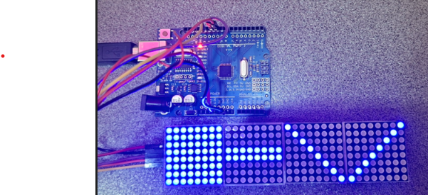
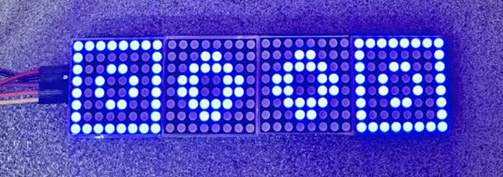

<h1 dir="rtl" align="center">📘 جلسه 15: راه‌اندازی LED Matrix 8×32 با MAX7219</h1>

<p dir="rtl" align="right">
در جلسه قبل با <bdi><strong>LED Matrix 8×8</strong></bdi> آشنا شدیم و یاد گرفتیم چگونه با درایور <bdi><strong>MAX7219</strong></bdi> یک ماتریس 8×8 را کنترل کنیم.
</p>

<p dir="rtl" align="right">
در این جلسه چهار ماژول <bdi><strong>LED Matrix 8×8</strong></bdi> را به‌صورت زنجیره‌ای به یکدیگر متصل می‌کنیم تا یک نمایشگر عریض‌تر با ابعاد <bdi><strong>8×32</strong></bdi> بسازیم.
</p>

<p dir="rtl" align="right">
در ادامه با مفهوم <bdi><strong>DOUT</strong></bdi>، اتصال <bdi><strong>Daisy Chain</strong></bdi>، کنترل چند MAX7219، نمایش الگو در 32 ستون و حرکت دادن یک الگو در طول نمایشگر آشنا می‌شویم.
</p>

<p dir="rtl" align="right">
در جلسه ۱۶ نیز سراغ <bdi><strong>Remote</strong></bdi> می‌رویم و نحوه دریافت فرمان از کنترل از راه دور را بررسی خواهیم کرد.
</p>

<hr>

<h2 dir="rtl" align="right">🎯 اهداف جلسه</h2>

<p dir="rtl" align="right">
در پایان این جلسه می‌توانیم:
</p>

<ul dir="rtl" align="right">
  <li>ساختار یک نمایشگر <bdi><strong>LED Matrix 8×32</strong></bdi> را توضیح دهیم.</li>
  <li>بدانیم چگونه چهار ماژول 8×8 را به‌صورت زنجیره‌ای متصل کنیم.</li>
  <li>تفاوت <bdi><strong>DIN</strong></bdi> و <bdi><strong>DOUT</strong></bdi> را درک کنیم.</li>
  <li>کتابخانه <bdi><strong>LedControl</strong></bdi> را برای چهار دستگاه تنظیم کنیم.</li>
  <li>هر چهار ماژول MAX7219 را مقداردهی اولیه کنیم.</li>
  <li>یک الگو را روی بخش‌های مختلف ماتریس 8×32 نمایش دهیم.</li>
  <li>یک ستون یا Pixel را در طول 32 ستون جابه‌جا کنیم.</li>
  <li>با مفهوم بافر ساده برای نگهداری الگوی ماتریس آشنا شویم.</li>
</ul>

<hr>

<h2 dir="rtl" align="right">📐 بخش اول: LED Matrix 8×32 چیست؟</h2>

<p dir="rtl" align="right">
یک ماتریس 8×8 دارای 8 سطر و 8 ستون است. در جلسه قبل دیدیم که در مجموع 64 LED داریم.
</p>

<p dir="rtl" align="right">
اگر چهار ماتریس 8×8 را در کنار یکدیگر قرار دهیم، تعداد سطرها همان 8 باقی می‌ماند و تعداد ستون‌ها چهار برابر می‌شود:
</p>

```text
8 × 8 = 64 LED     ← یک ماژول

8 × 32 = 256 LED   ← چهار ماژول 8×8
```

<p dir="rtl" align="right">
بنابراین یک <bdi><strong>LED Matrix 8×32</strong></bdi> شامل 8 سطر و 32 ستون است و در ساده‌ترین حالت می‌توان هر نقطه را به‌عنوان یک Pixel در نظر گرفت.
</p>

```text
                              32 ستون
      ◄─────────────────────────────────────────────────────────────►

R0    ● ● ● ● ● ● ● ● ● ● ● ● ● ● ● ● ● ● ● ● ● ● ● ● ● ● ● ● ● ● ● ●
R1    ● ● ● ● ● ● ● ● ● ● ● ● ● ● ● ● ● ● ● ● ● ● ● ● ● ● ● ● ● ● ● ●
R2    ● ● ● ● ● ● ● ● ● ● ● ● ● ● ● ● ● ● ● ● ● ● ● ● ● ● ● ● ● ● ● ●
R3    ● ● ● ● ● ● ● ● ● ● ● ● ● ● ● ● ● ● ● ● ● ● ● ● ● ● ● ● ● ● ● ●
R4    ● ● ● ● ● ● ● ● ● ● ● ● ● ● ● ● ● ● ● ● ● ● ● ● ● ● ● ● ● ● ● ●
R5    ● ● ● ● ● ● ● ● ● ● ● ● ● ● ● ● ● ● ● ● ● ● ● ● ● ● ● ● ● ● ● ●
R6    ● ● ● ● ● ● ● ● ● ● ● ● ● ● ● ● ● ● ● ● ● ● ● ● ● ● ● ● ● ● ● ●
R7    ● ● ● ● ● ● ● ● ● ● ● ● ● ● ● ● ● ● ● ● ● ● ● ● ● ● ● ● ● ● ● ●
```

<p dir="rtl" align="right">
در این جلسه هدف ما این است که چهار ماژول 8×8 را مانند یک نمایشگر واحد 8×32 کنترل کنیم.
</p>

<hr>

<h2 dir="rtl" align="right">🧩 بخش دوم: چرا چند MAX7219 را به یکدیگر متصل می‌کنیم؟</h2>

<p dir="rtl" align="right">
هر MAX7219 می‌تواند اطلاعات یک ماتریس 8×8 را مدیریت کند. برای ساخت یک نمایشگر عریض‌تر، چند درایور را به‌صورت زنجیره‌ای به هم متصل می‌کنیم.
</p>

<p dir="rtl" align="right">
در این حالت Arduino داده را به اولین MAX7219 ارسال می‌کند و اطلاعات از طریق خروجی <bdi><strong>DOUT</strong></bdi> به ماژول بعدی منتقل می‌شود.
</p>

```text
Arduino
   │
   │ DIN
   ▼
┌───────────┐      ┌───────────┐      ┌───────────┐      ┌───────────┐
│ MAX7219 #0│ DOUT │ MAX7219 #1│ DOUT │ MAX7219 #2│ DOUT │ MAX7219 #3│
│   8×8     ├─────►│   8×8     ├─────►│   8×8     ├─────►│   8×8     │
└───────────┘      └───────────┘      └───────────┘      └───────────┘

                 ←────── LED Matrix 8×32 ──────→
```

<p dir="rtl" align="right">
این روش را <bdi><strong>Daisy Chain</strong></bdi> یا اتصال زنجیره‌ای می‌نامیم.
</p>

<hr>

<h2 dir="rtl" align="right">🔌 بخش سوم: پایه‌های ورودی و خروجی ماژول</h2>

<p dir="rtl" align="right">
ماژول‌های MAX7219 معمولاً یک سمت برای دریافت اطلاعات و یک سمت برای ارسال اطلاعات به ماژول بعدی دارند.
</p>

<div dir="rtl" align="left">

| پایه | کاربرد |
| --- | --- |
| VCC | تغذیه ماژول |
| GND | زمین |
| DIN | ورود داده به MAX7219 |
| CS / LOAD | انتخاب و ثبت داده |
| CLK | کلاک |
| DOUT | خروجی داده برای ماژول بعدی |

</div>

<p align="center">
  
</p>

<p dir="rtl" align="right">
در اولین ماژول، داده از Arduino وارد <bdi><strong>DIN</strong></bdi> می‌شود. سپس از <bdi><strong>DOUT</strong></bdi> همان ماژول به <bdi><strong>DIN</strong></bdi> ماژول بعدی می‌رود.
</p>

<hr>

<h2 dir="rtl" align="right">🔗 بخش چهارم: اتصال چهار ماژول به یکدیگر</h2>

<p dir="rtl" align="right">
فرض می‌کنیم چهار ماژول 8×8 دارای MAX7219 داریم. اتصال باید به این صورت باشد:
</p>

```text
Arduino D11 (MOSI)
        │
        ▼
     DIN #0
   ┌─────────┐
   │ Module 0│
   └────┬────┘
       DOUT
        │
        ▼
     DIN #1
   ┌─────────┐
   │ Module 1│
   └────┬────┘
       DOUT
        │
        ▼
     DIN #2
   ┌─────────┐
   │ Module 2│
   └────┬────┘
       DOUT
        │
        ▼
     DIN #3
   ┌─────────┐
   │ Module 3│
   └─────────┘
```

<p dir="rtl" align="right">
خطوط <bdi><strong>CLK</strong></bdi> و <bdi><strong>CS</strong></bdi> به همه ماژول‌ها می‌رسند، اما مسیر داده از DOUT هر ماژول به DIN ماژول بعدی عبور می‌کند.
</p>

<hr>

<h2 dir="rtl" align="right">🔌 بخش پنجم: اتصال Arduino به اولین ماژول</h2>

<div dir="rtl" align="left">

| MAX7219 اولین ماژول | Arduino UNO |
| --- | --- |
| VCC | 5V |
| GND | GND |
| DIN | D11 (MOSI) |
| CS | D10 |
| CLK | D13 (SCK) |

</div>

<p dir="rtl" align="right">
در سمت زنجیره‌ای نیز اتصال به شکل زیر ادامه پیدا می‌کند:
</p>

<div dir="rtl" align="left">

| ماژول قبلی | ماژول بعدی |
| --- | --- |
| DOUT | DIN |
| GND | GND مشترک |
| VCC | VCC مشترک |
| CLK | CLK مشترک |
| CS | CS مشترک |

</div>

<p dir="rtl" align="right">
⚠️ <b>نکته:</b> نام کانکتورها و جهت قرارگیری ورودی و خروجی روی بعضی ماژول‌ها متفاوت است. قبل از اتصال، نوشته <bdi><strong>IN</strong></bdi> و <bdi><strong>OUT</strong></bdi> روی برد را بررسی کنید.
</p>

<hr>

<h2 dir="rtl" align="right">⚡ بخش ششم: تغذیه چهار ماژول</h2>

<p dir="rtl" align="right">
چهار ماژول نسبت به یک ماژول جریان بیشتری نیاز دارند؛ به‌خصوص زمانی که تعداد زیادی LED هم‌زمان روشن باشند.
</p>

<p dir="rtl" align="right">
برای همین بهتر است مسیر تغذیه را جدی بگیریم و از سیم‌های مناسب استفاده کنیم. زمین Arduino و تمام ماژول‌ها باید مشترک باشد.
</p>

```text
             +5V ─────────┬────────┬────────┬────────┐
                          │        │        │        │
                       Module0  Module1  Module2  Module3
                          │        │        │        │
              GND ────────┴────────┴────────┴────────┘
                          │
                       Arduino GND
```

<p dir="rtl" align="right">
💡 <b>نکته:</b> در مدار واقعی، اگر تعداد LEDهای روشن زیاد باشد، تغذیه مناسب و سیم‌کشی درست اهمیت زیادی پیدا می‌کند. افت ولتاژ می‌تواند باعث کم‌نور شدن یا رفتار ناپایدار نمایشگر شود.
</p>

<hr>

<h2 dir="rtl" align="right">📚 بخش هفتم: تنظیم LedControl برای چهار دستگاه</h2>

<p dir="rtl" align="right">
در جلسه قبل برای یک ماژول مقدار چهارم سازنده را برابر <bdi><strong>1</strong></bdi> قرار دادیم. اکنون چهار MAX7219 داریم، بنابراین تعداد دستگاه‌ها را برابر <bdi><strong>4</strong></bdi> می‌گذاریم.
</p>

```cpp
#include <LedControl.h>

#define DIN_PIN 11
#define CLK_PIN 13
#define CS_PIN 10

LedControl matrix = LedControl(DIN_PIN, CLK_PIN, CS_PIN, 4);
```

<p dir="rtl" align="right">
عدد <bdi><strong>4</strong></bdi> یعنی این شیء برای چهار دستگاه زنجیره‌ای تنظیم شده است. کتابخانه LedControl دستگاه‌ها را با آدرس صفر تا سه مدیریت می‌کند. citeturn681747search0
</p>

<hr>

<h2 dir="rtl" align="right">🔢 بخش هشتم: شماره‌گذاری ماژول‌ها</h2>

<p dir="rtl" align="right">
در برنامه چهار ماژول با شماره‌های زیر در دسترس هستند:
</p>

```text
Module 0
Module 1
Module 2
Module 3
```

<p dir="rtl" align="right">
مثلاً برای روشن کردن یک LED در ماژول شماره 2 می‌نویسیم:
</p>

```cpp
matrix.setLed(2, 0, 0, true);
```

<p dir="rtl" align="right">
در این دستور:
</p>

```text
2     → شماره ماژول
0     → سطر
0     → ستون
true  → روشن
```

<p dir="rtl" align="right">
⚠️ توجه کنید که شماره دستگاه‌ها بیانگر ترتیب زنجیره‌ای آن‌ها در کتابخانه است؛ ممکن است به دلیل نحوه نصب فیزیکی، Module 0 در سمت چپ نمایشگر دیده نشود. این موضوع به جهت نصب ماژول‌ها و نحوه قرارگیری بردها بستگی دارد.
</p>

<hr>

<h2 dir="rtl" align="right">⚙️ بخش نهم: راه‌اندازی هر چهار ماژول</h2>

<p dir="rtl" align="right">
در <bdi><strong>setup()</strong></bdi> باید هر چهار دستگاه را از حالت خاموش خارج کنیم، شدت روشنایی را تعیین کنیم و محتوای آن‌ها را پاک کنیم.
</p>

```cpp
for (int device = 0; device < 4; device++) {

  matrix.shutdown(device, false);

  matrix.setIntensity(device, 8);

  matrix.clearDisplay(device);
}
```

<p dir="rtl" align="right">
در این حلقه، عدد <bdi><strong>device</strong></bdi> از 0 تا 3 تغییر می‌کند و همین دستورات روی هر چهار ماژول اجرا می‌شود.
</p>

<hr>

<h2 dir="rtl" align="right">💻 بخش دهم: اولین برنامه تست 8×32</h2>

<p dir="rtl" align="right">
در اولین آزمایش، روی هر ماژول یک الگوی متفاوت نمایش می‌دهیم تا متوجه شویم چهار دستگاه مستقل در یک زنجیره در دسترس هستند.
</p>

```cpp
#include <LedControl.h>

#define DIN_PIN 11
#define CLK_PIN 13
#define CS_PIN 10

LedControl matrix = LedControl(DIN_PIN, CLK_PIN, CS_PIN, 4);

void setup() {

  for (int device = 0; device < 4; device++) {

    matrix.shutdown(device, false);
    matrix.setIntensity(device, 8);
    matrix.clearDisplay(device);

  }

  // Module 0
  for (int row = 0; row < 8; row++) {
    matrix.setRow(0, row, B11111111);
  }

  // Module 1
  matrix.setRow(1, 3, B11111111);
  matrix.setRow(1, 4, B11111111);

  // Module 2
  for (int row = 0; row < 8; row++) {
    matrix.setLed(2, row, row, true);
  }

  // Module 3
  for (int row = 0; row < 8; row++) {
    matrix.setLed(3, row, 7 - row, true);
  }
}

void loop() {

}
```
<p align="center">
  
</p>

<p dir="rtl" align="right">
اگر ماژول‌ها به ترتیب دلخواه شما کنار هم قرار گرفته باشند، شکل نهایی ممکن است از چپ به راست جابه‌جا شود. برای تست اولیه، مهم این است که هر چهار بخش روشن شوند.
</p>

<hr>

<h2 dir="rtl" align="right">🧱 بخش یازدهم: نمایش یک سطر در چهار ماژول</h2>

<p dir="rtl" align="right">
هر ماژول 8 ستون دارد. بنابراین برای ساخت یک سطر 32 ستونه می‌توانیم چهار مقدار 8 بیتی در کنار یکدیگر قرار دهیم.
</p>

```text
Module 0      Module 1      Module 2      Module 3
12345678      12345678      12345678      12345678
────────      ────────      ────────      ────────
  8 bit        8 bit         8 bit         8 bit
```

<p dir="rtl" align="right">
برای مثال:
</p>

```cpp
matrix.setRow(0, 0, B11111111);
matrix.setRow(1, 0, B00011000);
matrix.setRow(2, 0, B00011000);
matrix.setRow(3, 0, B11111111);
```

<p dir="rtl" align="right">
در نتیجه در سطر صفر، هر چهار بخش دارای الگوی مخصوص خود هستند.
</p>

<hr>

<h2 dir="rtl" align="right">🧠 بخش دوازدهم: تبدیل 32 ستون به چهار بلوک 8 بیتی</h2>

<p dir="rtl" align="right">
یکی از مهم‌ترین مفاهیم جلسه این است که نمایشگر 8×32 را می‌توان به چهار قسمت 8×8 تقسیم کرد.
</p>

```text
┌────────┬────────┬────────┬────────┐
│  8×8   │  8×8   │  8×8   │  8×8   │
│Module0 │Module1 │Module2 │Module3 │
└────────┴────────┴────────┴────────┘
       ←──────── 32 ستون ────────→
```

<p dir="rtl" align="right">
بنابراین اگر بخواهیم یک الگو را در کل نمایشگر قرار دهیم، برای هر سطر معمولاً چهار بایت در اختیار داریم:
</p>

```cpp
byte rowData[4] = {
  B11110000,
  B00001111,
  B11001100,
  B00110011
};
```

<p dir="rtl" align="right">
سپس این چهار مقدار را روی همان سطر از چهار دستگاه ارسال می‌کنیم:
</p>

```cpp
matrix.setRow(0, row, rowData[0]);
matrix.setRow(1, row, rowData[1]);
matrix.setRow(2, row, rowData[2]);
matrix.setRow(3, row, rowData[3]);
```

<hr>

<h2 dir="rtl" align="right">🎨 بخش سیزدهم: نمایش قاب دور ماتریس 8×32</h2>

<p dir="rtl" align="right">
حالا می‌خواهیم یک قاب دور کل نمایشگر بسازیم. سطر بالا و پایین کامل روشن می‌شوند و در سطرهای میانی فقط دو طرف نمایشگر روشن است.
</p>

```cpp
#include <LedControl.h>

#define DIN_PIN 11
#define CLK_PIN 13
#define CS_PIN 10

LedControl matrix = LedControl(DIN_PIN, CLK_PIN, CS_PIN, 4);

void setup() {

  for (int device = 0; device < 4; device++) {
    matrix.shutdown(device, false);
    matrix.setIntensity(device, 8);
    matrix.clearDisplay(device);
  }

  // سطر بالا و پایین
  for (int device = 0; device < 4; device++) {
    matrix.setRow(device, 0, B11111111);
    matrix.setRow(device, 7, B11111111);
  }

  // دو طرف نمایشگر
  for (int row = 1; row < 7; row++) {

    matrix.setLed(0, row, 0, true);
    matrix.setLed(0, row, 7, true);

    matrix.setLed(3, row, 0, true);
    matrix.setLed(3, row, 7, true);

  }
}

void loop() {

}
```

<p dir="rtl" align="right">
این مثال به شما نشان می‌دهد که چگونه می‌توان بخش‌های مختلف یک نمایشگر بزرگ‌تر را با آدرس دستگاه‌ها کنترل کرد.
</p>

<hr>

<h2 dir="rtl" align="right">➡️ بخش چهاردهم: حرکت دادن یک ستون در طول ماتریس</h2>

<p dir="rtl" align="right">
یکی از کاربردهای مهم ماتریس 8×32، نمایش حرکت و انیمیشن است. برای شروع، یک خط عمودی را در طول نمایشگر حرکت می‌دهیم.
</p>

```cpp
#include <LedControl.h>

#define DIN_PIN 11
#define CLK_PIN 13
#define CS_PIN 10

LedControl matrix = LedControl(DIN_PIN, CLK_PIN, CS_PIN, 4);

void clearAll() {

  for (int device = 0; device < 4; device++) {
    matrix.clearDisplay(device);
  }
}

void setup() {

  for (int device = 0; device < 4; device++) {
    matrix.shutdown(device, false);
    matrix.setIntensity(device, 8);
    matrix.clearDisplay(device);
  }
}

void loop() {

  for (int device = 0; device < 4; device++) {

    for (int col = 0; col < 8; col++) {

      clearAll();

      for (int row = 0; row < 8; row++) {
        matrix.setLed(device, row, col, true);
      }

      delay(100);
    }
  }
}
```

<p dir="rtl" align="right">
در این برنامه یک خط عمودی داخل هر ماژول حرکت می‌کند. چون چهار ماژول زنجیره شده‌اند، این حرکت در مجموع از چهار بخش 8 ستونه عبور می‌کند.
</p>

<hr>

<h2 dir="rtl" align="right">🔄 بخش پانزدهم: حرکت پیوسته‌تر در 32 ستون</h2>

<p dir="rtl" align="right">
برای کار با 32 ستون، می‌توانیم یک مختصات کلی به نام <bdi><strong>globalColumn</strong></bdi> تعریف کنیم.
</p>

<p dir="rtl" align="right">
محدوده ستون کلی برابر است با:
</p>

```text
0 تا 31
```

<p dir="rtl" align="right">
سپس از روی این مقدار مشخص می‌کنیم که ستون موردنظر متعلق به کدام ماژول است.
</p>

```text
globalColumn = 0 ... 7    → Module 0

globalColumn = 8 ... 15   → Module 1

globalColumn = 16 ... 23  → Module 2

globalColumn = 24 ... 31  → Module 3
```

<p dir="rtl" align="right">
فرمول ساده این است:
</p>

```cpp
device = globalColumn / 8;
column = globalColumn % 8;
```

<p dir="rtl" align="right">
مثلاً اگر:
</p>

```text
globalColumn = 19
```

<p dir="rtl" align="right">
خواهیم داشت:
</p>

```text
device = 19 / 8 = 2
column = 19 % 8 = 3
```

<p dir="rtl" align="right">
یعنی ستون 19 نمایشگر کلی، برابر با ستون 3 در ماژول شماره 2 است.
</p>

<hr>

<h2 dir="rtl" align="right">💻 بخش شانزدهم: تابع روشن کردن یک ستون کلی</h2>

<p dir="rtl" align="right">
می‌توانیم محاسبات بالا را داخل یک تابع قرار دهیم تا کار با 32 ستون راحت‌تر شود.
</p>

```cpp
void setGlobalColumn(int globalColumn, bool state) {

  if (globalColumn < 0 || globalColumn > 31) {
    return;
  }

  int device = globalColumn / 8;
  int column = globalColumn % 8;

  for (int row = 0; row < 8; row++) {
    matrix.setLed(device, row, column, state);
  }
}
```

<p dir="rtl" align="right">
حالا می‌توانیم فقط با نوشتن دستور زیر ستون شماره 20 را روشن کنیم:
</p>

```cpp
setGlobalColumn(20, true);
```

<p dir="rtl" align="right">
و برای خاموش کردن آن:
</p>

```cpp
setGlobalColumn(20, false);
```

<hr>

<h2 dir="rtl" align="right">🧪 بخش هفدهم: برنامه کامل حرکت ستون از 0 تا 31</h2>

```cpp
#include <LedControl.h>

#define DIN_PIN 11
#define CLK_PIN 13
#define CS_PIN 10

LedControl matrix = LedControl(DIN_PIN, CLK_PIN, CS_PIN, 4);

void clearAll() {

  for (int device = 0; device < 4; device++) {
    matrix.clearDisplay(device);
  }
}

void setGlobalColumn(int globalColumn, bool state) {

  if (globalColumn < 0 || globalColumn > 31) {
    return;
  }

  int device = globalColumn / 8;
  int column = globalColumn % 8;

  for (int row = 0; row < 8; row++) {
    matrix.setLed(device, row, column, state);
  }
}

void setup() {

  for (int device = 0; device < 4; device++) {

    matrix.shutdown(device, false);
    matrix.setIntensity(device, 8);
    matrix.clearDisplay(device);

  }
}

void loop() {

  for (int column = 0; column < 32; column++) {

    clearAll();

    setGlobalColumn(column, true);

    delay(80);
  }
}
```

<p dir="rtl" align="right">
این برنامه مفهوم مهمی را به ما نشان می‌دهد: می‌توان چهار ماتریس جداگانه را در سطح برنامه مانند یک صفحه 32 ستونه در نظر گرفت.
</p>

<hr>

<h2 dir="rtl" align="right">🧱 بخش هجدهم: نمایش یک الگوی 8×32 با آرایه</h2>

<p dir="rtl" align="right">
برای پروژه‌های بزرگ‌تر بهتر است الگو را داخل یک آرایه نگه‌داری کنیم.
</p>

<p dir="rtl" align="right">
از آنجا که هر سطر 32 بیت دارد، می‌توانیم آن را در قالب چهار بایت ذخیره کنیم:
</p>

```cpp
byte picture[8][4] = {

  {B11111111, B00000000, B00000000, B11111111},
  {B10000001, B00011000, B00011000, B10000001},
  {B10100101, B00100100, B00100100, B10100101},
  {B10000001, B00000000, B00000000, B10000001},
  {B10011001, B00000000, B00000000, B10011001},
  {B10000001, B00111100, B00111100, B10000001},
  {B10000001, B00000000, B00000000, B10000001},
  {B11111111, B00000000, B00000000, B11111111}

};
```

<p dir="rtl" align="right">
در این آرایه:
</p>

```text
8       → تعداد سطرها
4       → تعداد بایت‌های هر سطر
4 × 8   → 32 بیت در هر سطر
```

<p dir="rtl" align="right">
حالا می‌توانیم آرایه را روی چهار ماژول ارسال کنیم:
</p>

```cpp
for (int row = 0; row < 8; row++) {

  for (int device = 0; device < 4; device++) {

    matrix.setRow(device, row, picture[row][device]);

  }
}
```

<hr>

<h2 dir="rtl" align="right">💻 بخش نوزدهم: نمایش یک الگوی کامل</h2>

```cpp
#include <LedControl.h>

#define DIN_PIN 11
#define CLK_PIN 13
#define CS_PIN 10

LedControl matrix = LedControl(DIN_PIN, CLK_PIN, CS_PIN, 4);

byte picture[8][4] = {

  {B11111111, B00000000, B00000000, B11111111},
  {B10000001, B00011000, B00011000, B10000001},
  {B10011001, B00111100, B00111100, B10011001},
  {B10100101, B01100110, B01100110, B10100101},
  {B10100101, B01100110, B01100110, B10100101},
  {B10011001, B00111100, B00111100, B10011001},
  {B10000001, B00011000, B00011000, B10000001},
  {B11111111, B00000000, B00000000, B11111111}

};

void setup() {

  for (int device = 0; device < 4; device++) {

    matrix.shutdown(device, false);
    matrix.setIntensity(device, 8);
    matrix.clearDisplay(device);

  }

  for (int row = 0; row < 8; row++) {

    for (int device = 0; device < 4; device++) {

      matrix.setRow(device, row, picture[row][device]);

    }
  }
}

void loop() {

}
```
<p align="center">
  
</p>
<p dir="rtl" align="right">
این مدل آرایه‌ای پایه خوبی برای ساخت تابلوهای LED، آیکون‌ها و انیمیشن‌های ساده در جلسات بعدی است.
</p>

<hr>

<h2 dir="rtl" align="right">🎚️ بخش بیستم: تنظیم شدت روشنایی چهار ماژول</h2>

<p dir="rtl" align="right">
همانند جلسه قبل، شدت روشنایی هر دستگاه را می‌توان با <bdi><strong>setIntensity()</strong></bdi> در محدوده 0 تا 15 تنظیم کرد.
</p>

```cpp
for (int device = 0; device < 4; device++) {
  matrix.setIntensity(device, 5);
}
```

<p dir="rtl" align="right">
اگر شدت همه ماژول‌ها برابر نباشد، ممکن است بخش‌های مختلف نمایشگر با روشنایی متفاوت دیده شوند؛ بنابراین در یک نمایشگر 8×32 معمولاً تنظیم یکسان مناسب‌تر است.
</p>

<hr>

<h2 dir="rtl" align="right">🧹 بخش بیست‌ویکم: پاک کردن تمام 8×32</h2>

<p dir="rtl" align="right">
برای پاک کردن هر چهار دستگاه باید دستور <bdi><strong>clearDisplay()</strong></bdi> را برای همه دستگاه‌ها اجرا کنیم.
</p>

```cpp
for (int device = 0; device < 4; device++) {
  matrix.clearDisplay(device);
}
```

<p dir="rtl" align="right">
می‌توانیم این عملیات را داخل یک تابع قرار دهیم:
</p>

```cpp
void clearAll() {

  for (int device = 0; device < 4; device++) {
    matrix.clearDisplay(device);
  }
}
```

<hr>

<h2 dir="rtl" align="right">⚠️ بخش بیست‌ودوم: مشکل آینه‌ای یا جابه‌جا شدن تصویر</h2>

<p dir="rtl" align="right">
اگر برنامه از نظر نرم‌افزاری درست باشد اما تصویر از سمت اشتباه شروع شود، معمولاً ترتیب فیزیکی ماژول‌ها با ترتیب شماره دستگاه‌ها یکسان نیست.
</p>

<p dir="rtl" align="right">
مثلاً ممکن است در زنجیره داشته باشیم:
</p>

```text
Arduino → Module 0 → Module 1 → Module 2 → Module 3
```

<p dir="rtl" align="right">
ولی هنگام نگاه کردن به نمایشگر، Module 0 در سمت راست قرار گرفته باشد.
</p>

<p dir="rtl" align="right">
در این حالت معمولاً نیازی به تغییر سیم‌کشی نیست و می‌توان ترتیب ارسال داده را در برنامه تغییر داد.
</p>

<p dir="rtl" align="right">
برای نمونه، اگر بخواهیم الگوی چهار ماژول را برعکس کنیم، می‌توانیم به‌جای:
</p>

```cpp
matrix.setRow(0, row, data[0]);
matrix.setRow(1, row, data[1]);
matrix.setRow(2, row, data[2]);
matrix.setRow(3, row, data[3]);
```

<p dir="rtl" align="right">
از ترتیب معکوس استفاده کنیم:
</p>

```cpp
matrix.setRow(3, row, data[0]);
matrix.setRow(2, row, data[1]);
matrix.setRow(1, row, data[2]);
matrix.setRow(0, row, data[3]);
```

<p dir="rtl" align="right">
این کار بستگی به نحوه نصب واقعی ماژول‌ها دارد.
</p>

<hr>

<h2 dir="rtl" align="right">🔎 بخش بیست‌وسوم: عیب‌یابی</h2>

<p dir="rtl" align="right">
اگر تمام یا بخشی از LED Matrix 8×32 درست کار نکرد، موارد زیر را مرحله‌به‌مرحله بررسی کنید:
</p>

<ul dir="rtl" align="right">
  <li>بررسی کنید Arduino به <bdi><strong>DIN</strong></bdi> اولین ماژول وصل شده باشد.</li>
  <li>بررسی کنید <bdi><strong>DOUT</strong></bdi> هر ماژول به <bdi><strong>DIN</strong></bdi> ماژول بعدی وصل باشد.</li>
  <li>اتصال <bdi><strong>CLK</strong></bdi> در تمام ماژول‌ها مشترک و درست باشد.</li>
  <li>اتصال <bdi><strong>CS</strong></bdi> در تمام ماژول‌ها درست باشد.</li>
  <li>زمین همه بخش‌ها مشترک باشد.</li>
  <li>عدد چهار در سازنده LedControl با تعداد دستگاه‌های واقعی مطابقت داشته باشد.</li>
  <li>شماره Module 0 تا Module 3 را با جهت واقعی زنجیره مقایسه کنید.</li>
  <li>اگر فقط بخشی از نمایشگر روشن می‌شود، اتصال DOUT/DIN بین ماژول‌ها را بررسی کنید.</li>
  <li>اگر تصویر آینه‌ای یا برعکس است، جهت فیزیکی ماژول‌ها و ترتیب دستگاه‌ها را بررسی کنید.</li>
</ul>

<hr>

<h2 dir="rtl" align="right">🧪 بخش بیست‌وچهارم: تست مرحله‌ای پیشنهادی</h2>

<p dir="rtl" align="right">
برای اینکه سریع‌تر متوجه مشکل شوید، بهتر است ابتدا هر چهار ماژول را با یک الگوی ساده آزمایش کنید.
</p>

```cpp
for (int device = 0; device < 4; device++) {

  matrix.setRow(device, 0, B11111111);

  delay(300);

  matrix.clearDisplay(device);
}
```

<p dir="rtl" align="right">
اگر هر چهار ماژول به‌ترتیب روشن شدند، زنجیره داده معمولاً درست متصل شده است. سپس می‌توانید سراغ الگوهای پیچیده‌تر بروید.
</p>

<hr>

<h2 dir="rtl" align="right">📝 تمرین عملی</h2>

<p dir="rtl" align="right">
برنامه‌ای بنویسید که روی نمایشگر 8×32 یک قاب کامل ایجاد کند.
</p>

```text
● ● ● ● ● ● ● ● ● ● ● ● ● ● ● ● ● ● ● ● ● ● ● ● ● ● ● ● ● ● ● ●
● ○ ○ ○ ○ ○ ○ ○ ○ ○ ○ ○ ○ ○ ○ ○ ○ ○ ○ ○ ○ ○ ○ ○ ○ ○ ○ ○ ○ ○ ○ ●
● ○ ○ ○ ○ ○ ○ ○ ○ ○ ○ ○ ○ ○ ○ ○ ○ ○ ○ ○ ○ ○ ○ ○ ○ ○ ○ ○ ○ ○ ○ ●
● ○ ○ ○ ○ ○ ○ ○ ○ ○ ○ ○ ○ ○ ○ ○ ○ ○ ○ ○ ○ ○ ○ ○ ○ ○ ○ ○ ○ ○ ○ ●
● ○ ○ ○ ○ ○ ○ ○ ○ ○ ○ ○ ○ ○ ○ ○ ○ ○ ○ ○ ○ ○ ○ ○ ○ ○ ○ ○ ○ ○ ○ ●
● ○ ○ ○ ○ ○ ○ ○ ○ ○ ○ ○ ○ ○ ○ ○ ○ ○ ○ ○ ○ ○ ○ ○ ○ ○ ○ ○ ○ ○ ○ ●
● ○ ○ ○ ○ ○ ○ ○ ○ ○ ○ ○ ○ ○ ○ ○ ○ ○ ○ ○ ○ ○ ○ ○ ○ ○ ○ ○ ○ ○ ○ ●
● ● ● ● ● ● ● ● ● ● ● ● ● ● ● ● ● ● ● ● ● ● ● ● ● ● ● ● ● ● ● ●
```

<p dir="rtl" align="right">
برای حل تمرین می‌توانید از <bdi><strong>setRow()</strong></bdi> برای سطرهای کامل و <bdi><strong>setLed()</strong></bdi> برای دو طرف استفاده کنید.
</p>

<hr>

<h2 dir="rtl" align="right">📝 تمرین دوم</h2>

<p dir="rtl" align="right">
یک خط عمودی ایجاد کنید که از ستون 0 شروع شود و تا ستون 31 حرکت کند.
</p>

```text
Column 0
   ↓
Column 1
   ↓
Column 2
   ↓
...
   ↓
Column 31
```

<p dir="rtl" align="right">
برای این تمرین از رابطه زیر استفاده کنید:
</p>

```cpp
device = globalColumn / 8;
column = globalColumn % 8;
```

<hr>

<h2 dir="rtl" align="right">📝 تمرین سوم</h2>

<p dir="rtl" align="right">
یک آرایه 8×32 طراحی کنید که در مرکز آن یک شکل ساده قرار داشته باشد.
</p>

<p dir="rtl" align="right">
برای شروع می‌توانید شکل زیر را طراحی کنید:
</p>

```text
       ● ●       ● ●
       ● ● ● ● ● ● ●
       ● ● ● ● ● ● ●
         ● ● ● ● ●
           ● ● ●
             ●
```

<p dir="rtl" align="right">
سپس هر سطر را به چهار بایت تقسیم کرده و با <bdi><strong>setRow()</strong></bdi> ارسال کنید.
</p>

<hr>

<h2 dir="rtl" align="right">📌 جمع‌بندی جلسه</h2>

<p dir="rtl" align="right">
در این جلسه یاد گرفتیم که چگونه چهار ماژول <bdi><strong>LED Matrix 8×8</strong></bdi> را با استفاده از <bdi><strong>MAX7219</strong></bdi> به‌صورت زنجیره‌ای به یک نمایشگر <bdi><strong>8×32</strong></bdi> تبدیل کنیم.
</p>

<p dir="rtl" align="right">
مهم‌ترین مفاهیم این جلسه:
</p>

```text
8 × 32 = 256 Pixel

DIN  → ورود داده
DOUT → خروجی داده برای ماژول بعدی
CLK  → کلاک مشترک
CS   → انتخاب و ثبت داده

Module 0
Module 1
Module 2
Module 3
```

<p dir="rtl" align="right">
همچنین یاد گرفتیم که برای کار با چهار دستگاه، سازنده کتابخانه را به شکل زیر تنظیم کنیم:
</p>

```cpp
LedControl matrix = LedControl(11, 13, 10, 4);
```

<p dir="rtl" align="right">
و برای درک بهتر 32 ستون، یک شماره ستون کلی تعریف کردیم و آن را به شماره دستگاه و ستون داخلی دستگاه تبدیل کردیم:
</p>

```cpp
device = globalColumn / 8;
column = globalColumn % 8;
```

<p dir="rtl" align="right">
در نهایت دیدیم که می‌توان چهار ماتریس 8×8 را از دید برنامه به یک فضای واحد با 32 ستون تبدیل کرد و الگو و حرکت را روی آن اجرا کرد.
</p>

```text
                     Arduino UNO
                          │
                    DIN / CLK / CS
                          │
                          ▼
                    ┌───────────┐
                    │ MAX7219 #0│
                    └─────┬─────┘
                          │ DOUT
                          ▼
                    ┌───────────┐
                    │ MAX7219 #1│
                    └─────┬─────┘
                          │ DOUT
                          ▼
                    ┌───────────┐
                    │ MAX7219 #2│
                    └─────┬─────┘
                          │ DOUT
                          ▼
                    ┌───────────┐
                    │ MAX7219 #3│
                    └─────┬─────┘
                          │
                          ▼
                 LED Matrix 8 × 32
```

<hr>

<h2 dir="rtl" align="right">⏭️ پیش‌نمایش جلسه ۱۶</h2>

<p dir="rtl" align="right">
در جلسه ۱۶ سراغ <bdi><strong>Remote</strong></bdi> می‌رویم.
</p>

<p dir="rtl" align="right">
در آن جلسه با مفهوم کنترل از راه دور، دریافت فرمان از Remote و نحوه پردازش کدهای دریافتی توسط Arduino آشنا خواهیم شد.
</p>

<ul dir="rtl" align="right">
  <li>Remote چیست؟</li>
  <li>گیرنده مادون قرمز و نحوه عملکرد آن</li>
  <li>اتصال گیرنده Remote به Arduino</li>
  <li>نصب کتابخانه موردنیاز</li>
  <li>خواندن کد دکمه‌های Remote</li>
  <li>استفاده از Remote برای کنترل یک خروجی</li>
</ul>

<hr>

<p dir="rtl" align="right">
⬅️ <a href="../14-LED-Matrix-8x8/">جلسه 14 — راه‌اندازی <bdi><strong>LED Matrix 8×8</strong></bdi></a>
</p>

<p dir="rtl" align="right">
➡️ <a href="../16-Remote/">جلسه 16 — راه‌اندازی <bdi><strong>Remote</strong></bdi></a>
</p>


<p align="center">
<strong>Arduino From Zero to Projects</strong>
</p>

<p align="center">
<strong>Mohammad Esteghamat</strong>
</p>
