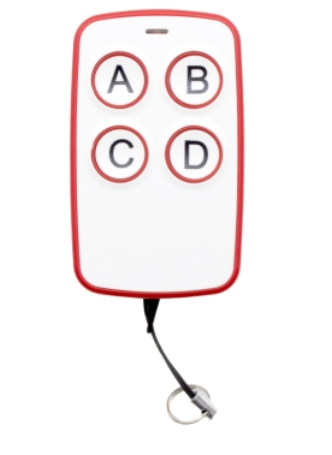
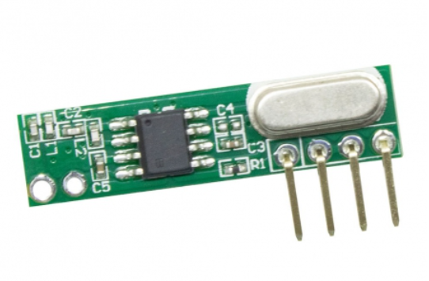
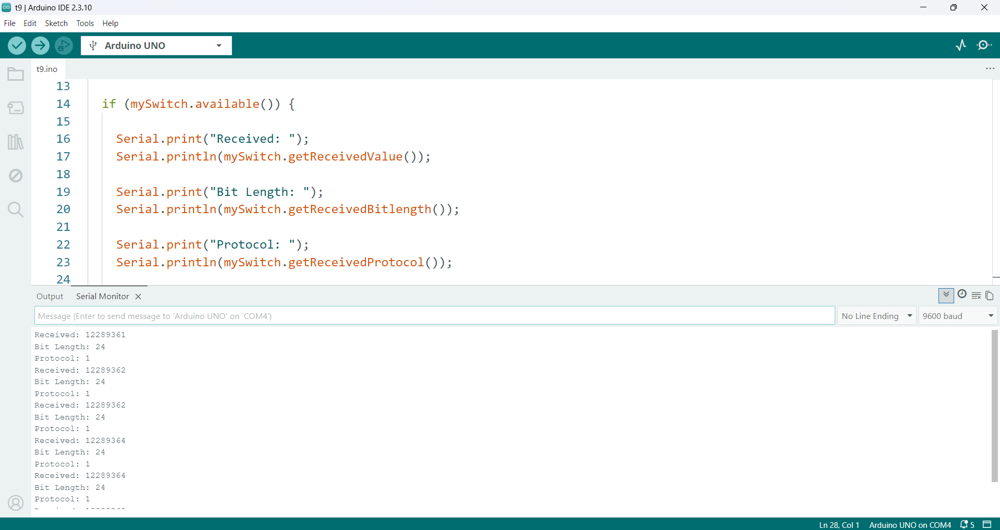
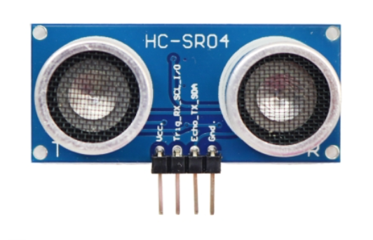

<h1 dir="rtl" align="center">📘 جلسه 16: کار با Remote RF و گیرنده RXB61</h1>

<p dir="rtl" align="right">
در جلسه قبل با <bdi><strong>LED Matrix 8×32</strong></bdi> آشنا شدیم و یاد گرفتیم چگونه چند ماژول <bdi><strong>MAX7219</strong></bdi> را به‌صورت زنجیره‌ای به یکدیگر متصل کنیم.
</p>

<p dir="rtl" align="right">
در این جلسه سراغ ارتباط بی‌سیم می‌رویم و با یک <bdi><strong>Remote Control RF</strong></bdi> و گیرنده <bdi><strong>RXB61</strong></bdi> کار خواهیم کرد.
</p>

<p dir="rtl" align="right">
یاد می‌گیریم چگونه سیگنال ارسال‌شده از ریموت را توسط گیرنده دریافت کنیم، کد دکمه‌های مختلف را بخوانیم و از این کدها برای کنترل خروجی‌های Arduino استفاده کنیم.
</p>

<p dir="rtl" align="right">
در جلسه ۱۷ نیز سراغ سنسور <bdi><strong>Ultrasonic</strong></bdi> خواهیم رفت و نحوه اندازه‌گیری فاصله با <bdi><strong>HC-SR04</strong></bdi> را بررسی خواهیم کرد.
</p>

<hr>

<h2 dir="rtl" align="right">🎯 اهداف جلسه</h2>

<p dir="rtl" align="right">
در پایان این جلسه می‌توانیم:
</p>

<ul dir="rtl" align="right">
  <li>مفهوم <bdi><strong>RF</strong></bdi> و ارتباط رادیویی را توضیح دهیم.</li>
  <li>تفاوت <bdi><strong>RF</strong></bdi> و <bdi><strong>IR</strong></bdi> را درک کنیم.</li>
  <li>گیرنده <bdi><strong>RXB61</strong></bdi> را بشناسیم.</li>
  <li>پایه‌های <bdi><strong>VCC</strong></bdi>، <bdi><strong>GND</strong></bdi>، <bdi><strong>DATA</strong></bdi> و <bdi><strong>ANT</strong></bdi> را شناسایی کنیم.</li>
  <li>گیرنده RXB61 را به Arduino متصل کنیم.</li>
  <li>کتابخانه <bdi><strong>RCSwitch</strong></bdi> را نصب و استفاده کنیم.</li>
  <li>کد ارسال‌شده توسط Remote را دریافت کنیم.</li>
  <li>کد دکمه‌های مختلف Remote را شناسایی کنیم.</li>
  <li>با استفاده از Remote یک LED را کنترل کنیم.</li>
  <li>چند خروجی را با چند دکمه Remote کنترل کنیم.</li>
  <li>با مشکلات رایج دریافت سیگنال RF آشنا شویم.</li>
</ul>

<hr>

<h2 dir="rtl" align="right">📡 بخش اول: Remote RF چیست؟</h2>

<p dir="rtl" align="right">
<bdi><strong>Remote Control</strong></bdi> وسیله‌ای است که به ما اجازه می‌دهد بدون اتصال سیمی، یک فرمان را از فاصله مشخصی ارسال کنیم.
</p>

<p dir="rtl" align="right">
در این جلسه از نوعی ریموت استفاده می‌کنیم که اطلاعات را توسط امواج رادیویی یا <bdi><strong>RF (Radio Frequency)</strong></bdi> ارسال می‌کند.
</p>

<p dir="rtl" align="right">
ریموت، اطلاعات مربوط به فشرده شدن یک دکمه را به صورت یک سیگنال رادیویی ارسال می‌کند. گیرنده <bdi><strong>RXB61</strong></bdi> این سیگنال را دریافت کرده و اطلاعات را از پایه <bdi><strong>DATA</strong></bdi> در اختیار Arduino قرار می‌دهد.
</p>

<p dir="rtl" align="right">
گیرنده RXB61 برای سیگنال‌های RF با مدولاسیون‌هایی مانند <bdi><strong>ASK/OOK</strong></bdi> طراحی شده است و نسخه‌های آن در فرکانس‌هایی مانند 315MHz و 433.92MHz وجود دارند.
</p>
<p align="center">
  
</p>
<hr>

<h2 dir="rtl" align="right">🔍 بخش دوم: تفاوت RF و IR</h2>

<p dir="rtl" align="right">
قبل از شروع کار با RXB61 بهتر است تفاوت <bdi><strong>RF</strong></bdi> و <bdi><strong>IR</strong></bdi> را بدانیم.
</p>

<div dir="rtl" align="left">

| ویژگی              | IR                   | RF                               |
|:------------------:|:--------------------:|:--------------------------------:|
| نام                | Infrared             | Radio Frequency                  |
| نوع موج            | مادون قرمز           | رادیویی                          |
| نیاز به دید مستقیم | معمولاً دارد         | معمولاً ندارد                    |
| گیرنده نمونه       | IR Receiver          | RXB61                            |
| فرکانس نمونه       | حدود 38KHz Carrier   | 433MHz                           |
| کاربرد             | تلویزیون، کولر و ... | ریموت، دزدگیر، درب پارکینگ و ... |

</div>

<p dir="rtl" align="right">
در Remoteهای مادون قرمز معمولاً باید ریموت تقریباً رو به گیرنده باشد؛ اما در ارتباط RF، سیگنال رادیویی می‌تواند بدون نیاز به دید مستقیم منتقل شود.
</p>

<hr>

<h2 dir="rtl" align="right">📻 بخش سوم: معرفی RXB61</h2>

<p dir="rtl" align="right">
<bdi><strong>RXB61</strong></bdi> یک گیرنده RF است که برای دریافت سیگنال‌های رادیویی استفاده می‌شود.
</p>

<p dir="rtl" align="right">
این ماژول در نسخه‌های مختلف برای فرکانس‌هایی مانند <bdi><strong>315MHz</strong></bdi> و <bdi><strong>433.92MHz</strong></bdi> ساخته شده است. در این جلسه فرض می‌کنیم از نسخه <bdi><strong>433.92MHz</strong></bdi> استفاده می‌کنیم.
</p>

<p dir="rtl" align="right">
وظیفه RXB61 دریافت سیگنال رادیویی و ارائه خروجی داده به صورت دیجیتال است. در نسخه‌های مستندشده، پایه <bdi><strong>DATA</strong></bdi> خروجی اطلاعات دریافتی است.
</p>

<hr>

<h2 dir="rtl" align="right">🔌 بخش چهارم: پایه‌های RXB61</h2>

<p dir="rtl" align="right">
RXB61 در نسخه‌های مختلف ممکن است با تعداد پایه متفاوت عرضه شود؛ بنابراین قبل از سیم‌کشی، نوشته‌های روی ماژول و مدل دقیق آن را بررسی کنید.
</p>
<p align="center">
  
</p>

<p dir="rtl" align="right">
در نسخه 6 پایه‌ای دیتاشیت RXB61 پایه‌های <bdi><strong>ANT</strong></bdi>، <bdi><strong>GND</strong></bdi>، <bdi><strong>VDD</strong></bdi>، <bdi><strong>SHUT</strong></bdi> و <bdi><strong>DATA</strong></bdi> را مشخص می‌کند.
</p>

<div dir="rtl" align="left">

| پایه | نام       | کاربرد                   |
| ---- | --------- | ------------------------ |
| 1    | ANT       | ورودی آنتن               |
| 2    | GND       | زمین                     |
| 3    | VDD / VCC | تغذیه                    |
| 4    | SHUT      | حالت خاموش/خروجی اختیاری |
| 5    | DATA      | خروجی داده               |
| 6    | GND       | زمین                     |

</div>

<p dir="rtl" align="right">
⚠️ <b>توجه:</b> شماره پایه‌ها را به صورت حفظی استفاده نکنید؛ ترتیب پایه‌ها ممکن است با نسخه و برد مورد استفاده متفاوت باشد.
</p>

<hr>

<h2 dir="rtl" align="right">📶 بخش پنجم: آنتن RXB61</h2>

<p dir="rtl" align="right">
آنتن نقش مهمی در کیفیت دریافت سیگنال RF دارد.
</p>

<p dir="rtl" align="right">
برای فرکانس <bdi><strong>433.92MHz</strong></bdi> طول رایج آنتن یک‌چهارم طول موج تقریباً <bdi><strong>17cm</strong></bdi> است. دیتاشیت RXB61 نیز برای 433.92MHz طول حدود 17cm را ذکر می‌کند.
</p>

<p dir="rtl" align="right">
برای پروژه آموزشی می‌توانیم یک سیم مستقیم حدود 17 سانتی‌متر را به ورودی <bdi><strong>ANT</strong></bdi> متصل کنیم.
</p>

```text
RXB61 ANT
    │
    │
    └────────────── سیم حدود 17cm
```

<p dir="rtl" align="right">
قرار دادن آنتن به صورت مستقیم و دور از منابع نویز و اجسام فلزی بزرگ می‌تواند به دریافت بهتر کمک کند.
</p>

<hr>

<h2 dir="rtl" align="right">🔗 بخش ششم: اتصال RXB61 به Arduino UNO</h2>

<p dir="rtl" align="right">
برای دریافت سیگنال از Remote، خروجی <bdi><strong>DATA</strong></bdi> را به پایه دیجیتال D2 آردوینو متصل می‌کنیم.
</p>

<div dir="rtl" align="left">

| RXB61     | Arduino UNO    |
| --------- | -------------- |
| VCC / VDD | 5V             |
| GND       | GND            |
| DATA      | D2             |
| ANT       | آنتن حدود 17cm |

</div>

<p dir="rtl" align="right">
استفاده از D2 برای Arduino UNO مناسب است، زیرا کتابخانه RCSwitch در نمونه‌های دریافت از <bdi><strong>Interrupt 0</strong></bdi> استفاده می‌کند که روی UNO به D2 مربوط است.
</p>

```text
                 Arduino UNO
                ┌────────────┐
                │            │
       5V ──────┤ 5V         │
      GND ──────┤ GND        │
       D2 ◄─────┤ DATA       │
                │            │
                └────────────┘
                      ▲
                      │
                    RXB61
```

<hr>

<h2 dir="rtl" align="right">⚡ بخش هفتم: تغذیه RXB61</h2>

<p dir="rtl" align="right">
RXB61 در دیتاشیت‌های موجود برای نسخه‌های مختلف، محدوده تغذیه‌ای در حدود 3.6 تا 5.5 ولت دارد و نسخه 433.92MHz با تغذیه 5V نیز مشخص شده است.
</p>

<p dir="rtl" align="right">
برای مدار آموزشی Arduino UNO می‌توانیم VCC ماژول را به 5V و GND را به GND متصل کنیم، مشروط بر اینکه مدل دقیق ماژول شما همین محدوده تغذیه را پشتیبانی کند.
</p>

<p dir="rtl" align="right">
⚠️ <b>نکته:</b> همیشه مشخصات نسخه دقیق RXB61 خود را بررسی کنید؛ نسخه‌ها و بردهای مختلف ممکن است تفاوت‌هایی در پایه‌ها و شرایط تغذیه داشته باشند.
</p>

<hr>

<h2 dir="rtl" align="right">📚 بخش هشتم: کتابخانه RCSwitch</h2>

<p dir="rtl" align="right">
برای ساده‌تر شدن کار با Remoteهای رایج 315MHz و 433MHz می‌توانیم از کتابخانه <bdi><strong>RCSwitch</strong></bdi> استفاده کنیم.
</p>

<p dir="rtl" align="right">
RCSwitch برای تعدادی از پروتکل‌های رایج Remoteهای RF طراحی شده است؛ از جمله خانواده‌هایی مانند <bdi><strong>PT2262</strong></bdi>، <bdi><strong>EV1527</strong></bdi> و چند پروتکل دیگر.
</p>

<p dir="rtl" align="right">
برای نصب کتابخانه می‌توان از <bdi><strong>Library Manager</strong></bdi> در Arduino IDE استفاده کرد.
</p>

```text
Arduino IDE
     │
     ▼
Sketch
     │
     ▼
Include Library
     │
     ▼
Manage Libraries
     │
     ▼
RCSwitch
```

<hr>

<h2 dir="rtl" align="right">💻 بخش نهم: اولین برنامه دریافت Remote</h2>

<p dir="rtl" align="right">
بعد از اتصال RXB61 و نصب RCSwitch، ابتدا می‌خواهیم ببینیم با فشار دادن دکمه Remote چه اطلاعاتی دریافت می‌شود.
</p>

```cpp
#include <RCSwitch.h>

RCSwitch mySwitch = RCSwitch();

void setup() {

  Serial.begin(9600);

  mySwitch.enableReceive(0);
}

void loop() {

  if (mySwitch.available()) {

    Serial.print("Received: ");
    Serial.println(mySwitch.getReceivedValue());

    Serial.print("Bit Length: ");
    Serial.println(mySwitch.getReceivedBitlength());

    Serial.print("Protocol: ");
    Serial.println(mySwitch.getReceivedProtocol());

    mySwitch.resetAvailable();
  }
}
```

<p dir="rtl" align="right">
در این برنامه دریافت‌کننده روی <bdi><strong>Interrupt 0</strong></bdi> فعال می‌شود که در Arduino UNO به پایه D2 مربوط است.
</p>
<p align="center">
  
</p>
<hr>

<h2 dir="rtl" align="right">🔎 بخش دهم: بررسی برنامه</h2>

<h3 dir="rtl" align="right">۱. وارد کردن کتابخانه</h3>

```cpp
#include <RCSwitch.h>
```

<p dir="rtl" align="right">
کتابخانه <bdi><strong>RCSwitch</strong></bdi> را وارد برنامه می‌کند.
</p>

<h3 dir="rtl" align="right">۲. ساخت شیء</h3>

```cpp
RCSwitch mySwitch = RCSwitch();
```

<p dir="rtl" align="right">
یک شیء از کلاس RCSwitch ایجاد می‌کنیم.
</p>

<h3 dir="rtl" align="right">۳. فعال کردن دریافت</h3>

```cpp
mySwitch.enableReceive(0);
```

<p dir="rtl" align="right">
دریافت را روی Interrupt شماره 0 فعال می‌کند. در Arduino UNO این وقفه روی پایه D2 قرار دارد.
</p>

<h3 dir="rtl" align="right">۴. بررسی دریافت</h3>

```cpp
if (mySwitch.available())
```

<p dir="rtl" align="right">
بررسی می‌کند که آیا اطلاعات جدیدی دریافت شده است یا خیر.
</p>

<h3 dir="rtl" align="right">۵. دریافت کد</h3>

```cpp
mySwitch.getReceivedValue()
```

<p dir="rtl" align="right">
مقدار کد دریافت‌شده را برمی‌گرداند.
</p>

<h3 dir="rtl" align="right">۶. تعداد بیت‌ها</h3>

```cpp
mySwitch.getReceivedBitlength()
```

<p dir="rtl" align="right">
تعداد بیت‌های داده دریافت‌شده را مشخص می‌کند.
</p>

<h3 dir="rtl" align="right">۷. پروتکل</h3>

```cpp
mySwitch.getReceivedProtocol()
```

<p dir="rtl" align="right">
شماره پروتکل شناسایی‌شده توسط کتابخانه را برمی‌گرداند.
</p>

<h3 dir="rtl" align="right">۸. آماده شدن برای دریافت بعدی</h3>

```cpp
mySwitch.resetAvailable();
```

<p dir="rtl" align="right">
وضعیت دریافت را پاک می‌کند تا بتوانیم فرمان بعدی را دریافت کنیم.
</p>

<hr>

<h2 dir="rtl" align="right">🖥️ بخش یازدهم: مشاهده کد Remote</h2>

<p dir="rtl" align="right">
پس از آپلود برنامه، <bdi><strong>Serial Monitor</strong></bdi> را با Baud Rate برابر 9600 باز کنید.
</p>

<p dir="rtl" align="right">
حالا یکی از دکمه‌های Remote را فشار دهید.
</p>

```text
Received: 123456
Bit Length: 24
Protocol: 1
```

<p dir="rtl" align="right">
اعداد بالا فقط نمونه هستند و کد واقعی Remote شما ممکن است کاملاً متفاوت باشد.
</p>

<p dir="rtl" align="right">
برای هر دکمه چند بار آزمایش انجام دهید و کدهای دریافت‌شده را یادداشت کنید.
</p>

<hr>

<h2 dir="rtl" align="right">🎛️ بخش دوازدهم: شناسایی دکمه‌های Remote</h2>

<p dir="rtl" align="right">
فرض کنیم Remote ما چهار دکمه دارد.
</p>

<div dir="rtl" align="left">

| دکمه | کد نمونه | Bit Length | Protocol |
| ---- | -------: | ---------: | -------: |
| A    |   123456 |         24 |        1 |
| B    |   123457 |         24 |        1 |
| C    |   123458 |         24 |        1 |
| D    |   123459 |         24 |        1 |

</div>

<p dir="rtl" align="right">
اعداد جدول فقط نمونه هستند. باید کدهای واقعی Remote خودتان را از Serial Monitor استخراج کنید.
</p>

<hr>

<h2 dir="rtl" align="right">💡 بخش سیزدهم: کنترل LED با Remote</h2>

<p dir="rtl" align="right">
حالا که کد دکمه را داریم، می‌توانیم از آن برای کنترل یک LED استفاده کنیم.
</p>

<p dir="rtl" align="right">
LED را به پایه D13 متصل می‌کنیم.
</p>

```cpp
#include <RCSwitch.h>

RCSwitch mySwitch = RCSwitch();

const int ledPin = 13;

void setup() {

  pinMode(ledPin, OUTPUT);

  Serial.begin(9600);

  mySwitch.enableReceive(0);
}

void loop() {

  if (mySwitch.available()) {

    unsigned long code = mySwitch.getReceivedValue();

    if (code == 123456) {
      digitalWrite(ledPin, HIGH);
    }

    mySwitch.resetAvailable();
  }
}
```

<p dir="rtl" align="right">
عدد <bdi><strong>123456</strong></bdi> را با کد واقعی دکمه Remote خودتان جایگزین کنید.
</p>

<hr>

<h2 dir="rtl" align="right">🔄 بخش چهاردهم: روشن و خاموش کردن LED</h2>

<p dir="rtl" align="right">
می‌توانیم یک دکمه را برای روشن کردن LED و دکمه دیگری را برای خاموش کردن آن استفاده کنیم.
</p>

```cpp
#include <RCSwitch.h>

RCSwitch mySwitch = RCSwitch();

const int ledPin = 13;

void setup() {

  pinMode(ledPin, OUTPUT);

  Serial.begin(9600);

  mySwitch.enableReceive(0);
}

void loop() {

  if (mySwitch.available()) {

    unsigned long code = mySwitch.getReceivedValue();

    if (code == 123456) {
      digitalWrite(ledPin, HIGH);
    }

    if (code == 123457) {
      digitalWrite(ledPin, LOW);
    }

    mySwitch.resetAvailable();
  }
}
```

<p dir="rtl" align="right">
در این برنامه:
</p>

```text
دکمه A → LED روشن
دکمه B → LED خاموش
```

<hr>

<h2 dir="rtl" align="right">🔢 بخش پانزدهم: کنترل چند LED</h2>

<p dir="rtl" align="right">
اکنون می‌توانیم از چند دکمه برای کنترل چند خروجی استفاده کنیم.
</p>

```cpp
#include <RCSwitch.h>

RCSwitch mySwitch = RCSwitch();

const int led1 = 8;
const int led2 = 9;
const int led3 = 10;

void setup() {

  pinMode(led1, OUTPUT);
  pinMode(led2, OUTPUT);
  pinMode(led3, OUTPUT);

  Serial.begin(9600);

  mySwitch.enableReceive(0);
}

void loop() {

  if (mySwitch.available()) {

    unsigned long code = mySwitch.getReceivedValue();

    if (code == 111111) {
      digitalWrite(led1, HIGH);
    }

    if (code == 222222) {
      digitalWrite(led2, HIGH);
    }

    if (code == 333333) {
      digitalWrite(led3, HIGH);
    }

    mySwitch.resetAvailable();
  }
}
```

<p dir="rtl" align="right">
در اینجا نیز باید کدهای نمونه را با کدهای واقعی Remote جایگزین کنیم.
</p>

<hr>

<h2 dir="rtl" align="right">🔘 بخش شانزدهم: ساخت حالت Toggle</h2>

<p dir="rtl" align="right">
تا اینجا یک دکمه را برای روشن کردن و یک دکمه را برای خاموش کردن استفاده کردیم. اما می‌توانیم با یک دکمه، وضعیت LED را تغییر دهیم.
</p>

```cpp
#include <RCSwitch.h>

RCSwitch mySwitch = RCSwitch();

const int ledPin = 13;

bool ledState = false;

void setup() {

  pinMode(ledPin, OUTPUT);

  Serial.begin(9600);

  mySwitch.enableReceive(0);
}

void loop() {

  if (mySwitch.available()) {

    unsigned long code = mySwitch.getReceivedValue();

    if (code == 123456) {

      ledState = !ledState;

      digitalWrite(ledPin, ledState);
    }

    mySwitch.resetAvailable();
  }
}
```

<p dir="rtl" align="right">
در این برنامه هر بار که دکمه مشخص‌شده را فشار دهیم، وضعیت LED برعکس می‌شود:
</p>

```text
خاموش → روشن
روشن → خاموش
```

<hr>

<h2 dir="rtl" align="right">🧠 بخش هفدهم: چرا ممکن است یک کد چند بار دریافت شود؟</h2>

<p dir="rtl" align="right">
وقتی دکمه Remote را نگه می‌داریم، ممکن است Remote یک فرمان را چندین بار پشت سر هم ارسال کند.
</p>

<p dir="rtl" align="right">
بنابراین ممکن است Arduino در مدت کوتاهی چند بار همان کد را دریافت کند.
</p>

<p dir="rtl" align="right">
این موضوع هنگام استفاده از حالت <bdi><strong>Toggle</strong></bdi> مهم است؛ زیرا اگر یک بار فشار دادن دکمه باعث چند دریافت شود، LED ممکن است چند بار تغییر وضعیت دهد.
</p>

<p dir="rtl" align="right">
در پروژه‌های حرفه‌ای می‌توان با استفاده از زمان‌بندی، بررسی فاصله زمانی بین فرمان‌ها و روش‌های دیگر، این موضوع را مدیریت کرد.
</p>

<hr>

<h2 dir="rtl" align="right">🔬 بخش هجدهم: اطلاعات بیشتر با ReceiveDemo Advanced</h2>

<p dir="rtl" align="right">
اگر بخواهیم اطلاعات بیشتری درباره سیگنال دریافتی مشاهده کنیم، می‌توانیم از مثال <bdi><strong>ReceiveDemo_Advanced</strong></bdi> کتابخانه استفاده کنیم.
</p>

<p dir="rtl" align="right">
این مثال برای بررسی اطلاعاتی مانند مقدار دریافت‌شده، طول بیت، زمان پالس و پروتکل کاربرد دارد.
</p>

```cpp
#include <RCSwitch.h>

RCSwitch mySwitch = RCSwitch();

void setup() {

  Serial.begin(9600);

  mySwitch.enableReceive(0);
}

void loop() {

  if (mySwitch.available()) {

    Serial.print("Value: ");
    Serial.println(mySwitch.getReceivedValue());

    Serial.print("Bit Length: ");
    Serial.println(mySwitch.getReceivedBitlength());

    Serial.print("Delay: ");
    Serial.println(mySwitch.getReceivedDelay());

    Serial.print("Protocol: ");
    Serial.println(mySwitch.getReceivedProtocol());

    mySwitch.resetAvailable();
  }
}
```

<hr>

<h2 dir="rtl" align="right">⚠️ بخش نوزدهم: اگر هیچ کدی دریافت نشد</h2>

<p dir="rtl" align="right">
اگر بعد از فشار دادن Remote هیچ اطلاعاتی در Serial Monitor نمایش داده نشد، موارد زیر را بررسی کنید:
</p>

<ul dir="rtl" align="right">
  <li>فرکانس Remote و گیرنده با یکدیگر سازگار باشند.</li>
  <li>نسخه RXB61 برای فرکانس موردنظر انتخاب شده باشد.</li>
  <li>پایه <bdi><strong>DATA</strong></bdi> به ورودی صحیح Arduino متصل شده باشد.</li>
  <li>پایه‌های <bdi><strong>VCC</strong></bdi> و <bdi><strong>GND</strong></bdi> درست متصل شده باشند.</li>
  <li>آنتن مناسب به RXB61 متصل شده باشد.</li>
  <li>کتابخانه <bdi><strong>RCSwitch</strong></bdi> به درستی نصب شده باشد.</li>
  <li>Remote باتری سالم داشته باشد.</li>
  <li>Remote و گیرنده بیش از حد از یکدیگر دور نباشند.</li>
  <li>بررسی کنید Remote از پروتکل قابل پشتیبانی توسط RCSwitch استفاده کند.</li>
</ul>

<p dir="rtl" align="right">
کتابخانه RCSwitch از مجموعه مشخصی از پروتکل‌های رایج پشتیبانی می‌کند؛ بنابراین هر وسیله RF با فرکانس 433MHz الزاماً توسط این کتابخانه قابل Decode نیست.
</p>

<hr>

<h2 dir="rtl" align="right">📡 بخش بیستم: اهمیت فرکانس</h2>

<p dir="rtl" align="right">
یکی از مهم‌ترین نکات در پروژه‌های RF، فرکانس است.
</p>

```text
Remote 433MHz
      │
      ▼
RXB61 433MHz
      │
      ▼
Arduino
```

<p dir="rtl" align="right">
اگر Remote شما 433MHz باشد ولی گیرنده برای 315MHz طراحی شده باشد، نمی‌توان انتظار دریافت صحیح داشت.
</p>

<p dir="rtl" align="right">
بنابراین قبل از خرید یا اتصال ماژول، فرکانس Remote و گیرنده را بررسی کنید.
</p>

<hr>

<h2 dir="rtl" align="right">🧪 بخش بیست‌ویکم: پروژه عملی</h2>

<h3 dir="rtl" align="right">پروژه: کنترل سه LED با Remote</h3>

<p dir="rtl" align="right">
در این پروژه سه LED به Arduino متصل می‌کنیم و با سه دکمه Remote آن‌ها را کنترل می‌کنیم.
</p>

```text
Remote Button A → LED 1
Remote Button B → LED 2
Remote Button C → LED 3
Remote Button D → همه خاموش
```

<p dir="rtl" align="right">
ابتدا با برنامه دریافت کد، مقدار هر چهار دکمه را پیدا کنید.
</p>

<p dir="rtl" align="right">
سپس کدهای واقعی را در برنامه اصلی قرار دهید.
</p>

<hr>

<h2 dir="rtl" align="right">💻 بخش بیست‌ودوم: برنامه کامل پروژه</h2>

```cpp
#include <RCSwitch.h>

RCSwitch mySwitch = RCSwitch();

const int led1 = 8;
const int led2 = 9;
const int led3 = 10;

void setup() {

  pinMode(led1, OUTPUT);
  pinMode(led2, OUTPUT);
  pinMode(led3, OUTPUT);

  Serial.begin(9600);

  mySwitch.enableReceive(0);
}

void loop() {

  if (mySwitch.available()) {

    unsigned long code = mySwitch.getReceivedValue();

    Serial.print("Code: ");
    Serial.println(code);

    if (code == 111111) {
      digitalWrite(led1, HIGH);
    }

    if (code == 222222) {
      digitalWrite(led2, HIGH);
    }

    if (code == 333333) {
      digitalWrite(led3, HIGH);
    }

    if (code == 444444) {

      digitalWrite(led1, LOW);
      digitalWrite(led2, LOW);
      digitalWrite(led3, LOW);
    }

    mySwitch.resetAvailable();
  }
}
```

<p dir="rtl" align="right">
کدهای <bdi><strong>111111</strong></bdi>، <bdi><strong>222222</strong></bdi>، <bdi><strong>333333</strong></bdi> و <bdi><strong>444444</strong></bdi> نمونه هستند و باید با کدهای واقعی Remote جایگزین شوند.
</p>

<hr>

<h2 dir="rtl" align="right">🧩 بخش بیست‌وسوم: کاربردهای Remote RF</h2>

<p dir="rtl" align="right">
بعد از یادگیری دریافت فرمان RF، می‌توانیم از آن در پروژه‌های مختلف استفاده کنیم.
</p>

<ul dir="rtl" align="right">
  <li>کنترل LED</li>
  <li>کنترل Relay</li>
  <li>کنترل موتور</li>
  <li>کنترل Servo</li>
  <li>سیستم روشنایی</li>
  <li>دزدگیر و سیستم امنیتی آموزشی</li>
  <li>کنترل ربات</li>
  <li>کنترل دستگاه‌های مختلف از راه دور</li>
</ul>

<p dir="rtl" align="right">
در واقع Remote می‌تواند به عنوان یک رابط کاربری بی‌سیم برای پروژه Arduino استفاده شود.
</p>

<hr>

<h2 dir="rtl" align="right">📝 تمرین عملی</h2>

<p dir="rtl" align="right">
برنامه‌ای بنویسید که با Remote بتوانید یک LED را روشن و خاموش کنید.
</p>

<p dir="rtl" align="right">
شرایط:
</p>

<ul dir="rtl" align="right">
  <li>دکمه A → LED روشن</li>
  <li>دکمه B → LED خاموش</li>
  <li>دکمه C → LED به صورت Toggle تغییر وضعیت دهد</li>
</ul>

<hr>

<h2 dir="rtl" align="right">📝 تمرین دوم</h2>

<p dir="rtl" align="right">
سه LED به Arduino متصل کنید.
</p>

```text
Button A → LED 1
Button B → LED 2
Button C → LED 3
Button D → همه خاموش
```

<p dir="rtl" align="right">
کد واقعی چهار دکمه را از Serial Monitor پیدا کنید و در برنامه استفاده کنید.
</p>

<hr>

<h2 dir="rtl" align="right">📝 تمرین سوم</h2>

<p dir="rtl" align="right">
یک برنامه بنویسید که با فشار دادن یک دکمه Remote، شمارنده‌ای یک واحد افزایش پیدا کند و مقدار شمارنده را روی <bdi><strong>Serial Monitor</strong></bdi> نمایش دهد.
</p>

```text
دکمه Remote
     │
     ▼
Counter + 1
     │
     ▼
Serial Monitor
```

<hr>

<h2 dir="rtl" align="right">📝 تمرین چهارم</h2>

<p dir="rtl" align="right">
گیرنده RXB61 را به Arduino و یک LCD 16×2 متصل کنید.
</p>

<p dir="rtl" align="right">
با فشار دادن هر دکمه Remote، کد دریافت‌شده را روی LCD نمایش دهید.
</p>

```text
Remote
   │
   ▼
RXB61
   │
   ▼
Arduino
   │
   ▼
LCD 16×2
```

<hr>

<h2 dir="rtl" align="right">🧪 تمرین پنجم: پروژه ترکیبی</h2>

<p dir="rtl" align="right">
یک پروژه طراحی کنید که با Remote بتوانید سه حالت مختلف را انتخاب کنید:
</p>

```text
Button A → Mode 1
Button B → Mode 2
Button C → Mode 3
Button D → Reset
```

<p dir="rtl" align="right">
برای هر Mode یک LED یا الگوی متفاوت ایجاد کنید.
</p>

<hr>

<h2 dir="rtl" align="right">📌 جمع‌بندی جلسه</h2>

<p dir="rtl" align="right">
در این جلسه با ارتباط بی‌سیم <bdi><strong>RF</strong></bdi> و نحوه دریافت فرمان از یک <bdi><strong>Remote</strong></bdi> آشنا شدیم.
</p>

<p dir="rtl" align="right">
گیرنده <bdi><strong>RXB61</strong></bdi> را بررسی کردیم و یاد گرفتیم چگونه سیگنال دریافتی را از طریق پایه <bdi><strong>DATA</strong></bdi> به Arduino منتقل کنیم.
</p>

<p dir="rtl" align="right">
همچنین با کتابخانه <bdi><strong>RCSwitch</strong></bdi> کار کردیم و توانستیم کد دکمه‌های Remote را دریافت کنیم.
</p>

<p dir="rtl" align="right">
مهم‌ترین مفاهیم این جلسه:
</p>

```text
RF
│
├── Remote
│
├── RXB61
│
├── DATA
│
├── 433MHz
│
└── RCSwitch
```

<p dir="rtl" align="right">
اتصال اصلی ما به شکل زیر بود:
</p>

```text
                 Remote
                    │
                    │ RF 433MHz
                    ▼
                ┌─────────┐
                │  RXB61  │
                └────┬────┘
                     │ DATA
                     ▼
                ┌─────────┐
                │ Arduino │
                └────┬────┘
                     │
             ┌───────┼───────┐
             ▼       ▼       ▼
           LED 1   LED 2   LED 3
```

<p dir="rtl" align="right">
همچنین یاد گرفتیم که برای Arduino UNO می‌توانیم گیرنده را روی پایه D2 قرار دهیم و در RCSwitch از <bdi><strong>enableReceive(0)</strong></bdi> استفاده کنیم.
</p>

<p dir="rtl" align="right">
در نهایت متوجه شدیم که فرکانس، آنتن، سیم‌کشی و سازگاری پروتکل Remote با کتابخانه، همگی در دریافت صحیح سیگنال نقش دارند.
</p>

<hr>

<h2 dir="rtl" align="right">⏭️ پیش‌نمایش جلسه ۱۷</h2>

<p dir="rtl" align="right">
در جلسه ۱۷ وارد دنیای سنسورها می‌شویم و با <bdi><strong>Ultrasonic Sensor</strong></bdi> آشنا خواهیم شد.
</p>

<p dir="rtl" align="right">
در این جلسه با سنسور <bdi><strong>HC-SR04</strong></bdi> کار خواهیم کرد و یاد می‌گیریم چگونه با ارسال موج صوتی و اندازه‌گیری زمان برگشت آن، فاصله یک جسم را محاسبه کنیم.
</p>
<p align="center">
  
</p>
<ul dir="rtl" align="right">
  <li>Ultrasonic چیست؟</li>
  <li>سنسور HC-SR04 چگونه کار می‌کند؟</li>
  <li>معرفی پایه‌های VCC، TRIG، ECHO و GND</li>
  <li>اتصال HC-SR04 به Arduino</li>
  <li>استفاده از تابع <bdi><strong>pulseIn()</strong></bdi></li>
  <li>محاسبه فاصله بر حسب سانتی‌متر</li>
  <li>نمایش فاصله در Serial Monitor</li>
  <li>کنترل LED بر اساس فاصله</li>
  <li>ساخت Distance Meter</li>
</ul>

<hr>

<p dir="rtl" align="right">
⬅️ <a href="../15-LED-Matrix-8x32/">جلسه 15 — راه‌اندازی <bdi><strong>LED Matrix 8×32</strong></bdi></a>
</p>

<p dir="rtl" align="right">
➡️ <a href="../17-Ultrasonic/">جلسه 17 — کار با <bdi><strong>Ultrasonic</strong></bdi></a>
</p>


<p align="center">
<strong>Arduino From Zero to Projects</strong>
</p>

<p align="center">
<strong>Mohammad Esteghamat</strong>
</p>
