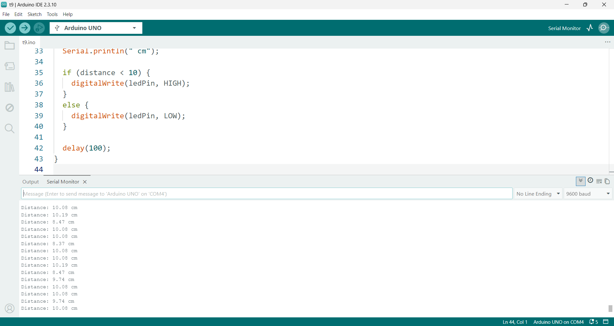

<h1 dir="rtl" align="center">جلسه 17: کار با <bdi><strong>Ultrasonic</strong></bdi> و سنسور <bdi><strong>HC-SR04</strong></bdi></h1>


<hr>

<h2 dir="rtl" align="right">🎯 هدف جلسه</h2>

<p dir="rtl" align="right">
در این جلسه می‌خواهیم با یکی از سنسورهای بسیار کاربردی در پروژه‌های آردوینو یعنی سنسور فاصله‌سنج اولتراسونیک آشنا شویم.
</p>

<p dir="rtl" align="right">
سنسور <bdi><strong>HC-SR04</strong></bdi> می‌تواند با استفاده از امواج صوتی با فرکانس بالا، فاصله یک جسم تا سنسور را اندازه‌گیری کند.
</p>

<p dir="rtl" align="right">
در این جلسه با مفاهیم زیر آشنا می‌شویم:
</p>

<ul dir="rtl">
<li>آشنایی با <bdi><strong>Ultrasonic</strong></bdi></li>
<li>معرفی سنسور <bdi><strong>HC-SR04</strong></bdi></li>
<li>شناخت پایه‌های سنسور</li>
<li>اتصال سنسور به آردوینو</li>
<li>ارسال پالس <bdi><strong>Trigger</strong></bdi></li>
<li>دریافت پالس <bdi><strong>Echo</strong></bdi></li>
<li>کار با تابع <bdi><strong>pulseIn()</strong></bdi></li>
<li>محاسبه فاصله بر حسب سانتی‌متر</li>
<li>نمایش فاصله در <bdi><strong>Serial Monitor</strong></bdi></li>
<li>روشن کردن LED بر اساس فاصله</li>
<li>ساخت یک پروژه فاصله‌سنج ساده</li>
</ul>

<hr>

<h2 dir="rtl" align="right">📌 <bdi><strong>Ultrasonic</strong></bdi> چیست؟</h2>

<p dir="rtl" align="right">
کلمه <bdi><strong>Ultrasonic</strong></bdi> به معنی «فراصوت» است.
</p>

<p dir="rtl" align="right">
امواج فراصوت، امواج صوتی‌ای هستند که فرکانس آن‌ها بالاتر از محدوده شنوایی انسان است.
</p>

<p dir="rtl" align="right">
سنسور <bdi><strong>HC-SR04</strong></bdi> با ارسال یک موج صوتی و اندازه‌گیری مدت زمانی که طول می‌کشد تا بازتاب آن به سنسور برگردد، فاصله جسم را محاسبه می‌کند.
</p>

<p dir="rtl" align="right">
یعنی روند کار به صورت ساده این است:
</p>

<p dir="rtl" align="center">
<b>ارسال موج صوتی → برخورد به جسم → بازتاب موج → دریافت بازتاب → محاسبه زمان → محاسبه فاصله</b>
</p>

<hr>

<h2 dir="rtl" align="right">📌 معرفی سنسور <bdi><strong>HC-SR04</strong></bdi></h2>

<p dir="rtl" align="right">
<bdi><strong>HC-SR04</strong></bdi> یکی از سنسورهای رایج برای اندازه‌گیری فاصله در پروژه‌های آردوینو است.
</p>

<p dir="rtl" align="right">
این ماژول معمولاً دارای چهار پایه است:
</p>

<table dir="rtl">
<tr>
<th>پایه</th>
<th>وظیفه</th>
</tr>
<tr>
<td><bdi><strong>VCC</strong></bdi></td>
<td>تغذیه سنسور</td>
</tr>
<tr>
<td><bdi><strong>TRIG</strong></bdi></td>
<td>ارسال فرمان شروع اندازه‌گیری</td>
</tr>
<tr>
<td><bdi><strong>ECHO</strong></bdi></td>
<td>دریافت مدت زمان بازگشت موج</td>
</tr>
<tr>
<td><bdi><strong>GND</strong></bdi></td>
<td>زمین</td>
</tr>
</table>

<p dir="rtl" align="right">
در پروژه امروز از آردوینو <bdi><strong>UNO</strong></bdi> استفاده می‌کنیم.
</p>
<p align="center">
  
</p>
<hr>

<h2 dir="rtl" align="right">📌 نحوه عملکرد <bdi><strong>HC-SR04</strong></bdi></h2>

<p dir="rtl" align="right">
ابتدا آردوینو یک پالس کوتاه به پایه <bdi><strong>TRIG</strong></bdi> ارسال می‌کند.
</p>

<p dir="rtl" align="right">
سنسور پس از دریافت این فرمان، موج فراصوت را ارسال می‌کند.
</p>

<p dir="rtl" align="right">
اگر جسمی در مقابل سنسور قرار داشته باشد، موج به جسم برخورد کرده و بازتاب می‌شود.
</p>

<p dir="rtl" align="right">
سنسور مدت زمان برگشت موج را روی پایه <bdi><strong>ECHO</strong></bdi> ایجاد می‌کند.
</p>

<p dir="rtl" align="right">
آردوینو با اندازه‌گیری این زمان می‌تواند فاصله را محاسبه کند.
</p>

<p dir="rtl" align="center">
<b>هرچه جسم دورتر باشد → زمان برگشت بیشتر است</b>
</p>

<p dir="rtl" align="center">
<b>هرچه جسم نزدیک‌تر باشد → زمان برگشت کمتر است</b>
</p>

<hr>

<h2 dir="rtl" align="right">📌 اتصال <bdi><strong>HC-SR04</strong></bdi> به آردوینو</h2>

<table dir="rtl">
<tr>
<th>HC-SR04</th>
<th>Arduino UNO</th>
</tr>
<tr>
<td><bdi><strong>VCC</strong></bdi></td>
<td>5V</td>
</tr>
<tr>
<td><bdi><strong>TRIG</strong></bdi></td>
<td>D9</td>
</tr>
<tr>
<td><bdi><strong>ECHO</strong></bdi></td>
<td>D10</td>
</tr>
<tr>
<td><bdi><strong>GND</strong></bdi></td>
<td>GND</td>
</tr>
</table>

<p dir="rtl" align="right">
در این مثال پایه <bdi><strong>TRIG</strong></bdi> را به پایه ۹ و پایه <bdi><strong>ECHO</strong></bdi> را به پایه ۱۰ آردوینو متصل می‌کنیم.
</p>

<hr>

<h2 dir="rtl" align="right">📌 اولین برنامه <bdi><strong>Ultrasonic</strong></bdi></h2>

<p dir="rtl" align="right">
ابتدا یک برنامه ساده می‌نویسیم که فاصله جسم را در <bdi><strong>Serial Monitor</strong></bdi> نمایش دهد.
</p>

```cpp
const int trigPin = 9;
const int echoPin = 10;

float duration;
float distance;

void setup() {
  pinMode(trigPin, OUTPUT);
  pinMode(echoPin, INPUT);

  Serial.begin(9600);
}

void loop() {

  digitalWrite(trigPin, LOW);
  delayMicroseconds(2);

  digitalWrite(trigPin, HIGH);
  delayMicroseconds(10);

  digitalWrite(trigPin, LOW);

  duration = pulseIn(echoPin, HIGH);

  distance = (duration * 0.0343) / 2;

  Serial.print("Distance: ");
  Serial.print(distance);
  Serial.println(" cm");

  delay(100);
}
```

<p dir="rtl" align="right">
در نمونه‌های آموزشی Arduino نیز همین روش کلی برای راه‌اندازی <bdi><strong>HC-SR04</strong></bdi> استفاده می‌شود: ایجاد پالس روی <bdi><strong>TRIG</strong></bdi>، خواندن مدت پالس <bdi><strong>ECHO</strong></bdi> با <bdi><strong>pulseIn()</strong></bdi> و تبدیل زمان به فاصله.
</p>

<hr>

<h2 dir="rtl" align="right">📌 بررسی کد</h2>

<h3 dir="rtl" align="right">1️⃣ تعریف پایه‌ها</h3>

```cpp
const int trigPin = 9;
const int echoPin = 10;
```

<p dir="rtl" align="right">
در این قسمت مشخص می‌کنیم پایه <bdi><strong>TRIG</strong></bdi> به پایه ۹ و پایه <bdi><strong>ECHO</strong></bdi> به پایه ۱۰ متصل شده است.
</p>

<h3 dir="rtl" align="right">2️⃣ تنظیم ورودی و خروجی</h3>

```cpp
pinMode(trigPin, OUTPUT);
pinMode(echoPin, INPUT);
```

<p dir="rtl" align="right">
چون آردوینو فرمان را از طریق <bdi><strong>TRIG</strong></bdi> ارسال می‌کند، این پایه <bdi><strong>OUTPUT</strong></bdi> است.
</p>

<p dir="rtl" align="right">
پایه <bdi><strong>ECHO</strong></bdi> اطلاعات را به آردوینو می‌دهد، بنابراین <bdi><strong>INPUT</strong></bdi> است.
</p>

<h3 dir="rtl" align="right">3️⃣ ایجاد پالس <bdi><strong>TRIG</strong></bdi></h3>

```cpp
digitalWrite(trigPin, LOW);
delayMicroseconds(2);

digitalWrite(trigPin, HIGH);
delayMicroseconds(10);

digitalWrite(trigPin, LOW);
```

<p dir="rtl" align="right">
در این قسمت یک پالس کوتاه روی پایه <bdi><strong>TRIG</strong></bdi> ایجاد می‌کنیم.
</p>

<p dir="rtl" align="right">
پالس <bdi><strong>HIGH</strong></bdi> در این مثال به مدت ۱۰ میکروثانیه باقی می‌ماند. این روش در نمونه‌های رسمی‌تر و آموزشی Arduino برای <bdi><strong>HC-SR04</strong></bdi> نیز استفاده شده است.
</p>

<h3 dir="rtl" align="right">4️⃣ استفاده از <bdi><strong>pulseIn()</strong></bdi></h3>

```cpp
duration = pulseIn(echoPin, HIGH);
```

<p dir="rtl" align="right">
تابع <bdi><strong>pulseIn()</strong></bdi> مدت زمانی را که پایه موردنظر در وضعیت مشخصی قرار دارد اندازه‌گیری می‌کند.
</p>

<p dir="rtl" align="right">
در اینجا منتظر می‌مانیم تا پایه <bdi><strong>ECHO</strong></bdi> در وضعیت <bdi><strong>HIGH</strong></bdi> قرار بگیرد و مدت زمان آن را بر حسب میکروثانیه دریافت می‌کنیم.
</p>

<h3 dir="rtl" align="right">5️⃣ محاسبه فاصله</h3>

```cpp
distance = (duration * 0.0343) / 2;
```

<p dir="rtl" align="right">
سرعت صوت تقریباً برابر با ۰٫۰۳۴۳ سانتی‌متر بر میکروثانیه در نظر گرفته می‌شود.
</p>

<p dir="rtl" align="right">
اما یک نکته بسیار مهم وجود دارد:
</p>

<p dir="rtl" align="right">
موج ابتدا از سنسور به جسم می‌رود و سپس از جسم به سنسور برمی‌گردد. بنابراین زمان اندازه‌گیری‌شده مربوط به مسیر رفت و برگشت است.
</p>

<p dir="rtl" align="center">
<b>فاصله = (زمان × سرعت صوت) ÷ ۲</b>
</p>

<p dir="rtl" align="right">
به همین دلیل عدد نهایی را بر ۲ تقسیم می‌کنیم.
</p>

<hr>

<h2 dir="rtl" align="right">📌 مشاهده فاصله در <bdi><strong>Serial Monitor</strong></bdi></h2>

<p dir="rtl" align="right">
بعد از آپلود برنامه، <bdi><strong>Serial Monitor</strong></bdi> را با سرعت <bdi><strong>9600 Baud</strong></bdi> باز کنید.
</p>

<p dir="rtl" align="right">
حالا اگر یک جسم را جلوی سنسور حرکت دهید، مقدار فاصله تغییر خواهد کرد.
</p>

<p dir="rtl" align="right">
برای مثال ممکن است خروجی چیزی شبیه این باشد:
</p>

```text
Distance: 25.41 cm
Distance: 25.12 cm
Distance: 24.87 cm
Distance: 23.96 cm
```

<p dir="rtl" align="right">
طبیعی است که مقدار اندازه‌گیری‌شده کمی نوسان داشته باشد؛ چون اندازه‌گیری با امواج صوتی و شرایط محیطی انجام می‌شود.
</p>

<hr>

<h2 dir="rtl" align="right">📌 تبدیل فاصله به اینچ</h2>

<p dir="rtl" align="right">
می‌توانیم علاوه بر سانتی‌متر، فاصله را بر حسب <bdi><strong>Inch</strong></bdi> نیز محاسبه کنیم.
</p>

```cpp
float distanceInch;

distanceInch = distance * 0.3937;

Serial.print("Distance: ");
Serial.print(distance);
Serial.print(" cm | ");

Serial.print(distanceInch);
Serial.println(" inch");
```

<p dir="rtl" align="right">
هر سانتی‌متر تقریباً برابر با ۰٫۳۹۳۷ اینچ است.
</p>

<hr>

<h2 dir="rtl" align="right">📌 کنترل LED با فاصله</h2>

<p dir="rtl" align="right">
حالا می‌خواهیم یک پروژه کاربردی‌تر بسازیم.
</p>

<p dir="rtl" align="right">
اگر جسم به سنسور نزدیک شود، LED روشن شود و اگر جسم از فاصله مشخصی دورتر باشد، LED خاموش شود.
</p>

<p dir="rtl" align="right">
در این مثال اگر فاصله کمتر از ۱۰ سانتی‌متر باشد، LED روشن می‌شود.
</p>

```cpp
const int trigPin = 9;
const int echoPin = 10;
const int ledPin = 13;

float duration;
float distance;

void setup() {

  pinMode(trigPin, OUTPUT);
  pinMode(echoPin, INPUT);
  pinMode(ledPin, OUTPUT);

  Serial.begin(9600);
}

void loop() {

  digitalWrite(trigPin, LOW);
  delayMicroseconds(2);

  digitalWrite(trigPin, HIGH);
  delayMicroseconds(10);

  digitalWrite(trigPin, LOW);

  duration = pulseIn(echoPin, HIGH);

  distance = (duration * 0.0343) / 2;

  Serial.print("Distance: ");
  Serial.print(distance);
  Serial.println(" cm");

  if (distance < 10) {
    digitalWrite(ledPin, HIGH);
  }
  else {
    digitalWrite(ledPin, LOW);
  }

  delay(100);
}
```
<p align="center">
  
</p>
<hr>

<h2 dir="rtl" align="right">📌 ساخت فاصله‌سنج ساده</h2>

<p dir="rtl" align="right">
حالا یک پروژه کامل‌تر می‌سازیم که بتواند فاصله را اندازه‌گیری کند و بر اساس فاصله، وضعیت مختلفی را ایجاد کند.
</p>

<p dir="rtl" align="right">
در این پروژه:
</p>

<ul dir="rtl">
<li>فاصله کمتر از ۱۰ سانتی‌متر → LED روشن</li>
<li>فاصله بین ۱۰ تا ۲۰ سانتی‌متر → LED چشمک‌زن</li>
<li>فاصله بیشتر از ۲۰ سانتی‌متر → LED خاموش</li>
</ul>

```cpp
const int trigPin = 9;
const int echoPin = 10;
const int ledPin = 13;

float duration;
float distance;

void setup() {

  pinMode(trigPin, OUTPUT);
  pinMode(echoPin, INPUT);
  pinMode(ledPin, OUTPUT);

  Serial.begin(9600);
}

void loop() {

  digitalWrite(trigPin, LOW);
  delayMicroseconds(2);

  digitalWrite(trigPin, HIGH);
  delayMicroseconds(10);

  digitalWrite(trigPin, LOW);

  duration = pulseIn(echoPin, HIGH);

  distance = (duration * 0.0343) / 2;

  Serial.print("Distance: ");
  Serial.print(distance);
  Serial.println(" cm");

  if (distance < 10) {

    digitalWrite(ledPin, HIGH);

  }
  else if (distance >= 10 && distance < 20) {

    digitalWrite(ledPin, HIGH);
    delay(100);

    digitalWrite(ledPin, LOW);
    delay(100);

  }
  else {

    digitalWrite(ledPin, LOW);

  }
}
```

<hr>

<h2 dir="rtl" align="right">📌 نکته مهم درباره <bdi><strong>pulseIn()</strong></bdi></h2>

<p dir="rtl" align="right">
تابع <bdi><strong>pulseIn()</strong></bdi> می‌تواند تا دریافت پالس منتظر بماند.
</p>

<p dir="rtl" align="right">
اگر سنسور نتواند بازتاب مناسبی دریافت کند، ممکن است برنامه مدت بیشتری منتظر بماند.
</p>

<p dir="rtl" align="right">
می‌توانیم برای آن یک <bdi><strong>Timeout</strong></bdi> تعیین کنیم:
</p>

```cpp
duration = pulseIn(echoPin, HIGH, 30000);
```

<p dir="rtl" align="right">
عدد <bdi><strong>30000</strong></bdi> یعنی حداکثر زمان انتظار بر حسب میکروثانیه.
</p>

<p dir="rtl" align="right">
این روش در پروژه‌هایی که نمی‌خواهیم برنامه در صورت نبودن بازتاب برای مدت نامشخص منتظر بماند، مفید است.
</p>

<hr>

<h2 dir="rtl" align="right">📌 بررسی نبودن بازتاب</h2>

<p dir="rtl" align="right">
اگر <bdi><strong>pulseIn()</strong></bdi> نتواند پالس موردنظر را در زمان تعیین‌شده دریافت کند، مقدار برگشتی می‌تواند صفر باشد.
</p>

```cpp
duration = pulseIn(echoPin, HIGH, 30000);

if (duration == 0) {

  Serial.println("No Echo");

}
else {

  distance = (duration * 0.0343) / 2;

  Serial.print("Distance: ");
  Serial.print(distance);
  Serial.println(" cm");
}
```

<p dir="rtl" align="right">
این روش باعث می‌شود برنامه بتواند شرایطی را که در آن بازتاب مناسبی دریافت نشده است، تشخیص دهد.
</p>

<hr>

<h2 dir="rtl" align="right">📌 نمایش فاصله روی <bdi><strong>LCD</strong></bdi></h2>

<p dir="rtl" align="right">
یکی از کاربردهای جالب <bdi><strong>HC-SR04</strong></bdi> ترکیب آن با LCD است.
</p>

<p dir="rtl" align="right">
در این حالت می‌توانیم فاصله را به صورت مستقیم روی نمایشگر مشاهده کنیم.
</p>

```cpp
#include <LiquidCrystal.h>

LiquidCrystal lcd(2, 3, 4, 5, 6, 7);

const int trigPin = 9;
const int echoPin = 10;

float duration;
float distance;

void setup() {

  lcd.begin(16, 2);

  pinMode(trigPin, OUTPUT);
  pinMode(echoPin, INPUT);
}

void loop() {

  digitalWrite(trigPin, LOW);
  delayMicroseconds(2);

  digitalWrite(trigPin, HIGH);
  delayMicroseconds(10);

  digitalWrite(trigPin, LOW);

  duration = pulseIn(echoPin, HIGH);

  distance = (duration * 0.0343) / 2;

  lcd.clear();

  lcd.setCursor(0, 0);
  lcd.print("Distance:");

  lcd.setCursor(0, 1);
  lcd.print(distance);
  lcd.print(" cm");

  delay(200);
}
```

<p dir="rtl" align="right">
با این روش می‌توانیم یک <bdi><strong>Distance Meter</strong></bdi> ساده بسازیم. نمونه‌های پروژه‌ای Arduino نیز ترکیب <bdi><strong>HC-SR04</strong></bdi> و LCD را برای نمایش فاصله به کار می‌برند.
</p>

<hr>

<h2 dir="rtl" align="right">📌 کاربردهای <bdi><strong>Ultrasonic</strong></bdi></h2>

<p dir="rtl" align="right">
سنسورهای اولتراسونیک در پروژه‌های مختلفی استفاده می‌شوند، از جمله:
</p>

<ul dir="rtl">
<li>تشخیص وجود جسم</li>
<li>اندازه‌گیری فاصله</li>
<li>ربات‌های مسیریاب</li>
<li>سیستم جلوگیری از برخورد</li>
<li>پارک خودکار</li>
<li>سطل زباله هوشمند</li>
<li>سیستم هشدار نزدیک شدن جسم</li>
<li>فاصله‌سنج دیجیتال</li>
<li>پروژه‌های رباتیک</li>
</ul>

<hr>

<h2 dir="rtl" align="right">📌 خطاهای رایج</h2>

<h3 dir="rtl" align="right">❌ جابه‌جا کردن <bdi><strong>TRIG</strong></bdi> و <bdi><strong>ECHO</strong></bdi></h3>

<p dir="rtl" align="right">
اگر این دو پایه اشتباه متصل شوند، سنسور نمی‌تواند به شکل صحیح کار کند.
</p>

<h3 dir="rtl" align="right">❌ فراموش کردن <bdi><strong>pinMode()</strong></bdi></h3>

<p dir="rtl" align="right">
باید <bdi><strong>TRIG</strong></bdi> را <bdi><strong>OUTPUT</strong></bdi> و <bdi><strong>ECHO</strong></bdi> را <bdi><strong>INPUT</strong></bdi> تعریف کنیم.
</p>

<h3 dir="rtl" align="right">❌ استفاده نکردن از تقسیم بر ۲</h3>

<p dir="rtl" align="right">
زمان اندازه‌گیری‌شده مربوط به مسیر رفت و برگشت موج است؛ بنابراین برای محاسبه فاصله یک‌طرفه باید آن را بر ۲ تقسیم کنیم.
</p>

<h3 dir="rtl" align="right">❌ جسم نامناسب برای بازتاب</h3>

<p dir="rtl" align="right">
سطح، زاویه و شرایط جسم می‌تواند روی کیفیت بازتاب موج اثر بگذارد و باعث نوسان یا خطای اندازه‌گیری شود.
</p>

<hr>

<h2 dir="rtl" align="right">🧪 تمرین‌های جلسه</h2>

<ol dir="rtl">
<li>سنسور <bdi><strong>HC-SR04</strong></bdi> را به آردوینو متصل کنید و فاصله را در <bdi><strong>Serial Monitor</strong></bdi> نمایش دهید.</li>
<li>برنامه‌ای بنویسید که فاصله را بر حسب <bdi><strong>Inch</strong></bdi> نمایش دهد.</li>
<li>اگر فاصله کمتر از ۲۰ سانتی‌متر شد، LED را روشن کنید.</li>
<li>اگر فاصله کمتر از ۱۰ سانتی‌متر شد، LED را سریع چشمک‌زن کنید.</li>
<li>سه LED قرار دهید و بر اساس فاصله، یکی از آن‌ها را روشن کنید.</li>
<li>فاصله را روی LCD 16×2 نمایش دهید.</li>
<li>یک <bdi><strong>Distance Meter</strong></bdi> بسازید.</li>
<li>با تغییر فاصله، سرعت چشمک زدن LED را تغییر دهید.</li>
<li>یک <bdi><strong>Buzzer</strong></bdi> اضافه کنید تا هرچه جسم نزدیک‌تر شد، صدای هشدار سریع‌تر شود.</li>
</ol>

<hr>

<h2 dir="rtl" align="right">📌 پروژه پیشنهادی جلسه</h2>

<p dir="rtl" align="right">
یک سیستم هشدار فاصله بسازید.
</p>

<p dir="rtl" align="right">
قوانین پروژه:
</p>

<table dir="rtl">
<tr>
<th>فاصله</th>
<th>وضعیت</th>
</tr>
<tr>
<td>بیشتر از ۳۰ سانتی‌متر</td>
<td>LED خاموش</td>
</tr>
<tr>
<td>بین ۱۵ تا ۳۰ سانتی‌متر</td>
<td>LED چشمک‌زن</td>
</tr>
<tr>
<td>کمتر از ۱۵ سانتی‌متر</td>
<td>LED روشن + هشدار</td>
</tr>
</table>

<p dir="rtl" align="right">
این پروژه تمرین بسیار خوبی برای ترکیب <bdi><strong>Sensor + Condition + Output</strong></bdi> است.
</p>

<hr>

<h2 dir="rtl" align="right">📌 نکته مهم</h2>

<p dir="rtl" align="right">
در پروژه‌های واقعی بهتر است فقط به یک اندازه‌گیری اکتفا نکنیم و در صورت نیاز چند اندازه‌گیری انجام داده و از آن‌ها برای کاهش نوسان استفاده کنیم.
</p>

<p dir="rtl" align="right">
همچنین مقدار فاصله‌ای که سنسور می‌تواند به شکل قابل‌اعتماد اندازه‌گیری کند به مدل سنسور و شرایط محیط بستگی دارد؛ بنابراین در پروژه‌های عملی باید مشخصات همان ماژولی که در اختیار داریم بررسی شود.
</p>

<hr>

<h2 dir="rtl" align="right">📌 جمع‌بندی جلسه</h2>

<p dir="rtl" align="right">
در این جلسه با سنسور <bdi><strong>Ultrasonic HC-SR04</strong></bdi> آشنا شدیم.
</p>

<p dir="rtl" align="right">
یاد گرفتیم که این سنسور با ارسال موج فراصوت و اندازه‌گیری زمان بازگشت آن می‌تواند فاصله جسم را محاسبه کند.
</p>

<p dir="rtl" align="right">
همچنین با پایه‌های زیر کار کردیم:
</p>

<ul dir="rtl">
<li><bdi><strong>VCC</strong></bdi></li>
<li><bdi><strong>TRIG</strong></bdi></li>
<li><bdi><strong>ECHO</strong></bdi></li>
<li><bdi><strong>GND</strong></bdi></li>
</ul>

<p dir="rtl" align="right">
مهم‌ترین دستورات این جلسه:
</p>

```cpp
digitalWrite()
delayMicroseconds()
pulseIn()
Serial.print()
```

<p dir="rtl" align="right">
و در نهایت یاد گرفتیم چگونه زمان برگشت موج را به فاصله تبدیل کنیم:
</p>

```cpp
distance = (duration * 0.0343) / 2;
```

<p dir="rtl" align="right">
با همین مفاهیم ساده می‌توانیم پروژه‌های بسیار جذابی مثل فاصله‌سنج، سیستم هشدار، ربات جلوگیری از برخورد و سیستم تشخیص جسم بسازیم.
</p>

<hr>


<h2 dir="rtl" align="right">⏭️ پیش‌نمایش جلسه بعد</h2>

<p dir="rtl" align="right">
در جلسه ۱۸ سراغ یکی از سنسورهای کاربردی اندازه‌گیری شدت نور می‌رویم:
</p>

<h3 dir="rtl" align="right">💡 کار با <bdi><strong>BH1750</strong></bdi></h3>

<p dir="rtl" align="right">
در جلسه بعد با سنسور <bdi><strong>BH1750</strong></bdi> آشنا می‌شویم و یاد می‌گیریم چگونه شدت نور محیط را به صورت عددی اندازه‌گیری کنیم.
</p>

<p dir="rtl" align="right">
در این جلسه یاد می‌گیریم:
</p>

<ul dir="rtl">
<li><bdi><strong>BH1750</strong></bdi> چیست؟</li>
<li>نحوه عملکرد سنسور اندازه‌گیری شدت نور</li>
<li>آشنایی با واحد <bdi><strong>Lux</strong></bdi></li>
<li>شناخت پایه‌های <bdi><strong>BH1750</strong></bdi></li>
<li>آشنایی با ارتباط <bdi><strong>I2C</strong></bdi></li>
<li>اتصال <bdi><strong>BH1750</strong></bdi> به آردوینو</li>
<li>نصب و استفاده از کتابخانه مربوط به سنسور</li>
<li>خواندن مقدار شدت نور محیط</li>
<li>نمایش مقدار <bdi><strong>Lux</strong></bdi> در <bdi><strong>Serial Monitor</strong></bdi></li>
<li>تغییر وضعیت LED بر اساس شدت نور</li>
<li>و در نهایت ساخت یک پروژه کاربردی با <bdi><strong>BH1750</strong></bdi></li>
</ul>

<p dir="rtl" align="center">
🔥 جلسه بعد وارد دنیای اندازه‌گیری دیجیتال شدت نور و ارتباط <bdi><strong>I2C</strong></bdi> می‌شویم.
</p>

<hr>

<p dir="rtl" align="right">
⬅️ <a href="../16-Remote-RF/">جلسه 16 — کار با <bdi><strong>Remote RF</strong></bdi> و <bdi><strong>RXB61</strong></bdi></a>
</p>

<p dir="rtl" align="right">
➡️ <a href="../18-BH1750/">جلسه 18 — کار با <bdi><strong>BH1750</strong></bdi> و اندازه‌گیری شدت نور</a>
</p>


<p align="center"><strong>Arduino From Zero to Projects</strong></p>
<p align="center"><strong>Mohammad Esteghamat</strong></p>
