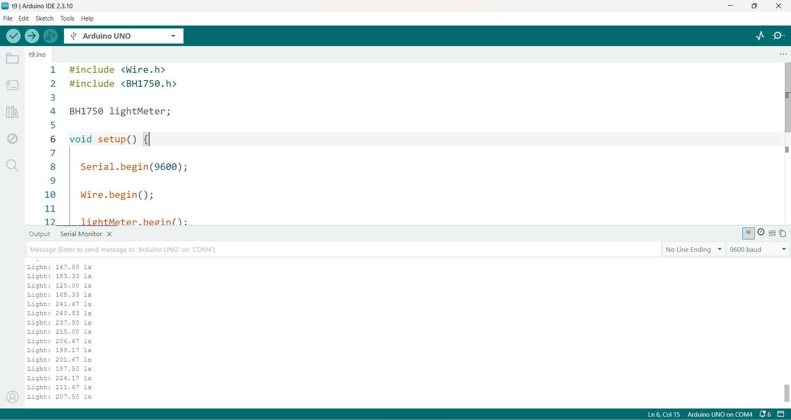

<h1 dir="rtl" align="center">جلسه 18: کار با <bdi><strong>BH1750</strong></bdi> و اندازه‌گیری شدت نور</h1>


<hr>

<h2 dir="rtl" align="right">🎯 هدف جلسه</h2>

<p dir="rtl" align="right">
در جلسه قبل با سنسور <bdi><strong>Ultrasonic</strong></bdi> آشنا شدیم و یاد گرفتیم چگونه فاصله یک جسم را اندازه‌گیری کنیم.
</p>

<p dir="rtl" align="right">
در این جلسه می‌خواهیم سراغ یک سنسور کاربردی دیگر برویم؛ سنسور <bdi><strong>BH1750</strong></bdi>.
</p>

<p dir="rtl" align="right">
<bdi><strong>BH1750</strong></bdi> یک سنسور دیجیتال برای اندازه‌گیری شدت نور محیط است و نتیجه اندازه‌گیری را می‌توان بر حسب <bdi><strong>Lux</strong></bdi> دریافت کرد.
</p>

<p dir="rtl" align="right">
در این جلسه با مفاهیم زیر آشنا می‌شویم:
</p>

<ul dir="rtl">
<li>آشنایی با سنسور <bdi><strong>BH1750</strong></bdi></li>
<li>مفهوم <bdi><strong>Lux</strong></bdi></li>
<li>شناخت پایه‌های سنسور</li>
<li>آشنایی با ارتباط <bdi><strong>I2C</strong></bdi></li>
<li>اتصال <bdi><strong>BH1750</strong></bdi> به Arduino UNO</li>
<li>آشنایی با کتابخانه <bdi><strong>BH1750</strong></bdi></li>
<li>خواندن شدت نور محیط</li>
<li>نمایش مقدار نور در <bdi><strong>Serial Monitor</strong></bdi></li>
<li>تغییر وضعیت LED بر اساس شدت نور</li>
<li>آشنایی با آدرس <bdi><strong>I2C</strong></bdi></li>
<li>ساخت چراغ هوشمند با <bdi><strong>BH1750</strong></bdi></li>
</ul>

<hr>

<h2 dir="rtl" align="right">📌 <bdi><strong>BH1750</strong></bdi> چیست؟</h2>

<p dir="rtl" align="right">
<bdi><strong>BH1750</strong></bdi> یک سنسور دیجیتال اندازه‌گیری شدت نور محیط است.
</p>

<p dir="rtl" align="right">
برخلاف بعضی روش‌های ساده اندازه‌گیری نور، این سنسور مقدار نور را به صورت دیجیتال در اختیار میکروکنترلر قرار می‌دهد.
</p>

<p dir="rtl" align="right">
ارتباط سنسور با آردوینو از طریق پروتکل <bdi><strong>I2C</strong></bdi> انجام می‌شود.
</p>

<p dir="rtl" align="right">
یکی از مزیت‌های مهم <bdi><strong>BH1750</strong></bdi> این است که خروجی آن مستقیماً برای اندازه‌گیری شدت روشنایی بر حسب <bdi><strong>Lux</strong></bdi> مناسب است.
</p>

<p align="center">
  
</p>

<hr>

<h2 dir="rtl" align="right">📌 <bdi><strong>Lux</strong></bdi> چیست؟</h2>

<p dir="rtl" align="right">
واحد <bdi><strong>Lux</strong></bdi> برای بیان شدت روشنایی یک سطح استفاده می‌شود.
</p>

<p dir="rtl" align="right">
به زبان ساده، هرچه مقدار <bdi><strong>Lux</strong></bdi> بیشتر باشد، نور بیشتری به سطح مورد اندازه‌گیری می‌رسد.
</p>

<p dir="rtl" align="center">
<b>نور کم → Lux کمتر</b>
</p>

<p dir="rtl" align="center">
<b>نور زیاد → Lux بیشتر</b>
</p>

<p dir="rtl" align="right">
به عنوان یک دید کلی، یک محیط بسیار تاریک می‌تواند مقدار بسیار کمی <bdi><strong>Lux</strong></bdi> داشته باشد، در حالی که محیط‌های کاری روشن یا نور مستقیم خورشید مقادیر بسیار بزرگ‌تری ایجاد می‌کنند.
</p>

<p dir="rtl" align="right">
بنابراین مقدار <bdi><strong>Lux</strong></bdi> یک عدد ثابت برای همه محیط‌ها نیست و به شرایط نور، زاویه سنسور و محل قرارگیری آن بستگی دارد.
</p>

<hr>

<h2 dir="rtl" align="right">📌 پایه‌های ماژول <bdi><strong>BH1750</strong></bdi></h2>

<p dir="rtl" align="right">
ماژول‌های رایج <bdi><strong>BH1750</strong></bdi> مانند <bdi><strong>GY-30</strong></bdi> معمولاً دارای پایه‌های زیر هستند:
</p>

<table dir="rtl">
<tr>
<th>پایه</th>
<th>وظیفه</th>
</tr>
<tr>
<td><bdi><strong>VCC</strong></bdi></td>
<td>تغذیه سنسور</td>
</tr>
<tr>
<td><bdi><strong>GND</strong></bdi></td>
<td>زمین</td>
</tr>
<tr>
<td><bdi><strong>SDA</strong></bdi></td>
<td>خط داده <bdi><strong>I2C</strong></bdi></td>
</tr>
<tr>
<td><bdi><strong>SCL</strong></bdi></td>
<td>خط کلاک <bdi><strong>I2C</strong></bdi></td>
</tr>
<tr>
<td><bdi><strong>ADDR</strong></bdi></td>
<td>انتخاب آدرس <bdi><strong>I2C</strong></bdi></td>
</tr>
</table>

<p dir="rtl" align="right">
بسته به نوع ماژول ممکن است نام پایه <bdi><strong>ADDR</strong></bdi> به شکل دیگری مانند <bdi><strong>ADD</strong></bdi> نوشته شده باشد.
</p>

<hr>

<h2 dir="rtl" align="right">📌 ارتباط <bdi><strong>I2C</strong></bdi> چیست؟</h2>

<p dir="rtl" align="right">
<bdi><strong>I2C</strong></bdi> یکی از پروتکل‌های ارتباطی بسیار پرکاربرد در پروژه‌های الکترونیکی است.
</p>

<p dir="rtl" align="right">
در این روش معمولاً دو خط اصلی برای ارتباط استفاده می‌شود:
</p>

<table dir="rtl">
<tr>
<th>خط</th>
<th>نام</th>
<th>وظیفه</th>
</tr>
<tr>
<td>1</td>
<td><bdi><strong>SDA</strong></bdi></td>
<td>انتقال داده</td>
</tr>
<tr>
<td>2</td>
<td><bdi><strong>SCL</strong></bdi></td>
<td>کلاک ارتباط</td>
</tr>
</table>

<p dir="rtl" align="right">
در Arduino UNO پایه‌های <bdi><strong>I2C</strong></bdi> به صورت زیر هستند:
</p>

<table dir="rtl">
<tr>
<th>Arduino UNO</th>
<th>I2C</th>
</tr>
<tr>
<td>A4</td>
<td><bdi><strong>SDA</strong></bdi></td>
</tr>
<tr>
<td>A5</td>
<td><bdi><strong>SCL</strong></bdi></td>
</tr>
</table>

<p dir="rtl" align="right">
در بردهای مختلف Arduino ممکن است پایه‌های <bdi><strong>I2C</strong></bdi> متفاوت باشند؛ بنابراین همیشه باید پایه‌های مخصوص همان برد را بررسی کنیم.
</p>

<hr>

<h2 dir="rtl" align="right">📌 اتصال <bdi><strong>BH1750</strong></bdi> به Arduino UNO</h2>

<p dir="rtl" align="right">
در این جلسه از Arduino UNO استفاده می‌کنیم.
</p>

<table dir="rtl">
<tr>
<th>BH1750</th>
<th>Arduino UNO</th>
</tr>
<tr>
<td><bdi><strong>VCC</strong></bdi></td>
<td>5V</td>
</tr>
<tr>
<td><bdi><strong>GND</strong></bdi></td>
<td>GND</td>
</tr>
<tr>
<td><bdi><strong>SDA</strong></bdi></td>
<td>A4</td>
</tr>
<tr>
<td><bdi><strong>SCL</strong></bdi></td>
<td>A5</td>
</tr>
<tr>
<td><bdi><strong>ADDR</strong></bdi></td>
<td>بدون اتصال یا GND</td>
</tr>
</table>

<p dir="rtl" align="right">
در ماژول‌های رایج <bdi><strong>GY-30</strong></bdi>، پایه <bdi><strong>ADDR</strong></bdi> در حالت Low یا بدون اتصال معمولاً آدرس <bdi><strong>0x23</strong></bdi> را انتخاب می‌کند و با قرار گرفتن در حالت High آدرس به <bdi><strong>0x5C</strong></bdi> تغییر می‌کند.
</p>

<hr>

<h2 dir="rtl" align="right">📌 چرا از <bdi><strong>I2C</strong></bdi> استفاده می‌کنیم؟</h2>

<p dir="rtl" align="right">
یکی از مزیت‌های <bdi><strong>I2C</strong></bdi> این است که می‌توانیم چند وسیله را روی یک باس ارتباطی قرار دهیم و هر وسیله را با آدرس آن شناسایی کنیم.
</p>

<p dir="rtl" align="right">
به همین دلیل در پروژه‌های آردوینو سنسورهایی مثل <bdi><strong>BH1750</strong></bdi>، نمایشگرهای <bdi><strong>OLED</strong></bdi> و بسیاری از ماژول‌های دیگر از <bdi><strong>I2C</strong></bdi> استفاده می‌کنند.
</p>

<hr>

<h2 dir="rtl" align="right">📌 نصب کتابخانه <bdi><strong>BH1750</strong></bdi></h2>

<p dir="rtl" align="right">
برای اینکه کار با سنسور ساده‌تر شود، می‌توانیم از کتابخانه <bdi><strong>BH1750</strong></bdi> استفاده کنیم.
</p>

<p dir="rtl" align="right">
در <bdi><strong>Arduino IDE</strong></bdi> وارد مسیر زیر شوید:
</p>

```text
Sketch
↓
Include Library
↓
Manage Libraries
```

<p dir="rtl" align="right">
سپس عبارت زیر را جستجو کنید:
</p>

```text
BH1750
```

<p dir="rtl" align="right">
کتابخانه مناسب را نصب کنید.
</p>

<p dir="rtl" align="right">
کتابخانه رایج <bdi><strong>BH1750</strong></bdi> از ارتباط <bdi><strong>I2C</strong></bdi> استفاده می‌کند و حالت‌های مختلف اندازه‌گیری از جمله <bdi><strong>Continuous</strong></bdi> و <bdi><strong>One-Time</strong></bdi> را پشتیبانی می‌کند.
</p>

<hr>

<h2 dir="rtl" align="right">📌 اولین برنامه <bdi><strong>BH1750</strong></bdi></h2>

<p dir="rtl" align="right">
حالا اولین برنامه را می‌نویسیم تا مقدار شدت نور را در <bdi><strong>Serial Monitor</strong></bdi> مشاهده کنیم.
</p>

```cpp id="k7r2ax"
#include <Wire.h>
#include <BH1750.h>

BH1750 lightMeter;

void setup() {

  Serial.begin(9600);

  Wire.begin();

  lightMeter.begin();

  Serial.println("BH1750 Test");
}

void loop() {

  float lux = lightMeter.readLightLevel();

  Serial.print("Light: ");
  Serial.print(lux);
  Serial.println(" lx");

  delay(1000);
}
```
<p align="center">
  
</p>

<p dir="rtl" align="right">
این نمونه از کتابخانه <bdi><strong>BH1750</strong></bdi> استفاده می‌کند، باس <bdi><strong>I2C</strong></bdi> را با <bdi><strong>Wire.begin()</strong></bdi> راه‌اندازی کرده و سپس مقدار نور را با <bdi><strong>readLightLevel()</strong></bdi> می‌خواند.
</p>

<hr>

<h2 dir="rtl" align="right">📌 بررسی کد</h2>

<h3 dir="rtl" align="right">1️⃣ اضافه کردن کتابخانه‌ها</h3>

```cpp id="m2rj5s"
#include <Wire.h>
#include <BH1750.h>
```

<p dir="rtl" align="right">
کتابخانه <bdi><strong>Wire</strong></bdi> برای ارتباط <bdi><strong>I2C</strong></bdi> استفاده می‌شود.
</p>

<p dir="rtl" align="right">
کتابخانه <bdi><strong>BH1750</strong></bdi> نیز دستورات موردنیاز برای کار با سنسور را در اختیار ما قرار می‌دهد.
</p>

<h3 dir="rtl" align="right">2️⃣ ساخت شیء سنسور</h3>

```cpp id="j9b4sq"
BH1750 lightMeter;
```

<p dir="rtl" align="right">
در این خط یک شیء از کلاس <bdi><strong>BH1750</strong></bdi> ایجاد می‌کنیم.
</p>

<p dir="rtl" align="right">
از این شیء برای ارتباط با سنسور استفاده خواهیم کرد.
</p>

<h3 dir="rtl" align="right">3️⃣ راه‌اندازی <bdi><strong>I2C</strong></bdi></h3>

```cpp id="g4zq2p"
Wire.begin();
```

<p dir="rtl" align="right">
این دستور ارتباط <bdi><strong>I2C</strong></bdi> آردوینو را راه‌اندازی می‌کند.
</p>

<h3 dir="rtl" align="right">4️⃣ راه‌اندازی سنسور</h3>

```cpp id="v3m1cx"
lightMeter.begin();
```

<p dir="rtl" align="right">
با این دستور سنسور <bdi><strong>BH1750</strong></bdi> برای اندازه‌گیری آماده می‌شود.
</p>

<h3 dir="rtl" align="right">5️⃣ خواندن مقدار نور</h3>

```cpp id="n4e7qy"
float lux = lightMeter.readLightLevel();
```

<p dir="rtl" align="right">
مقدار شدت نور خوانده شده و در متغیر <bdi><strong>lux</strong></bdi> قرار می‌گیرد.
</p>

<p dir="rtl" align="right">
از آنجا که مقدار نور می‌تواند اعشاری باشد، از نوع <bdi><strong>float</strong></bdi> استفاده کرده‌ایم.
</p>

<hr>

<h2 dir="rtl" align="right">📌 مشاهده مقدار نور در <bdi><strong>Serial Monitor</strong></bdi></h2>

<p dir="rtl" align="right">
بعد از آپلود برنامه، <bdi><strong>Serial Monitor</strong></bdi> را باز کنید و سرعت آن را روی <bdi><strong>9600 Baud</strong></bdi> قرار دهید.
</p>

<p dir="rtl" align="right">
ممکن است خروجی چیزی شبیه نمونه زیر باشد:
</p>

```text
BH1750 Test
Light: 85.00 lx
Light: 87.00 lx
Light: 91.00 lx
Light: 320.00 lx
Light: 325.00 lx
```

<p dir="rtl" align="right">
اگر چراغی را روشن کنید یا سنسور را به منبع نور نزدیک‌تر کنید، مقدار <bdi><strong>Lux</strong></bdi> افزایش پیدا می‌کند.
</p>

<p dir="rtl" align="right">
اگر سنسور را بپوشانید یا محیط تاریک‌تر شود، مقدار <bdi><strong>Lux</strong></bdi> کاهش پیدا می‌کند.
</p>

<hr>

<h2 dir="rtl" align="right">📌 آزمایش با دست</h2>

<p dir="rtl" align="right">
یک آزمایش ساده انجام دهید.
</p>

<ol dir="rtl">
<li>برنامه را روی Arduino UNO آپلود کنید.</li>
<li><bdi><strong>Serial Monitor</strong></bdi> را باز کنید.</li>
<li>مقدار <bdi><strong>Lux</strong></bdi> را مشاهده کنید.</li>
<li>دست خود را روی سنسور قرار دهید.</li>
<li>مقدار نور را دوباره مشاهده کنید.</li>
<li>سنسور را به یک لامپ نزدیک کنید.</li>
<li>تغییر مقدار <bdi><strong>Lux</strong></bdi> را بررسی کنید.</li>
</ol>

<p dir="rtl" align="center">
<b>نور بیشتر → Lux بیشتر</b>
</p>

<p dir="rtl" align="center">
<b>نور کمتر → Lux کمتر</b>
</p>

<hr>

<h2 dir="rtl" align="right">📌 کنترل LED با <bdi><strong>BH1750</strong></bdi></h2>

<p dir="rtl" align="right">
حالا می‌خواهیم یک پروژه ساده بسازیم.
</p>

<p dir="rtl" align="right">
اگر شدت نور محیط کمتر از مقدار مشخصی شد، LED روشن شود.
</p>

<p dir="rtl" align="right">
اگر نور محیط کافی بود، LED خاموش شود.
</p>

```cpp id="p6s8dw"
#include <Wire.h>
#include <BH1750.h>

BH1750 lightMeter;

const int ledPin = 13;

void setup() {

  Serial.begin(9600);

  pinMode(ledPin, OUTPUT);

  Wire.begin();
  lightMeter.begin();
}

void loop() {

  float lux = lightMeter.readLightLevel();

  Serial.print("Light: ");
  Serial.print(lux);
  Serial.println(" lx");

  if (lux < 50) {

    digitalWrite(ledPin, HIGH);

  }
  else {

    digitalWrite(ledPin, LOW);

  }

  delay(500);
}
```

<p dir="rtl" align="right">
در این برنامه اگر مقدار نور کمتر از <bdi><strong>50 Lux</strong></bdi> باشد، LED روشن می‌شود.
</p>

<p dir="rtl" align="right">
توجه کنید که عدد ۵۰ فقط یک آستانه آموزشی است و برای هر محیط باید بر اساس شرایط واقعی پروژه تنظیم شود.
</p>

<hr>

<h2 dir="rtl" align="right">📌 ساخت چراغ اتوماتیک</h2>

<p dir="rtl" align="right">
حالا می‌توانیم یک پروژه کاربردی‌تر بسازیم.
</p>

<p dir="rtl" align="right">
فرض کنید می‌خواهیم یک چراغ اتوماتیک داشته باشیم که با تاریک شدن محیط روشن شود.
</p>

<p dir="rtl" align="right">
برای این کار:
</p>

<table dir="rtl">
<tr>
<th>شدت نور</th>
<th>وضعیت LED</th>
</tr>
<tr>
<td>کمتر از 30 Lux</td>
<td>روشن</td>
</tr>
<tr>
<td>30 تا 100 Lux</td>
<td>خاموش</td>
</tr>
<tr>
<td>بیشتر از 100 Lux</td>
<td>خاموش</td>
</tr>
</table>

```cpp id="w5v8kf"
#include <Wire.h>
#include <BH1750.h>

BH1750 lightMeter;

const int ledPin = 13;

void setup() {

  Serial.begin(9600);

  pinMode(ledPin, OUTPUT);

  Wire.begin();
  lightMeter.begin();
}

void loop() {

  float lux = lightMeter.readLightLevel();

  Serial.print("Light: ");
  Serial.print(lux);
  Serial.println(" lx");

  if (lux < 30) {

    digitalWrite(ledPin, HIGH);

  }
  else {

    digitalWrite(ledPin, LOW);

  }

  delay(500);
}
```

<p dir="rtl" align="right">
این ایده را می‌توان در پروژه‌هایی مثل چراغ اتوماتیک اتاق، روشنایی راهرو و سیستم‌های هوشمند روشنایی توسعه داد.
</p>

<hr>

<h2 dir="rtl" align="right">📌 استفاده از چند سطح نور</h2>

<p dir="rtl" align="right">
می‌توانیم به جای یک شرط ساده، چند محدوده برای شدت نور تعریف کنیم.
</p>

<table dir="rtl">
<tr>
<th>Lux</th>
<th>وضعیت</th>
</tr>
<tr>
<td>کمتر از 20</td>
<td>محیط تاریک</td>
</tr>
<tr>
<td>20 تا 100</td>
<td>محیط کم‌نور</td>
</tr>
<tr>
<td>100 تا 500</td>
<td>محیط روشن</td>
</tr>
<tr>
<td>بیشتر از 500</td>
<td>محیط بسیار روشن</td>
</tr>
</table>

<p dir="rtl" align="right">
این تقسیم‌بندی صرفاً برای تمرین برنامه‌نویسی است و نباید به عنوان استاندارد ثابت برای تمام محیط‌ها در نظر گرفته شود.
</p>

<hr>

<h2 dir="rtl" align="right">📌 سه LED برای نمایش شدت نور</h2>

<p dir="rtl" align="right">
حالا می‌توانیم سه LED داشته باشیم که وضعیت نور را نشان دهند.
</p>

<ul dir="rtl">
<li>LED اول → نور کم</li>
<li>LED دوم → نور متوسط</li>
<li>LED سوم → نور زیاد</li>
</ul>

```cpp id="e3t7qn"
#include <Wire.h>
#include <BH1750.h>

BH1750 lightMeter;

const int ledLow = 8;
const int ledMedium = 9;
const int ledHigh = 10;

void setup() {

  Serial.begin(9600);

  pinMode(ledLow, OUTPUT);
  pinMode(ledMedium, OUTPUT);
  pinMode(ledHigh, OUTPUT);

  Wire.begin();
  lightMeter.begin();
}

void loop() {

  float lux = lightMeter.readLightLevel();

  Serial.print("Light: ");
  Serial.print(lux);
  Serial.println(" lx");

  digitalWrite(ledLow, LOW);
  digitalWrite(ledMedium, LOW);
  digitalWrite(ledHigh, LOW);

  if (lux < 50) {

    digitalWrite(ledLow, HIGH);

  }
  else if (lux < 200) {

    digitalWrite(ledMedium, HIGH);

  }
  else {

    digitalWrite(ledHigh, HIGH);

  }

  delay(500);
}
```

<hr>

<h2 dir="rtl" align="right">📌 آدرس <bdi><strong>I2C</strong></bdi> در <bdi><strong>BH1750</strong></bdi></h2>

<p dir="rtl" align="right">
یکی از نکات مهم در سنسور <bdi><strong>BH1750</strong></bdi> آدرس <bdi><strong>I2C</strong></bdi> آن است.
</p>

<p dir="rtl" align="right">
این سنسور معمولاً می‌تواند از یکی از دو آدرس زیر استفاده کند:
</p>

<table dir="rtl">
<tr>
<th>ADDR</th>
<th>I2C Address</th>
</tr>
<tr>
<td>LOW / Open</td>
<td><bdi><strong>0x23</strong></bdi></td>
</tr>
<tr>
<td>HIGH</td>
<td><bdi><strong>0x5C</strong></bdi></td>
</tr>
</table>

<p dir="rtl" align="right">
این قابلیت زمانی مهم می‌شود که بخواهیم بیش از یک سنسور <bdi><strong>BH1750</strong></bdi> را روی یک باس <bdi><strong>I2C</strong></bdi> قرار دهیم.
</p>

<hr>

<h2 dir="rtl" align="right">📌 پیدا کردن آدرس با <bdi><strong>I2C Scanner</strong></bdi></h2>

<p dir="rtl" align="right">
برای پیدا کردن دستگاه‌های متصل به باس <bdi><strong>I2C</strong></bdi> می‌توانیم از برنامه <bdi><strong>I2C Scanner</strong></bdi> استفاده کنیم.
</p>

```cpp id="q9x4mv"
#include <Wire.h>

void setup() {

  Wire.begin();

  Serial.begin(9600);

  Serial.println("I2C Scanner");
}

void loop() {

  byte error;
  byte address;

  int devices = 0;

  for (address = 1; address < 127; address++) {

    Wire.beginTransmission(address);

    error = Wire.endTransmission();

    if (error == 0) {

      Serial.print("I2C device found at 0x");

      if (address < 16) {
        Serial.print("0");
      }

      Serial.println(address, HEX);

      devices++;
    }
  }

  if (devices == 0) {
    Serial.println("No I2C devices found");
  }

  Serial.println();

  delay(2000);
}
```

<p dir="rtl" align="right">
اگر <bdi><strong>ADDR</strong></bdi> در وضعیت پیش‌فرض باشد، در بسیاری از ماژول‌های <bdi><strong>BH1750</strong></bdi> باید آدرس <bdi><strong>0x23</strong></bdi> را مشاهده کنید.
</p>

<hr>

<h2 dir="rtl" align="right">📌 حالت‌های اندازه‌گیری <bdi><strong>BH1750</strong></bdi></h2>

<p dir="rtl" align="right">
<bdi><strong>BH1750</strong></bdi> فقط یک روش برای اندازه‌گیری ندارد و می‌توان از حالت‌های مختلف اندازه‌گیری استفاده کرد.
</p>

<table dir="rtl">
<tr>
<th>حالت</th>
<th>دقت</th>
<th>زمان تقریبی</th>
</tr>
<tr>
<td><bdi><strong>Low Resolution</strong></bdi></td>
<td>4 Lux</td>
<td>حدود 16ms</td>
</tr>
<tr>
<td><bdi><strong>High Resolution</strong></bdi></td>
<td>1 Lux</td>
<td>حدود 120ms</td>
</tr>
<tr>
<td><bdi><strong>High Resolution 2</strong></bdi></td>
<td>0.5 Lux</td>
<td>حدود 120ms</td>
</tr>
</table>

<p dir="rtl" align="right">
کتابخانه‌های رایج <bdi><strong>BH1750</strong></bdi> این حالت‌ها را در اختیار برنامه‌نویس قرار می‌دهند.
</p>

<p dir="rtl" align="right">
در پروژه‌های معمول آموزشی، حالت <bdi><strong>High Resolution</strong></bdi> انتخاب مناسبی برای شروع است.
</p>

<hr>

<h2 dir="rtl" align="right">📌 <bdi><strong>Continuous</strong></bdi> و <bdi><strong>One-Time</strong></bdi></h2>

<p dir="rtl" align="right">
یکی دیگر از تفاوت‌های حالت‌های کاری سنسور، نحوه انجام اندازه‌گیری است.
</p>

<h3 dir="rtl" align="right">🔹 <bdi><strong>Continuous</strong></bdi></h3>

<p dir="rtl" align="right">
در این حالت سنسور به صورت پیوسته اندازه‌گیری انجام می‌دهد.
</p>

<h3 dir="rtl" align="right">🔹 <bdi><strong>One-Time</strong></bdi></h3>

<p dir="rtl" align="right">
در این حالت سنسور یک اندازه‌گیری انجام می‌دهد و سپس وارد حالت کم‌مصرف یا <bdi><strong>Power Down</strong></bdi> می‌شود.
</p>

<p dir="rtl" align="right">
برای پروژه‌های ساده و آموزشی، استفاده از حالت پیش‌فرض کتابخانه معمولاً کافی است.
</p>

<hr>

<h2 dir="rtl" align="right">📌 کنترل <bdi><strong>Buzzer</strong></bdi> با نور</h2>

<p dir="rtl" align="right">
می‌توانیم علاوه بر LED، یک <bdi><strong>Buzzer</strong></bdi> نیز به پروژه اضافه کنیم.
</p>

<p dir="rtl" align="right">
برای مثال اگر محیط خیلی تاریک شد، <bdi><strong>Buzzer</strong></bdi> فعال شود.
</p>

```cpp id="u5j2kp"
#include <Wire.h>
#include <BH1750.h>

BH1750 lightMeter;

const int ledPin = 13;
const int buzzerPin = 8;

void setup() {

  Serial.begin(9600);

  pinMode(ledPin, OUTPUT);
  pinMode(buzzerPin, OUTPUT);

  Wire.begin();
  lightMeter.begin();
}

void loop() {

  float lux = lightMeter.readLightLevel();

  Serial.print("Light: ");
  Serial.print(lux);
  Serial.println(" lx");

  if (lux < 20) {

    digitalWrite(ledPin, HIGH);
    digitalWrite(buzzerPin, HIGH);

  }
  else {

    digitalWrite(ledPin, LOW);
    digitalWrite(buzzerPin, LOW);

  }

  delay(500);
}
```

<p dir="rtl" align="right">
با این روش می‌توانیم یک سیستم هشدار ساده برای شرایط کم‌نور ایجاد کنیم.
</p>

<hr>

<h2 dir="rtl" align="right">📌 نمایش شدت نور روی LCD</h2>

<p dir="rtl" align="right">
یکی از پروژه‌های جذاب، ترکیب <bdi><strong>BH1750</strong></bdi> با LCD است.
</p>

<p dir="rtl" align="right">
در این پروژه مقدار <bdi><strong>Lux</strong></bdi> مستقیماً روی نمایشگر نمایش داده می‌شود.
</p>

```cpp id="r8m3vf"
#include <Wire.h>
#include <BH1750.h>
#include <LiquidCrystal.h>

BH1750 lightMeter;

LiquidCrystal lcd(2, 3, 4, 5, 6, 7);

void setup() {

  lcd.begin(16, 2);

  Wire.begin();
  lightMeter.begin();
}

void loop() {

  float lux = lightMeter.readLightLevel();

  lcd.clear();

  lcd.setCursor(0, 0);
  lcd.print("Light:");

  lcd.setCursor(0, 1);
  lcd.print(lux);
  lcd.print(" lx");

  delay(500);
}
```

<p dir="rtl" align="right">
با ترکیب سنسور و LCD می‌توانیم یک <bdi><strong>Digital Light Meter</strong></bdi> ساده بسازیم.
</p>

<hr>

<h2 dir="rtl" align="right">📌 خطاهای رایج</h2>

<h3 dir="rtl" align="right">❌ جابه‌جا کردن <bdi><strong>SDA</strong></bdi> و <bdi><strong>SCL</strong></bdi></h3>

<p dir="rtl" align="right">
در Arduino UNO:
</p>

```text
SDA → A4
SCL → A5
```

<p dir="rtl" align="right">
اگر این دو پایه جابه‌جا شوند، آردوینو نمی‌تواند به درستی با سنسور ارتباط برقرار کند.
</p>

<h3 dir="rtl" align="right">❌ اتصال اشتباه تغذیه</h3>

<p dir="rtl" align="right">
اتصال <bdi><strong>VCC</strong></bdi> و <bdi><strong>GND</strong></bdi> را بررسی کنید.
</p>

<h3 dir="rtl" align="right">❌ پیدا نشدن سنسور</h3>

<p dir="rtl" align="right">
اگر سنسور شناسایی نمی‌شود، ابتدا سیم‌های <bdi><strong>SDA</strong></bdi> و <bdi><strong>SCL</strong></bdi> را بررسی کنید و سپس با <bdi><strong>I2C Scanner</strong></bdi> آدرس دستگاه را بررسی کنید.
</p>

<h3 dir="rtl" align="right">❌ اشتباه بودن آدرس</h3>

<p dir="rtl" align="right">
اگر پایه <bdi><strong>ADDR</strong></bdi> در وضعیت متفاوتی قرار گرفته باشد، آدرس سنسور ممکن است <bdi><strong>0x23</strong></bdi> یا <bdi><strong>0x5C</strong></bdi> باشد.
</p>

<h3 dir="rtl" align="right">❌ قرار دادن سنسور در موقعیت نامناسب</h3>

<p dir="rtl" align="right">
زاویه قرارگیری سنسور و منبع نور می‌تواند روی مقدار اندازه‌گیری‌شده تأثیر بگذارد.
</p>

<hr>

<h2 dir="rtl" align="right">🧪 تمرین‌های جلسه</h2>

<ol dir="rtl">
<li>سنسور <bdi><strong>BH1750</strong></bdi> را به Arduino UNO متصل کنید.</li>
<li>مقدار <bdi><strong>Lux</strong></bdi> را در <bdi><strong>Serial Monitor</strong></bdi> نمایش دهید.</li>
<li>با دست سنسور را بپوشانید و تغییر مقدار نور را بررسی کنید.</li>
<li>سنسور را به یک لامپ نزدیک کنید و مقدار <bdi><strong>Lux</strong></bdi> را بررسی کنید.</li>
<li>اگر نور کمتر از ۵۰ <bdi><strong>Lux</strong></bdi> شد، LED را روشن کنید.</li>
<li>سه LED قرار دهید و برای نور کم، متوسط و زیاد وضعیت متفاوت ایجاد کنید.</li>
<li>یک <bdi><strong>Buzzer</strong></bdi> اضافه کنید که در تاریکی فعال شود.</li>
<li>مقدار نور را روی LCD 16×2 نمایش دهید.</li>
<li>برنامه <bdi><strong>I2C Scanner</strong></bdi> را اجرا کرده و آدرس سنسور را پیدا کنید.</li>
<li>یک چراغ اتوماتیک بسازید که با تاریک شدن محیط روشن شود.</li>
</ol>

<hr>

<h2 dir="rtl" align="right">📌 پروژه پیشنهادی جلسه</h2>

<p dir="rtl" align="right">
در پایان این جلسه یک پروژه کاربردی بسازید:
</p>

<h3 dir="rtl" align="right">💡 چراغ هوشمند با <bdi><strong>BH1750</strong></bdi></h3>

<p dir="rtl" align="right">
قوانین پروژه:
</p>

<table dir="rtl">
<tr>
<th>شدت نور</th>
<th>وضعیت سیستم</th>
</tr>
<tr>
<td>کمتر از 20 Lux</td>
<td>LED روشن + هشدار</td>
</tr>
<tr>
<td>20 تا 100 Lux</td>
<td>LED روشن</td>
</tr>
<tr>
<td>100 تا 300 Lux</td>
<td>LED خاموش</td>
</tr>
<tr>
<td>بیشتر از 300 Lux</td>
<td>LED خاموش</td>
</tr>
</table>

<p dir="rtl" align="right">
می‌توانید در مرحله بعد LCD را نیز به پروژه اضافه کنید تا مقدار <bdi><strong>Lux</strong></bdi> روی نمایشگر نشان داده شود.
</p>

<hr>

<h2 dir="rtl" align="right">📌 یک نکته مهم درباره <bdi><strong>BH1750</strong></bdi></h2>

<p dir="rtl" align="right">
<bdi><strong>BH1750</strong></bdi> یک سنسور دیجیتال است؛ بنابراین برخلاف سنسورهای مقاومتی ساده، برای دریافت مقدار نور نیازی نداریم مقدار یک تقسیم مقاومتی را مستقیماً با <bdi><strong>analogRead()</strong></bdi> بخوانیم.
</p>

<p dir="rtl" align="right">
در این سنسور، اندازه‌گیری در خود سنسور انجام شده و نتیجه از طریق <bdi><strong>I2C</strong></bdi> به آردوینو منتقل می‌شود.
</p>

<p dir="rtl" align="right">
این موضوع یکی از تفاوت‌های مهم <bdi><strong>BH1750</strong></bdi> با روش‌هایی مثل <bdi><strong>LDR + Voltage Divider</strong></bdi> است.
</p>

<hr>

<h2 dir="rtl" align="right">📌 جمع‌بندی جلسه</h2>

<p dir="rtl" align="right">
در این جلسه با سنسور دیجیتال اندازه‌گیری نور <bdi><strong>BH1750</strong></bdi> آشنا شدیم.
</p>

<p dir="rtl" align="right">
یاد گرفتیم که این سنسور شدت نور محیط را اندازه‌گیری کرده و مقدار آن را بر حسب <bdi><strong>Lux</strong></bdi> در اختیار برنامه قرار می‌دهد.
</p>

<p dir="rtl" align="right">
همچنین با ارتباط <bdi><strong>I2C</strong></bdi> آشنا شدیم و یاد گرفتیم در Arduino UNO:
</p>

```text
SDA → A4
SCL → A5
```

<p dir="rtl" align="right">
با کتابخانه <bdi><strong>BH1750</strong></bdi> نیز کار کردیم و مهم‌ترین دستورات برنامه را یاد گرفتیم:
</p>

```cpp
Wire.begin();

lightMeter.begin();

lightMeter.readLightLevel();
```

<p dir="rtl" align="right">
همچنین با مفهوم آدرس <bdi><strong>I2C</strong></bdi> آشنا شدیم و دیدیم که در ماژول‌های رایج می‌توان از آدرس‌های <bdi><strong>0x23</strong></bdi> و <bdi><strong>0x5C</strong></bdi> استفاده کرد.
</p>

<p dir="rtl" align="right">
در نهایت با ترکیب <bdi><strong>BH1750</strong></bdi>، LED، Buzzer و LCD توانستیم پروژه‌های کاربردی مانند چراغ اتوماتیک و نمایشگر شدت نور بسازیم.
</p>

<hr>

<h2 dir="rtl" align="right">⏭️ پیش‌نمایش جلسه بعد</h2>

<p dir="rtl" align="right">
در جلسه ۱۹ سراغ یک موضوع جدید می‌رویم و مفاهیم یادگرفته‌شده در جلسات قبل را وارد یک پروژه جدید می‌کنیم.
</p>

<p dir="rtl" align="center">
🔥 آماده‌ایم برای پروژه بعدی <bdi><strong>Arduino From Zero to Projects</strong></bdi>
</p>

<hr>

<p dir="rtl" align="right">
⬅️ <a href="../17-Ultrasonic/">جلسه 17 — کار با <bdi><strong>Ultrasonic</strong></bdi> و <bdi><strong>HC-SR04</strong></bdi></a>
</p>

<p dir="rtl" align="right">
➡️ <a href="../19-Project/">جلسه 19 — پروژه بعدی</a>
</p>


<p align="center"><strong>Arduino From Zero to Projects</strong></p>
<p align="center"><strong>Mohammad Esteghamat</strong></p>
